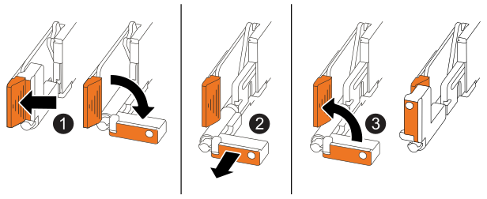
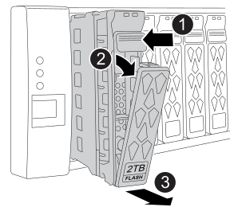
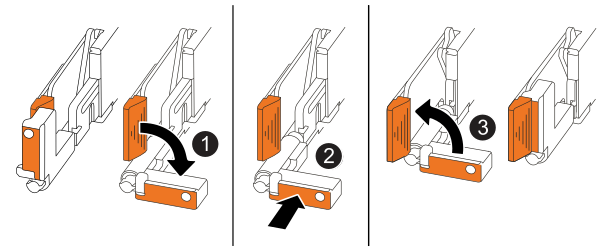

= 更换机箱- AFF C30和AFF C60
:allow-uri-read: 
:icons: font
:imagesdir: ../media/

[role="lead"]
如果硬件故障需要更换AFF C30或AFF C60系统的机箱。更换过程包括卸下控制器和电源设备(PSU)、卸下驱动器、安装更换机箱以及重新安装机箱组件。

== 第 1 步：卸下控制器

在更换控制器或更换控制器内部的组件时、必须从机箱中卸下控制器。

.开始之前
确保存储系统中的所有其他组件均正常运行；否则、您必须先联系、 https://mysupport.netapp.com/site/global/dashboard["NetApp 支持"]然后再继续此过程。

.步骤
. 在受损控制器上、确保NV LED熄灭。
+
当NV LED熄灭时、转销已完成、可以安全地卸下受损控制器。

+

NOTE: 如果NV LED闪烁(绿色)、则表示正在进行减载。您必须等待NV LED熄灭。但是、如果闪烁持续时间超过五分钟、请先联系、 https://mysupport.netapp.com/site/global/dashboard["NetApp 支持"]然后再继续此过程。

+
NV LED位于控制器上的NV图标旁边。

+
image::../media/drw_g_nvmem_led_ieops-1839.svg[NV状态LED位置]

[cols="1,4"]
|===

 a| 
image::../media/icon_round_1.png[标注编号1]
 a| 
控制器上的NV图标和LED

|===
. 如果您尚未接地，请正确接地。
. 断开受损控制器的电源：
+

NOTE: 电源(PSU)没有电源开关。

+
[cols="1,2"]
|===
| 如果您要断开... | 那么 ... 

 a| 
交流PSU
 a| 
.. 打开电源线固定器。
.. 从PSU上拔下电源线、并将其放在一旁。

 a| 
直流PSU
 a| 
.. 拧下D-sub直流电源线连接器上的两颗指旋螺钉。
.. 从PSU上拔下电源线、并将其放在一旁。

|===
. 从受损控制器上拔下所有缆线。
+
跟踪电缆的连接位置。

. 删除受损控制器：
+
下图显示了卸下控制器时控制器手柄(从控制器左侧开始)的操作：

+

+
[cols="1,4"]
|===

 a| 
image::../media/icon_round_1.png[标注编号1]
 a| 
在控制器的两端、向外推垂直锁定卡舌以释放手柄。

 a| 
image::../media/icon_round_2.png[标注编号2]
 a| 
** 朝您的方向拉动手柄、将控制器从中间板上取下。
+
拉动时、手柄会从控制器中伸出、然后您会感觉到一些阻力、请继续拉动。

** 将控制器滑出机箱、同时支撑控制器底部、然后将其放在平稳的表面上。

 a| 
image::../media/icon_round_3.png[标注编号3]
 a| 
如果需要、竖直旋转手柄(位于卡舌旁边)以将其移开。

|===
. 对机箱中的另一个控制器重复上述步骤。

== 第2步：从受损机箱中卸下缓存模块

您需要从受损机箱中卸下任何缓存模块和驱动器挡片、以便在此过程稍后将其安装到更换机箱中。

. 从存储系统正面轻轻卸下挡板。
. 卸下缓存模块和驱动器挡片：
+

NOTE: 跟踪每个缓存模块和驱动器挡片的驱动器托架、因为它们必须安装在更换机箱的相同驱动器托架中。

+

+
[cols="20%,80%"]
|===

 a| 
image::../media/icon_round_1.png[标注编号1]
 a| 
按下模块表面的释放按钮以打开凸轮把手。

 a| 
image::../media/icon_round_2.png[标注编号2]
 a| 
向下旋转凸轮把手、使模块与中板分离。

 a| 
image::../media/icon_round_3.png[标注编号3]
 a| 
使用凸轮把手将模块滑出驱动器托架、并用另一只手支撑模块。

拆卸模块时、始终用双手支撑其重量。

|===
. 将缓存模块放在无静电的手推车或桌子上。

== 第3步：从设备机架或系统机柜中更换机箱

您可以从设备机架或系统机柜中卸下受损机箱、安装更换机箱、安装驱动器和所有驱动器挡片、然后安装挡板。

. 从受损机箱安装点上卸下螺钉。
+
将螺钉放在一边、以便稍后在此过程中使用。

+

NOTE: 如果存储系统随附在NetApp系统机柜中、则必须先卸下机箱背面的额外螺钉、然后才能卸下机箱。

. 使用两个人或动力提升装置、将受损机箱从设备机架或系统机柜中滑出导轨、然后将其放在一旁。
. 由两个人将更换机箱滑入导轨、将其安装到设备机架或系统机柜中。
. 使用从受损机箱上拧下的螺钉将更换机箱的正面固定到设备机架或系统机柜。

== 第 4 步：安装控制器

将控制器安装到替代机箱中并重新启动它们。

.关于此任务
下图显示了安装控制器时控制器手柄(从控制器左侧开始)的操作、可用作其余控制器安装步骤的参考。

[cols="1,4"]
|===

 a| 
image::../media/icon_round_1.png[标注编号1]
 a| 
如果竖直旋转控制器手柄(卡舌旁边)以使其移开、请将其向下旋转至水平位置。

 a| 
image::../media/icon_round_2.png[标注编号2]
 a| 
推动手柄以将控制器重新插入机箱、然后推动直至控制器完全就位。

 a| 
image::../media/icon_round_3.png[标注编号3]
 a| 
将手柄旋转至竖直位置、并使用锁定卡舌锁定到位。

|===
. 将其中一个控制器插入机箱：
+
.. 将控制器背面与机箱中的开口对齐。
.. 用力推动手柄、直至控制器与中板接触并完全固定在机箱中。
+

NOTE: 将控制器滑入机箱时、请勿用力过度、否则可能会损坏连接器。

.. 向上旋转控制器手柄、并使用卡舌锁定到位。

. 根据需要对控制器重新布线(电源线除外)。
. 重复上述步骤、将第二个控制器安装到机箱中。
. 将从受损机箱中卸下的缓存模块和驱动器挡片安装到更换机箱中：
+

NOTE: 高速缓存模块和驱动器挡片必须安装在更换机箱的相同驱动器托架中。

. 在凸轮把手处于打开位置的情况下、用双手插入驱动器。
. 轻轻推动、直至驱动器停止。
. 合上凸轮把手、使驱动器完全固定在中板中、并且把手卡入到位。
+
请务必缓慢地关闭凸轮把手，使其与驱动器正面正确对齐。

. 对其余驱动器重复此过程。
+
.. 安装挡板。
.. 将电源线重新连接到控制器中的电源(PSU)。
+
PSU电源恢复后、状态LED应呈绿色。

+

NOTE: 电源恢复后、控制器将立即启动。

+
[cols="1,2"]
|===
| 如果您要重新连接... | 那么 ... 

 a| 
交流PSU
 a| 
... 将电源线插入PSU。
... 使用电源线固定器固定电源线。

 a| 
直流PSU
 a| 
... 将D-sub直流电源线连接器插入PSU。
... 拧紧两颗指旋螺钉、将D-sub直流电源线连接器固定至PSU。

|===
.. 如果控制器启动至Loader提示符、请重新启动控制器：
+
`boot_ontap`

.. 重新打开AutoSupport：
+
`system node autosupport invoke -node * -type all -message MAINT=END`

.下一步是什么？
在更换受损AFF C30或AFF C60机箱并将组件重新安装到其中后，您需要link:chassis-replace-complete-system-restore-rma.html["完成机箱更换"]。
