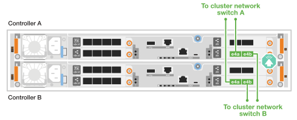
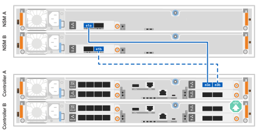

= 为硬件布线- AFF C30和AFF C60
:allow-uri-read: 
:icons: font
:imagesdir: ../media/

[role="lead"]
安装AFF C30或AFF C60存储系统硬件后、使用缆线将控制器连接到网络和磁盘架。

.开始之前
有关将存储系统连接到网络交换机的信息、请与网络管理员联系。

.关于此任务
* 集群/HA和主机网络布线过程显示了常见配置。请注意、具体布线取决于为存储系统订购的组件。有关全面的配置和插槽优先级详细信息，请参见 link:https://hwu.netapp.com["NetApp Hardware Universe"^]。
* 布线图中的箭头图标显示了将连接器插入端口时电缆连接器推拉卡舌的正确方向(向上或向下)。
+
插入连接器时、您应感觉到连接器卡入到位；如果您不觉得连接器卡嗒声、请将其卸下、然后将其翻转并重试。

+
image:../media/drw_cable_pull_tab_direction_ieops-1699.svg["电缆拉片方向"]

* 如果使用缆线连接到光纤交换机、请先将光纤收发器插入控制器端口、然后再使用缆线连接到交换机端口。

== 第1步：为集群/HA连接布线

使用缆线将控制器连接到ONTAP集群。此过程因存储系统型号和I/O模块配置而异。

[role="tabbed-block"]
====
.无交换机集群布线
--
使用缆线将控制器互相连接以创建ONTAP集群连接。

.具有两个2端口100GbE I/O模块的AFF A30或A50
[%collapsible]
=====
插槽2和4中的I/O模块端口是40/100GbE端口。这是否仅适用于30-50、如果是、请将2个注释保留在所在位置、但如果适用于所有3个注释、则将其移动到节主文本下的新段落。？？？

.步骤
. 为集群/HA互连连接布线：
+

NOTE: 集群互连流量和HA流量共享相同的物理端口。

+
.. 使用缆线将控制器A端口E2A连接到控制器B端口E2A。
.. 使用缆线将控制器A端口e4a连接到控制器B端口e4a。
+

NOTE: 插槽2和4中的I/O模块上的端口e2b和e4b未使用、可用于前端(主机网络)连接(如果需要)。

+
*集群/HA互连缆线*

+
image::../media/oie_cable_25Gb_Ethernet_SFP28_IEOPS-1069.svg[集群HA缆线]

+
image::../media/drw_isi_a30-50_switchless_2p_100gbe_2card_cabling_ieops-2011.svg[使用两个100GbE IO模块的双节点无交换机集群布线图]

=====
.具有一个2端口100GbE I/O模块的AFF A30或A50
[%collapsible]
=====
插槽2和4中的I/O模块端口是40/100GbE端口。

.步骤
. 为集群/HA互连连接布线：
+

NOTE: 集群互连流量和HA流量共享相同的物理端口。

+
.. 使用缆线将控制器A端口e4a连接到控制器B端口e4a。
.. 使用缆线将控制器A端口e4b连接到控制器B端口e4b。
+
*集群/HA互连缆线*

+
image::../media/oie_cable_25Gb_Ethernet_SFP28_IEOPS-1069.svg[集群HA缆线]

+
image::../media/drw_isi_a30-50_switchless_2p_100gbe_1card_cabling_ieops-1925.svg[使用一个100GbE IO模块的双节点无交换机集群布线图]

=====
.带有一个双端口10Gbe I/O模块的AFF A20
[%collapsible]
=====
添加示例

+image:../media/oie_cable_sfp_gbe_copper.png["GbE SFP铜缆连接器"]

+

=====
--
.Switched cluster cabling
--
使用缆线将控制器连接到集群网络交换机以创建ONTAP集群连接。

.具有两个2端口100GbE I/O模块的AFF A30或A50
[%collapsible]
=====
添加示例

添加注释：插槽2和4中I/O模块上的40/100GbE端口e2b和e4b未使用、可用于前端连接(如果需要)。

=====
.具有一个2端口100GbE I/O模块的AFF A30或A50
[%collapsible]
=====
.步骤
. 使用缆线将控制器连接到集群网络交换机：
+

NOTE: 集群互连流量和HA流量共享相同的物理端口。

+
.. 使用缆线将控制器A端口e4a和控制器B端口e4a连接到集群网络交换机A
.. 使用缆线将控制器A端口e4b和控制器B端口e4b连接到集群网络交换机B
+
*集群/HA互连缆线*

+
image::../media/oie_cable100_gbe_qsfp28.png[100 Gb缆线]

+

=====
.带有一个双端口10Gbe I/O模块的AFF A20
[%collapsible]
=====
添加示例

=====
--
====

== 第2步：为主机网络连接布线

使用缆线将控制器连接到主机网络。此过程因存储系统型号和I/O模块配置而异。主机连接为40/100 GbE。

.具有两个2端口100GbE I/O模块的AFF A30或A50
[%collapsible]
====
文本

====
.具有一个2端口100GbE I/O模块的AFF A30或A50
[%collapsible]
====
. 为主机网络连接布线。
+
以下子步骤是可选主机网络布线示例。如果需要、请参见link:https://hwu.netapp.com["NetApp Hardware Universe"^]了解您的特定存储系统配置。

+
.. 可选：使用缆线连接到40/100GbE主机网络交换机。
+
使用缆线将每个控制器上的端口e2a、e2b、e2C和e2d连接到以太网主机网络交换机。

+
*40/100 GbE缆线*

+
image::../media/oie_cable_sfp_gbe_copper.png[40/100 GB电缆]

+
image::../media/drw_isi_a30-50_host_2p_40-100gbe_1card_cabling_ieops-1923.svg[使用缆线连接到40/100GbE以太网主机网络交换机]

.. 可选：使用缆线连接到FC主机网络交换机。
+
使用缆线将每个控制器上的端口1a、1b、1c和1d连接到FC主机网络交换机。

+
*64 Gb/秒FC缆线*

+
image::../media/oie_cable_sfp_gbe_copper.png[64 Gb光纤信道电缆]

+
image::../media/drw_isi_a30-50_4p_64gb_fc_1card_cabling_ieops-1924.svg[连接到64 GB FC主机网络交换机的缆线]

====
.带有一个2端口100GbE模块的AFF A20
[%collapsible]
====
添加文本

====

== 第3步：为管理网络连接布线

使用缆线将控制器连接到管理网络。

. 使用缆线将每个控制器上的管理(扳手)端口连接到管理网络交换机。
+
*1000BASE-T RJ-45电缆*

+
image::../media/oie_cable_rj45.png[RJ-45电缆]

+
image::../media/drw_isi_g_wrench_cabling_ieops-1928.svg[连接到管理网络]

IMPORTANT: 请勿插入电源线。

== 第4步：为磁盘架连接布线

此过程介绍如何使用缆线将控制器连接到一个NS224磁盘架。

.关于此任务
* 有关存储系统和所有布线选项(例如光纤和交换机连接)支持的最大磁盘架数量，请参见link:https://hwu.netapp.com["NetApp Hardware Universe"^]。
* 您可以使用存储系统随附的存储缆线将每个控制器连接到NS224磁盘架上的每个NSM100B模块、缆线类型可以是：
+
*100 GbE QSFP28铜缆*

+
image::../media/oie_cable100_gbe_qsfp28.png[100 GbE QSFP28铜缆]

* 图中显示控制器A的布线为蓝色、控制器B的布线为黄色。

.步骤
. 使用缆线将控制器 A 连接到磁盘架：
+
.. 使用缆线将控制器A端口e3a连接到NSM A端口e1a。
.. 使用缆线将控制器A端口e3b连接到NSM B端口e1b。
+

. Cable controller B to the shelf:
+
.. 使用缆线将控制器B端口e3a连接到NSM B端口e1a。
.. 使用缆线将控制器B端口e3b连接到NSM A端口e1b。
+
image:../media/drw_isi_g_1_ns224_controller_b_cabling_ieops-1946.svg["控制器B端口e3a和e3b连接到一个NS224磁盘架"]

.下一步是什么？
在为存储系统的硬件布线之后，您可以link:install-power-hardware.html["启动存储系统"]。
