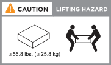

= 查看安装 AFF C30 或 AFF C60 存储系统的要求
:allow-uri-read: 
:icons: font
:imagesdir: ../media/

[role="lead"]
查看安装 AFF C30 或 AFF C60 存储系统的要求，包括所需的设备、起重注意事项和现场规格，以便顺利安装。

[[equipment-needed-for-install]]
== 安装所需的设备

要安装存储系统、您需要以下设备和工具。

* 访问Web浏览器以配置存储系统
* 静电放电(ESD)带
* 手电筒
* 具有USB/串行连接的笔记本电脑或控制台
* 2 号十字螺丝刀

[[lifting-precautions]]
== 提升注意事项

存储系统和磁盘架很重。搬运这些物品时请务必小心。

[[storage-system-weight]]
=== 存储系统重量

移动或抬起存储系统时、请采取必要的预防措施。

存储系统最重可达27.9千克(61.5磅)。要抬起存储系统、请两个人或使用液压升降机。

image::../media/drw_g_lifting_weight_ieops-1831.svg[AFF 2020 A30 A50和C30及C60重量小心图标]

[[shelf-weight]]
=== 磁盘架重量

移动或抬起磁盘架时、请采取必要的预防措施。

带有NSM100B模块的NS224磁盘架的重量可达56.8磅(25.8千克)。要抬起磁盘架、请两个人或使用液压升降机。将所有组件(前部和后部)保留在磁盘架中、以防止磁盘架重量不平衡。

.相关信息
* https://library.netapp.com/ecm/ecm_download_file/ECMP12475945["安全信息和法规声明"^]

.下一步是什么？
在查看存储系统的安装要求和注意事项之后，您可以link:install-prepare.html["准备安装"]：
