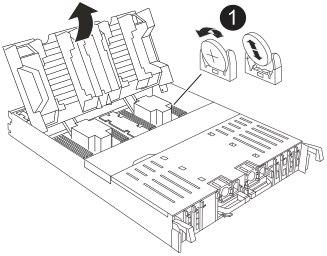

= 更换实时时钟电池- AFF C80
:allow-uri-read: 
:icons: font
:imagesdir: ../media/

[role="lead"]
更换AFF C80系统中的实时时钟(RTC)电池(通常称为币形电池)、以确保依赖于准确时间同步的服务和应用程序保持正常运行。

卸下发生故障的RTC电池、然后安装更换用的RTC电池。

您必须使用经认可的 RTC 电池。

.步骤
. 打开控制器顶部的控制器通风管。
+
.. 将手指插入空气管道远端的凹槽中。
.. 提起空气管道、将其向上旋转至最远位置。

. 找到空气管道下方的RTC电池。
+

+
[cols="1,4"]
|===

 a| 
image:../media/icon_round_1.png["标注编号1"]
 a| 
RTC 电池和外壳

|===
. 将电池轻轻推离电池架，将其旋转出电池架，然后将其从电池架中取出。
+

NOTE: 从电池架中取出电池时，请注意电池的极性。电池标有加号，必须正确放置在支架中。电池座旁边的加号用于指示电池的位置。

. 从防静电运输袋中取出更换用电池。
. 记下 RTC 电池的极性，然后将电池倾斜并向下推，将其插入电池架中。
. 目视检查电池，确保其已完全安装到电池架中，并且极性正确。

