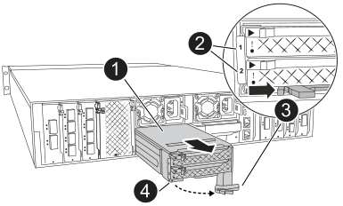

= 更换FlashCache模块托架或缓存模块- FAS70和FAS90
:allow-uri-read: 
:icons: font
:imagesdir: ../media/

[role="lead"]
NVMe SSD FlashCache模块托架包含一个或两个FlashCache模块(缓存模块)、每个缓存模块集成一个SSD FlashCache驱动器。

FAS70支持2 TB缓存模块、FAS90支持4 TB缓存模块。您不能在FlashCache模块托架中混用容量不同的缓存模块。

根据需要更换的组件、您可以执行以下任一过程：整个Flashcache模块托架或缓存模块。

* <<更换FlashCache模块托架>>
* <<更换缓存模块>>

== 更换FlashCache模块托架

FlashCache模块托架位于插槽6中、最多可容纳两个FlashCache模块。您不能热插拔FlashCache模块托架

.开始之前
* 确保存储系统具有适用于更换FlashCache模块托架的操作系统。
* 确认所有其他组件均正常工作；如果不正常、则必须联系技术支持。

=== 第 1 步：关闭受损节点

使用以下选项之一关闭或接管受损控制器。

.选项1：MOST系统
[%collapsible]
====
要关闭受损控制器，您必须确定控制器的状态，并在必要时接管控制器，以便运行正常的控制器继续从受损控制器存储提供数据。

.关于此任务
If you have a cluster with more than two nodes, it must be in quorum.如果集群未达到仲裁或运行状况良好的控制器在资格和运行状况方面显示false、则必须在关闭受损控制器之前更正问题描述 ；请参见 link:https://docs.netapp.com/us-en/ontap/system-admin/synchronize-node-cluster-task.html?q=Quorum["将节点与集群同步"^]。

.步骤
. 如果启用了AutoSupport、则通过调用AutoSupport消息命令禁止自动创建案例： `system node autosupport invoke -node * -type all -message MAINT=number_of_hours_downh`
+
以下AutoSupport命令将禁止自动创建案例两小时： `cluster1:*> system node autosupport invoke -node * -type all -message MAINT=2h`

. 从运行正常的控制器的控制台禁用自动交还： `storage failover modify – node local -auto-giveback false`
. 将受损控制器显示为 LOADER 提示符：
+
[cols="1,2"]
|===
| 如果受损控制器显示 ... | 那么 ... 

 a| 
LOADER 提示符
 a| 
转至下一步。

 a| 
`正在等待交还 ...`
 a| 
按 Ctrl-C ，然后在出现提示时回答 `y` 。

 a| 
系统提示符或密码提示符（输入系统密码）
 a| 
暂停受损控制器或从运行正常的控制器接管此控制器： `storage failover takeover -ofnode _impaired_node_name_`

当受损控制器显示 Waiting for giveback... 时，按 Ctrl-C ，然后回答 `y` 。

|===

====
.选项2 MetroCluster配置
[%collapsible]
====

NOTE: 如果您的系统采用双节点 MetroCluster 配置，请勿使用此操作步骤。

要关闭受损控制器，您必须确定控制器的状态，并在必要时接管控制器，以便运行正常的控制器继续从受损控制器存储提供数据。

* If you have a cluster with more than two nodes, it must be in quorum.如果集群未达到仲裁或运行状况良好的控制器在资格和运行状况方面显示false、则必须在关闭受损控制器之前更正问题描述 ；请参见 link:https://docs.netapp.com/us-en/ontap/system-admin/synchronize-node-cluster-task.html?q=Quorum["将节点与集群同步"^]。
* 如果您使用的是 MetroCluster 配置，则必须确认已配置 MetroCluster 配置状态，并且节点处于已启用且正常的状态（`MetroCluster node show` ）。

.步骤
. 如果启用了AutoSupport、则通过调用AutoSupport命令禁止自动创建案例： `system node autosupport invoke -node * -type all -message MAINT=number_of_hours_downh`
+
以下AutoSupport命令将禁止自动创建案例两小时： `cluster1:*> system node autosupport invoke -node * -type all -message MAINT=2h`

. 从运行正常的控制器的控制台禁用自动交还： `storage failover modify – node local -auto-giveback false`
. 将受损控制器显示为 LOADER 提示符：
+
[cols="1,2"]
|===
| 如果受损控制器显示 ... | 那么 ... 

 a| 
LOADER 提示符
 a| 
转至下一步。

 a| 
正在等待交还
 a| 
按 Ctrl-C ，然后在出现提示时回答 `y` 。

 a| 
系统提示符或密码提示符（输入系统密码）
 a| 
暂停受损控制器或从运行正常的控制器接管此控制器： `storage failover takeover -ofnode _impaired_node_name_`

当受损控制器显示 Waiting for giveback... 时，按 Ctrl-C ，然后回答 `y` 。

|===

====

=== 第2步：更换FlashCache模块托架

执行以下步骤以更换FlashCache模块托架。

.步骤
. 如果您尚未接地，请正确接地。
. 通过FlashCache模块托架正面亮起的琥珀色警示LED、找到插槽6中发生故障的FlashCache模块托架。
+

+
[cols="1,4"]
|===

 a| 
image:../media/legend_icon_01.svg["标注编号1、宽度=30制"]
 a| 
FlashCache模块托架

 a| 
image:../media/legend_icon_02.svg["标注编号2、宽度=30制"]
 a| 
缓存模块插槽编号

 a| 
image:../media/legend_icon_03.svg["标注编号3、宽度=30制"]
 a| 
FlashCache模块托架凸轮把手

 a| 
image:../media/legend_icon_04.svg["标注编号4、宽度=30制"]
 a| 
FlashCache模块托架故障LED

|===
. 卸下发生故障的FlashCache模块托架：
+
.. 向下旋转缆线管理托架、方法是拉动缆线管理托架内侧两侧的按钮、然后向下旋转托架。
.. 捏住FlashCache模块托架底部的蓝色卡舌。
.. 旋转卡舌、使其远离模块。

. 将FlashCache模块托架从控制器模块中拉出、然后将其放在防静电垫上。
. 将缓存模块移至更换用的FlashCache模块托架：
+
.. 捏住缓存模块顶部的Terra Cotta卡舌、然后将凸轮把手转离缓存模块。
.. 将手指插入凸轮拉杆开口处、然后将模块拉出FlashCache模块托架、从而将模块从机箱中卸下。
.. 将缓存模块安装到更换用的FlashCache模块托架中的同一插槽中、然后将凸轮把手旋转到缓存模块上的闭合位置以将其锁定到位。

. 如果有第二个缓存模块、请重复上述步骤。
. 将更换用的FlashCache模块托架安装到系统中：
+
.. 将模块与机柜插槽开口的边缘对齐。
.. 将模块轻轻地滑入插槽，直至完全滑入机箱，然后将凸轮闩锁一直向上旋转，以将模块锁定到位。
.. 将缆线管理托架向上旋转到关闭位置。

=== 第3步：重新启动控制器

更换FlashCache模块托架后、必须重新启动控制器模块。

.步骤
. 在 LOADER 提示符处，重新启动节点： _bybye
+

NOTE: 此操作将重新初始化I/O卡和其他组件、然后重新启动节点。

. 将节点恢复正常运行：_storage故障转移g交还-ofnode受损_ne_name_
. 如果已禁用自动交还、请重新启用它：_storage故障转移修改-node local -auto-交还true _

=== 第 4 步：将故障部件退回 NetApp

按照套件随附的 RMA 说明将故障部件退回 NetApp 。 https://mysupport.netapp.com/site/info/rma["部件退回和更换"]有关详细信息、请参见页面。

== 更换缓存模块

.开始之前
FlashCache模块(缓存模块)位于插槽6-1或插槽6-2中、或者同时位于插槽6-1和插槽6-2中。

您可以将各个缓存模块热插拔为同一供应商或其他受支持供应商提供的容量相同的缓存模块。

.开始之前
* 确保更换用的缓存模块具有与故障模块相同的容量、这些模块来自同一供应商或其他受支持供应商。
* 确认所有其他组件均正常工作；如果不正常、则必须联系技术支持。
* 缓存模块中的驱动器不是现场可更换单元(FRU)。您必须更换整个缓存模块。

.步骤
. 如果您尚未接地，请正确接地。
. 通过缓存模块正面的琥珀色警示 LED ，在插槽 6 中找到故障缓存模块。
. 按照以下步骤准备要更换的缓存模块插槽：
+
.. 记下目标节点上的缓存模块容量、部件号和序列号：_system node run local Sysconfig -av 6_
.. 在管理权限级别、准备要删除的目标缓存模块插 `y`槽、并在系统提示是否继续时做出响应：_system controller插槽模块remove -node ne_name -SLOT SLOT_number_以下命令将准备要删除的node1上的插槽6-1、并显示一条消息、指出可以安全删除：
+
[listing]
----
::> system controller slot module remove -node node1 -slot 6-1

Warning: SSD module in slot 6-1 of the node node1 will be powered off for removal.
Do you want to continue? (y|n): _y_
The module has been successfully removed from service and powered off. It can now be safely removed.
----
.. 使用 `ssystem controller slot module show` 命令显示插槽状态。
+
缓存模块插槽状态显示 `powered-off`在需要更换的缓存模块的屏幕输出中。

+

NOTE: 请参见 https://docs.netapp.com/us-en/ontap-cli-9121/["命令手册页"^] for your version of ONTAP for more details.

. 删除缓存模块：
+
image::../media/drw_fas70-90_caching_module_remove_ieops-1773.svg[删除缓存模块]

+
[cols="1,4"]
|===

 a| 
image:../media/legend_icon_01.svg["标注编号1、宽度=30制"]
 a| 
缓存模块凸轮把手

 a| 
image:../media/legend_icon_02.svg["标注编号2、宽度=30制"]
 a| 
缓存模块故障LED

|===
+
.. 向下旋转缆线管理托架、方法是拉动缆线管理托架内侧两侧的按钮、然后向下旋转托架。
.. 按下缓存模块正面的 Terra cotta 释放按钮。
.. 将凸轮把手旋转到最远位置。
.. 将手指插入凸轮拉杆开口处、然后将缓存模块拉出FlashCache模块托架、从而将该模块从机箱中卸下。
+
从FlashCache模块托架中删除缓存模块时、请务必支持该模块。

. 安装替代缓存模块：
+
.. 将缓存模块的边缘与控制器模块中的开口对齐。
.. 将缓存模块轻轻推入托架，直到凸轮把手啮合为止。
.. 旋转凸轮把手，直到其锁定到位。
.. 将缆线管理托架向上旋转到关闭位置。

. 使用 `ssystem controller slot module insert` 命令将替代缓存模块置于联机状态，如下所示：
+
以下命令会为node1上的插槽6-1准备开机、并显示一条消息、指出已打开电源：

+
[listing]
----
::> system controller slot module insert -node node1 -slot 6-1

Warning: NVMe module in slot 6-1 of the node localhost will be powered on and initialized.
Do you want to continue? (y|n): `y`

The module has been successfully powered on, initialized and placed into service.
----
. 使用 `ssystem controller slot module show` 命令验证插槽状态。
+
确保命令输出将的状态报告为`power-on`并做好操作准备。

. 确认替代缓存模块已联机并已识别，然后目视确认琥珀色警示 LED 未亮起： `ssysconfig -av slot_number`
+

NOTE: 如果将缓存模块替换为其他供应商提供的缓存模块，则新的供应商名称将显示在命令输出中。

. 按照套件随附的 RMA 说明将故障部件退回 NetApp 。 https://mysupport.netapp.com/site/info/rma["部件退回和更换"^]有关详细信息、请参见页面。

