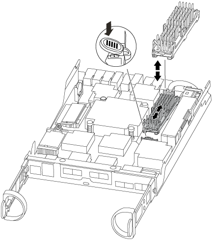

= 更换缓存模块— FAS2600
:icons: font
:imagesdir: ../media/

[role="lead"]
如果系统注册了一条 AutoSupport （ ASUP ）消息，指出控制器模块已脱机，则必须更换此缓存模块；否则会导致性能下降。

* 您必须将故障组件更换为从提供商处收到的替代 FRU 组件。

link:https://youtu.be/Rc-EQT-HAxU["AFF FAS2600 缓存模块更换视频"^]

== 第 1 步：关闭受损控制器

根据存储系统硬件配置的不同，您可以使用不同的过程关闭或接管受损的控制器。

如果集群包含两个以上的节点，则该集群必须处于仲裁状态。如果集群未达到仲裁或运行状况良好的节点在资格和运行状况方面显示 false ，则必须在关闭受损节点之前更正问题描述。

http://docs.netapp.com/ontap-9/topic/com.netapp.doc.dot-cm-sag/home.html["《 ONTAP 9 系统管理参考》"^]

您可能希望在更换缓存模块之前擦除其内容。

. 尽管缓存模块上的数据已加密，但您可能希望擦除受损缓存模块中的所有数据，并验证缓存模块是否没有数据：
+
.. 擦除缓存模块上的数据： `ssystem controller flash-cache secure -erase run`
.. 验证是否已从缓存模块中擦除数据： `ssystem controller flash-cache secure -erase show -node node_name`
+
输出应将缓存模块状态显示为已擦除。

. 如果受损节点属于 HA 对，请从运行正常的节点的控制台禁用自动交还： `storage failover modify -node local -auto-giveback false`
. 将受损节点显示为 LOADER 提示符：
+
[cols="1,2"]
|===
| 如果受损节点显示 ... | 那么 ... 

 a| 
LOADER 提示符
 a| 
转至下一步。

 a| 
正在等待交还
 a| 
按 Ctrl-C ，然后在出现提示时回答 `y` 。

 a| 
系统提示符或密码提示符（输入系统密码）
 a| 
接管或暂停受损节点：

** 对于 HA 对，从运行状况良好的节点接管受损节点： `storage failover takeover -ofnode _impaired_node_name_`
+
当受损节点显示 Waiting for giveback... 时，按 Ctrl-C ，然后回答 `y` 。

** 对于独立系统： `ssystem node halt _impaired_node_name_`

|===
. 如果系统机箱中只有一个控制器模块，请关闭电源，然后从电源中拔下受损节点的电源线。

== 第 2 步：打开系统

要访问控制器内部的组件，您必须先从系统中卸下控制器模块，然后再卸下控制器模块上的盖板。

. 如果您尚未接地，请正确接地。
. 松开将缆线绑在缆线管理设备上的钩环带，然后从控制器模块上拔下系统缆线和 SFP （如果需要），并跟踪缆线的连接位置。
+
将缆线留在缆线管理设备中，以便在重新安装缆线管理设备时，缆线排列有序。

. 从控制器模块的左右两侧卸下缆线管理设备并将其放在一旁。
+
image::../media/drw_25xx_cable_management_arm.png[DRW 25xx 缆线管理臂]

. 按压凸轮把手上的闩锁，直到其释放为止，完全打开凸轮把手以从中板释放控制器模块，然后用两只手将控制器模块拉出机箱。
+
image::../media/drw_2240_x_opening_cam_latch.png[DRW 2240 x 打开凸轮闩锁]

. 将控制器模块翻转，将其放在平稳的表面上。
. 滑动蓝色卡舌以释放盖板，然后向上翻盖并打开，从而打开盖板。
+
image::../media/drw_2600_opening_pcm_cover.png[DRW 2600 打开 PCM 盖板]

== 第 3 步：更换缓存模块

要更换控制器上标签上称为 M.2 PCIe 卡的缓存模块，请找到控制器内的插槽并按照特定步骤顺序进行操作。

您的存储系统必须满足特定条件，具体取决于您的情况：

* 它必须具有与要安装的缓存模块对应的操作系统。
* 它必须支持缓存容量。
* 存储系统中的所有其他组件必须正常运行；否则，您必须联系技术支持。
+
.. 找到控制器模块背面的缓存模块并将其卸下。
+
... 按释放卡舌。
... 卸下散热器。

+

+
.. 将缓存模块竖直从外壳中轻轻拉出。
.. 将缓存模块的边缘与外壳中的插槽对齐，然后将其轻轻推入插槽。
.. 验证缓存模块是否已完全固定在插槽中。
+
如有必要，请卸下缓存模块并将其重新插入插槽。

.. 重新拔插并向下推散热器，以接合缓存模块外壳上的锁定按钮。
.. 根据需要关闭控制器模块盖板。

== 第 4 步：重新安装控制器模块

更换控制器模块中的组件后，将其重新安装到机箱中。

. 如果您尚未更换控制器模块上的外盖，请进行更换。
. 将控制器模块的末端与机箱中的开口对齐，然后将控制器模块轻轻推入系统的一半。
+

NOTE: 请勿将控制器模块完全插入机箱中，除非系统指示您这样做。

. 根据需要重新对系统进行布线。
+
如果您已卸下介质转换器（ QSFP 或 SFP ），请记得在使用光缆时重新安装它们。

. 完成控制器模块的重新安装：
+
[cols="1,2"]
|===
| 如果您的系统位于 ... | 然后执行以下步骤 ... 

 a| 
HA 对
 a| 
控制器模块一旦完全固定在机箱中，就会开始启动。准备中断启动过程。

.. 在凸轮把手处于打开位置的情况下，用力推入控制器模块，直到它与中板并完全就位，然后将凸轮把手合上到锁定位置。
+

NOTE: 将控制器模块滑入机箱时，请勿用力过大，以免损坏连接器。

+
控制器一旦固定在机箱中，就会开始启动。

.. 如果尚未重新安装缆线管理设备，请重新安装该设备。
.. 使用钩环带将缆线绑定到缆线管理设备。
.. 当您看到消息 `Press Ctrl-C for Boot Menu` 时，按 `Ctrl-C` 以中断启动过程。
+

NOTE: 如果您未看到此提示，而控制器模块启动到 ONTAP ，请输入 `halt` ，然后在 LOADER 提示符处输入 `boot_ontap` ，并在出现提示时按 `Ctrl-C` ，然后启动到维护模式。

.. 从显示的菜单中选择启动至维护模式的选项。

 a| 
一种独立配置
 a| 
.. 在凸轮把手处于打开位置的情况下，用力推入控制器模块，直到它与中板并完全就位，然后将凸轮把手合上到锁定位置。
+

NOTE: 将控制器模块滑入机箱时，请勿用力过大，以免损坏连接器。

.. 如果尚未重新安装缆线管理设备，请重新安装该设备。
.. 使用钩环带将缆线绑定到缆线管理设备。
.. 将电源线重新连接到电源和电源，打开电源以启动启动过程，然后在看到 `Press Ctrl-C for Boot Menu` 消息后按 `Ctrl-C` 。
+

NOTE: 如果您未看到此提示，而控制器模块启动到 ONTAP ，请输入 `halt` ，然后在 LOADER 提示符处输入 `boot_ontap` ，并在出现提示时按 `Ctrl-C` ，然后启动到维护模式。

.. 从启动菜单中，选择维护模式选项。

|===

== 第 5 步：运行系统级诊断

安装新的缓存模块后，您应运行诊断。

您的系统必须处于 LOADER 提示符处，才能启动系统级诊断。

诊断过程中的所有命令都是从要更换组件的节点发出的。

. 如果要服务的节点不在 LOADER 提示符处，请执行以下步骤：
+
.. 从显示的菜单中选择维护模式选项。
.. 在节点启动至维护模式后，暂停节点： `halt`
+
问题描述命令后，您应等待系统停留在 LOADER 提示符处。

+

NOTE: 在启动过程中，您可以安全地响应 `y` 提示：

. 在 LOADER 提示符处，访问专为系统级诊断而设计的特殊驱动程序以正常运行： `boot_diags`
+
在启动过程中，您可以安全地对提示 `y` 做出响应，直到显示维护模式提示符（ * > ）为止。

. 对缓存模块运行诊断： `sldiag device run -dev fcache`
. 验证更换缓存模块是否未导致硬件问题： `sldiag device status -dev fcache -long -state failed`
+
如果没有测试失败，则系统级诊断会返回到提示符，或者会列出因测试组件而导致的失败的完整状态。

. 根据上一步的结果继续操作：

[cols="1,3"]
|===
| 如果系统级诊断测试 ... | 那么 ... 

 a| 
已完成，无任何故障
 a| 
. 清除状态日志： `sldiag device clearstatus`
. 验证是否已清除日志： `sldiag device status`
+
此时将显示以下默认响应：

+
SLDIAG ：不存在日志消息。

. 退出维护模式： `halt`
+
节点将显示 LOADER 提示符。

. 从加载程序提示符处启动节点： `bye`
. 使节点恢复正常运行：
+
* 如果节点位于 HA 对中 * ，请执行交还： `storage failover giveback -ofnode _replacement_node_name_`

+
* 注： * 如果禁用了自动交还，请使用 `storage failover modify` 命令重新启用它。

+
* 如果节点采用独立配置 * ，请继续执行下一步。无需执行任何操作。

+
您已完成系统级诊断。

 a| 
导致某些测试失败
 a| 
确定问题的发生原因：

. 退出维护模式： `halt`
+
问题描述命令后，请等待，直到系统停留在 LOADER 提示符处。

. 根据机箱中的控制器模块数量，关闭或保持电源打开状态：
+
** 如果机箱中有两个控制器模块，请保持电源处于打开状态，以便为另一个控制器模块供电。
** 如果机箱中有一个控制器模块，请关闭电源并拔下电源插头。

. 验证您是否已遵循在运行系统级诊断时确定的所有注意事项，缆线是否已牢固连接以及硬件组件是否已正确安装在存储系统中。
. 启动您正在维护的控制器模块，在系统提示您进入启动菜单时按 `Ctrl-C` 以中断启动：
+
** 如果机箱中有两个控制器模块，请将您正在维护的控制器模块完全固定在机箱中。
+
控制器模块在完全就位后启动。

** 如果机箱中有一个控制器模块，请连接电源，然后将其打开。

. 从菜单中选择 Boot to maintenance mode 。
. 输入以下命令退出维护模式： `halt`
+
问题描述命令后，请等待，直到系统停留在 LOADER 提示符处。

. 重新运行系统级诊断测试。

|===

== 第 6 步：将故障部件退回 NetApp

更换部件后，您可以按照套件随附的 RMA 说明将故障部件退回 NetApp 。请通过联系技术支持 https://mysupport.netapp.com/site/global/dashboard["NetApp 支持"]， 888-463-8277 （北美）， 00-800-44-638277 （欧洲）或 +800-800-80-800 （亚太地区）（如果您需要 RMA 编号或有关更换操作步骤的其他帮助）。
