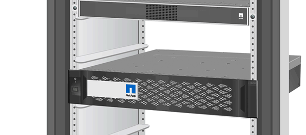

= 更换 SSD 驱动器或 HDD 驱动器— FAS2600
:allow-uri-read: 
:icons: font
:imagesdir: ../media/

[role="lead lead"]
You can replace a failed drive nondisruptively while I/O is in progress.用于更换 SSD 的操作步骤 用于非旋转驱动器，用于更换 HDD 的操作步骤 用于旋转驱动器。

When a drive fails, the platform logs a warning message to the system console indicating which drive has failed.In addition, both the fault LED on the operator display panel and the fault LED on the failed drive are illuminated.

.开始之前
* 在更换驱动器之前，请遵循最佳实践并安装最新版本的磁盘认证包（ DQP ）。
* 在系统控制台中运行命令、以确定故障驱动器 `storage disk show -broken` 。
+
The failed drive appears in the list of failed drives.If it does not, you should wait, and then run the command again.

+

NOTE: 根据类型和容量、驱动器可能需要长达数小时才能显示在故障驱动器列表中。

* 确定是否已启用 SED 身份验证。
+
更换驱动器的方式取决于驱动器的使用方式。如果启用了SED身份验证，则必须按照中的SED更换说明 https://docs.netapp.com/ontap-9/topic/com.netapp.doc.pow-nve/home.html["《 ONTAP 9 NetApp 加密高级指南》"]进行操作。这些说明介绍了在更换 SED 之前和之后必须执行的其他步骤。

* 确保您的平台支持替代驱动器。请参见 https://hwu.netapp.com["NetApp Hardware Universe"]。
* 确保系统中的所有其他组件均正常运行；否则，您必须联系技术支持。

.关于此任务
* 在固件版本不是最新的新驱动器上，驱动器固件会自动更新（无中断）。
* 更换驱动器时、必须在移除故障驱动器和插入替代驱动器之间等待一分钟、以使存储系统能够识别新驱动器的存在。

[role="tabbed-block"]
====
.选项 1 ：更换 SSD
--
.步骤
. 如果您想手动分配替换驱动器的驱动器所有权，则需要禁用自动驱动器分配（如果已启用）。
+
.. 验证是否已启用自动驱动器分配： `storage disk option show`
+
您可以在任一控制器模块上输入命令。

+
如果启用了自动驱动器分配，则输出会在 "`Auto Assign` " 列中显示 `on` （对于每个控制器模块）。

.. 如果启用了自动驱动器分配，请将其禁用： `storage disk option modify -node node_name -autodassign off`
+
您必须在两个控制器模块上禁用自动驱动器分配。

. 正确接地。
. 以物理方式确定故障驱动器。
+
驱动器发生故障时，系统会向系统控制台记录一条警告消息，指示哪个驱动器发生故障。此外，驱动器架操作员显示面板上的警示（琥珀色） LED 和故障驱动器将亮起。

+

NOTE: 故障驱动器上的活动（绿色） LED 可能会亮起（稳定亮起），表示驱动器已通电，但不应闪烁，这表示 I/O 活动。故障驱动器没有 I/O 活动。

. 删除故障驱动器：
+
.. 按下驱动器表面上的释放按钮以打开凸轮把手。
.. 使用凸轮把手将驱动器滑出磁盘架，并用另一只手支撑驱动器。

. 请至少等待 70 秒，然后再插入替代驱动器。
+
这样，系统就可以识别出驱动器已被删除。

. 插入替代驱动器：
+
.. 在凸轮把手处于打开位置的情况下，用双手插入替代驱动器。
.. 按，直到驱动器停止。
.. 合上凸轮把手、使驱动器完全固定在中板中、并且把手卡入到位。
+
请务必缓慢地关闭凸轮把手，使其与驱动器正面正确对齐。

. 验证驱动器的活动（绿色） LED 是否亮起。
+
如果驱动器的活动 LED 稳定亮起，则表示驱动器已通电。当驱动器的活动 LED 闪烁时，表示驱动器已通电且 I/O 正在进行中。如果驱动器固件正在自动更新，则 LED 将闪烁。

. 如果要更换另一个驱动器，请重复步骤 3 至 7。
. 如果您在步骤1中禁用了自动驱动器分配、请手动分配驱动器所有权、然后根据需要重新启用自动驱动器分配。
+
.. 显示所有未拥有的驱动器：
+
`storage disk show -container-type unassigned`

+
您可以在任一控制器模块上输入命令。

.. 分配每个驱动器：
+
`storage disk assign -disk disk_name -owner node_name`

+
您可以在任一控制器模块上输入命令。

+
您可以使用通配符一次分配多个驱动器。

.. 如果需要、重新启用自动驱动器分配：
+
`storage disk option modify -node node_name -autoassign on`

+
您必须在两个控制器模块上重新启用自动驱动器分配。

. 按照套件随附的 RMA 说明将故障部件退回 NetApp 。
+
接触 https://mysupport.netapp.com/site/global/dashboard["NetApp 支持"]如果您需要 RMA 号码或更换程序的额外帮助。

--
.选项 2 ：更换 HDD
--
. 如果要手动为替代驱动器分配驱动器所有权，则需要禁用自动驱动器分配替代驱动器（如果已启用）
+

NOTE: 您可以手动分配驱动器所有权，然后在此操作步骤中稍后重新启用自动驱动器分配。

+
.. 验证是否已启用自动驱动器分配： `storage disk option show`
+
您可以在任一控制器模块上输入命令。

+
如果启用了自动驱动器分配，则输出会在 "`Auto Assign` " 列中显示 `on` （对于每个控制器模块）。

.. 如果启用了自动驱动器分配，请将其禁用： `storage disk option modify -node node_name -autodassign off`
+
您必须在两个控制器模块上禁用自动驱动器分配。

. 正确接地。
. 从平台正面轻轻卸下挡板。
. 通过系统控制台警告消息和磁盘驱动器上亮起的故障 LED 确定故障磁盘驱动器
. 按下磁盘驱动器表面上的释放按钮。
+
根据存储系统的不同，磁盘驱动器的释放按钮位于磁盘驱动器正面的顶部或左侧。

+
例如，下图显示了一个磁盘驱动器，其释放按钮位于磁盘驱动器正面的顶部：

+

+
磁盘驱动器上的凸轮把手部分打开，磁盘驱动器从中板释放。

. 将凸轮把手拉至完全打开位置，以使磁盘驱动器从中板中取出。
+
image::../media/drw_drive_open.gif[卸下释放按钮位于中间的驱动器]

. 轻轻滑出磁盘驱动器，让磁盘安全地旋转，这可能需要不到一分钟的时间，然后用双手将磁盘驱动器从磁盘架中取出。
. 在凸轮把手处于打开位置的情况下，将替代磁盘驱动器插入驱动器托架，用力推动，直到磁盘驱动器停止。
+

NOTE: 请至少等待 10 秒，然后再插入新磁盘驱动器。这样，系统就可以识别磁盘驱动器已被删除。

+

NOTE: 如果平台驱动器托架未完全加载驱动器，请务必将替代驱动器置于从中删除故障驱动器的同一驱动器托架中。

+

NOTE: 插入磁盘驱动器时，请用双手，但不要将手放在磁盘托架下侧暴露的磁盘驱动器板上。

. 合上凸轮把手，使磁盘驱动器完全固定到中板中板中，并且把手卡入到位。
+
请务必缓慢地关闭凸轮把手，使其与磁盘驱动器的正面正确对齐。

. 如果要更换另一个磁盘驱动器，请重复步骤 4 到 9 。
. 重新安装挡板。
. 如果您在步骤 1 中禁用了自动驱动器分配，则手动分配驱动器所有权，然后根据需要重新启用自动驱动器分配。
+
.. 显示所有未分配的驱动器： `storage disk show -container-type unassigned`
+
您可以在任一控制器模块上输入命令。

.. 分配每个驱动器： `storage disk assign -disk disk_name -owner owner_name`
+
您可以在任一控制器模块上输入命令。

+
您可以使用通配符一次分配多个驱动器。

.. 如果需要，请重新启用自动驱动器分配： `storage disk option modify -node node_name -autodassign on`
+
您必须在两个控制器模块上重新启用自动驱动器分配。

. 按照套件随附的 RMA 说明将故障部件退回 NetApp 。
+
请通过联系技术支持 https://mysupport.netapp.com/site/global/dashboard["NetApp 支持"]， 888-463-8277 （北美）， 00-800-44-638277 （欧洲）或 +800-800-80-800 （亚太地区）（如果您需要 RMA 编号或有关更换操作步骤的其他帮助）。

--
====