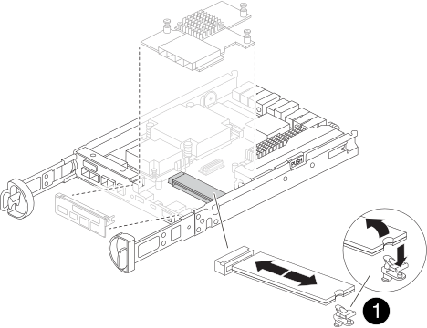

= 更换启动介质以实现自动启动恢复 - FAS2800
:allow-uri-read: 
:icons: font
:imagesdir: ../media/

[role="lead"]
FAS2800 系统中的启动介质存储了重要的固件和配置数据。更换过程包括移除并打开控制器模块、移除受损的启动介质、在控制器模块中安装替换启动介质，然后重新安装控制器模块。

自动启动介质恢复过程仅在ONTAP 9.17.1 及更高版本中受支持。如果您的存储系统运行的是早期版本的ONTAP，请使用link:bootmedia-replace-workflow.html["手动启动恢复程序"] 。

启动介质位于控制器模块内部，可以通过从机箱中移除控制器模块并从系统中移除控制器模块盖模块来访问。

.步骤
. 如果您尚未接地，请正确接地。
. 松开将缆线绑在缆线管理设备上的钩环带，然后从控制器模块上拔下系统缆线和 SFP （如果需要），并跟踪缆线的连接位置。
. 按压凸轮把手上的闩锁，直到其释放为止，完全打开凸轮把手以从中板释放控制器模块，然后用两只手将控制器模块拉出机箱。
+
image::../media/drw_2850_pcm_remove_install_IEOPS-694.svg[卸下控制器]

. 将控制器模块翻转，将其放在平稳的表面上。
. 按下控制器模块两侧的蓝色按钮以松开护盖、然后向上旋转护盖、使其脱离控制器模块、从而打开护盖。
+
image::../media/drw_2850_open_controller_module_cover_IEOPS-695.svg[打开控制器]

+
[cols="1,2"]
|===

 a| 
image::../media/icon_round_1.png[标注编号1]
 a| 
控制器模块护盖释放按钮

|===
. 找到位于夹层卡下方的控制器模块中的启动介质、然后按照说明进行更换。
+

+
[cols="1,2"]
|===

 a| 
image::../media/icon_round_1.png[标注编号1]
 a| 
启动介质锁定卡舌

|===
. 按照下图或控制器模块上的FRU示意图卸下夹层卡：
+
.. 将IO板从控制器模块中直接滑出、以将其卸下。
.. 拧松夹层卡上的翼形螺钉。
+

NOTE: 您可以用手指或螺丝刀拧松翼形螺钉。如果您用手指、则可能需要向上旋转NV电池、以便在其旁边的指旋螺钉上购买更好的手指。

.. 垂直向上提起夹层卡。

. 更换启动介质：
+
.. 按下启动介质外壳上的蓝色按钮、将启动介质从其外壳中释放出来、向上旋转启动介质、然后轻轻地将其从启动介质插槽中竖直拉出。
+

NOTE: 请勿将启动介质竖直向上扭曲或拉，因为这样可能会损坏插槽或启动介质。

.. Align the edges of the replacement boot media with the boot media socket, and then gently push it into the socket.
检查启动介质以确保其完全正确地固定在插槽中、如有必要、请取出启动介质并将其重新插入插槽。
.. 按下蓝色锁定按钮、向下旋转启动介质、然后释放锁定按钮以将启动介质锁定到位。

. 重新安装夹层卡：
+
.. 将主板上的插槽与夹层卡上的插槽对齐、然后将卡轻轻地插入插槽中。
.. 拧紧夹层卡上的三个翼形螺钉。
.. 重新安装IO板。

. 重新安装控制器模块护盖并将其锁定到位。
. 安装控制器模块：
+
.. 将控制器模块的末端与机箱中的开口对齐，然后轻轻地将控制器模块推入系统一半。
.. 重新连接控制器，用力推动凸轮手柄以完成控制器模块的安装，将凸轮手柄推至关闭位置，然后拧紧翼形螺钉。
+
控制器开始启动并在 LOADER 提示符处停止。

.下一步行动
物理更换受损启动介质后，link:bootmedia-recovery-image-boot-bmr.html["从配对节点还原ONTAP映像"]。
