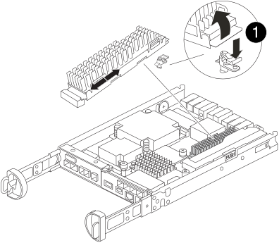

= 更换缓存模块- FAS2820
:allow-uri-read: 
:icons: font
:imagesdir: ../media/

[role="lead"]
如果系统注册了一条 AutoSupport （ ASUP ）消息，指出控制器模块已脱机，则必须更换此缓存模块；否则会导致性能下降。

* 您必须将故障组件更换为从提供商处收到的替代 FRU 组件。

== 第 1 步：关闭受损控制器

要关闭受损控制器，您必须确定控制器的状态，并在必要时接管控制器，以便运行正常的控制器继续从受损控制器存储提供数据。

.关于此任务
If you have a cluster with more than two nodes, it must be in quorum.如果集群未达到仲裁或运行状况良好的控制器在资格和运行状况方面显示 false ，则必须在关闭受损控制器之前更正问题描述 。

http://docs.netapp.com/ontap-9/topic/com.netapp.doc.dot-cm-sag/home.html["《 ONTAP 9 系统管理参考》"^]

您可能希望在更换缓存模块之前擦除其内容。

.步骤
. 尽管缓存模块上的数据已加密，但您可能希望擦除受损缓存模块中的所有数据，并验证缓存模块是否没有数据：
+
.. 擦除缓存模块上的数据： `system controller flash-cache secure-erase run -node _node name_ localhost -device-id _device_number_`
+

NOTE: 请运行 `system controller flash-cache show`如果您不知道Flash Cache设备ID、命令。

.. 验证是否已从缓存模块中擦除数据： `system controller flash-cache secure-erase show`
+
The output should display the caching module status as erased.

. 如果启用了 AutoSupport ，则通过调用 AutoSupport 消息禁止自动创建案例： `ssystem node AutoSupport invoke -node * -type all -message MAINT=number_of_hours_downh`
+
以下 AutoSupport 消息禁止自动创建案例两小时： `cluster1 ： * > system node AutoSupport invoke -node * -type all -message MAINT=2h`

. 如果受损控制器属于 HA 对，请从运行正常的控制器的控制台禁用自动交还： `storage failover modify -node local -auto-giveback false`
. 将受损控制器显示为 LOADER 提示符：
+
[cols="1,2"]
|===
| 如果受损控制器显示 ... | 那么 ... 

 a| 
LOADER 提示符
 a| 
转至下一步。

 a| 
正在等待交还
 a| 
按 Ctrl-C ，然后在出现提示时回答 `y` 。

 a| 
系统提示符或密码提示符（输入系统密码）
 a| 
接管或暂停受损的控制器：

** 对于 HA 对，从运行正常的控制器接管受损的控制器： `storage failover takeover -ofnode _impaired_node_name_`
+
当受损控制器显示 Waiting for giveback... 时，按 Ctrl-C ，然后回答 `y` 。

** 对于独立系统： `ssystem node halt _impaired_node_name_`

|===

== 第 2 步：卸下控制器模块

从系统中卸下控制器模块、然后卸下控制器模块的护盖。

.步骤
. 如果您尚未接地，请正确接地。
. 松开将缆线绑在缆线管理设备上的钩环带，然后从控制器模块上拔下系统缆线和 SFP （如果需要），并跟踪缆线的连接位置。
+
将缆线留在缆线管理设备中，以便在重新安装缆线管理设备时，缆线排列有序。

. 从控制器模块的左右两侧卸下缆线管理设备并将其放在一旁。
. 按压凸轮把手上的闩锁，直到其释放为止，完全打开凸轮把手以从中板释放控制器模块，然后用两只手将控制器模块拉出机箱。
+
image::../media/drw_2240_x_opening_cam_latch.svg[DRW 2240 x 打开凸轮闩锁]

. 将控制器模块翻转，将其放在平稳的表面上。
. 按下控制器模块两侧的蓝色按钮以松开护盖、然后向上旋转护盖、使其脱离控制器模块、从而打开护盖。
+
image::../media/drw_2850_open_controller_module_cover_IEOPS-695.svg[DRW 285控制器模块盖板打开IEOPS 695]

[cols="1,3"]
|===

 a| 
image::../media/icon_round_1.png[标注编号1]
 a| 
控制器模块护盖释放按钮

|===

== 第 3 步：更换缓存模块

找到控制器内的缓存模块、卸下发生故障的缓存模块并将其更换。

.动画-更换缓存模块
video::12b339c5-640a-4be8-a5fc-af47017276fd[panopto]
您的存储系统必须满足特定条件，具体取决于您的情况：

* 它必须具有与要安装的缓存模块对应的操作系统。
* 它必须支持缓存容量。
* 存储系统中的所有其他组件必须正常运行；否则，您必须联系技术支持。

.步骤
. 如果您尚未接地，请正确接地。
. 找到靠近控制器模块背面的故障缓存模块、然后将其卸下。
+
.. 按下蓝色释放按钮、然后向上旋转缓存模块。
.. 将缓存模块竖直从外壳中轻轻拉出。
+

+
[cols="1,3"]
|===

 a| 
image::../media/icon_round_1.png[标注编号1]
 a| 
缓存模块释放按钮

|===

. 将替代缓存模块的边缘与外壳中的插槽对齐、然后将其轻轻推入插槽。
. 验证缓存模块是否已完全固定在插槽中。
+
如有必要，请卸下缓存模块并将其重新插入插槽。

. 按下蓝色锁定按钮、向下旋转缓存模块、然后释放锁定按钮以将缓存模块锁定到位。
. 重新安装控制器模块护盖并将其锁定到位。

== 第 4 步：重新安装控制器模块

将控制器模块重新安装到机箱中。

.步骤
. 如果您尚未接地，请正确接地。
. 如果您尚未更换控制器模块上的外盖，请进行更换。
. 翻转控制器模块、并将其端部与机箱中的开口对齐。
. 将控制器模块轻轻推入系统一半。
+

NOTE: 请勿将控制器模块完全插入机箱中，除非系统指示您这样做。

. 根据需要重新对系统进行布线。
+
如果您已卸下介质转换器（ QSFP 或 SFP ），请记得在使用光缆时重新安装它们。

. 完成控制器模块的重新安装：
+
.. 在凸轮把手处于打开位置的情况下，用力推入控制器模块，直到它与中板并完全就位，然后将凸轮把手合上到锁定位置。
+

NOTE: 将控制器模块滑入机箱时，请勿用力过大，以免损坏连接器。

+
一旦控制器完全固定在机箱中、控制器就会开始启动。

.. 如果尚未重新安装缆线管理设备，请重新安装该设备。
.. 使用钩环带将缆线绑定到缆线管理设备。

== 第5步：还原自动交还和AutoSupport

还原自动交还和AutoSupport (如果已禁用)。

. 使用还原自动交还 `storage failover modify -node local -auto-giveback true` 命令：
. 如果已触发AutoSupport维护窗口、请使用结束此窗口 `system node autosupport invoke -node * -type all -message MAINT=END`

== 第 6 步：将故障部件退回 NetApp

按照套件随附的 RMA 说明将故障部件退回 NetApp 。 https://mysupport.netapp.com/site/info/rma["部件退回和更换"]有关详细信息、请参见页面。
