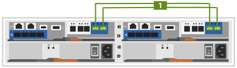

= 详细步骤—FAS2800
:allow-uri-read: 
:icons: font
:imagesdir: ../media/

[role="lead"]
本指南详细介绍了安装典型 NetApp 系统的分步说明。如果您需要更详细的安装说明，请使用本指南。

== 第 1 步：准备安装

要安装FAS2800系统、您需要在NetApp 支持站点 上创建帐户、注册系统并获取许可证密钥。You also need to inventory the appropriate number and type of cables for your system and collect specific network information.

您需要有权访问 https://hwu.netapp.com["NetApp Hardware Universe"] 有关站点要求以及已配置系统上的追加信息的信息。您可能还希望有权访问 http://mysupport.netapp.com/documentation/productlibrary/index.html?productID=62286["适用于您的ONTAP 9版本的发行说明"] 有关此系统的详细信息，请参见您的 ONTAP 版本。

您需要在站点上提供以下内容：

* 存储系统的机架空间
* 2 号十字螺丝刀
* 使用其他网络缆线通过 Web 浏览器将系统连接到网络交换机和笔记本电脑或控制台
* 具有 RJ-45 连接并可访问 Web 浏览器的笔记本电脑或控制台

.步骤
. 打开所有框内容的包装。
. 记录控制器的系统序列号。
+
image::../media/drw_ssn_label.svg[DRW SSN 标签]

. 设置您的帐户：
+
.. 登录到现有帐户或创建帐户。
.. 通过注册您的系统  https://mysupport.netapp.com/eservice/registerSNoAction.do?moduleName=RegisterMyProduct["NetApp 产品注册"]

. 下载并安装 https://mysupport.netapp.com/site/tools/tool-eula/activeiq-configadvisor["Config Advisor"] 在您的笔记本电脑上。
. 清点并记下收到的缆线数量和类型。
+
The following table identifies the types of cables you might receive.如果您收到的缆线未在表中列出，请参见 https://hwu.netapp.com["NetApp Hardware Universe"] 以找到缆线并确定其用途。

+
[cols="1,2,1,2"]
|===
| 缆线类型 ... | 部件号和长度 | 连接器类型 | 针对 ... 

 a| 
10 GbE、SFP28缆线(因订单而异)
 a| 
X6566B-05-R6、.5、

X6566B-2-R6、2米
 a| 
image::../media/oie_cable_sfp_gbe_copper.svg[OIE 使用缆线连接 SFP GbE 铜缆]
 a| 
网络缆线

 a| 
25Gb以太网、SFP28
 a| 
X66240A-05、0.5米

X66240-2、2米

X66240A-5、5米
 a| 
image::../media/oie_cable_25Gb_Ethernet_SFP28_IEOPS-1069.svg[OIE缆线25 Gb以太网SFP28 IEOPS 1069]
 a| 
网络缆线

 a| 
32 Gb光纤通道、
SFP+(目标/启动程序)
 a| 
X66250-2、2米

X66250-5、5米

X66250-15、15米
 a| 
image::../media/oie_cable_sfp_gbe_copper.svg[OIE 使用缆线连接 SFP GbE 铜缆]
 a| 
FC网络

 a| 
6 类， RJ-45 （取决于订单）
 a| 
X6561-R6

X6562-R6
 a| 
image::../media/oie_cable_rj45.svg[OIE 缆线 RJ45]
 a| 
管理网络和以太网数据

 a| 
存储
 a| 
X66030A、0.5米

X66031A、1米

X66032 A、2米
 a| 
image::../media/oie_cable_mini_sas_hd_to_mini_sas_hd.svg[OIE使用缆线将迷你SAS HD连接到迷你SAS HD]
 a| 
存储

 a| 
USB-C控制台电缆
 a| 
不适用
 a| 
image::../media/oie_cable_micro_usb.svg[OIE缆线微型USB]
 a| 
在非 Windows 或 Mac 笔记本电脑 / 控制台上设置软件期间连接控制台

 a| 
电源线
 a| 
不适用
 a| 
image::../media/oie_cable_power.svg[OIE缆线电源]
 a| 
启动系统

 a| 
可选FC缆线
 a| 
可选FC缆线
 a| 
image::../media/oie_cable_fiber_lc_connector.svg[OIE 缆线光纤 LC 连接器]
 a| 
附加FC网络缆线

|===
. 下载并填写中的工作表  https://docs.netapp.com/us-en/ontap/software_setup/concept_set_up_the_cluster.html#cluster-setup-worksheets["使用 ONTAP 命令行界面设置集群"^]。

== 第 2 步：安装硬件

您需要根据需要将系统安装在四柱机架或 NetApp 系统机柜中。

.步骤
. 根据需要安装导轨套件。
. 按照导轨套件附带的说明安装并固定系统。
+

NOTE: 您需要了解与系统重量相关的安全问题。

+
image::../media/oie_fas2800_weight_caution_IEOPS-1070.svg[OIE FAS2800重量注意事项IEOPS 1070]

. 连接缆线管理设备（如图所示）。
+
image::../media/drw_cable_management_arm_install.svg[DRW 缆线管理臂安装]

. 将挡板放在系统正面。

== 第 3 步：使用缆线将控制器连接到网络

使用双节点无交换机集群方法或集群互连网络方法将控制器连接到网络。

下表列出了双节点无交换机集群网络布线和有交换机集群网络布线的插图中的缆线类型以及呼出编号和缆线颜色。

[cols="20%,80%"]
|===
| 布线 | 连接类型 

 a| 
image::../media/oie_legend_icon_1_lg.svg[OIE图例图标1长]
 a| 
集群互连

 a| 

 a| 
管理网络交换机

 a| 
image::../media/oie_legend_icon_3_o.svg[OIE 图例图标 3 o]
 a| 
主机网络交换机

|===
[role="tabbed-block"]
====
.选项 1 ：为双节点无交换机集群布线
--
为双节点无交换机集群的网络连接和集群互连端口布线。

.开始之前
有关将系统连接到交换机的信息，请与网络管理员联系。

请务必检查插图箭头以确定正确的缆线连接器拉片方向。

image::../media/oie_cable_pull_tab_down.svg[OIE 缆线下拉卡舌]

NOTE: 插入连接器时、您应感觉到它卡入到位；如果您没有感觉到它卡入到位、请将其卸下、将电缆头翻转并重试。

NOTE: 如果要连接到光纤交换机，请先将 SFP 插入控制器端口，然后再使用缆线连接到该端口。

.关于此任务
您可以使用图形或分步说明完成控制器之间以及与交换机之间的布线。

.动画—为双节点无交换机集群布线
video::90577508-fa79-46cf-b18a-afe8016325af[panopto]
.步骤
. 使用集群互连缆线将集群互连端口e0a连接到e0a、并将e0b连接到e0b：
+
image::../media/oie_cable_25Gb_Ethernet_SFP28_IEOPS-1069.svg[OIE缆线25 Gb以太网SFP28 IEOPS 1069]

+
*集群互连缆线*

+

. 使用 RJ45 缆线将 e0M 端口连接到管理网络交换机：
+
image::../media/oie_cable_rj45.svg[OIE 缆线 RJ45]

+
*RJ45电缆*

+
image::../media/drw_2800_management_connection_IEOPS-1077.svg[DRW 2800管理连接IEOPS 1077]

. 使用缆线将夹层卡端口连接到主机网络。
+
image::../media/drw_2800_network_cabling_IEOPS-894.svg[DRW 2800 IEOPS 894网络布线]

+
.. 如果您使用的是4端口以太网数据网络、请使用缆线将端口e1a到e1d连接到以太网数据网络。
+
*** 4端口、1025 Gb以太网、SFP28
+
image::../media/oie_cable_sfp_gbe_copper.svg[OIE 使用缆线连接 SFP GbE 铜缆]

+
image::../media/oie_cable_25Gb_Ethernet_SFP28_IEOPS-1069.svg[OIE缆线25 Gb以太网SFP28 IEOPS 1069]

*** 4端口、10GBase-T、RJ45
+
image::../media/oie_cable_rj45.svg[OIE 缆线 RJ45]

.. 如果您使用的是4端口光纤通道数据网络、请使用缆线将端口1a到1d连接到FC网络。
+
*** 4端口、32 Gb光纤通道、SFP+(仅限目标)
+
image::../media/oie_cable_sfp_gbe_copper.svg[OIE 使用缆线连接 SFP GbE 铜缆]

*** 4端口、32 Gb光纤通道、SFP+(启动程序/目标)
+
image::../media/oie_cable_sfp_gbe_copper.svg[OIE 使用缆线连接 SFP GbE 铜缆]

.. 如果您有2+2卡(2个端口具有以太网连接、2个端口具有光纤通道连接)、请使用缆线将端口e1a和e1b连接到FC数据网络、并将端口e1c和e1d连接到以太网数据网络。
+
*** 2端口、10/C5Gb以太网(SFP28)+ 2端口32 Gb FC (SFP+)
+
image::../media/oie_cable_sfp_gbe_copper.svg[OIE 使用缆线连接 SFP GbE 铜缆]

+
image::../media/oie_cable_sfp_gbe_copper.svg[OIE 使用缆线连接 SFP GbE 铜缆]

IMPORTANT: 请勿插入电源线。

--
.选项 2 ：为有交换机的集群布线
--
为有交换机集群的网络连接和集群互连端口布线。

NOTE: 您必须已联系网络管理员，了解有关将系统连接到交换机的信息。

请务必检查插图箭头以确定正确的缆线连接器拉片方向。

image::../media/oie_cable_pull_tab_down.svg[OIE 缆线下拉卡舌]

NOTE: 插入连接器时、您应感觉到它卡入到位；如果您没有感觉到它卡入到位、请将其卸下、然后将电缆头翻转过来并重试。

.关于此任务
您可以使用图形或分步说明完成控制器之间以及与交换机之间的布线。

.动画—切换集群布线
video::6553a3db-57dd-4247-b34a-afe8016315d4[panopto]
.步骤
. 使用集群互连缆线将集群互连端口e0a连接到e0a、并将e0b连接到e0b：
+
image::../media/oie_cable_25Gb_Ethernet_SFP28_IEOPS-1069.svg[OIE缆线25 Gb以太网SFP28 IEOPS 1069]

+

. 使用 RJ45 缆线将 e0M 端口连接到管理网络交换机：
+
image::../media/oie_cable_rj45.svg[OIE 缆线 RJ45]

+
image::../media/drw_2800_management_connection_IEOPS-1077.svg[DRW 2800管理连接IEOPS 1077]

. 使用缆线将夹层卡端口连接到主机网络。
+
image::../media/drw_2800_network_cabling_IEOPS-894.svg[DRW 2800 IEOPS 894网络布线]

+
.. 如果您使用的是4端口以太网数据网络、请使用缆线将端口e1a到e1d连接到以太网数据网络。
+
*** 4端口、1025 Gb以太网、SFP28
+
image::../media/oie_cable_sfp_gbe_copper.svg[OIE 使用缆线连接 SFP GbE 铜缆]

+
image::../media/oie_cable_25Gb_Ethernet_SFP28_IEOPS-1069.svg[OIE缆线25 Gb以太网SFP28 IEOPS 1069]

*** 4端口、10GBase-T、RJ45
+
image::../media/oie_cable_rj45.svg[OIE 缆线 RJ45]

.. 如果您使用的是4端口光纤通道数据网络、请使用缆线将端口1a到1d连接到FC网络。
+
*** 4端口、32 Gb光纤通道、SFP+(仅限目标)
+
image::../media/oie_cable_sfp_gbe_copper.svg[OIE 使用缆线连接 SFP GbE 铜缆]

*** 4端口、32 Gb光纤通道、SFP+(启动程序/目标)
+
image::../media/oie_cable_sfp_gbe_copper.svg[OIE 使用缆线连接 SFP GbE 铜缆]

.. 如果您有2+2卡(2个端口具有以太网连接、2个端口具有光纤通道连接)、请使用缆线将端口e1a和e1b连接到FC数据网络、并将端口e1c和e1d连接到以太网数据网络。
+
*** 2端口、10/C5Gb以太网(SFP28)+ 2端口32 Gb FC (SFP+)
+
image::../media/oie_cable_sfp_gbe_copper.svg[OIE 使用缆线连接 SFP GbE 铜缆]

+
image::../media/oie_cable_sfp_gbe_copper.svg[OIE 使用缆线连接 SFP GbE 铜缆]

IMPORTANT: 请勿插入电源线。

--
====

== 第 4 步：使用缆线将控制器连接到驱动器架

使用缆线将控制器连接到外部存储。

NOTE: 此示例使用 DS224C 。布线方式与其他受支持的驱动器架类似。

请务必检查插图箭头以确定正确的缆线连接器拉片方向。

image::../media/oie_cable_pull_tab_down.svg[OIE 缆线下拉卡舌]

.关于此任务
您可以使用图形或分步说明完成控制器之间以及驱动器架的布线。

.动画-驱动器架布线
video::b2a7549d-8141-47dc-9e20-afe8016f4386[panopto]

NOTE: 请勿在FAS2800上使用端口0b2。ONTAP不使用此SAS端口、并且此端口始终处于禁用状态。请参见 https://docs.netapp.com/us-en/ontap-systems/sas3/install-new-system.html["在新存储系统中安装磁盘架"^] 有关详细信息 ...

下表列出了双节点无交换机集群网络布线和有交换机集群网络布线的插图中的缆线类型以及呼出编号和缆线颜色。

[cols="20%,80%"]
|===
| 布线 | 连接类型 

 a| 
image::../media/oie_legend_icon_1_lo.svg[OIE图例图标1]
 a| 
集群互连

 a| 
image::../media/oie_legend_icon_2_mb.svg[OIE图例图标2 MB]
 a| 
管理网络交换机

 a| 

 a| 
主机网络交换机

|===
.步骤
. 为磁盘架到磁盘架端口布线。
+
.. IOM A上的端口1到直接下方磁盘架上IOM A上的端口3。
.. IOM B上的端口1到直接下方磁盘架上IOM B上的端口3。
+
image::../media/oie_cable_mini_sas_hd_to_mini_sas_hd.svg[OIE使用缆线将迷你SAS HD连接到迷你SAS HD]

+
*迷你SAS HD到迷你SAS HD电缆*

+
image::../media/drw_2800_shelf-to-shelf_cabling_IEOPS-895.svg[DRW 2800磁盘架到磁盘架的缆线IEOPS 895]

. 使用缆线将控制器A连接到驱动器架。
+
.. 控制器A端口0a到堆栈中第一个驱动器架上的IOM B端口1。
.. 控制器A端口0b1到堆栈中最后一个驱动器架上的IOM A端口3。
+
image::../media/oie_cable_mini_sas_hd_to_mini_sas_hd.svg[OIE使用缆线将迷你SAS HD连接到迷你SAS HD]

+
*迷你SAS HD到迷你SAS HD电缆*

+
image::../media/dwr-2800_controller1-to shelves_IEOPS-896.svg[DWR 2800控制器1到磁盘架IEOPS 896]

. 将控制器B连接到驱动器架。
+
.. 控制器B端口0a到堆栈中第一个驱动器架上的IOM A端口1。
.. 控制器B端口0b1到堆栈中最后一个驱动器架上的IOM B端口3。
+
image::../media/oie_cable_mini_sas_hd_to_mini_sas_hd.svg[OIE使用缆线将迷你SAS HD连接到迷你SAS HD]

+
*迷你SAS HD到迷你SAS HD电缆*

+
image::../media/dwr-2800_controller2-to shelves_IEOPS-897.svg[DWR 2800控制器2到磁盘架IEOPS 897]

== 第 5 步：完成系统设置和配置

您可以使用仅连接到交换机和笔记本电脑的集群发现完成系统设置和配置，也可以直接连接到系统中的控制器，然后连接到管理交换机。

[role="tabbed-block"]
====
.选项 1 ：如果启用了网络发现
--
如果您的笔记本电脑启用了网络发现、请使用自动集群发现完成系统设置和配置。

.步骤
. Use the following animation to set one or more drive shelf IDs:
+
.动画—设置驱动器架ID
video::c600f366-4d30-481a-89d9-ab1b0066589b[panopto]
. 将电源线插入控制器电源，然后将其连接到不同电路上的电源。
. 打开两个节点的电源开关。
+
image::../media/dwr_2800_turn_on_power_IEOPS-898.svg[DWR 2800打开电源IEOPS 898]

+

NOTE: 初始启动可能需要长达八分钟的时间。

. 确保您的笔记本电脑已启用网络发现。
+
有关详细信息，请参见笔记本电脑的联机帮助。

. 使用以下动画将您的笔记本电脑连接到管理交换机。
+
.动画—将笔记本电脑连接到管理交换机
video::d61f983e-f911-4b76-8b3a-ab1b0066909b[panopto]
. 选择列出的 ONTAP 图标以发现：
+
image::../media/drw_autodiscovery_controler_select.svg[DRW 自动发现控制器选择]

+
.. 打开文件资源管理器。
.. 单击左窗格中的 network 。
.. 右键单击并选择刷新。
.. 双击 ONTAP 图标并接受屏幕上显示的任何证书。
+

NOTE: XXXXX 是目标节点的系统序列号。

+
此时将打开 System Manager 。

. 使用 System Manager 引导式设置使用中收集的数据配置系统 https://library.netapp.com/ecm/ecm_download_file/ECMLP2862613["《 ONTAP 配置指南》"]
. 运行 Config Advisor 以验证系统的运行状况。
. 完成初始配置后，转到 https://www.netapp.com/data-management/oncommand-system-documentation/["ONTAP 和 AMP ； ONTAP System Manager 文档资源"] 页面，了解有关在 ONTAP 中配置其他功能的信息。

--
.选项 2 ：如果未启用网络发现
--
如果您的笔记本电脑未启用网络发现、请手动完成配置和设置。

.步骤
. 为笔记本电脑或控制台布线并进行配置：
+
.. 使用 N-8-1 将笔记本电脑或控制台上的控制台端口设置为 115200 波特。
+

NOTE: 有关如何配置控制台端口的信息，请参见笔记本电脑或控制台的联机帮助。

.. 将控制台电缆连接到笔记本电脑或控制台、并使用系统附带的控制台电缆连接控制器上的控制台端口、然后c将 笔记本电脑或控制台连接到管理子网上的交换机。
+
image::../media/drw_2800_laptop_to_switch_to_controller_IEOPS-1084.svg[DRW 2800笔记本电脑、用于切换到控制器IEOPS 1084]

.. 使用管理子网上的一个 TCP/IP 地址为笔记本电脑或控制台分配 TCP/IP 地址。

. 使用以下动画设置一个或多个驱动器架 ID ：
+
.动画—设置驱动器架ID
video::c600f366-4d30-481a-89d9-ab1b0066589b[panopto]
. 将电源线插入控制器电源，然后将其连接到不同电路上的电源。
. 打开两个节点的电源开关。
+
image::../media/dwr_2800_turn_on_power_IEOPS-898.svg[DWR 2800打开电源IEOPS 898]

+

NOTE: 初始启动可能需要长达八分钟的时间。

. 将初始节点管理 IP 地址分配给其中一个节点。
+
[cols="20%,80%"]
|===
| 如果管理网络具有 DHCP... | 那么 ... 

 a| 
已配置
 a| 
记录分配给新控制器的 IP 地址。

 a| 
未配置
 a| 
.. 使用 PuTTY ，终端服务器或环境中的等效项打开控制台会话。
+

NOTE: 如果您不知道如何配置 PuTTY ，请查看笔记本电脑或控制台的联机帮助。

.. 在脚本提示时输入管理 IP 地址。

|===
. 使用笔记本电脑或控制台上的 System Manager 配置集群：
+
.. 将浏览器指向节点管理 IP 地址。
+

NOTE: 此地址的格式为 https://x.x.x.x[]。

.. Configure the system using the data you collected in the https://library.netapp.com/ecm/ecm_download_file/ECMLP2862613["《 ONTAP 配置指南》"]。

. 运行 Config Advisor 以验证系统的运行状况。
. 完成初始配置后、请转至  https://www.netapp.com/data-management/oncommand-system-documentation/["ONTAP 和 AMP ； ONTAP System Manager 文档资源"] 有关在ONTAP中配置其他功能的信息、请参见。

--
====