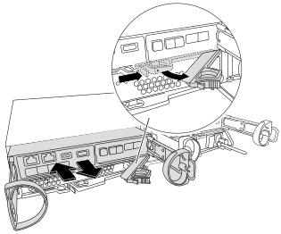

= 更换夹层卡- FAS2820
:allow-uri-read: 
:icons: font
:imagesdir: ../media/

[role="lead"]
如果卡出现故障，请更换 FAS2820 系统中的夹层卡，或通过安装新卡将其升级到其他协议。

* 将此过程与您的系统支持的任何 ONTAP 版本一起使用。
* 使用相同类型或不同类型的夹层卡进行更换。
* 在关闭控制器之前，写下 ifgrp 和 VLAN 信息。
* 如果更改夹层卡类型，请在控制器重新启动后更改 LIF 和端口设置。
* 验证所有其他系统组件是否正常工作。如果问题仍然存在，请致电技术支持。

.动画-更换夹层卡
video::a8ec891d-f6f6-4479-9ca2-af47017254ff[panopto]

== 第 1 步：关闭受损控制器

.开始之前
* 如果要更改夹层卡类型，请捕获受损节点的 ifgrp 和 VLAN 信息。
+
[source, cli]
----
network port vlan show -node _impaired_node_name_
network port ifgrp show -node _impaired_node_name_
----

接管并停止受损的控制器，以便健康控制器继续从受损的控制器的存储中提供数据。为此，您需要在 AutoSupport 中禁止自动创建案例，禁用自动回馈，并将受损的控制器带到 LOADER 提示符处。LOADER 提示符是安全停止状态，您可以从中更换 FRU。

If you have a cluster with more than two nodes, it must be in quorum.如果集群未达到仲裁或运行状况良好的控制器在资格和运行状况方面显示false、则必须在关闭受损控制器之前更正问题描述 ；请参见 link:https://docs.netapp.com/us-en/ontap/system-admin/synchronize-node-cluster-task.html?q=Quorum["将节点与集群同步"^]。

.步骤
. 如果启用了AutoSupport 、则通过调用AutoSupport 消息禁止自动创建案例：
+
`system node autosupport invoke -node * -type all -message MAINT=<number of hours down>h`

+
这可以防止在计划的维护时段内打开自动支持案例。最大抑制持续时间为 72 小时。如果维护提前完成，您可以通过调用带有  `MAINT=END` 的 AutoSupport 消息来重新启用案例创建。有关详细信息，请参见  https://kb.netapp.com/Support_Bulletins/Customer_Bulletins/SU92["如何在计划维护窗口期间禁止自动创建案例"^]。

+
以下AutoSupport 消息禁止自动创建案例两小时：

+
`cluster1:*> system node autosupport invoke -node * -type all -message MAINT=2h`

. 如果受损控制器属于 HA 对，请从运行正常的控制器的控制台禁用自动交还： `storage failover modify -node local -auto-giveback false`
. 将受损控制器显示为 LOADER 提示符：
+
[cols="1,2"]
|===
| 如果受损控制器显示 ... | 那么 ... 

 a| 
LOADER 提示符
 a| 
转至 "Remove controller module" 。

 a| 
正在等待交还
 a| 
按 Ctrl-C ，然后回答 `y` 。

 a| 
系统提示符或密码提示符（输入系统密码）
 a| 
从运行正常的控制器接管或暂停受损的控制器： `storage failover takeover -ofnode _impaired_node_name_`

当受损控制器显示 Waiting for giveback... 时，按 Ctrl-C ，然后回答 `y` 。

|===

== 第 2 步：卸下控制器模块

拆下控制器模块及其外盖。

.步骤
. 如果您尚未接地，请正确接地。
. 松开钩环带，注意电缆的连接位置，然后拔下系统电缆和 SFP（如果需要）。
+
将电缆留在电缆管理设备中，以保持电缆井然有序。

. 从控制器模块的左右两侧卸下缆线管理设备并将其放在一旁。
. 松开凸轮手柄闩锁，将其完全打开，然后将控制器模块从机箱中拉出。
+

. 将控制器翻过来，放在平坦、稳定的表面上。
. 按下控制器模块两侧的蓝色按钮以松开盖子。向上旋转盖子并将其从控制器模块上取下。
+
image::../media/drw_2850_open_controller_module_cover_IEOPS-695.svg[打开控制器]

[cols="1,3"]
|===

 a| 
image::../media/icon_round_1.png[标注编号1]
 a| 
控制器模块护盖释放按钮

|===

== 步骤3：更换夹层卡

更换夹层卡。

. 如果您尚未接地，请正确接地。
. 按照下图或控制器模块上的FRU示意图卸下夹层卡：
+
image::../media/drw_2850_replace_HIC_IEOPS-700.svg[更换夹层卡]

+
[cols="1,3"]
|===

 a| 
image::../media/icon_round_1.png[标注编号1]
 a| 
IO板

 a| 
image::../media/icon_round_2.png[标注编号2]
 a| 
PCIe夹层卡

|===
+
.. 将IO板从控制器模块中竖直滑出、以将其卸下。
.. 拧松夹层卡上的翼形螺钉、然后竖直提起夹层卡。
+

NOTE: 您可以用手指或螺丝刀拧松翼形螺钉。如果您用手指、则可能需要向上旋转NV电池、以便在其旁边的指旋螺钉上购买更好的手指。

. 重新安装夹层卡：
+
.. 将更换夹层卡上的连接器与主板上的插座对齐，然后轻轻地将卡正方形固定在插座中。
.. 拧紧夹层卡上的三个翼形螺钉。
.. 重新安装IO板。

. 将控制器模块盖盖上并锁定。

== 步骤 4：安装并重新启动控制器模块

重新安装并重新启动控制器模块。

.步骤
. 如果您尚未接地，请正确接地。
. 翻转控制器模块、并将其端部与机箱中的开口对齐。
. 轻轻地将控制器模块推入机箱一半的位置。
+

NOTE: 请勿将控制器模块完全插入机箱中，除非系统指示您这样做。

. 根据需要重新连接系统电缆。
+
如果您已卸下介质转换器（ QSFP 或 SFP ），请记得在使用光缆时重新安装它们。

. 完成控制器模块的重新安装：
+
.. 打开凸轮手柄，牢固地推入控制器模块，直到完全就位。关闭凸轮手柄以锁定。
+

NOTE: 将控制器模块滑入机箱时，请勿用力过大，以免损坏连接器。

+
控制器一旦固定在机箱中，就会开始启动。

.. 如果尚未重新安装缆线管理设备，请重新安装该设备。
.. 使用钩环带将电缆绑在电缆管理设备上。== 第 5 步：重新配置夹层卡（如果类型已更改）

控制器重新启动后，如果您更换了其他类型的卡，请更改夹层卡设置，使其与新卡相匹配。

[role="tabbed-block"]
====
.选项 1：光纤通道到以太网夹层卡
--
根据需要更新 LIF 和端口设置，以配置以太网更换夹层卡。

.步骤
. 使用  `network port show` 命令可确认新的端口名称和链路状态。
. 在新的以太网夹层端口上重建任何 ifgrps 和 VLAN。
. 将新端口或 ifgrp/VLAN 端口放入正确的广播域和 IPspaces 中，并设置 MTU 值。
. 更新受影响的 LIF 主端口和故障转移设置。
. 删除不再需要的 LIF。

有关在 ONTAP 中配置以太网的更多详细信息，请参见 link:https://docs.netapp.com/us-en/ontap/networking/configure_network_ports_cluster_administrators_only_overview.html["了解 ONTAP 网络端口配置"]。

--
.选项 2：以太网到光纤通道夹层卡
--
根据需要更新 LIF 和端口设置，以配置更换 FC 夹层卡。

.步骤
. 在相关 SVM 上启用 FCP。创建新数据 LIF。
. 更新结构分区和主机路径。根据需要更新端口集、igroup 和 LUN 映射。
. 验证主机多路径。确认没有过时的路径，并且路径在优化和非优化路径之间保持平衡。
. 验证没有 LIF 驻留在已删除的以太网端口上，所有 FC LIF 都已启动并提供 I/O，并且 AutoSupport 监控反映了新配置。

有关在 ONTAP 中配置光纤通道的更多详细信息，请参见link:https://docs.netapp.com/us-en/ontap/san-admin/index.html["SAN 管理概述"]。

--
====

== 第 6 步：使控制器恢复正常运行

将存储空间交还给受损的控制器，恢复自动交还，并结束 AutoSupport 维护窗口。

. 从运行正常的控制器或集群管理提示符下，通过恢复其存储使控制器恢复正常运行： `storage failover giveback -ofnode _impaired_node_name_`
. 使用还原自动交还 `storage failover modify -node local -auto-giveback true` 命令：
. 如果已触发AutoSupport维护窗口、请使用结束此窗口 `system node autosupport invoke -node * -type all -message MAINT=END` 命令：

== 第 7 步：将故障部件退回 NetApp

按照套件随附的 RMA 说明将故障部件退回 NetApp 。 https://mysupport.netapp.com/site/info/rma["部件退回和更换"]有关详细信息、请参见页面。
