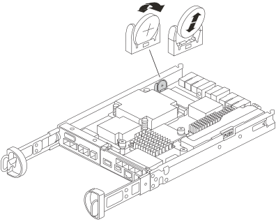

= 更换实时时钟电池- FAS2800
:allow-uri-read: 
:icons: font
:imagesdir: ../media/

[role="lead"]
您需要更换控制器模块中的实时时钟（ Real-Time Clock ， RTC ）电池，以便依靠准确时间同步的系统服务和应用程序可以继续运行。

* 您可以将此操作步骤与系统支持的所有 ONTAP 版本结合使用
* 系统中的所有其他组件必须正常运行；否则，您必须联系技术支持。

== 第 1 步：关闭受损控制器

要关闭受损控制器，您必须确定控制器的状态，并在必要时接管控制器，以便运行正常的控制器继续从受损控制器存储提供数据。

.关于此任务
* 如果您使用的是SAN系统，则必须已检查受损控制器SCSI刀片的事件消息  `cluster kernel-service show`。 `cluster kernel-service show`命令(在priv高级模式下)可显示节点名称、该节点的仲裁状态、该节点的可用性状态以及该节点的运行状态。
+
每个 SCSI 刀片式服务器进程应与集群中的其他节点保持仲裁关系。在继续更换之前，必须先解决所有问题。

* If you have a cluster with more than two nodes, it must be in quorum.如果集群未达到仲裁或运行状况良好的控制器在资格和运行状况方面显示false、则必须在关闭受损控制器之前更正问题描述 ；请参见 link:https://docs.netapp.com/us-en/ontap/system-admin/synchronize-node-cluster-task.html?q=Quorum["将节点与集群同步"^]。

.步骤
. 如果启用了AutoSupport、则通过调用AutoSupport消息禁止自动创建案例： `system node autosupport invoke -node * -type all -message MAINT=<# of hours>h`
+
以下AutoSupport 消息禁止自动创建案例两小时： `cluster1:> system node autosupport invoke -node * -type all -message MAINT=2h`

. 从运行正常的控制器的控制台禁用自动交还： `storage failover modify – node local -auto-giveback false`
+

NOTE: 当您看到_Do you want to disable auto-giveback？_时、输入`y`。

. 将受损控制器显示为 LOADER 提示符：
+
[cols="1,2"]
|===
| 如果受损控制器显示 ... | 那么 ... 

 a| 
LOADER 提示符
 a| 
转至下一步。

 a| 
正在等待交还
 a| 
按 Ctrl-C ，然后在出现提示时回答 `y` 。

 a| 
系统提示符或密码提示符
 a| 
从运行正常的控制器接管或暂停受损的控制器： `storage failover takeover -ofnode _impaired_node_name_`

当受损控制器显示 Waiting for giveback... 时，按 Ctrl-C ，然后回答 `y` 。

|===

== 第 2 步：卸下控制器模块

从系统中卸下控制器模块、然后卸下控制器模块的护盖。

. 如果您尚未接地，请正确接地。
. 松开将缆线绑在缆线管理设备上的钩环带，然后从控制器模块上拔下系统缆线和 SFP （如果需要），并跟踪缆线的连接位置。
+
将缆线留在缆线管理设备中，以便在重新安装缆线管理设备时，缆线排列有序。

. 从控制器模块的左右两侧卸下缆线管理设备并将其放在一旁。
. 按压凸轮把手上的闩锁，直到其释放为止，完全打开凸轮把手以从中板释放控制器模块，然后用两只手将控制器模块拉出机箱。
+
image::../media/drw_2850_pcm_remove_install_IEOPS-694.svg[DRW 285 PCM拆卸、安装IEOPS 694]

. 将控制器模块翻转，将其放在平稳的表面上。
. 按下控制器模块两侧的蓝色按钮以松开护盖、然后向上旋转护盖、使其脱离控制器模块、从而打开护盖。
+
image::../media/drw_2850_open_controller_module_cover_IEOPS-695.svg[DRW 285控制器模块盖板打开IEOPS 695]

== 第 3 步：更换 RTC 电池

将RTC电池放在控制器中、然后按照特定步骤顺序进行更换。

.动画-更换RTC电池
video::7420d100-23b1-4213-a8da-af4701725622[panopto]

. 如果您尚未接地，请正确接地。
. 找到 RTC 电池。
. 将电池轻轻推离电池架，将其旋转出电池架，然后将其从电池架中取出。
+

NOTE: 从电池架中取出电池时，请注意电池的极性。电池标有加号，必须正确放置在支架中。电池座旁边的加号用于指示电池的位置。

. 从防静电运输袋中取出更换用电池。
. 找到控制器模块中的空电池支架。
. 记下 RTC 电池的极性，然后将电池倾斜并向下推，将其插入电池架中。
. 目视检查电池，确保其已完全安装到电池架中，并且极性正确。

== 第 4 步：重新安装控制器模块

重新安装控制器模块、并将其启动至加载程序提示符。

. 翻转控制器模块、并将其端部与机箱中的开口对齐。
. 将控制器模块轻轻推入系统的一半。将控制器模块的一端与机箱中的开口对齐、然后将控制器模块轻轻推入系统的一半。
+
请勿将控制器模块完全插入机箱中，除非系统指示您这样做。

. 根据需要重新对系统进行布线。
+
如果您已卸下介质转换器（ QSFP 或 SFP ），请记得在使用光缆时重新安装它们。

. 如果已拔下电源，请重新插入电源，然后重新安装电源线固定器。
. 完成控制器模块的重新安装：

image::../media/drw_2850_pcm_remove_install_IEOPS-694.svg[DRW 285 PCM拆卸、安装IEOPS 694]

. 在凸轮把手处于打开位置的情况下，用力推入控制器模块，直到它与中板并完全就位，然后将凸轮把手合上到锁定位置。
+

NOTE: 将控制器模块滑入机箱时，请勿用力过大，以免损坏连接器。

+
控制器一旦固定在机箱中，就会开始启动。

. 如果尚未重新安装缆线管理设备，请重新安装该设备。
. 使用钩环带将缆线绑定到缆线管理设备。
. 将电源线重新连接到电源和电源，然后打开电源以启动启动过程。
. 在 LOADER 提示符处暂停控制器。

== 第5步：在更换RTC电池后设置时间/日期

. 重置控制器上的时间和日期：
+
.. 使用 `show date` 命令检查运行状况良好的控制器上的日期和时间。
.. 在目标控制器上的 LOADER 提示符处，检查时间和日期。
.. 如有必要，请使用 `set date MM/dd/yyyy` 命令修改日期。
.. 如有必要，请使用 `set time hh ： mm ： ss` 命令在 GMT 中设置时间。
.. 确认目标控制器上的日期和时间。

. 在 LOADER 提示符处，输入 `bye` 以重新初始化 PCIe 卡和其他组件，并让控制器重新启动。
. 交还控制器的存储，使其恢复正常运行： `storage failover giveback -ofnode _impaired_node_name_`
. 使用还原自动交还 `storage failover modify -node local -auto-giveback true` 命令：
. 如果已触发AutoSupport维护窗口、请使用结束此窗口 `system node autosupport invoke -node * -type all -message MAINT=END` 命令：

== 第 6 步：将故障部件退回 NetApp

按照套件随附的 RMA 说明将故障部件退回 NetApp 。请参见 https://mysupport.netapp.com/site/info/rma["部件退回和放大器；更换"] 第页，了解更多信息。
