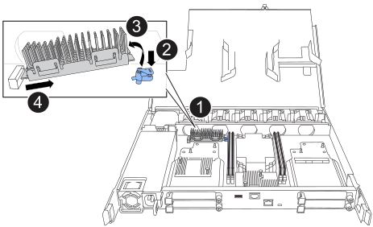

= 更换启动介质以实现自动启动恢复 - FAS50
:allow-uri-read: 
:icons: font
:imagesdir: ../media/

[role="lead"]
FAS50 存储系统中的启动介质存储了重要的固件和配置数据。更换过程包括移除控制器模块、移除损坏的启动介质、安装替换启动介质，然后重新安装控制器模块。

自动启动介质恢复过程仅在ONTAP 9.17.1 及更高版本中受支持。如果您的存储系统运行的是早期版本的ONTAP，请使用link:bootmedia-replace-workflow.html["手动启动恢复程序"] 。

== 关于此任务

如果需要、您可以打开平台机箱位置(蓝色) LED、以帮助找到受影响的平台。使用SSH登录到BMC并输入 `system location-led _on_`命令。

平台机箱有三个定位LED：操作员显示面板上一个、每个控制器上一个。Location LEDs remain illuminated for 30 minutes.

您可以输入命令将其关闭 `system location-led _off_`。如果您不确定LED是亮起还是熄灭、可以输入命令来检查其状态 `system location-led show`。

== 第 1 步：卸下控制器

在更换控制器或更换控制器内部的组件时、必须从机箱中卸下控制器。

.开始之前
确保存储系统中的所有其他组件均正常运行；否则、您必须先联系、 https://mysupport.netapp.com/site/global/dashboard["NetApp 支持"]然后再继续此过程。

.步骤
. 在受损控制器上、确保NV LED熄灭。
+
当NV LED熄灭时、转销已完成、可以安全地卸下受损控制器。

+

NOTE: 如果NV LED闪烁(绿色)、则表示正在进行减载。您必须等待NV LED熄灭。但是、如果闪烁持续时间超过五分钟、请先联系、 https://mysupport.netapp.com/site/global/dashboard["NetApp 支持"]然后再继续此过程。

+
NV LED位于控制器上的NV图标旁边。

+
image::../media/drw_g_nvmem_led_ieops-1839.svg[NV状态LED位置]

[cols="1,4"]
|===

 a| 
image::../media/icon_round_1.png[标注编号1]
 a| 
控制器上的NV图标和LED

|===
. 如果您尚未接地，请正确接地。
. 断开受损控制器的电源：
+

NOTE: 电源(PSU)没有电源开关。

+
[cols="1,2"]
|===
| 如果您要断开... | 那么 ... 

 a| 
交流PSU
 a| 
.. 打开电源线固定器。
.. 从PSU上拔下电源线、并将其放在一旁。

 a| 
直流PSU
 a| 
.. 拧下D-sub直流电源线连接器上的两颗指旋螺钉。
.. 从PSU上拔下电源线、并将其放在一旁。

|===
. 从受损控制器上拔下所有缆线。
+
跟踪电缆的连接位置。

. 删除受损控制器：
+
下图显示了卸下控制器时控制器手柄(从控制器左侧开始)的操作：

+
image::../media/drw_g_and_t_handles_remove_ieops-1837.svg[用于删除控制器的控制器句柄操作]

+
[cols="1,4"]
|===

 a| 
image::../media/icon_round_1.png[标注编号1]
 a| 
在控制器的两端、向外推垂直锁定卡舌以释放手柄。

 a| 
image::../media/icon_round_2.png[标注编号2]
 a| 
** 朝您的方向拉动手柄、将控制器从中间板上取下。
+
拉动时、手柄会从控制器中伸出、然后您会感觉到一些阻力、请继续拉动。

** 将控制器滑出机箱、同时支撑控制器底部、然后将其放在平稳的表面上。

 a| 
image::../media/icon_round_3.png[标注编号3]
 a| 
如果需要、竖直旋转手柄(位于卡舌旁边)以将其移开。

|===
. 将控制器放在防静电垫上。
. 逆时针旋转指旋螺钉以打开控制器护盖、然后打开护盖。

== 第 2 步：更换启动介质

要更换启动介质、请在控制器内找到它、然后按照特定的步骤顺序进行操作。

. 如果您尚未接地，请正确接地。
. 删除启动介质：
+

+
[cols="1,4"]
|===

 a| 
image::../media/icon_round_1.png[标注编号1]
 a| 
启动介质位置

 a| 
image::../media/icon_round_2.png[标注编号2]
 a| 
按下蓝色卡舌以释放启动介质的右端。

 a| 
image::../media/icon_round_3.png[标注编号3]
 a| 
轻轻向上提起引导介质的右端，以便沿着引导介质的两侧获得良好的抓持力。

 a| 
image::../media/icon_round_4.png[标注编号4]
 a| 
轻轻地将引导介质的左端从插槽中拉出。

|===
. 安装替代启动介质：
+
.. 从启动介质的软件包中取出启动介质。
.. 将启动介质的插槽端滑入其插槽。
.. 在启动介质的另一端、按住蓝色卡舌(处于打开位置)、轻轻向下推启动介质的那一端、直到其停止、然后释放卡舌以将启动介质锁定到位。

== Step 3: Reinstall the controller

将控制器重新安装到机箱中并重新启动。

.关于此任务
下图显示了重新安装控制器时控制器手柄(从控制器左侧开始)的操作、可用作其余控制器重新安装步骤的参考。

image::../media/drw_g_and_t_handles_reinstall_ieops-1838.svg[用于安装控制器的控制器句柄操作]

[cols="1,4"]
|===

 a| 
image::../media/icon_round_1.png[标注编号1]
 a| 
如果在维修控制器时竖直旋转控制器手柄(卡舌旁边)以使其移出、请将其向下旋转至水平位置。

 a| 
image::../media/icon_round_2.png[标注编号2]
 a| 
将手柄推至一半以将控制器重新插入机箱、然后在系统提示时按、直至控制器完全就位。

 a| 
image::../media/icon_round_3.png[标注编号3]
 a| 
将手柄旋转至竖直位置、并使用锁定卡舌锁定到位。

|===
.步骤
. 合上控制器护盖、然后顺时针旋转指旋螺钉、直到拧紧为止。
. 将控制器插入机箱一半。
+
将控制器背面与机箱中的开口对齐、然后使用手柄轻轻推动控制器。

+

NOTE: 请勿将控制器完全插入机箱、除非此过程稍后指示您这样做。

. 将缆线重新连接到控制器；但是、此时请勿将电源线插入电源(PSU)。
+

NOTE: 确保控制台电缆已连接到控制器、因为您希望稍后在将控制器完全装入机箱并开始启动时、在启动介质更换过程中捕获并记录启动顺序。

. 将控制器完全装入机箱：
+
.. 用力推动手柄、直至控制器与中板接触并完全就位。
+
将控制器滑入机箱时、请勿用力过度、否则可能会损坏连接器。

+

NOTE: 完全插入机箱后、控制器将启动至Loader提示符。它从配对控制器获得电源。

.. 向上旋转控制器手柄、并使用卡舌锁定到位。

. 将电源线重新连接到受损控制器上的PSU。
+
在PSU恢复供电后、状态LED应为绿色。

+
[cols="1,2"]
|===
| 如果您要重新连接... | 那么 ... 

 a| 
交流PSU
 a| 
.. 将电源线插入PSU。
.. 使用电源线固定器固定电源线。

 a| 
直流PSU
 a| 
.. 将D-sub直流电源线连接器插入PSU。
.. 拧紧两颗指旋螺钉、将D-sub直流电源线连接器固定至PSU。

|===

.下一步行动
物理更换受损启动介质后，link:bootmedia-recovery-image-boot-bmr.html["从配对节点还原ONTAP映像"]。
