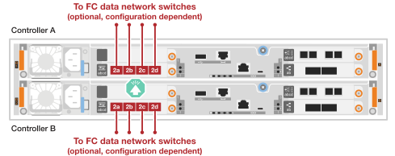
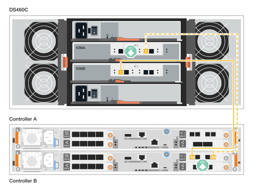
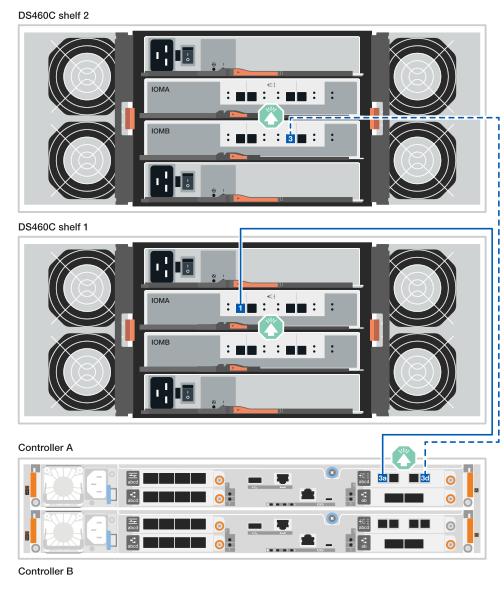
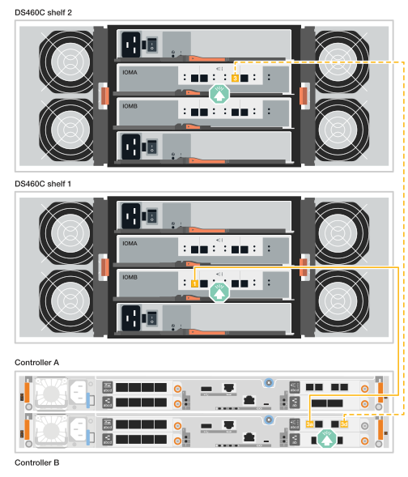

= 为硬件(FAS50)布线
:allow-uri-read: 
:icons: font
:imagesdir: ../media/

[role="lead"]
安装FAS50存储系统硬件后、使用缆线将控制器连接到网络和磁盘架。

.开始之前
有关将存储系统连接到网络交换机的信息、请与网络管理员联系。

.关于此任务
* 集群/HA和主机网络布线过程显示了常见配置。
+
如果在此处未看到您的配置、请访问link:https://hwu.netapp.com["NetApp Hardware Universe"^]以获取全面的配置和插槽优先级信息、以便为存储系统布线。

* 布线图中的箭头图标显示了将连接器插入端口时电缆连接器推拉卡舌的正确方向(向上或向下)。
+
插入连接器时、您应感觉到连接器卡入到位；如果您不觉得连接器卡嗒声、请将其卸下、然后将其翻转并重试。

+
image:../media/drw_cable_pull_tab_direction_ieops-1699.svg["电缆拉片方向"]

* 如果使用缆线连接到光纤交换机、请先将光纤收发器插入控制器端口、然后再使用缆线连接到交换机端口。

== 第1步：为集群/HA连接布线

为控制器布线以创建ONTAP集群连接。

[role="tabbed-block"]
====
.无交换机集群布线
--
.带有一个双端口40/100 GbE I/O模块的FAS50
[%collapsible]
=====
.步骤
. 为集群/HA互连连接布线：
+

NOTE: 集群互连流量和HA流量共享相同的物理端口(位于插槽4中的I/O模块上)。端口为40/100 GbE。

+
.. 使用缆线将控制器A端口e4a连接到控制器B端口e4a。
.. 使用缆线将控制器A端口e4b连接到控制器B端口e4b。
+
*100 GbE集群/HA互连缆线*

+
image::../media/oie_cable100_gbe_qsfp28.png[集群HA 100 GbE缆线]

+
image::../media/drw_isi_fas50_switchless_2p_100gbe_cabling_ieops-1937.svg[使用一个100GbE IO模块的FAS50无交换机集群布线图]

=====
--
.Switched cluster cabling
--
.带有一个双端口40/100 GbE I/O模块的FAS50
[%collapsible]
=====
. 使用缆线将控制器连接到集群网络交换机：
+

NOTE: 集群互连流量和HA流量共享相同的物理端口(位于插槽4中的I/O模块上)。端口为40/100 GbE。

+
.. 使用缆线将控制器A端口e4a连接到集群网络交换机A
.. 使用缆线将控制器A端口e4b连接到集群网络交换机B
.. 使用缆线将控制器B端口e4a连接到集群网络交换机A
.. 使用缆线将控制器B端口e4b连接到集群网络交换机B
+
*40/100 GbE集群/HA互连缆线*

+
image::../media/oie_cable100_gbe_qsfp28.png[集群HA 40/100 GbE缆线]

+
image:../media/drw_isi_fas50_2p_100gbe_switched_cluster_cabling_ieops-1936.svg["使用一个100GbE IO模块的FAS50交换集群布线图"]

=====
--
====

== 第2步：为主机网络连接布线

使用缆线将控制器连接到以太网或FC主机网络。

[role="tabbed-block"]
====
.以太网主机布线
--
.带有一个4端口1025 GbE I/O模块的FAS50
[%collapsible]
=====
.步骤
. 在每个控制器上、使用缆线将端口e2a、e2b、e2C和e2d连接到以太网主机网络交换机。
+
*1025 GbE缆线*

+
image:../media/oie_cable_sfp_gbe_copper.png["GbE SFP铜缆连接器、宽度=100pp"]

+
image::../media/drw_isi_fas50_4p_25gbe_optional_cabling_ieops-1934.svg[使用缆线将FAS50连接到10/C5GbE以太网主机网络交换机]

=====
--
.FC主机布线
--
.具有一个4端口64 Gb/秒FC I/O模块的FAS50
[%collapsible]
=====
.步骤
. 在每个控制器上、使用缆线将端口1a、1b、1c和1d连接到FC主机网络交换机。
+
*64 Gb/秒FC缆线*

+
image:../media/oie_cable_sfp_gbe_copper.png["64 Gb FC电缆、宽度=100个点"]

+

=====
--
====

== 第3步：为管理网络连接布线

使用缆线将控制器连接到管理网络。

. 使用缆线将每个控制器上的管理(扳手)端口连接到管理网络交换机。
+
*1000BASE-T RJ-45电缆*

+
image::../media/oie_cable_rj45.png[RJ-45电缆]

+
image::../media/drw_isi_fas50_wrench_cabling_ieops-1938.svg[连接到管理网络]

IMPORTANT: 请勿插入电源线。

== 第4步：为磁盘架连接布线

以下过程显示了如何使用缆线将控制器连接到一个或两个DS460C磁盘架。

.关于此任务
* 布线示例显示了DS460C磁盘架；但是，还支持其他SAS磁盘架，请参见link:https://hwu.netapp.com["NetApp Hardware Universe"^]。
+
其他受支持SAS磁盘架的布线方式类似。请参阅。 link:../sas3/install-new-system.html["为新系统安装安装磁盘架并为其布线"^]您也可以参考link:../sas3/overview-cabling-rules-examples.html["SAS布线规则、工作表和示例概述"^]。

* 有关存储系统支持的最大磁盘架数量以及所有布线选项(例如光纤和交换机连接)，请参见link:https://hwu.netapp.com["NetApp Hardware Universe"^]。
* 图中显示控制器A的布线为蓝色、控制器B的布线为黄色。
* 您可以使用存储系统随附的存储缆线、可以是以下缆线类型：
+
*迷你SAS HD电缆*

+
image::../media/oie_cable_mini_sas_hd_to_mini_sas_hd.svg[迷你SAS HD缆线]

[role="tabbed-block"]
====
.选项1：一个DS460C磁盘架
--
使用缆线将每个控制器连接到DS460C磁盘架上的每个IOM12模块。

.步骤
. 使用缆线将控制器 A 连接到磁盘架：
+
.. 使用缆线将控制器A端口3a连接到IOMA端口1。
.. 使用缆线将控制器A端口3D连接到IOMB端口3。
+
image:../media/drw_isi_fas50_1_ds460c_controller_a_cabling_ieops-2167.svg["控制器A端口3a和3d连接到一个DS460C磁盘架"]

. Cable controller B to the shelf:
+
.. 使用缆线将控制器B端口3a连接到IOMB端口1。
.. 使用缆线将控制器B端口3D连接到IOMA端口3。
+

--
.选项2：两个DS460C磁盘架
--
将每个控制器连接到两个DS460C磁盘架上的IOM12模块。

. 使用缆线进行磁盘架到磁盘架连接：
+
.. 使用缆线将磁盘架1的IOMA端口3连接到磁盘架2的IOMA端口1。
.. 使用缆线将磁盘架1的IOMB端口3连接到磁盘架2的IOMB端口1。
+
image:../media/drw_isi_fas50_2_ds460c_shelf_to_shelf_ieops-2172.svg["使用缆线将磁盘架连接到磁盘架"]

. Cable controller A to the shelves:
+
.. 使用缆线将控制器A端口3a连接到磁盘架1的IOMA端口1。
.. 使用缆线将控制器A端口3D连接到磁盘架2的IOMB端口3。
+

. Cable controller B to the shelves:
+
.. 使用缆线将控制器B端口3a连接到磁盘架1的IOMB端口1。
.. 使用缆线将控制器B端口3D连接到磁盘架2 IOMA端口3。
+

--
====
.下一步是什么？
在为存储系统的硬件布线之后，您可以link:install-power-hardware.html["启动存储系统"]。
