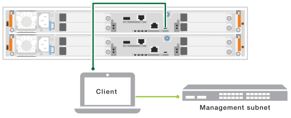
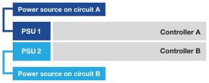

= 启动存储系统—FAS50
:allow-uri-read: 
:icons: font
:imagesdir: ../media/

[role="lead"]
使用缆线将控制器连接到FAS50存储系统中的网络和磁盘架后、您可以打开磁盘架和控制器的电源。

== 第1步：打开磁盘架电源并分配磁盘架ID

每个磁盘架都有一个唯一的磁盘架ID来区分。此ID可确保存储架在存储系统设置中是不同的。

.关于此任务
* A valid shelf ID is 01 through 99.
+
如果控制器中集成了内部磁盘架(存储)、则会为其分配一个固定磁盘架ID 00。

* 要使磁盘架ID生效、您必须重新启动磁盘架(关闭SAS磁盘架每个电源上的电源开关、等待适当的时间、然后重新打开电源)。

.步骤
. 首先将电源线连接到磁盘架、使用电源线固定器将其固定到位、将电源线连接到不同电路上的电源、然后打开每个电源(位于磁盘架背面)上的电源开关、以此为磁盘架供电。
+
磁盘架通电并在通电后自动启动。

. 卸下左端盖，以接触面板上的橙色磁盘架ID按钮。
+
image::../media/drw_shelf_id_sas_ieops-2187.svg[更改SAS磁盘架ID]

+
[cols="20%,80%"]
|===

 a| 
image::../media/icon_round_1.png[标注编号1]
 a| 
磁盘架端盖

 a| 
image::../media/icon_round_2.png[[插图编号2]
 a| 
磁盘架面板

 a| 
image::../media/icon_round_3.png[[插图编号3]
 a| 
磁盘架ID按钮

 a| 
image::../media/icon_round_4.png[[插图编号4]
 a| 
磁盘架ID编号

|===
. 更改磁盘架 ID 的第一个数字：
+
.. 按住磁盘架ID按钮、直到数字显示屏上的第一个数字闪烁、然后松开该按钮。
+
此数字可能需要长达 15 秒才能闪烁。此操作将激活磁盘架 ID 编程模式。

+

NOTE: 如果ID闪烁时间超过15秒、请再次按住磁盘架ID按钮、确保一直按到底。

.. 按下并释放磁盘架ID按钮、将该数字前进、直到达到所需数字0到9为止。
+
每个印刷和发布持续时间可短至一秒。

+
第一个数字将继续闪烁。

. 更改磁盘架 ID 的第二个数字：
+
.. 按住该按钮，直到数字显示屏上的第二个数字闪烁。
+
此数字可能需要长达三秒的时间才能闪烁。

+
数字显示屏上的第一个数字停止闪烁。

.. 按下并释放磁盘架ID按钮、将该数字前进、直到达到所需数字0到9为止。
+
第二个数字将继续闪烁。

. 锁定所需的数字、并按住磁盘架ID按钮退出编程模式、直到第二个数字停止闪烁。
+
此数字可能需要长达三秒的时间才能停止闪烁。

+
数字显示屏上的两个数字开始闪烁、大约五秒钟后琥珀色LED亮起、提醒您待定磁盘架ID尚未生效。

. 重新启动磁盘架至少10秒钟、以使磁盘架ID生效。
+
.. 关闭每个电源上的电源开关。
.. Wait 10 seconds.
.. 打开每个电源上的电源开关以完成重新启动。
+
打开电源时、双色LED应呈绿色亮起。

. 更换左端盖。

== 第2步：打开控制器的电源

打开磁盘架电源并为其分配唯一ID后、打开存储控制器的电源。

.步骤
. 将笔记本电脑连接到串行控制台端口。这样、您就可以在控制器通电时监控启动顺序。
+
.. 使用N-8-1将笔记本电脑上的串行控制台端口设置为115、200波特。
+

NOTE: 有关如何配置串行控制台端口的说明，请参阅便携式计算机的联机帮助。

.. 使用存储系统随附的控制台缆线、将控制台缆线的一端连接到笔记本电脑、将另一端连接到控制器A上的串行控制台端口
.. 将笔记本电脑连接到管理子网上的交换机。
+

. 使用管理子网上的TCP/IP地址为笔记本电脑分配TCP/IP地址。
. 将两根电源线插入控制器电源、然后将其连接到不同电路上的电源。
+

+
** 允许系统启动。初始启动可能需要长达八分钟时间。
** LED指示灯闪烁且风扇启动、这表示控制器正在通电。
** 首次启动风扇时、风扇可能会发出很大的噪音。启动期间风扇噪音正常。
** 系统机箱正面的磁盘架ID显示屏未亮起。

. 使用每个电源上的固定设备固定电源线。

.下一步是什么？
打开存储系统电源后， https://docs.netapp.com/us-en/ontap/software_setup/workflow-summary.html["设置集群"] 。
