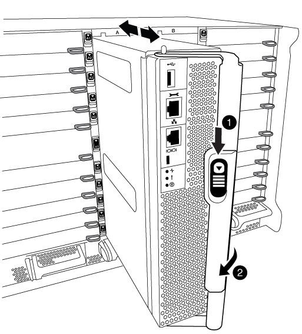
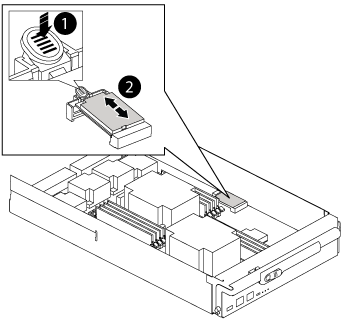

= 更换控制器模块硬件— AFF A700 和 FAS9000
:allow-uri-read: 
:icons: font
:imagesdir: ../media/

[role="lead"]
要更换控制器模块硬件，您必须卸下受损节点，将 FRU 组件移至更换用的控制器模块，在机箱中安装更换用的控制器模块，然后将系统启动至维护模式。

== 第 1 步：卸下控制器模块

要访问控制器内部的组件，您必须先从系统中卸下控制器模块，然后再卸下控制器模块上的盖板。

.步骤
. 如果您尚未接地，请正确接地。
. 从受损控制器模块拔下缆线，并跟踪缆线的连接位置。
. 向下滑动凸轮把手上的橙色按钮，直到其解锁为止。

|===

 a| 
image:../media/legend_icon_01.png[""]

 a| 
凸轮把手释放按钮

 a| 
image:../media/legend_icon_02.png[""]

 a| 
凸轮把手

|===
. 旋转凸轮把手，使其完全脱离机箱，然后将控制器模块滑出机箱。
+
将控制器模块滑出机箱时，请确保您支持控制器模块的底部。

. 将控制器模块的盖板朝上放在平稳的平面上，按下盖板上的蓝色按钮，将盖板滑至控制器模块的背面，然后向上转动盖板并将其从控制器模块中提出。
+
image::../media/drw_9000_pcm_open.png[DRW 9000 PCM 打开]

+
|===

 a| 
image:../media/legend_icon_01.png[""]

 a| 
控制器模块盖锁定按钮

|===

== 第 2 步：移动启动介质

您必须找到启动介质并按照说明将其从旧控制器中取出并将其插入新控制器中。

.步骤
. 提起控制器模块背面的黑色通风管，然后使用以下示意图或控制器模块上的 FRU 示意图找到启动介质：
+

+
|===

 a| 
image:../media/legend_icon_01.png[""]

 a| 
按释放卡舌

 a| 
image:../media/legend_icon_02.png[""]

 a| 
启动介质

|===
. 按启动介质外壳上的蓝色按钮，将启动介质从其外壳中释放，然后将其竖直拉出启动介质插槽。
+

NOTE: 请勿将启动介质竖直向上扭曲或拉，因为这样可能会损坏插槽或启动介质。

. 将启动介质移至新控制器模块，将启动介质的边缘与插槽外壳对齐，然后将其轻轻推入插槽。
. 检查启动介质，确保其完全固定在插槽中。
+
如有必要，请取出启动介质并将其重新插入插槽。

. 向下推启动介质以接合启动介质外壳上的锁定按钮。

== 第 3 步：移动系统 DIMM

要移动 DIMM ，请找到 DIMM 并将其从旧控制器移至更换控制器，然后按照特定步骤顺序进行操作。

.步骤
. 如果您尚未接地，请正确接地。
. 找到控制器模块上的 DIMM 。
. 记下插槽中 DIMM 的方向，以便可以按正确的方向将 DIMM 插入更换用的控制器模块中。
. 缓慢推动 DIMM 两侧的两个 DIMM 弹出卡舌，将 DIMM 从插槽中弹出，然后将 DIMM 滑出插槽。
+

NOTE: 小心握住 DIMM 的边缘，以避免对 DIMM 电路板上的组件施加压力。

+
image::../media/drw_9000_replace_pcm_dimms.png[DRW 9000 可更换 PCM DIMM]

+
|===

 a| 
image:../media/legend_icon_01.png[""]

 a| 
DIMM 弹出器卡舌

 a| 
image:../media/legend_icon_02.png[""]

 a| 
DIMM

|===
. 找到要安装 DIMM 的插槽。
. 确保连接器上的 DIMM 弹出器卡舌处于打开位置，然后将 DIMM 垂直插入插槽。
+
DIMM 紧紧固定在插槽中，但应很容易插入。如果没有，请将 DIMM 与插槽重新对齐并重新插入。

+

NOTE: 目视检查 DIMM ，确认其均匀对齐并完全插入插槽。

. 将 DIMM 垂直插入插槽。
+
DIMM 紧紧固定在插槽中，但应很容易插入。如果没有，请将 DIMM 与插槽重新对齐并重新插入。

+

NOTE: 目视检查 DIMM ，确认其均匀对齐并完全插入插槽。

. 小心而稳固地推动 DIMM 的上边缘，直到弹出器卡舌卡入到位，卡入到位于 DIMM 两端的缺口上。
. 对其余 DIMM 重复上述步骤。

== 第 4 步：安装控制器

将组件安装到控制器模块后，您必须将控制器模块安装回系统机箱并启动操作系统。

对于在同一机箱中具有两个控制器模块的 HA 对，安装控制器模块的顺序尤为重要，因为一旦将其完全装入机箱，它就会尝试重新启动。

NOTE: 系统可能会在启动时更新系统固件。请勿中止此过程。操作步骤要求您中断启动过程，您通常可以在系统提示时随时中断启动过程。但是，如果系统在启动时更新了系统固件，则必须等到更新完成后再中断启动过程。

.步骤
. 如果您尚未接地，请正确接地。
. 如果您尚未更换控制器模块上的外盖，请进行更换。
. 将控制器模块的末端与机箱中的开口对齐，然后将控制器模块轻轻推入系统的一半。
+

NOTE: 请勿将控制器模块完全插入机箱中，除非系统指示您这样做。

. 仅为管理和控制台端口布线，以便您可以访问系统以执行以下各节中的任务。
+

NOTE: 您将在此操作步骤中稍后将其余缆线连接到控制器模块。

. 完成控制器模块的重新安装：
+
.. 如果尚未重新安装缆线管理设备，请重新安装该设备。
.. 将控制器模块牢牢推入机箱，直到它与中板相距并完全就位。
+
控制器模块完全就位后，锁定闩锁会上升。

+

NOTE: 将控制器模块滑入机箱时，请勿用力过大，以免损坏连接器。

+
控制器模块一旦完全固定在机箱中，就会开始启动。准备中断启动过程。

.. 向上旋转锁定闩锁，使其倾斜，以清除锁定销，然后将其降低到锁定位置。
.. 出现 `Press Ctrl-C for Boot Menu` 时按 `Ctrl-C` 以中断启动过程。
.. 从显示的菜单中选择启动至维护模式的选项。

