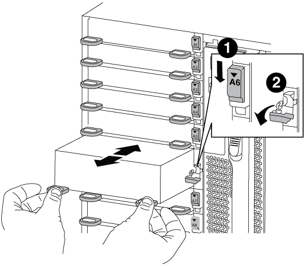

= 更换 NVRAM 模块或 NVRAM DIMM — AFF A700 和 FAS9000
:allow-uri-read: 
:icons: font
:imagesdir: ../media/

[role="lead"]
NVRAM 模块由 NVRAM10 和 DIMM 组成，每个 NVRAM 模块最多包含两个 NVMe SSD Flash Cache 模块（ FlashCache 或缓存模块）。您可以更换发生故障的 NVRAM 模块或 NVRAM 模块中的 DIMM 。要更换发生故障的 NVRAM 模块，您必须将其从机箱中卸下，从 NVRAM 模块中卸下 FlashCache 模块，将 DIMM 移至更换模块，重新安装 FlashCache 模块，然后将更换的 NVRAM 模块安装到机箱中。由于系统 ID 源自 NVRAM 模块，因此，如果更换此模块，则属于此系统的磁盘将重新分配给新的系统 ID 。

* 开始之前 *

* 所有磁盘架都必须正常工作。
* 如果您的系统位于 HA 对中，则配对节点必须能够接管与要更换的 NVRAM 模块关联的节点。
* 此操作步骤使用以下术语：
+
** 受损节点是指要在其中执行维护的节点。
** _health_ 节点是受损节点的 HA 配对节点。

* 此操作步骤包括自动或手动将磁盘重新分配给与新 NVRAM 模块关联的控制器模块的步骤。当操作步骤中指示您重新分配磁盘时，您必须重新分配这些磁盘。在交还之前完成磁盘重新分配可能会出现发生原因问题。
* 您必须将故障组件更换为从提供商处收到的替代 FRU 组件。
* 您不能在此操作步骤中更改任何磁盘或磁盘架。

== 第 1 步：关闭受损控制器

[role="lead"]
使用以下选项之一关闭或接管受损控制器。

[role="tabbed-block"]
====
.选项 1 ：大多数系统
--
[role="lead"]
要关闭受损控制器，您必须确定控制器的状态，并在必要时接管控制器，以便运行正常的控制器继续从受损控制器存储提供数据。

.关于此任务
* 如果您使用的是 NetApp 存储加密，则必须按照 _ONTAP 9 NetApp 加密高级指南 _ 的 "`将 SED 返回到未受保护的模式` " 一节中的说明重置 MSID 。
+
https://docs.netapp.com/ontap-9/topic/com.netapp.doc.pow-nve/home.html["《 ONTAP 9 NetApp 加密高级指南》"^]

* 如果您使用的是SAN系统、则必须已检查受损控制器SCSI刀片式服务器的事件消息(`event log show`)。
+
每个 SCSI 刀片式服务器进程应与集群中的其他节点保持仲裁关系。在继续更换之前，必须先解决所有问题。

* If you have a cluster with more than two nodes, it must be in quorum.如果集群未达到仲裁或运行状况良好的控制器在资格和运行状况方面显示 false ，则必须在关闭受损控制器之前更正问题描述 ；请参见 link:https://docs.netapp.com/us-en/ontap/system-admin/index.html["CLI 管理概述"^]。
* 如果您使用的是 MetroCluster 配置，则必须确认已配置 MetroCluster 配置状态，并且节点处于已启用且正常的状态（`MetroCluster node show` ）。

.步骤
. 如果启用了 AutoSupport ，则通过调用 AutoSupport 消息禁止自动创建案例： `ssystem node AutoSupport invoke -node * -type all -message MAINT=number_of_hours_downh`
+
以下 AutoSupport 消息禁止自动创建案例两小时： `cluster1 ： * > system node AutoSupport invoke -node * -type all -message MAINT=2h`

. 从运行正常的控制器的控制台禁用自动交还： `storage failover modify – node local -auto-giveback false`
. 将受损控制器显示为 LOADER 提示符：
+
[cols="1,2"]
|===
| 如果受损控制器显示 ... | 那么 ... 

 a| 
LOADER 提示符
 a| 
转至 "Remove controller module" 。

 a| 
正在等待交还
 a| 
按 Ctrl-C ，然后在出现提示时回答 `y` 。

 a| 
系统提示符或密码提示符（输入系统密码）
 a| 
从运行正常的控制器接管或暂停受损的控制器： `storage failover takeover -ofnode _impaired_node_name_`

当受损控制器显示 Waiting for giveback... 时，按 Ctrl-C ，然后回答 `y` 。

|===

--
.选项2：控制器位于双节点MetroCluster 中
--
[role="lead"]
要关闭受损控制器，您必须确定控制器的状态，并在必要时切换控制器，以便运行正常的控制器继续从受损控制器存储提供数据。

.关于此任务
* 如果您使用的是 NetApp 存储加密，则必须按照的 " 将 FIPS 驱动器或 SED 返回到未受保护的模式 " 一节中的说明重置 MSID link:https://docs.netapp.com/us-en/ontap/encryption-at-rest/return-seds-unprotected-mode-task.html["使用命令行界面概述 NetApp 加密"^]。
* 您必须在此操作步骤 末尾保持电源处于打开状态，以便为运行正常的控制器供电。

.步骤
. 检查 MetroCluster 状态以确定受损控制器是否已自动切换到运行正常的控制器： `MetroCluster show`
. 根据是否发生了自动切换，按照下表继续操作：
+
[cols="1,2"]
|===
| 如果控制器受损 ... | 那么 ... 

 a| 
已自动切换
 a| 
继续执行下一步。

 a| 
未自动切换
 a| 
从运行正常的控制器执行计划内切换操作： `MetroCluster switchover`

 a| 
未自动切换，您尝试使用 `MetroCluster switchover` 命令进行切换，并且切换已被否决
 a| 
查看否决消息，如果可能，请解决问题描述并重试。如果无法解决问题描述问题，请联系技术支持。

|===
. 在运行正常的集群中运行 `MetroCluster heal -phase aggregates` 命令，以重新同步数据聚合。
+
[listing]
----
controller_A_1::> metrocluster heal -phase aggregates
[Job 130] Job succeeded: Heal Aggregates is successful.
----
+
如果修复被否决，您可以使用 ` override-vetoes` 参数重新发出 `MetroCluster heal` 命令。如果使用此可选参数，则系统将覆盖任何阻止修复操作的软否决。

. 使用 MetroCluster operation show 命令验证操作是否已完成。
+
[listing]
----
controller_A_1::> metrocluster operation show
    Operation: heal-aggregates
      State: successful
Start Time: 7/25/2016 18:45:55
   End Time: 7/25/2016 18:45:56
     Errors: -
----
. 使用 `storage aggregate show` 命令检查聚合的状态。
+
[listing]
----
controller_A_1::> storage aggregate show
Aggregate     Size Available Used% State   #Vols  Nodes            RAID Status
--------- -------- --------- ----- ------- ------ ---------------- ------------
...
aggr_b2    227.1GB   227.1GB    0% online       0 mcc1-a2          raid_dp, mirrored, normal...
----
. 使用 `MetroCluster heal -phase root-aggregates` 命令修复根聚合。
+
[listing]
----
mcc1A::> metrocluster heal -phase root-aggregates
[Job 137] Job succeeded: Heal Root Aggregates is successful
----
+
如果修复被否决，您可以使用 -override-vetoes 参数重新发出 `MetroCluster heal` 命令。如果使用此可选参数，则系统将覆盖任何阻止修复操作的软否决。

. 在目标集群上使用 `MetroCluster operation show` 命令验证修复操作是否已完成：
+
[listing]
----

mcc1A::> metrocluster operation show
  Operation: heal-root-aggregates
      State: successful
 Start Time: 7/29/2016 20:54:41
   End Time: 7/29/2016 20:54:42
     Errors: -
----
. 在受损控制器模块上，断开电源。

--
====

== 第 2 步：更换 NVRAM 模块

[role="lead"]
要更换 NVRAM 模块，请在机箱的插槽 6 中找到该模块，然后按照特定步骤顺序进行操作。

.步骤
. 如果您尚未接地，请正确接地。
. 将 FlashCache 模块从旧 NVRAM 模块移至新 NVRAM 模块：
+
image::../media/drw_9000_remove_flashcache.png[DRW 9000 删除闪存]

+
|===

 a| 
image:../media/legend_icon_01.png[""]
 a| 
橙色释放按钮（空 FlashCache 模块上为灰色）

 a| 
image:../media/legend_icon_02.png[""]
 a| 
FlashCache 凸轮把手

|===
+
.. 按 FlashCache 模块正面的橙色按钮。
+

NOTE: 空 FlashCache 模块上的释放按钮为灰色。

.. 向外旋转凸轮把手，直到模块开始滑出旧的 NVRAM 模块。
.. 抓住模块凸轮把手，将其滑出 NVRAM 模块，然后将其插入新 NVRAM 模块的正面。
.. 将 FlashCache 模块轻轻推入 NVRAM 模块，然后将凸轮把手旋转到关闭位置，直到其将模块锁定到位。

. 从机箱中删除目标 NVRAM 模块：
+
.. 按下带字母和编号的凸轮按钮。
+
凸轮按钮离开机箱。

.. 向下旋转凸轮闩锁，直到其处于水平位置。
+
NVRAM 模块从机箱中分离并移出几英寸。

.. 拉动 NVRAM 模块侧面的拉片，将其从机箱中卸下。
+

+
|===

 a| 
image:../media/legend_icon_01.png[""]
 a| 
I/O 凸轮闩锁有字母和编号

 a| 
image:../media/legend_icon_02.png[""]
 a| 
I/O 闩锁完全解锁

|===

. 将 NVRAM 模块放在一个稳定的表面上，向下按压 NVRAM 模块上的蓝色锁定按钮，然后在按住蓝色按钮的同时，将盖从 NVRAM 模块上滑出。
+
image::../media/drw_9000_remove_nvram_module_contents.png[DRW 9000 删除 NVRAM 模块内容]

+
|===

 a| 
image:../media/legend_icon_01.png[""]
 a| 
盖板锁定按钮

 a| 
image:../media/legend_icon_02.png[""]
 a| 
DIMM 和 DIMM 弹出器卡舌

|===
. 从旧 NVRAM 模块中逐个卸下 DIMM ，然后将其安装到更换用的 NVRAM 模块中。
. 盖上模块上的盖板。
. 将更换用的 NVRAM 模块安装到机箱中：
+
.. 将模块与插槽 6 中机箱开口的边缘对齐。
.. 将模块轻轻滑入插槽，直到带字母和编号的 I/O 凸轮闩锁开始与 I/O 凸轮销啮合，然后将 I/O 凸轮闩锁一直向上推，以将模块锁定到位。

== 第 3 步：更换 NVRAM DIMM

[role="lead"]
要更换 NVRAM 模块中的 NVRAM DIMM ，您必须卸下 NVRAM 模块，打开该模块，然后更换目标 DIMM 。

.步骤
. 如果您尚未接地，请正确接地。
. 从机箱中删除目标 NVRAM 模块：
+
.. 按下带字母和编号的凸轮按钮。
+
凸轮按钮离开机箱。

.. 向下旋转凸轮闩锁，直到其处于水平位置。
+
NVRAM 模块从机箱中分离并移出几英寸。

.. 拉动 NVRAM 模块侧面的拉片，将其从机箱中卸下。
+

+
|===

 a| 
image:../media/legend_icon_01.png[""]
 a| 
I/O 凸轮闩锁有字母和编号

 a| 
image:../media/legend_icon_02.png[""]
 a| 
I/O 闩锁完全解锁

|===

. 将 NVRAM 模块放在一个稳定的表面上，向下按压 NVRAM 模块上的蓝色锁定按钮，然后在按住蓝色按钮的同时，将盖从 NVRAM 模块上滑出。
+
image::../media/drw_9000_remove_nvram_module_contents.png[DRW 9000 删除 NVRAM 模块内容]

+
|===

 a| 
image:../media/legend_icon_01.png[""]
 a| 
盖板锁定按钮

 a| 
image:../media/legend_icon_02.png[""]
 a| 
DIMM 和 DIMM 弹出器卡舌

|===
. 找到 NVRAM 模块内部要更换的 DIMM ，然后按下 DIMM 锁定卡舌并将 DIMM 从插槽中提出来将其卸下。
+
每个 DIMM 旁边都有一个 LED ，当 DIMM 发生故障时，此 LED 会闪烁。

. 安装更换用的 DIMM ，方法是将 DIMM 与插槽对齐，然后将 DIMM 轻轻推入插槽，直到锁定卡舌锁定到位。
. 盖上模块上的盖板。
. 将更换用的 NVRAM 模块安装到机箱中：
+
.. 将模块与插槽 6 中机箱开口的边缘对齐。
.. 将模块轻轻滑入插槽，直到带字母和编号的 I/O 凸轮闩锁开始与 I/O 凸轮销啮合，然后将 I/O 凸轮闩锁一直向上推，以将模块锁定到位。

== 第 4 步：更换 FRU 后重新启动控制器

[role="lead"]
更换 FRU 后，必须重新启动控制器模块。

.步骤
. 要从加载程序提示符处启动 ONTAP ，请输入 `bye` 。

== 第 5 步：重新分配磁盘

[role="lead"]
根据您使用的是 HA 对还是双节点 MetroCluster 配置，您必须验证是否已将磁盘重新分配给新控制器模块，或者手动重新分配磁盘。

有关如何将磁盘重新分配给新控制器的说明，请选择以下选项之一。

[role="tabbed-block"]
====
.选项 1 ：验证 ID （ HA 对）
--
[role="lead"]
您必须在启动 _replacement_ 节点时确认系统 ID 更改，然后确认更改是否已实施。

此操作步骤仅适用于在 HA 对中运行 ONTAP 的系统。

.步骤
. 如果替代节点处于维护模式（显示 ` * >` 提示符），请退出维护模式并转到加载程序提示符： `halt`
. 在替代节点上的 LOADER 提示符处，启动节点，如果系统因系统 ID 不匹配而提示您覆盖系统 ID ，请输入 `y` 。
+
``boot_ontap bye``

+
如果设置了自动启动，则节点将重新启动。

. 请等待` Waiting for giveback... `消息显示在 _replacement_ 节点控制台上，然后从运行状况良好的节点上验证是否已自动分配新的配对系统 ID ： `storage failover show`
+
在命令输出中，您应看到一条消息，指出受损节点上的系统 ID 已更改，并显示正确的旧 ID 和新 ID 。在以下示例中， node2 已进行更换，新系统 ID 为 151759706 。

+
[listing]
----
node1> `storage failover show`
                                    Takeover
Node              Partner           Possible     State Description
------------      ------------      --------     -------------------------------------
node1             node2             false        System ID changed on partner (Old:
                                                  151759755, New: 151759706), In takeover
node2             node1             -            Waiting for giveback (HA mailboxes)
----
. 从运行状况良好的节点中，验证是否已保存任何核心转储：
+
.. 更改为高级权限级别： `set -privilege advanced`
+
系统提示您继续进入高级模式时，您可以回答 `y` 。此时将显示高级模式提示符（ * > ）。

.. 保存任何核心转储： `ssystem node run -node _local-node-name_ partner savecore`
.. 等待 `savecore`命令完成，然后再发出交还。
+
您可以输入以下命令来监控 savecore 命令的进度： `ssystem node run -node _local-node-name_ partner savecore -s`

.. 返回到管理权限级别： `set -privilege admin`

. 交还节点：
+
.. 从运行正常的节点中，交还已更换节点的存储： `storage failover giveback -ofnode _replacement_node_name_`
+
replacement_ 节点将收回其存储并完成启动。

+
如果由于系统 ID 不匹配而提示您覆盖系统 ID ，则应输入 `y` 。

+

NOTE: 如果交还被否决，您可以考虑覆盖此否决。

+
http://mysupport.netapp.com/documentation/productlibrary/index.html?productID=62286["查找适用于您的 ONTAP 9 版本的《高可用性配置指南》"]

.. 交还完成后，确认 HA 对运行状况良好且可以接管： `storage failover show`
+
`storage failover show` 命令的输出不应包含 `Ssystem ID changed on partner` 消息。

. 验证是否已正确分配磁盘： `storage disk show -ownership`
+
属于 _replacement_ 节点的磁盘应显示新的系统 ID 。在以下示例中， node1 拥有的磁盘现在显示新的系统 ID 1873775277 ：

+
[listing]
----
node1> `storage disk show -ownership`

Disk  Aggregate Home  Owner  DR Home  Home ID    Owner ID  DR Home ID Reserver  Pool
----- ------    ----- ------ -------- -------    -------    -------  ---------  ---
1.0.0  aggr0_1  node1 node1  -        1873775277 1873775277  -       1873775277 Pool0
1.0.1  aggr0_1  node1 node1           1873775277 1873775277  -       1873775277 Pool0
.
.
.
----
. 如果系统采用 MetroCluster 配置，请监控节点的状态： `MetroCluster node show`
+
在更换后， MetroCluster 配置需要几分钟才能恢复到正常状态，此时，每个节点将显示已配置状态，并启用 DR 镜像并显示正常模式。`MetroCluster node show -fields node-SystemID` 命令输出将显示旧系统 ID ，直到 MetroCluster 配置恢复正常状态为止。

. 如果节点采用 MetroCluster 配置，则根据 MetroCluster 状态，如果原始所有者是灾难站点上的节点，请验证 DR 主 ID 字段是否显示磁盘的原始所有者。
+
如果同时满足以下条件，则必须执行此操作：

+
** MetroCluster 配置处于切换状态。
** _replacement_ 节点是灾难站点上磁盘的当前所有者。
+
https://docs.netapp.com/us-en/ontap-metrocluster/manage/concept_understanding_mcc_data_protection_and_disaster_recovery.html#disk-ownership-changes-during-ha-takeover-and-metrocluster-switchover-in-a-four-node-metrocluster-configuration["在四节点 MetroCluster 配置中，磁盘所有权会在 HA 接管和 MetroCluster 切换期间发生更改"]

. 如果您的系统采用 MetroCluster 配置，请验证是否已配置每个节点： `MetroCluster node show - fields configuration-state`
+
[listing]
----
node1_siteA::> metrocluster node show -fields configuration-state

dr-group-id            cluster node           configuration-state
-----------            ---------------------- -------------- -------------------
1 node1_siteA          node1mcc-001           configured
1 node1_siteA          node1mcc-002           configured
1 node1_siteB          node1mcc-003           configured
1 node1_siteB          node1mcc-004           configured

4 entries were displayed.
----
. 验证每个节点是否存在所需的卷： `vol show -node node-name`
. 如果您在重新启动时禁用了自动接管，请从运行正常的节点启用它： `storage failover modify -node replacement-node-name -onreboot true`

--
.选项 2 ：重新分配 ID （ MetroCluster 配置）
--
[role="lead"]
在运行 ONTAP 的双节点 MetroCluster 配置中，您必须手动将磁盘重新分配给新控制器的系统 ID ，然后才能使系统恢复正常运行状态。

此操作步骤仅适用于运行 ONTAP 的双节点 MetroCluster 配置中的系统。

您必须确保问题描述在此操作步骤中的命令位于正确的节点上：

* 受损节点是指要在其中执行维护的节点。
* _replacement_ 节点是此操作步骤中更换受损节点的新节点。
* _health_ 节点是受损节点的 DR 配对节点。

.步骤
. 如果尚未重新启动 _replacement_ 节点，输入 `Ctrl-C` 以中断启动过程，然后从显示的菜单中选择启动到维护模式的选项。
+
由于系统 ID 不匹配，系统提示您覆盖系统 ID 时，您必须输入 `Y` 。

. 从运行状况良好的节点查看旧系统 ID ： ``MetroCluster node show -fields node-systemID` ， dr-partner-systemID`
+
在此示例中， Node_B_1 是旧节点，旧系统 ID 为 118073209 ：

+
[listing]
----
dr-group-id cluster         node                 node-systemid dr-partner-systemid
 ----------- --------------------- -------------------- ------------- -------------------
 1           Cluster_A             Node_A_1             536872914     118073209
 1           Cluster_B             Node_B_1             118073209     536872914
 2 entries were displayed.
----
. 在受损节点上的维护模式提示符处查看新的系统 ID ： `disk show`
+
在此示例中，新系统 ID 为 118065481 ：

+
[listing]
----
Local System ID: 118065481
    ...
    ...
----
. 使用从 disk show 命令获取的系统 ID 信息重新分配磁盘所有权（对于 FAS 系统）或 LUN 所有权（对于 FlexArray 系统）： `disk reassign -s old system ID`
+
在上述示例中，命令为： `disk reassign -s 118073209`

+
系统提示您继续时，您可以回答 `Y` 。

. 验证是否已正确分配磁盘（或 FlexArray LUN ）： `disk show -a`
+
验证属于 _replacement_ 节点的磁盘是否显示 _replacement_ 节点的新系统 ID 。在以下示例中， system-1 所拥有的磁盘现在显示新的系统 ID 118065481 ：

+
[listing]
----
*> disk show -a
Local System ID: 118065481

  DISK     OWNER                 POOL   SERIAL NUMBER  HOME
-------    -------------         -----  -------------  -------------
disk_name   system-1  (118065481) Pool0  J8Y0TDZC       system-1  (118065481)
disk_name   system-1  (118065481) Pool0  J8Y09DXC       system-1  (118065481)
.
.
.
----
. 从运行状况良好的节点中，验证是否已保存任何核心转储：
+
.. 更改为高级权限级别： `set -privilege advanced`
+
系统提示您继续进入高级模式时，您可以回答 `y` 。此时将显示高级模式提示符（ * > ）。

.. 验证核心转储是否已保存： `ssystem node run -node _local-node-name_ partner savecore`
+
如果命令输出指示 savecore 正在进行中，请等待 savecore 完成，然后再发出交还。您可以使用 `ssystem node run -node _local-node-name_ partner savecore -s 命令` 监控 savecore 的进度。 </info>

.. 返回到管理权限级别： `set -privilege admin`

. 如果 _replacement_ 节点处于维护模式（显示 * > 提示符），请退出维护模式并转到加载程序提示符： `halt`
. 启动 _replacement_ 节点： `boot_ontap`
. 在 _replacement_ 节点完全启动后，执行切回： `MetroCluster switchback`
. 验证 MetroCluster 配置： `MetroCluster node show - fields configuration-state`
+
[listing]
----
node1_siteA::> metrocluster node show -fields configuration-state

dr-group-id            cluster node           configuration-state
-----------            ---------------------- -------------- -------------------
1 node1_siteA          node1mcc-001           configured
1 node1_siteA          node1mcc-002           configured
1 node1_siteB          node1mcc-003           configured
1 node1_siteB          node1mcc-004           configured

4 entries were displayed.
----
. 在 Data ONTAP 中验证 MetroCluster 配置的运行情况：
+
.. 检查两个集群上是否存在任何运行状况警报： `ssystem health alert show`
.. 确认 MetroCluster 已配置且处于正常模式： `MetroCluster show`
.. 执行 MetroCluster 检查： `MetroCluster check run`
.. 显示 MetroCluster 检查的结果： `MetroCluster check show`
.. 运行 Config Advisor 。转到 NetApp 支持站点上的 Config Advisor 页面，网址为 http://support.netapp.com/NOW/download/tools/config_advisor/["support.netapp.com/NOW/download/tools/config_advisor/"]。
+
运行 Config Advisor 后，查看该工具的输出并按照输出中的建议解决发现的任何问题。

. 模拟切换操作：
+
.. 在任何节点的提示符处，更改为高级权限级别： `set -privilege advanced`
+
当系统提示您继续进入高级模式并显示高级模式提示符（ * > ）时，您需要使用 `y` 进行响应。

.. 使用 -simulate 参数执行切回操作： `MetroCluster switchover -simulate`
.. 返回到管理权限级别： `set -privilege admin`

--
====

== 第 6 步：还原存储和卷加密功能

[role="lead"]
在更换先前配置为使用存储或卷加密的存储系统的控制器模块或 NVRAM 模块后，您必须执行其他步骤以提供无中断加密功能。对于未启用存储或卷加密的存储系统，您可以跳过此任务。

.步骤
. 使用中的相应操作步骤还原存储或卷加密功能 https://docs.netapp.com/us-en/ontap/encryption-at-rest/index.html["使用命令行界面概述 NetApp 加密"^]。
. 根据您使用的是板载密钥管理还是外部密钥管理，请执行以下过程之一：
+
** https://docs.netapp.com/us-en/ontap/encryption-at-rest/restore-onboard-key-management-encryption-keys-task.html["还原板载密钥管理加密密钥"^]
** https://docs.netapp.com/us-en/ontap/encryption-at-rest/restore-external-encryption-keys-93-later-task.html["还原外部密钥管理加密密钥"^]

== 第 7 步：将故障部件退回 NetApp

[role="lead"]
按照套件随附的 RMA 说明将故障部件退回 NetApp 。请参见 https://mysupport.netapp.com/site/info/rma["部件退回和放大器；更换"] 第页，了解更多信息。
