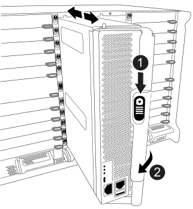

= 移动并更换硬件—FAS9500
:allow-uri-read: 
:icons: font
:imagesdir: ../media/

[role="lead"]
要更换机箱、您必须从受损机箱中卸下组件、然后将其安装到更换机箱中。

== 第 1 步：卸下电源

在更换机箱时、要卸下电源、需要先关闭、断开连接、然后再从受损机箱背面卸下四个电源。

. 如果您尚未接地，请正确接地。
. 关闭电源并断开电源线：
+
.. 关闭电源上的电源开关。
.. 打开电源线固定器，然后从电源拔下电源线。
.. 从电源拔下电源线。

. 按住电源手柄上的Terra cotta锁定按钮、然后将电源从机箱中拉出。
+

NOTE: 卸下电源时，请始终用双手支撑其重量。

+
.动画-删除/安装PSU
video::590b3414-6ea5-42b2-b7f4-ae78004b86a4[panopto]
+
image::../media/drw_9500_remove_install_PSU_module.svg[DRW 9500remove install PSU module]

+
[cols="20%,80%"]
|===

 a| 
image::../media/legend_icon_01.svg[图例图标 01]
 a| 
Terra cotta锁定按钮

|===
. 对其余所有电源重复上述步骤。

== 第 2 步：卸下风扇

更换机箱时、必须卸下机箱正面的六个风扇模块。

. 如果您尚未接地，请正确接地。
. 如有必要，请用两只手抓住挡板每一侧的开口，然后将其拉向您，直到挡板从机箱框架上的球形螺柱上松开，从而卸下挡板。
. 按下风扇模块上的Terra cotta锁定按钮、然后将风扇模块竖直拉出机箱、确保用您的空闲手支撑它。
+

NOTE: 风扇模块较短。请始终用您的空闲手托住风扇模块的底部，以免其突然从机箱中脱离并造成您的人身伤害。

+
.动画-拆卸/安装风扇
video::86b0ed39-1083-4b3a-9e9c-ae78004c2ffc[panopto]
+
image::../media/drw_9500_remove_install_fan.svg[DRW 9500-卸下安装风扇]

+
[cols="20%,80%"]
|===

 a| 
image:../media/legend_icon_01.svg["宽度= 20"]
 a| 
Terra cotta锁定按钮

 a| 
image:../media/legend_icon_02.svg["宽度= 20"]
 a| 
将风扇滑入 / 滑出机箱

|===
. 将风扇模块放在一旁。
. 对其余所有风扇模块重复上述步骤。

== 第 3 步：卸下控制器模块

要更换机箱、您必须从受损机箱中卸下控制器模块。

. 如果您尚未接地，请正确接地。
. 从受损控制器模块拔下缆线，并跟踪缆线的连接位置。
. 向下滑动凸轮把手上的Terra cotta锁定按钮、直到其解锁为止。
+
.动画-删除控制器模块
video::5e029a19-8acc-4fa1-be5d-ae78004b365a[panopto]
+

+
[cols="20%,80%"]
|===

 a| 
image:../media/legend_icon_01.svg["宽度= 20"]
 a| 
凸轮把手锁定按钮

 a| 
image:../media/legend_icon_02.svg["宽度= 20"]
 a| 
凸轮把手

|===
. 旋转凸轮把手，使其完全脱离机箱，然后将控制器模块滑出机箱。
+
将控制器模块滑出机箱时，请确保您支持控制器模块的底部。

. 将控制器模块放在安全的位置、并跟踪其来自哪个机箱插槽、以便可以将其安装到更换机箱中的同一插槽中。
. 如果机箱中还有其他控制器模块、请重复上述步骤。

== 第 4 步：卸下 I/O 模块

要从受损机箱中卸下I/O模块、包括NVRAM模块、请按照特定步骤顺序进行操作。在将FlashCache模块移至更换机箱时、您无需从NVRAM模块中卸下该模块(如果存在)。

. 如果您尚未接地，请正确接地。
. 拔下与目标 I/O 模块关联的所有布线。
+
请确保为这些缆线贴上标签，以便您知道这些缆线来自何处。

. 从机箱中卸下目标 I/O 模块：
+
.. 按下带字母和编号的凸轮锁定按钮。
+
凸轮锁定按钮将从机箱中移出。

.. 向下旋转凸轮闩锁，直到其处于水平位置。
+
I/O 模块从机箱中分离，并从 I/O 插槽中移出大约 1/2 英寸。

.. 拉动 I/O 模块侧面的拉片，将 I/O 模块从机箱中卸下。
+
确保跟踪 I/O 模块所在的插槽。

+
.动画-删除/安装I/O模块
video::0903b1f9-187b-4bb8-9548-ae9b0012bb21[panopto]
+
image::../media/drw_9500_remove_PCIe_module.svg[DRW 9500-卸下PCIe模块]

+
[cols="20%,80%"]
|===

 a| 
image::../media/legend_icon_01.svg[图例图标 01]
 a| 
I/O 凸轮闩锁有字母和编号

 a| 
image::../media/legend_icon_02.svg[图例图标 02]
 a| 
I/O 凸轮闩锁完全解锁

|===

. 将 I/O 模块放在一旁。
. 对受损机箱中的其余I/O模块重复上述步骤。

== 第 5 步：卸下降级控制器电源模块

从受损机箱正面卸下两个降级控制器电源模块。

. 如果您尚未接地，请正确接地。
. 按下模块把手上的Terra cotta锁定按钮、然后将DCPM滑出机箱。
+
.动画-删除/安装DCPM
video::c067cf9d-35b8-4fbe-9573-ae78004c2328[panopto]
+
image::../media/drw_9500_remove_NV_battery.svg[DRW 9500-取出NV电池]

+
[cols="20%,80%"]
|===

 a| 
image::../media/legend_icon_01.svg[图例图标 01]
 a| 
DCPM Terra cotta锁定按钮

|===
. 将DCPM放在安全位置、然后对其余DCPM重复此步骤。

== 第6步：卸下USB LED模块

卸下USB LED模块。

.动画-删除/安装USB模块
video::bc46a3e8-6541-444e-973b-ae78004bf153[panopto]
image::../media/drw_9500_remove_replace_LED_mod.svg[DRW 9500-删除更换LED模块]

[cols="20%,80%"]
|===

 a| 
image::../media/legend_icon_01.svg[图例图标 01]
 a| 
弹出模块。

 a| 
image:../media/legend_icon_02.svg["宽度= 20"]
 a| 
滑出机箱。

|===
. 找到受损机箱正面、电源托架正下方的USB LED模块。
. 按下模块右侧的黑色锁定按钮、将模块从机箱中释放、然后将其滑出受损机箱。
. 将模块放在安全的位置。

== 第7步：从设备机架或系统机柜中更换机箱

您必须先从设备机架或系统机柜中卸下现有机箱，然后才能安装替代机箱。

. 从机箱安装点卸下螺钉。
+

NOTE: 如果系统位于系统机柜中，则可能需要卸下后部系紧支架。

. 在两三个人的帮助下、将受损机箱滑出系统机柜中的机架导轨或设备机架中的_L_支架、然后将其放在一旁。
. 如果您尚未接地，请正确接地。
. 由两到三人组成，通过将更换机箱引导至系统机柜中的机架导轨或设备机架中的 _L_ 支架，将更换机箱安装到设备机架或系统机柜中。
. 将机箱完全滑入设备机架或系统机柜中。
. 使用从受损机箱中卸下的螺钉将机箱前部固定到设备机架或系统机柜。
. 将机箱后部固定到设备机架或系统机柜。
. 如果您使用的是缆线管理支架、请将其从受损机箱中卸下、然后将其安装在更换机箱上。

== 第 8 步：在更换机箱时安装降级控制器电源模块

将替代机箱安装到机架或系统机柜中后，您必须将降级控制器电源模块重新安装到其中。

. 如果您尚未接地，请正确接地。
. 将DCPM的末端与机箱开口对齐、然后将其轻轻滑入机箱、直至卡入到位。
+

NOTE: 模块和插槽采用键控方式。请勿强行将模块插入开口。如果模块不易插入，请重新对齐模块并将其滑入机箱。

. 对其余DCPM重复此步骤。

== 第 9 步：将风扇安装到机箱中

要在更换机箱时安装风扇模块，您必须执行一系列特定的任务。

. 如果您尚未接地，请正确接地。
. 将替代风扇模块的边缘与机箱中的开口对齐，然后将其滑入机箱，直至其卡入到位。
+
将风扇模块成功插入机箱后，琥珀色警示 LED 会闪烁四次。

. 对其余风扇模块重复上述步骤。
. 将挡板与球形螺柱对齐，然后将挡板轻轻推入球形螺柱上。

== 第 10 步：安装 I/O 模块

要安装I/O模块、包括受损机箱中的NVRAM/FlashCache模块、请按照特定步骤顺序进行操作。

您必须安装机箱、以便可以将I/O模块安装到更换机箱中的相应插槽中。

. 如果您尚未接地，请正确接地。
. 将更换机箱安装到机架或机柜中后，通过将 I/O 模块轻轻滑入插槽，将 I/O 模块安装到更换机箱中相应的插槽中，直到带字母和编号的 I/O 凸轮闩锁开始啮合为止。 然后，将 I/O 凸轮闩锁完全向上推，以将模块锁定到位。
. 根据需要重新对 I/O 模块进行布线。
. 对其余已预留的 I/O 模块重复上述步骤。
+

NOTE: 如果受损机箱具有空白I/O面板、请此时将其移至更换机箱。

== 第 11 步：安装电源

在更换机箱时安装电源涉及到将电源安装到更换机箱以及连接到电源。

. 如果您尚未接地，请正确接地。
. 确保电源摇臂处于OFF位置。
. 用双手支撑电源边缘并将其与系统机箱中的开口对齐，然后将电源轻轻推入机箱，直到其锁定到位。
+
电源具有键控功能，只能单向安装。

+

IMPORTANT: 将电源滑入系统时，请勿用力过大。您可能会损坏连接器。

. 重新连接电源线，并使用电源线锁定机制将其固定到电源。
+

IMPORTANT: 仅将电源线连接到电源。此时请勿将电源线连接到电源。

. 对其余所有电源重复上述步骤。

== 第12步安装USB LED模块

在更换机箱中安装USB LED模块。

. 找到替代机箱正面DCPM托架正下方的USB LED模块插槽。
. 将模块边缘与USB LED托架对齐、然后将模块一直轻轻推入机箱、直到其卡入到位。

== 第13步：安装控制器

将控制器模块和任何其他组件安装到更换机箱后、将其启动到可以运行互连诊断测试的状态。

. 如果您尚未接地，请正确接地。
. 将电源连接到不同的电源，然后打开电源。
. 将控制器模块的末端与机箱中的开口对齐，然后将控制器模块轻轻推入系统的一半。
+

NOTE: 请勿将控制器模块完全插入机箱中，除非系统指示您这样做。

. 将控制台重新连接到控制器模块，然后重新连接管理端口。
. 在凸轮把手处于打开位置的情况下，将控制器模块滑入机箱并用力推入控制器模块，直到它与中板相距并完全就位，然后合上凸轮把手，直到它卡入到锁定位置。
+

IMPORTANT: 将控制器模块滑入机箱时，请勿用力过大，否则可能会损坏连接器。

+
控制器模块一旦完全固定在机箱中，就会开始启动。

. 重复上述步骤、将第二个控制器安装到更换的机箱中。
. 启动每个控制器。

