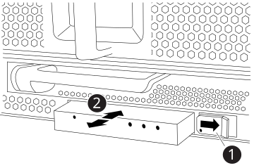

= 更换 FAS9500 系统中的 LED USB 模块
:allow-uri-read: 
:icons: font
:imagesdir: ../media/

[role="lead"]
FAS9500 系统中的 LED USB 模块提供与控制台端口和系统状态的连接。更换它不需要工具，也不会中断服务。

[[step-1-replace-the-led-usb-module]]
== 第 1 步：更换 LED USB 模块

.步骤
. 卸下旧的 LED USB 模块：
+
.动画-删除/安装LED/USB模块
video::bc46a3e8-6541-444e-973b-ae78004bf153[panopto]
+

+
[cols="20%,80%"]
|===

 a| 
image::../media/icon_round_1.png[标注编号1]
 a| 
锁定按钮

 a| 
image::../media/icon_round_2.png[标注编号2]
 a| 
USB LED 模块

|===
+
.. 卸下挡板后，找到机箱正面左下方的 LED USB 模块。
.. 滑动闩锁以部分弹出模块。
.. 将模块从托架中拉出，以断开其与中板的连接。请勿将插槽留空。

. 安装新的 LED USB 模块：
+
.. 将模块与托架对齐，模块角落的凹口位于底盘滑块闩锁附近。托架可防止您颠倒安装模块。
.. 将模块推入托架，直至其与机箱完全就位。
+
当模块安全连接到中间背板时，可听到模块发出咔嗒声。

[[step-2-return-the-failed-component]]
== 第 2 步：返回故障组件

. 按照套件随附的 RMA 说明将故障部件退回 NetApp 。 https://mysupport.netapp.com/site/info/rma["部件退回和更换"^]有关详细信息、请参见页面。

