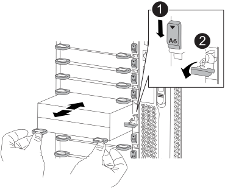

= 更换NVRAM模块和/或NVRAM DIMM—FAS9500
:allow-uri-read: 
:icons: font
:imagesdir: ../media/

[role="lead"]
NVRAM 模块由 NVRAM11 和 DIMM 组成。You can replace a failed NVRAM module or the DIMMs inside the NVRAM module.要更换发生故障的 NVRAM 模块，您必须将其从机箱中卸下，将 DIMM 移至更换模块，然后将更换的 NVRAM 模块安装到机箱中。

要更换和NVRAM DIMM、您必须从机箱中卸下NVRAM模块、更换模块中发生故障的DIMM、然后重新安装NVRAM模块。

.关于此任务
由于系统 ID 源自 NVRAM 模块，因此，如果更换此模块，则属于此系统的磁盘将重新分配给新的系统 ID 。

.开始之前
* 所有磁盘架都必须正常工作。
* 如果您的系统位于 HA 对中，则配对节点必须能够接管与要更换的 NVRAM 模块关联的节点。
* 此操作步骤使用以下术语：
+
** 受损节点是指要在其中执行维护的节点。
** 运行状况良好的节点是受损节点的 HA 配对节点。

* 此操作步骤包括自动或手动将磁盘重新分配给与新 NVRAM 模块关联的控制器模块的步骤。当操作步骤中指示您重新分配磁盘时，您必须重新分配这些磁盘。在交还之前完成磁盘重新分配可能会出现发生原因问题。
* 您必须将故障组件更换为从提供商处收到的替代 FRU 组件。
* 您不能在此操作步骤中更改任何磁盘或磁盘架。

== 第 1 步：关闭受损节点

要关闭受损控制器，您必须确定控制器的状态，并在必要时接管控制器，以便运行正常的控制器继续从受损控制器存储提供数据。

.关于此任务
If you have a cluster with more than two nodes, it must be in quorum.如果集群未达到仲裁或运行状况良好的控制器在资格和运行状况方面显示false、则必须在关闭受损控制器之前更正问题描述 ；请参见 link:https://docs.netapp.com/us-en/ontap/system-admin/synchronize-node-cluster-task.html?q=Quorum["将节点与集群同步"^]。

.步骤
. 如果启用了 AutoSupport ，则通过调用 AutoSupport 消息禁止自动创建案例： `ssystem node AutoSupport invoke -node * -type all -message MAINT=number_of_hours_downh`
+
以下 AutoSupport 消息禁止自动创建案例两小时： `cluster1 ： * > system node AutoSupport invoke -node * -type all -message MAINT=2h`

. 从运行正常的控制器的控制台禁用自动交还： `storage failover modify – node local -auto-giveback false`
. 将受损控制器显示为 LOADER 提示符：
+
[cols="1,2"]
|===
| 如果受损控制器显示 ... | 那么 ... 

 a| 
LOADER 提示符
 a| 
转至下一步。

 a| 
`正在等待交还 ...`
 a| 
按 Ctrl-C ，然后在出现提示时回答 `y` 。

 a| 
系统提示符或密码提示符（输入系统密码）
 a| 
从运行正常的控制器接管或暂停受损的控制器： `storage failover takeover -ofnode _impaired_node_name_`

当受损控制器显示 Waiting for giveback... 时，按 Ctrl-C ，然后回答 `y` 。

|===

== 第 2 步：更换 NVRAM 模块

要更换 NVRAM 模块，请在机箱的插槽 6 中找到该模块，然后按照特定步骤顺序进行操作。

. 如果您尚未接地，请正确接地。
. 从机箱中删除目标 NVRAM 模块：
+
.. 按下带字母和编号的凸轮按钮。
+
凸轮按钮离开机箱。

.. 向下旋转凸轮闩锁，直到其处于水平位置。
+
NVRAM 模块从机箱中分离并移出几英寸。

.. 拉动 NVRAM 模块侧面的拉片，将其从机箱中卸下。
+
.动画-更换NVRAM模块
video::228cbd14-4cb2-49b5-88f1-ae78004b9d84[panopto]
+

+
[cols="20%,90%"]
|===

 a| 
image::../media/legend_icon_01.svg[图例图标 01]
 a| 
I/O 凸轮闩锁有字母和编号

 a| 
image::../media/legend_icon_02.svg[图例图标 02]
 a| 
I/O 闩锁完全解锁

|===

. 将 NVRAM 模块放在一个稳定的表面上，向下按压 NVRAM 模块上的蓝色锁定按钮，然后在按住蓝色按钮的同时，将盖从 NVRAM 模块上滑出。
+
image::../media/drw_9500_remove_NVRAM_module_contents.svg[DRW 9500-删除NVRAM模块内容]

+
[cols="20%,80%"]
|===

 a| 
image::../media/legend_icon_01.svg[图例图标 01]
 a| 
盖板锁定按钮

 a| 
image::../media/legend_icon_02.svg[图例图标 02]
 a| 
DIMM 和 DIMM 弹出器卡舌

|===
. 从旧 NVRAM 模块中逐个卸下 DIMM ，然后将其安装到更换用的 NVRAM 模块中。
. 盖上模块上的盖板。
. 将更换用的 NVRAM 模块安装到机箱中：
+
.. 将模块与插槽 6 中机箱开口的边缘对齐。
.. 将模块轻轻滑入插槽，直到带字母和编号的 I/O 凸轮闩锁开始与 I/O 凸轮销啮合，然后将 I/O 凸轮闩锁一直向上推，以将模块锁定到位。

== 第 3 步：更换 NVRAM DIMM

要更换 NVRAM 模块中的 NVRAM DIMM ，您必须卸下 NVRAM 模块，打开该模块，然后更换目标 DIMM 。

. 如果您尚未接地，请正确接地。
. 从机箱中删除目标 NVRAM 模块：
+
.. 按下带字母和编号的凸轮按钮。
+
凸轮按钮离开机箱。

.. 向下旋转凸轮闩锁，直到其处于水平位置。
+
NVRAM 模块从机箱中分离并移出几英寸。

.. 拉动 NVRAM 模块侧面的拉片，将其从机箱中卸下。
+
.动画-更换NVRAM模块
video::228cbd14-4cb2-49b5-88f1-ae78004b9d84[panopto]
+

+
[cols="20%,80%"]
|===

 a| 
image::../media/legend_icon_01.svg[图例图标 01]
 a| 
I/O 凸轮闩锁有字母和编号

 a| 
image::../media/legend_icon_02.svg[图例图标 02]
 a| 
I/O 闩锁完全解锁

|===

. 将 NVRAM 模块放在一个稳定的表面上，向下按压 NVRAM 模块上的蓝色锁定按钮，然后在按住蓝色按钮的同时，将盖从 NVRAM 模块上滑出。
+
image::../media/drw_9500_remove_NVRAM_module_contents.svg[DRW 9500-删除NVRAM模块内容]

+
[cols="20%,80%"]
|===

 a| 
image::../media/legend_icon_01.svg[图例图标 01]
 a| 
盖板锁定按钮

 a| 
image::../media/legend_icon_02.svg[图例图标 02]
 a| 
DIMM 和 DIMM 弹出器卡舌

|===
. 找到 NVRAM 模块内部要更换的 DIMM ，然后按下 DIMM 锁定卡舌并将 DIMM 从插槽中提出来将其卸下。
. 安装更换用的 DIMM ，方法是将 DIMM 与插槽对齐，然后将 DIMM 轻轻推入插槽，直到锁定卡舌锁定到位。
. 盖上模块上的盖板。
. 将 NVRAM 模块安装到机箱中：
+
.. 将模块与插槽 6 中机箱开口的边缘对齐。
.. 将模块轻轻滑入插槽，直到带字母和编号的 I/O 凸轮闩锁开始与 I/O 凸轮销啮合，然后将 I/O 凸轮闩锁一直向上推，以将模块锁定到位。

== 第 4 步：更换 FRU 后重新启动控制器

更换 FRU 后，必须重新启动控制器模块。

. 要从加载程序提示符处启动 ONTAP ，请输入 `bye` 。

== 第 5 步：验证并设置控制器模块的 HA 状态

您必须验证控制器模块的 `HA` 状态，并在必要时更新此状态以匹配您的系统配置。

. 在维护模式下，从更换用的控制器模块验证所有组件是否显示相同 `HA` state ： `ha-config show`
+
[cols="1,2"]
|===
| 如果您的系统位于 ... | 所有组件的 HA 状态均应为 "mccip" 。 

 a| 
HA 对
 a| 
ha

 a| 
A MetroCluster FC configuration with four or more nodes
 a| 
MCC

 a| 
安装 MetroCluster IP 配置
 a| 
mccip

|===
. 如果显示的控制器模块系统状态与您的系统配置不匹配，请为控制器模块设置 `HA` state ： `ha-config modify controller _ha-state_`
. 如果显示的机箱系统状态与您的系统配置不匹配，请为机箱设置 `HA` state ： `ha-config modify chassis _ha-state_`

== 第 6 步：重新分配磁盘

您必须在启动替代节点时确认系统 ID 更改，然后确认更改是否已实施。

此操作步骤仅适用于在 HA 对中运行 ONTAP 的系统。

.步骤
. 如果替代节点处于维护模式(显示`*>`提示符)、请退出维护模式并转到加载程序提示符：`halt`
. 在替代节点上的 LOADER 提示符处，启动节点，如果系统因系统 ID 不匹配而提示您覆盖系统 ID ，请输入 `y` 。
. 等待更换节点控制台上显示`waiting for giveback...`消息、然后从运行状况良好的节点上、验证是否已自动分配新的配对系统ID：`storage failover show`
+
在命令输出中，您应看到一条消息，指出受损节点上的系统 ID 已更改，并显示正确的旧 ID 和新 ID 。在以下示例中， node2 已进行更换，新系统 ID 为 151759706 。

+
[listing]
----
node1> `storage failover show`
                                    Takeover
Node              Partner           Possible     State Description
------------      ------------      --------     -------------------------------------
node1             node2             false        System ID changed on partner (Old:
                                                  151759755, New: 151759706), In takeover
node2             node1             -            Waiting for giveback (HA mailboxes)
----
. 从运行状况良好的节点中，验证是否已保存任何核心转储：
+
.. 更改为高级权限级别： `set -privilege advanced`
+
系统提示您继续进入高级模式时，您可以回答 `y` 。此时将显示高级模式提示符（ * > ）。

.. 保存任何核心转储： `ssystem node run -node local-node-name partner savecore`
.. 等待`savecore`命令完成、然后再发出交还。
+
您可以输入以下命令来监控`savecore`命令的进度：`ssystem node run -node local-node-name partner savecore -s`

.. 返回到管理权限级别： `set -privilege admin`

. 交还节点：
+
.. 从运行正常的节点中，交还已更换节点的存储： `storage failover giveback -ofnode replacement_node_name`
+
替代节点将收回其存储并完成启动。

+
如果由于系统 ID 不匹配而提示您覆盖系统 ID ，则应输入 `y` 。

+

NOTE: 如果交还被否决，您可以考虑覆盖此否决。

+
有关详细信息，请参见 https://docs.netapp.com/us-en/ontap/high-availability/ha_manual_giveback.html#if-giveback-is-interrupted["手动交还命令"^] 主题以覆盖否决。

.. 交还完成后，确认 HA 对运行状况良好且可以接管： `storage failover show`
+
storage failover show 命令的输出不应包含 System ID changed on partner 消息。

. 验证是否已正确分配磁盘： `storage disk show -ownership`
+
属于替代节点的磁盘应显示新的系统 ID 。In the following example, the disks owned by node1 now show the new system ID, 1873775277:

+
[listing]
----
node1> `storage disk show -ownership`

Disk  Aggregate Home  Owner  DR Home  Home ID    Owner ID  DR Home ID Reserver  Pool
----- ------    ----- ------ -------- -------    -------    -------  ---------  ---
1.0.0  aggr0_1  node1 node1  -        1873775277 1873775277  -       1873775277 Pool0
1.0.1  aggr0_1  node1 node1           1873775277 1873775277  -       1873775277 Pool0
.
.
.
----
. 如果系统采用 MetroCluster 配置，请监控节点的状态： `MetroCluster node show`
+
在更换后， MetroCluster 配置需要几分钟才能恢复到正常状态，此时，每个节点将显示已配置状态，并启用 DR 镜像并显示正常模式。`MetroCluster node show -fields node-SystemID` 命令输出将显示旧系统 ID ，直到 MetroCluster 配置恢复正常状态为止。

. 如果节点采用 MetroCluster 配置，则根据 MetroCluster 状态，如果原始所有者是灾难站点上的节点，请验证 DR 主 ID 字段是否显示磁盘的原始所有者。
+
如果同时满足以下条件，则必须执行此操作：

+
** MetroCluster 配置处于切换状态。
** 替代节点是灾难站点上磁盘的当前所有者。
+
请参见 https://docs.netapp.com/us-en/ontap-metrocluster/manage/concept_understanding_mcc_data_protection_and_disaster_recovery.html#disk-ownership-changes-during-ha-takeover-and-metrocluster-switchover-in-a-four-node-metrocluster-configuration["在四节点 MetroCluster 配置中，磁盘所有权会在 HA 接管和 MetroCluster 切换期间发生更改"^] 有关详细信息 ...

. 如果您的系统采用 MetroCluster 配置，请验证是否已配置每个节点： `MetroCluster node show - fields configuration-state`
+
[listing]
----
node1_siteA::> metrocluster node show -fields configuration-state

dr-group-id            cluster node           configuration-state
-----------            ---------------------- -------------- -------------------
1 node1_siteA          node1mcc-001           configured
1 node1_siteA          node1mcc-002           configured
1 node1_siteB          node1mcc-003           configured
1 node1_siteB          node1mcc-004           configured

4 entries were displayed.
----
. 验证每个节点是否存在所需的卷： `vol show -node node-name`
. 如果您在重新启动时禁用了自动接管，请从运行正常的节点启用它： `storage failover modify -node replacement-node-name -onreboot true`

== 第 7 步：还原存储和卷加密功能

对于先前配置为使用存储或卷加密的存储系统、您必须执行其他步骤以提供无中断加密功能。You can skip this task on storage systems that do not have Storage or Volume Encryption enabled.

NOTE: 更换DIMM时不需要执行此步骤。

.步骤
. 根据您使用的是板载密钥管理还是外部密钥管理，请执行以下过程之一：
+
** https://docs.netapp.com/us-en/ontap/encryption-at-rest/restore-onboard-key-management-encryption-keys-task.html["还原板载密钥管理加密密钥"^]
** https://docs.netapp.com/us-en/ontap/encryption-at-rest/restore-external-encryption-keys-93-later-task.html["还原外部密钥管理加密密钥"^]

. 重置SED MSID

== 第 8 步：将故障部件退回 NetApp

按照套件随附的 RMA 说明将故障部件退回 NetApp 。请参见 https://mysupport.netapp.com/site/info/rma["部件退回和放大器；更换"] 第页，了解更多信息。
