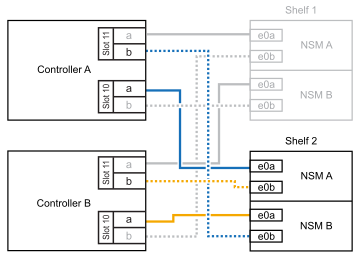
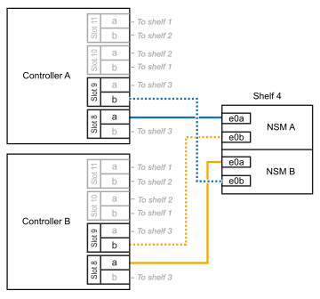
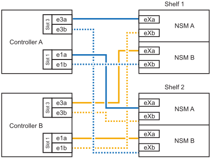

= 使用缆线将磁盘架连接到ASA系统—NS224磁盘架
:allow-uri-read: 
:icons: font
:imagesdir: ../media/

[role="lead"]
为要热添加的每个NS224磁盘架布线、以便每个磁盘架都有两个连接、连接到HA对中的每个控制器。

.关于此任务
您的硬件系统可能与具有NSM100模块的NS224磁盘架和具有NSM100B模块的NS224磁盘架兼容。要检查硬件和磁盘架的兼容性和端口名称，请参阅 https://hwu.netapp.com["NetApp Hardware Universe"]。

.将电缆架连接到ASA A1K
[%collapsible]
====
您可以将最多三个额外的NS224磁盘架热添加到一个ASA A1K HA对中(总共四个磁盘架)。

.开始之前
* 您必须已查看 link:requirements-hot-add-shelf.html["热添加要求和最佳实践"]。
* 您必须已完成中的适用过程 link:prepare-hot-add-shelf.html["准备热添加磁盘架"]。
* 您必须已安装磁盘架并为其通电，然后按照中所述设置磁盘架ID link:prepare-hot-add-shelf.html["安装用于热添加的磁盘架"]。

.关于此任务
* 此过程假设HA对至少有一个现有NS224磁盘架。
* 此过程可解决以下热添加情形：
+
** 将第二个磁盘架热添加到每个控制器中具有两个支持RoCE的I/O模块的HA对。(您已安装第二个I/O模块并将第一个磁盘架重新布线到两个I/O模块、或者已将第一个磁盘架布线到两个I/O模块。您将使用缆线将第二个磁盘架连接到两个I/O模块)。
** 在每个控制器中使用三个支持RoCE的I/O模块将第三个磁盘架热添加到HA对。(您已安装第三个I/O模块、并将使用缆线将第三个磁盘架仅连接到第三个I/O模块)。
** 将第三个磁盘架热添加到每个控制器中具有四个支持RoCE的I/O模块的HA对。(您已安装第三个和第四个I/O模块、并将使用缆线将第三个磁盘架连接到第三个和第四个I/O模块)。
** 在每个控制器中使用四个支持RoCE的I/O模块将第四个磁盘架热添加到HA对。(您已安装第四个I/O模块并将第三个磁盘架重新布线到第三个和第四个I/O模块、或者已将第三个磁盘架布线到第三个和第四个I/O模块。您将使用缆线将第四个磁盘架同时连接到第三个和第四个I/O模块)。

.步骤
. 如果要热添加的 NS224 磁盘架是 HA 对中的第二个 NS224 磁盘架，请完成以下子步骤。
+
否则，请转至下一步。

+
.. 使用缆线将磁盘架 NSM A 端口 e0a 连接到控制器 A 插槽 10 端口 A （ E10A ）。
.. 使用缆线将磁盘架 NSM A 端口 e0b 连接到控制器 B 插槽 11 端口 b （ e11b ）。
.. 使用缆线将磁盘架 NSM B 端口 e0a 连接到控制器 B 插槽 10 端口 A （ E10A ）。
.. 使用缆线将磁盘架 NSM B 端口 e0b 连接到控制器 A 插槽 11 端口 b （ e11b ）。
+
下图突出显示了HA对中第二个磁盘架的布线、其中每个控制器具有两个支持RoCE的I/O模块：

+

. 如果要热添加的NS224磁盘架是HA对中的第三个NS224磁盘架、并且每个控制器中有三个支持RoCE的I/O模块、请完成以下子步骤。否则，请继续执行下一步。
+
.. 使用缆线将磁盘架NSM A端口e0a连接到控制器A插槽9端口A (e9a)。
.. 使用缆线将磁盘架NSM A端口e0b连接到控制器B插槽9端口b (e9b)。
.. 使用缆线将磁盘架NSM B端口e0a连接到控制器B插槽9端口A (e9a)。
.. 使用缆线将磁盘架NSM B端口e0b连接到控制器A插槽9端口b (e9b)。
+
下图突出显示了HA对中第三个磁盘架的布线、其中每个控制器具有三个支持RoCE的I/O模块：

+
image::../media/drw_ns224_vino_m_3shelves_3cards_ieops-1643.svg[为AFF具有三个磁盘架和三个ASA模块的IO/IO A1K布线]

. 如果要热添加的NS224磁盘架是HA对中的第三个NS224磁盘架、并且每个控制器中有四个支持RoCE的I/O模块、请完成以下子步骤。否则，请继续执行下一步。
+
.. 使用缆线将磁盘架NSM A端口e0a连接到控制器A插槽9端口A (e9a)。
.. 使用缆线将磁盘架NSM A端口e0b连接到控制器B插槽8端口b (e8b)。
.. 使用缆线将磁盘架NSM B端口e0a连接到控制器B插槽9端口A (e9a)。
.. 使用缆线将磁盘架NSM B端口e0b连接到控制器A插槽8端口b (e8b)。
+
下图突出显示了HA对中第三个磁盘架的布线、其中每个控制器具有四个支持RoCE的I/O模块：

+
image::../media/drw_ns224_vino_m_3shelves_4cards_ieops-1644.svg[使用缆线为AFF具有三个磁盘架和四个ASA模块的IO/IO A1K布线]

. 如果要热添加的NS224磁盘架是HA对中的第四个NS224磁盘架、并且每个控制器中有四个支持RoCE的I/O模块、请完成以下子步骤。
+
.. 使用缆线将磁盘架NSM A端口e0a连接到控制器A插槽8端口A (e8a)。
.. 使用缆线将磁盘架NSM A端口e0b连接到控制器B插槽9端口b (e9b)。
.. 使用缆线将磁盘架NSM B端口e0a连接到控制器B插槽8端口A (e8a)。
.. 使用缆线将磁盘架NSM B端口e0b连接到控制器A插槽9端口b (e9b)。
+
下图突出显示了HA对中第四个磁盘架的布线、其中每个控制器具有四个支持RoCE的I/O模块：

+

. 使用验证热添加磁盘架的布线是否正确 https://mysupport.netapp.com/site/tools/tool-eula/activeiq-configadvisor["Active IQ Config Advisor"^]。
+
如果生成任何布线错误，请按照提供的更正操作进行操作。

.下一步是什么？
If you disabled automatic drive assignment as part of the preparation for this procedure, you need to manually assign drive ownership and then reenable automatic drive assignment, if needed.转到。 link:complete-hot-add-shelf.html["完成热添加"]

否则、您将完成热添加磁盘架过程。

====
.使用缆线将磁盘架连接到ASA A20
[%collapsible]
====
如果需要额外存储(到内部磁盘架)、则最多可以将一个NS224磁盘架热添加到一个ASA 2020 HA对中。

.开始之前
* 您必须已查看 link:requirements-hot-add-shelf.html["热添加要求和最佳实践"]。
* 您必须已完成中的适用过程 link:prepare-hot-add-shelf.html["准备热添加磁盘架"]。
* 您必须已安装磁盘架并为其通电，然后按照中所述设置磁盘架ID link:prepare-hot-add-shelf.html["安装用于热添加的磁盘架"]。

.关于此任务
* 此过程假设您的HA对只有内部存储(无外部磁盘架)、并且您要热添加最多一个额外磁盘架。
* 此过程可解决以下热添加情形：
+
** 在每个控制器中使用一个支持RoCE的I/O模块将第一个磁盘架热添加到HA对。
** 在每个控制器中使用两个支持RoCE的I/O模块将第一个磁盘架热添加到HA对。

* 这些系统可与具有NSM100模块的NS224磁盘架和具有NSM100B模块的NS224磁盘架兼容。为确保将控制器连接到正确的端口、请将每个示意图中的"X"替换为适用于您的模块的正确端口号：
+
[cols="1,4"]
|===
| 模块类型 | 端口标记 

 a| 
NSM100
 a| 
"0"

例如e0a

 a| 
NSM100B
 a| 
"1"

例如e1a

|===

.步骤
. 如果要在每个控制器模块中使用一组支持RoCE的端口(一个支持RoCE的I/O模块)热添加一个磁盘架、并且这是HA对中唯一的NS224磁盘架、请完成以下子步骤。
+
否则，请转至下一步。

+

NOTE: 此步骤假定您已将支持RoCE的I/O模块安装在插槽3中。

+
.. 使用缆线将磁盘架NSM A端口exa连接到控制器A插槽3端口A (E3A)。
.. 使用缆线将磁盘架NSM A端口EXB连接到控制器B插槽3端口b (e3b)。
.. 使用缆线将磁盘架NSM B端口exa连接到控制器B插槽3端口A (E3A)。
.. 使用缆线将磁盘架NSM B端口EXB连接到控制器A插槽3端口b (e3b)。
+
下图显示了在每个控制器模块中使用一个支持 RoCE 的 I/O 模块为一个热添加磁盘架布线：

+
image::../media/drw_ns224_g_1shelf_1card_ieops-2002.svg[使用缆线为AFF具有一个磁盘架和一个模块的IO/IO ASA A20布线]

. 如果要在每个控制器模块中使用两组支持RoCE的端口(两个支持RoCE的I/O模块)热添加一个磁盘架、请完成以下子步骤。
+
.. 使用缆线将NSM A端口exa连接到控制器A插槽3端口A (E3A)。
.. 使用缆线将NSM A端口EXB连接到控制器B插槽1端口b (e1b)。
.. 使用缆线将NSM B端口exa连接到控制器B插槽3端口A (E3A)。
.. 使用缆线将NSM B端口EXB连接到控制器A插槽1端口b (e1b)。

下图显示了如何在每个控制器模块中使用两个支持RoCE的I/O模块为一个热添加磁盘架布线：

image::../media/drw_ns224_g_1shelf_2card_ieops-2005.svg[为AFF具有一个磁盘架和两个模块的IO/IO ASA A20布线]

. 使用验证热添加磁盘架的布线是否正确 https://mysupport.netapp.com/site/tools/tool-eula/activeiq-configadvisor["Active IQ Config Advisor"^]。
+
如果生成任何布线错误，请按照提供的更正操作进行操作。

.下一步是什么？
If you disabled automatic drive assignment as part of the preparation for this procedure, you need to manually assign drive ownership and then reenable automatic drive assignment, if needed.转到。 link:complete-hot-add-shelf.html["完成热添加"]

否则、您将完成热添加磁盘架过程。

====
.使用缆线将磁盘架连接到ASA A30或ASA A50
[%collapsible]
====
如果需要为一个ASA A30或A50 HA对热添加更多存储(到内部磁盘架)、则最多可以将两个NS224磁盘架添加到其中。

.开始之前
* 您必须已查看 link:requirements-hot-add-shelf.html["热添加要求和最佳实践"]。
* 您必须已完成中的适用过程 link:prepare-hot-add-shelf.html["准备热添加磁盘架"]。
* 您必须已安装磁盘架并为其通电，然后按照中所述设置磁盘架ID link:prepare-hot-add-shelf.html["安装用于热添加的磁盘架"]。

.关于此任务
* 此过程假设HA对只有内部存储(无外部磁盘架)、并且您要在每个控制器中热添加最多两个额外磁盘架和两个支持RoCE的I/O模块。
* 此过程可解决以下热添加情形：
+
** 在每个控制器中使用一个支持RoCE的I/O模块将第一个磁盘架热添加到HA对。
** 在每个控制器中使用两个支持RoCE的I/O模块将第一个磁盘架热添加到HA对。
** 热-将第二个磁盘架添加到每个控制器中具有两个支持RoCE的I/O模块的HA对中。

* 这些系统可与具有NSM100模块的NS224磁盘架和具有NSM100B模块的NS224磁盘架兼容。为确保将控制器连接到正确的端口、请将每个示意图中的"X"替换为适用于您的模块的正确端口号：
+
[cols="1,4"]
|===
| 模块类型 | 端口标记 

 a| 
NSM100
 a| 
"0"

例如e0a

 a| 
NSM100B
 a| 
"1"

例如e1a

|===

.步骤
. 如果要在每个控制器模块中使用一组支持RoCE的端口(一个支持RoCE的I/O模块)热添加一个磁盘架、并且这是HA对中唯一的NS224磁盘架、请完成以下子步骤。
+
否则，请转至下一步。

+

NOTE: 此步骤假定您已将支持RoCE的I/O模块安装在插槽3中。

+
.. 使用缆线将磁盘架NSM A端口exa连接到控制器A插槽3端口A (E3A)。
.. 使用缆线将磁盘架NSM A端口EXB连接到控制器B插槽3端口b (e3b)。
.. 使用缆线将磁盘架NSM B端口exa连接到控制器B插槽3端口A (E3A)。
.. 使用缆线将磁盘架NSM B端口EXB连接到控制器A插槽3端口b (e3b)。
+
下图显示了在每个控制器模块中使用一个支持 RoCE 的 I/O 模块为一个热添加磁盘架布线：

+
image::../media/drw_ns224_g_1shelf_1card_ieops-2002.svg[为AFF或ASA A30布线,452px,AFF/ASA A50]

. 如果要在每个控制器模块中使用两组支持 RoCE 的端口（两个支持 RoCE 的 I/O 模块）热添加一个或两个磁盘架，请完成相应的子步骤。
+

NOTE: 此步骤假定您已在插槽3和1中安装了支持RoCE的I/O模块。

+
[cols="1,3"]
|===
| 磁盘架 | 布线 

 a| 
磁盘架 1
 a| 
.. 使用缆线将NSM A端口exa连接到控制器A插槽3端口A (E3A)。
.. 使用缆线将NSM A端口EXB连接到控制器B插槽1端口b (e1b)。
.. 使用缆线将NSM B端口exa连接到控制器B插槽3端口A (E3A)。
.. 使用缆线将NSM B端口EXB连接到控制器A插槽1端口b (e1b)。
.. 如果您要快速添加第二个搁板，请完成“`搁板 2`”子步骤；否则，请转到下一步。

下图显示了如何在每个控制器模块中使用两个支持RoCE的I/O模块为一个热添加磁盘架布线：

image::../media/drw_ns224_g_1shelf_2card_ieops-2005.svg[为AFF或ASA A30布线,452px,AFF/ASA A50]

 a| 
磁盘架 2
 a| 
.. 使用缆线将NSM A端口exa连接到控制器A插槽1的端口a (e1a)。
.. 使用缆线将NSM A端口EXB连接到控制器B插槽3端口b (e3b)。
.. 使用缆线将NSM B端口exa连接到控制器B插槽1端口A (e1a)。
.. 使用缆线将NSM B端口EXB连接到控制器A插槽3端口b (e3b)。
.. 转至下一步。

下图显示了在每个控制器模块中使用两个支持RoCE的I/O模块为两个热添加磁盘架布线：

|===
. 使用验证热添加磁盘架的布线是否正确 https://mysupport.netapp.com/site/tools/tool-eula/activeiq-configadvisor["Active IQ Config Advisor"^]。
+
如果生成任何布线错误，请按照提供的更正操作进行操作。

.下一步是什么？
If you disabled automatic drive assignment as part of the preparation for this procedure, you need to manually assign drive ownership and then reenable automatic drive assignment, if needed.转到。 link:complete-hot-add-shelf.html["完成热添加"]

否则、您将完成热添加磁盘架过程。

====
.使用缆线将磁盘架连接到ASA A70或ASA A90
[%collapsible]
====
如果需要为一个ASA A70或ASA A90 HA对热添加更多存储(到内部磁盘架)、则最多可以将两个NS224磁盘架添加到其中。

.开始之前
* 您必须已查看 link:requirements-hot-add-shelf.html["热添加要求和最佳实践"]。
* 您必须已完成中的适用过程 link:prepare-hot-add-shelf.html["准备热添加磁盘架"]。
* 您必须已安装磁盘架并为其通电，然后按照中所述设置磁盘架ID link:prepare-hot-add-shelf.html["安装用于热添加的磁盘架"]。

.关于此任务
* 此过程假设HA对只有内部存储(无外部磁盘架)、并且您要在每个控制器中热添加最多两个额外磁盘架和两个支持RoCE的I/O模块。
* 此过程可解决以下热添加情形：
+
** 在每个控制器中使用一个支持RoCE的I/O模块将第一个磁盘架热添加到HA对。
** 在每个控制器中使用两个支持RoCE的I/O模块将第一个磁盘架热添加到HA对。
** 热-将第二个磁盘架添加到每个控制器中具有两个支持RoCE的I/O模块的HA对中。

.步骤
. 如果要在每个控制器模块中使用一组支持RoCE的端口(一个支持RoCE的I/O模块)热添加一个磁盘架、并且这是HA对中唯一的NS224磁盘架、请完成以下子步骤。
+
否则，请转至下一步。

+

NOTE: 此步骤假定您已将支持RoCE的I/O模块安装在插槽11中。

+
.. 使用缆线将磁盘架 NSM A 端口 e0a 连接到控制器 A 插槽 11 端口 A （ e11a ）。
.. 使用缆线将磁盘架 NSM A 端口 e0b 连接到控制器 B 插槽 11 端口 b （ e11b ）。
.. 使用缆线将磁盘架 NSM B 端口 e0a 连接到控制器 B 插槽 11 端口 A （ e11a ）。
.. 使用缆线将磁盘架 NSM B 端口 e0b 连接到控制器 A 插槽 11 端口 b （ e11b ）。
+
下图显示了在每个控制器模块中使用一个支持 RoCE 的 I/O 模块为一个热添加磁盘架布线：

+
image::../media/drw_ns224_vino_i_1shelf_1card_ieops-1639.svg[使用缆线为AFF带有一个磁盘架和一个ASA模块的IO/IO A70或A90布线]

. 如果要在每个控制器模块中使用两组支持 RoCE 的端口（两个支持 RoCE 的 I/O 模块）热添加一个或两个磁盘架，请完成相应的子步骤。
+

NOTE: 此步骤假定您已在插槽11和8中安装了支持RoCE的I/O模块。

+
[cols="1,3"]
|===
| 磁盘架 | 布线 

 a| 
磁盘架 1
 a| 
.. 使用缆线将NSM A端口e0a连接到控制器A插槽11端口A (e11a)。
.. 使用缆线将NSM A端口e0b连接到控制器B插槽8端口b (e8b)。
.. 使用缆线将NSM B端口e0a连接到控制器B插槽11端口A (e11a)。
.. 使用缆线将NSM B端口e0b连接到控制器A插槽8端口b (e8b)。
.. 如果您要快速添加第二个搁板，请完成“`搁板 2`”子步骤；否则，请转到下一步。

下图显示了如何在每个控制器模块中使用两个支持RoCE的I/O模块为一个热添加磁盘架布线：

image::../media/drw_ns224_vino_i_1shelf_2cards_ieops-1640.svg[为带有一个磁盘架和两个ASA模块的IO/IO A70或AFF布线]

 a| 
磁盘架 2
 a| 
.. 使用缆线将NSM A端口e0a连接到控制器A插槽8端口A (E8a)。
.. 使用缆线将NSM A端口e0b连接到控制器B插槽11端口b (e11b)。
.. 使用缆线将NSM B端口e0a连接到控制器B插槽8端口A (E8a)。
.. 使用缆线将NSM B端口e0b连接到控制器A插槽11端口b (e11b)。
.. 转至下一步。

下图显示了在每个控制器模块中使用两个支持RoCE的I/O模块为两个热添加磁盘架布线：

image::../media/drw_ns224_vino_i_2shelves_2cards_ieops-1641.svg[使用缆线连接具有两个磁盘架和两个ASA模块的IO/IO A70或AFF]

|===
. 使用验证热添加磁盘架的布线是否正确 https://mysupport.netapp.com/site/tools/tool-eula/activeiq-configadvisor["Active IQ Config Advisor"^]。
+
如果生成任何布线错误，请按照提供的更正操作进行操作。

.下一步是什么？
If you disabled automatic drive assignment as part of the preparation for this procedure, you need to manually assign drive ownership and then reenable automatic drive assignment, if needed.转到。 link:complete-hot-add-shelf.html["完成热添加"]

否则、您将完成热添加磁盘架过程。

====
.用电缆将磁盘架连接到ASA A250或ASA C250
[%collapsible]
====
如果需要更多存储、您最多可以将一个NS224磁盘架热添加到一个ASA A250或ASA C250 HA对中。

.开始之前
* 您必须已查看 link:requirements-hot-add-shelf.html["热添加要求和最佳实践"]。
* 您必须已完成中的适用过程 link:prepare-hot-add-shelf.html["准备热添加磁盘架"]。
* 您必须已安装磁盘架并为其通电，然后按照中所述设置磁盘架ID link:prepare-hot-add-shelf.html["安装用于热添加的磁盘架"]。

.关于此任务
从平台机箱背面看，左侧支持 RoCE 的卡端口为端口 "A" （ e1a ），右侧端口为端口 "b" （ e1b ）。

.步骤
. 为磁盘架连接布线：
+
.. 使用缆线将磁盘架 NSM A 端口 e0a 连接到控制器 A 插槽 1 端口 A （ e1a ）。
.. 使用缆线将磁盘架 NSM A 端口 e0b 连接到控制器 B 插槽 1 端口 b （ e1b ）。
.. 使用缆线将磁盘架 NSM B 端口 e0a 连接到控制器 B 插槽 1 端口 A （ e1a ）。
.. 使用缆线将磁盘架 NSM B 端口 e0b 连接到控制器 A 插槽 1 端口 b （ e1b ）。+ 下图显示了完成后的磁盘架布线。
+
image::../media/drw_ns224_a250_c250_f500f_1shelf_ieops-1824.svg[为AFF具有一个NS224磁盘架和一组ASA A250卡端口的PCI/PCIE C250或FAS500f布线]

. 使用验证热添加磁盘架的布线是否正确 https://mysupport.netapp.com/site/tools/tool-eula/activeiq-configadvisor["Active IQ Config Advisor"^]。
+
如果生成任何布线错误，请按照提供的更正操作进行操作。

.下一步是什么？
If you disabled automatic drive assignment as part of the preparation for this procedure, you need to manually assign drive ownership and then reenable automatic drive assignment, if needed.转到。 link:complete-hot-add-shelf.html["完成热添加"]

否则、您将完成热添加磁盘架过程。

====
.用缆线将磁盘架连接到ASA A400或ASA C400
[%collapsible]
====
如何为NS224磁盘架布线以进行热添加取决于您拥有的是ASA A400还是ASA C400 HA对。

.开始之前
* 您必须已查看 link:requirements-hot-add-shelf.html["热添加要求和最佳实践"]。
* 您必须已完成中的适用过程 link:prepare-hot-add-shelf.html["准备热添加磁盘架"]。
* 您必须已安装磁盘架并为其通电，然后按照中所述设置磁盘架ID link:prepare-hot-add-shelf.html["安装用于热添加的磁盘架"]。

*用电缆将磁盘架连接到AFF A400 HA对*

对于AFF A400 HA对、您可以根据需要热添加最多两个磁盘架、并使用板载端口e0c/e0d和插槽5中的端口。

.步骤
. 如果要在每个控制器上使用一组支持RoCE的端口(板载支持RoCE的端口)热添加一个磁盘架、并且这是HA对中唯一的NS224磁盘架、请完成以下子步骤。
+
否则，请转至下一步。

+
.. 使用缆线将磁盘架 NSM A 端口 e0a 连接到控制器 A 端口 e0c 。
.. 使用缆线将磁盘架 NSM A 端口 e0b 连接到控制器 B 端口 e0d 。
.. 使用缆线将磁盘架 NSM B 端口 e0a 连接到控制器 B 端口 e0c 。
.. 使用缆线将磁盘架 NSM B 端口 e0b 连接到控制器 A 端口 e0d 。
+
下图显示了如何在每个控制器上使用一组支持RoCE的端口为一个热添加磁盘架布线：

+
image::../media/drw_ns224_a400_1shelf.png[为AFF具有一个NS224磁盘架和一组板载端口的NSS/ ASA A400布线]

. 如果要在每个控制器上使用两组支持RoCE的端口(板载端口和支持RoCE的PCIe卡端口)热添加一个或两个磁盘架、请完成以下子步骤。
+
[cols="1,3"]
|===
| 磁盘架 | 布线 

 a| 
磁盘架 1
 a| 
.. 使用缆线将 NSM A 端口 e0a 连接到控制器 A 端口 e0c 。
.. 使用缆线将NSM A端口e0b连接到控制器B插槽5端口2 (e5b)。
.. 使用缆线将 NSM B 端口 e0a 连接到控制器 B 端口 e0c 。
.. 使用缆线将NSM B端口e0b连接到控制器A插槽5端口2 (e5b)。
.. 如果您要快速添加第二个搁板，请完成“`搁板 2`”子步骤；否则，请转到下一步。

 a| 
磁盘架 2
 a| 
.. 使用缆线将NSM A端口e0a连接到控制器A插槽5端口1 (e5a)。
.. 使用缆线将 NSM A 端口 e0b 连接到控制器 B 端口 e0d 。
.. 使用缆线将NSM B端口e0a连接到控制器B插槽5端口1 (e5a)。
.. 使用缆线将 NSM B 端口 e0b 连接到控制器 A 端口 e0d 。
.. 转至下一步。

|===
+
下图显示了两个热添加磁盘架的布线：

+
image::../media/drw_ns224_a400_2shelves_IEOPS-983.svg[为ASA A400具有两个NS224磁盘架、一组板载端口和一组PCIe卡端口的/PCIe布线]

. 使用验证热添加磁盘架的布线是否正确 https://mysupport.netapp.com/site/tools/tool-eula/activeiq-configadvisor["Active IQ Config Advisor"^]。
+
如果生成任何布线错误，请按照提供的更正操作进行操作。

. If you disabled automatic drive assignment as part of the preparation for this procedure, you need to manually assign drive ownership and then re enable automatic drive assignment, if needed.请参阅。 link:complete-hot-add-shelf.html["完成热添加"]
+
否则，您将使用此操作步骤。

*用电缆将磁盘架连接到AFF C400 HA对*

对于AFF C400 HA对、您最多可以热添加两个磁盘架、并根据需要使用插槽4和5中的端口。

.步骤
. 如果要在每个控制器上使用一组支持RoCE的端口热添加一个磁盘架、并且这是HA对中唯一的NS224磁盘架、请完成以下子步骤。
+
否则，请转至下一步。

+
.. 使用缆线将磁盘架NSM A端口e0a连接到控制器A插槽4端口1 (E4A)。
.. 使用缆线将磁盘架NSM A端口e0b连接到控制器B插槽4端口2 (e4b)。
.. 使用缆线将磁盘架NSM B端口e0a连接到控制器B插槽4端口1 (E4A)。
.. 使用缆线将磁盘架NSM B端口e0b连接到控制器A插槽4端口2 (e4b)。
+
下图显示了如何在每个控制器上使用一组支持RoCE的端口为一个热添加磁盘架布线：

+
image::../media/drw_ns224_c400_1shelf_IEOPS-985.svg[为具有一个NS224磁盘架和一组AFF卡端口的ASA C400布线]

. 如果要在每个控制器上使用两组支持RoCE的端口热添加一个或两个磁盘架、请完成以下子步骤。
+
[cols="1,3"]
|===
| 磁盘架 | 布线 

 a| 
磁盘架 1
 a| 
.. 使用缆线将NSM A端口e0a连接到控制器A插槽4端口1 (E4A)。
.. 使用缆线将NSM A端口e0b连接到控制器B插槽5端口2 (e5b)。
.. 使用缆线将NSM B端口e0a连接到控制器B端口插槽4端口1 (E4A)。
.. 使用缆线将NSM B端口e0b连接到控制器A插槽5端口2 (e5b)。
.. 如果您要快速添加第二个搁板，请完成“`搁板 2`”子步骤；否则，请转到下一步。

 a| 
磁盘架 2
 a| 
.. 使用缆线将NSM A端口e0a连接到控制器A插槽5端口1 (e5a)。
.. 使用缆线将NSM A端口e0b连接到控制器B插槽4端口2 (e4b)。
.. 使用缆线将NSM B端口e0a连接到控制器B插槽5端口1 (e5a)。
.. 使用缆线将NSM B端口e0b连接到控制器A插槽4端口2 (e4b)。
.. 转至下一步。

|===
+
下图显示了两个热添加磁盘架的布线：

+
image::../media/drw_ns224_c400_2shelves_IEOPS-984.svg[为具有两个NS224磁盘架和两组AFF卡端口的ASA C400布线]

. 使用验证热添加磁盘架的布线是否正确 https://mysupport.netapp.com/site/tools/tool-eula/activeiq-configadvisor["Active IQ Config Advisor"^]。
+
如果生成任何布线错误，请按照提供的更正操作进行操作。

.下一步是什么？
If you disabled automatic drive assignment as part of the preparation for this procedure, you need to manually assign drive ownership and then reenable automatic drive assignment, if needed.转到。 link:complete-hot-add-shelf.html["完成热添加"]

否则、您将完成热添加磁盘架过程。

====
.用缆线将磁盘架连接到ASA A800或ASA C800
[%collapsible]
====
如何在ASA A800或ASA C800 HA对中为NS224磁盘架布线取决于要热添加的磁盘架数量以及控制器上使用的支持RoCE的端口集(一个或两个)数量。

.开始之前
* 您必须已查看 link:requirements-hot-add-shelf.html["热添加要求和最佳实践"]。
* 您必须已完成中的适用过程 link:prepare-hot-add-shelf.html["准备热添加磁盘架"]。
* 您必须已安装磁盘架并为其通电，然后按照中所述设置磁盘架ID link:prepare-hot-add-shelf.html["安装用于热添加的磁盘架"]。

.步骤
. 如果要在每个控制器上使用一组支持RoCE的端口(一个支持RoCE的PCIe卡)热添加一个磁盘架、并且这是HA对中唯一的NS224磁盘架、请完成以下子步骤。
+
否则，请转至下一步。

+

NOTE: 此步骤假定您已在插槽 5 中安装支持 RoCE 的 PCIe 卡。

+
.. 使用缆线将磁盘架NSM A端口e0a连接到控制器A插槽5端口A (e5a)。
.. 使用缆线将磁盘架NSM A端口e0b连接到控制器B插槽5端口b (e5b)。
.. 使用缆线将磁盘架NSM B端口e0a连接到控制器B插槽5端口A (e5a)。
.. 使用缆线将磁盘架NSM B端口e0b连接到控制器A插槽5端口b (e5b)。
+
下图显示了在每个控制器上使用一个支持RoCE的PCIe卡为一个热添加磁盘架布线：

+
image::../media/drw_ns224_a800_c800_1shelf_IEOPS-964.svg[为AFF具有一个NS224磁盘架和一个AFF卡的ASA A800或ASA C800布线]

. 如果要在每个控制器上使用两组支持RoCE的端口(两个支持RoCE的PCIe卡)热添加一个或两个磁盘架、请完成相应的子步骤。
+

NOTE: 此步骤假定您已在插槽 5 和插槽 3 中安装了支持 RoCE 的 PCIe 卡。

+
[cols="1,3"]
|===
| 磁盘架 | 布线 

 a| 
磁盘架 1
 a| 

NOTE: 这些子步骤假定您正在通过将磁盘架端口 e0a 连接到插槽 5 中支持 RoCE 的 PCIe 卡（而不是插槽 3 ）来开始布线。

.. 使用缆线将NSM A端口e0a连接到控制器A插槽5端口A (e5a)。
.. 使用缆线将NSM A端口e0b连接到控制器B插槽3端口b (e3b)。
.. 使用缆线将NSM B端口e0a连接到控制器B插槽5端口A (e5a)。
.. 使用缆线将NSM B端口e0b连接到控制器A插槽3端口b (e3b)。
.. 如果您要快速添加第二个搁板，请完成“`搁板 2`”子步骤；否则，请转到下一步。

 a| 
磁盘架 2
 a| 

NOTE: 这些子步骤假定您开始使用缆线将磁盘架端口 e0a 连接到插槽 3 中支持 RoCE 的 PCIe 卡，而不是插槽 5 （与磁盘架 1 的布线子步骤相关）。

.. 使用缆线将NSM A端口e0a连接到控制器A插槽3端口A (E3A)。
.. 使用缆线将NSM A端口e0b连接到控制器B插槽5端口b (e5b)。
.. 使用缆线将NSM B端口e0a连接到控制器B插槽3端口A (E3A)。
.. 使用缆线将NSM B端口e0b连接到控制器A插槽5端口b (e5b)。
.. 转至下一步。

|===
+
下图显示了两个热添加磁盘架的布线：

+
image::../media/drw_ns224_a800_c800_2shelves_IEOPS-966.svg[DRW nss224 a800 c800 2个磁盘架IEOPS 96696]

. 使用验证热添加磁盘架的布线是否正确 https://mysupport.netapp.com/site/tools/tool-eula/activeiq-configadvisor["Active IQ Config Advisor"^]。
+
如果生成任何布线错误，请按照提供的更正操作进行操作。

.下一步是什么？
If you disabled automatic drive assignment as part of the preparation for this procedure, you need to manually assign drive ownership and then reenable automatic drive assignment, if needed.转到。 link:complete-hot-add-shelf.html["完成热添加"]

否则、您将完成热添加磁盘架过程。

====
.用电缆将磁盘架连接到ASA A900
[%collapsible]
====
如果需要更多存储，您可以将最多三个额外的 NS224 驱动器架（总共四个磁盘架）热添加到一个 ASA A900 HA 对中。

.开始之前
* 您必须已查看 link:requirements-hot-add-shelf.html["热添加要求和最佳实践"]。
* 您必须已完成中的适用过程 link:prepare-hot-add-shelf.html["准备热添加磁盘架"]。
* 您必须已安装磁盘架并为其通电，然后按照中所述设置磁盘架ID link:prepare-hot-add-shelf.html["安装用于热添加的磁盘架"]。

.关于此任务
* 此操作步骤假定您的 HA 对至少具有一个现有 NS224 磁盘架，并且您要热添加最多三个额外的磁盘架。
* 如果您的 HA 对只有一个现有 NS224 磁盘架，则此操作步骤会假定该磁盘架已通过缆线连接到每个控制器上两个支持 RoCE 的 100GbE I/O 模块。

.步骤
. 如果要热添加的 NS224 磁盘架是 HA 对中的第二个 NS224 磁盘架，请完成以下子步骤。
+
否则，请转至下一步。

+
.. 使用缆线将磁盘架 NSM A 端口 e0a 连接到控制器 A 插槽 10 端口 A （ E10A ）。
.. 使用缆线将磁盘架 NSM A 端口 e0b 连接到控制器 B 插槽 2 端口 b （ e2b ）。
.. 使用缆线将磁盘架 NSM B 端口 e0a 连接到控制器 B 插槽 10 端口 A （ E10A ）。
.. 使用缆线将磁盘架 NSM B 端口 e0b 连接到控制器 A 插槽 2 端口 b （ e2b ）。
+
下图显示了第二个磁盘架的布线（以及第一个磁盘架）。

+
image::../media/drw_ns224_a900_2shelves.png[为具有两个NS224磁盘架和两个AFF模块的NSS/ ASA A900布线]

. 如果要热添加的 NS224 磁盘架是 HA 对中的第三个 NS224 磁盘架，请完成以下子步骤。
+
否则，请转至下一步。

+
.. 使用缆线将磁盘架 NSM A 端口 e0a 连接到控制器 A 插槽 1 端口 A （ e1a ）。
.. 使用缆线将磁盘架 NSM A 端口 e0b 连接到控制器 B 插槽 11 端口 b （ e11b ）。
.. 使用缆线将磁盘架 NSM B 端口 e0a 连接到控制器 B 插槽 1 端口 A （ e1a ）。
.. 使用缆线将磁盘架 NSM B 端口 e0b 连接到控制器 A 插槽 11 端口 b （ e11b ）。
+
下图显示了第三个磁盘架的布线。

+
image::../media/drw_ns224_a900_3shelves.png[为AFF包含三个NS224磁盘架和四个IO模块的NSS/ ASA A900布线]

. 如果要热添加的 NS224 磁盘架是 HA 对中的第四个 NS224 磁盘架，请完成以下子步骤。
+
否则，请转至下一步。

+
.. 使用缆线将磁盘架 NSM A 端口 e0a 连接到控制器 A 插槽 11 端口 A （ e11a ）。
.. 使用缆线将磁盘架 NSM A 端口 e0b 连接到控制器 B 插槽 1 端口 b （ e1b ）。
.. 使用缆线将磁盘架 NSM B 端口 e0a 连接到控制器 B 插槽 11 端口 A （ e11a ）。
.. Cable shelf NSM B port e0b to controller A slot 1 port b (e1b).
+
下图显示了第四个磁盘架的布线。

+
image::../media/drw_ns224_a900_4shelves.png[为AFF具有四个NS224磁盘架和四个IO模块的ASA A900布线]

. 使用验证热添加磁盘架的布线是否正确 https://mysupport.netapp.com/site/tools/tool-eula/activeiq-configadvisor["Active IQ Config Advisor"^]。
+
如果生成任何布线错误，请按照提供的更正操作进行操作。

.下一步是什么？
If you disabled automatic drive assignment as part of the preparation for this procedure, you need to manually assign drive ownership and then reenable automatic drive assignment, if needed.转到。 link:complete-hot-add-shelf.html["完成热添加"]

否则、您将完成热添加磁盘架过程。

====