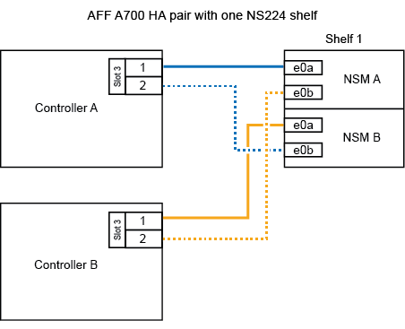

= 使用缆线将磁盘架连接到终止提供的系统—NS224磁盘架
:allow-uri-read: 
:icons: font
:imagesdir: ../media/

[role="lead"]
为要热添加的每个NS224磁盘架布线、以便每个磁盘架都有两个连接、连接到HA对中的每个控制器。

.用电缆将磁盘架连接到AFF A320
[%collapsible]
====
如果需要更多存储、您可以向现有HA对热添加第二个磁盘架。

.开始之前
* 您必须已查看 link:requirements-hot-add-shelf.html["热添加要求和最佳实践"]。
* 您必须已完成中的适用过程 link:prepare-hot-add-shelf.html["准备热添加磁盘架"]。
* 您必须已安装磁盘架并为其通电，然后按照中所述设置磁盘架ID link:prepare-hot-add-shelf.html["安装用于热添加的磁盘架"]。

.步骤
. 使用缆线将磁盘架连接到控制器。
+
.. 使用缆线将 NSM A 端口 e0a 连接到控制器 A 端口 e0e 。
.. 使用缆线将 NSM A 端口 e0b 连接到控制器 B 端口 e0b 。
.. 使用缆线将 NSM B 端口 e0a 连接到控制器 B 端口 e0e 。
.. 使用缆线将 NSM B 端口 e0b 连接到控制器 A 端口 e0b 。+ 下图显示了热添加磁盘架（磁盘架 2 ）的布线：
+
image::../media/drw_ns224_a320_2shelves_direct_attached.png[为具有两个NS224磁盘架和三组板载端口的AFF A320布线]

. 使用验证热添加磁盘架的布线是否正确 https://mysupport.netapp.com/site/tools/tool-eula/activeiq-configadvisor["Active IQ Config Advisor"^]。
+
如果生成任何布线错误，请按照提供的更正操作进行操作。

.下一步是什么？
If you disabled automatic drive assignment as part of the preparation for this procedure, you need to manually assign drive ownership and then reenable automatic drive assignment, if needed.转到。 link:complete-hot-add-shelf.html["完成热添加"]

否则、您将完成热添加磁盘架过程。

====
.用缆线将磁盘架连接到AFF A700
[%collapsible]
====
如何使用缆线将NS224磁盘架连接到AFF A700 HA对取决于要热添加的磁盘架数量以及控制器上使用的支持RoCE的端口集数量(一个或两个)。

.开始之前
* 您必须已查看 link:requirements-hot-add-shelf.html["热添加要求和最佳实践"]。
* 您必须已完成中的适用过程 link:prepare-hot-add-shelf.html["准备热添加磁盘架"]。
* 您必须已安装磁盘架并为其通电，然后按照中所述设置磁盘架ID link:prepare-hot-add-shelf.html["安装用于热添加的磁盘架"]。
* 如果要热添加初始NS224磁盘架(HA对中不存在NS224磁盘架)、则必须在每个控制器中安装一个核心转储模块(X9170A、NVMe 1TB SSD)、以支持核心转储(存储核心文件)。
+
请参阅。 link:../fas9000/caching-module-and-core-dump-module-replace.html["更换缓存模块或添加 / 更换核心转储模块— AFF A700 和 FAS9000"^]

.步骤
. 如果要在每个控制器上使用一组支持RoCE的端口(一个支持RoCE的I/O模块)热添加一个磁盘架、并且这是HA对中唯一的NS224磁盘架、请完成以下子步骤。
+
否则，请转至下一步。

+

NOTE: 此步骤假定您已将支持RoCE的I/O模块安装在每个控制器的插槽3 (而不是插槽7)中。

+
.. 使用缆线将磁盘架 NSM A 端口 e0a 连接到控制器 A 插槽 3 端口 a
.. 使用缆线将磁盘架 NSM A 端口 e0b 连接到控制器 B 插槽 3 端口 b
.. 使用缆线将磁盘架 NSM B 端口 e0a 连接到控制器 B 插槽 3 端口 a
.. 使用缆线将磁盘架 NSM B 端口 e0b 连接到控制器 A 插槽 3 端口 b
+
下图显示了如何在每个控制器中使用一个支持RoCE的I/O模块为一个热添加磁盘架布线：

+

. 如果要在每个控制器中使用两组支持RoCE的端口(两个支持RoCE的I/O模块)热添加一个或两个磁盘架、请完成相应的子步骤。
+
[cols="1,3"]
|===
| 磁盘架 | 布线 

 a| 
磁盘架 1
 a| 

NOTE: 这些子步骤假定您开始布线时使用的是将磁盘架端口 e0a 连接到插槽 3 中支持 RoCE 的 I/O 模块，而不是插槽 7 。

.. 使用缆线将 NSM A 端口 e0a 连接到控制器 A 插槽 3 端口 a
.. 使用缆线将 NSM A 端口 e0b 连接到控制器 B 插槽 7 端口 b
.. 使用缆线将 NSM B 端口 e0a 连接到控制器 B 插槽 3 端口 a
.. 使用缆线将 NSM B 端口 e0b 连接到控制器 A 插槽 7 端口 b
.. 如果要热添加第二个磁盘架，请完成 `Shelf 2` 子步骤；否则，请转至步骤 3 。

 a| 
磁盘架 2
 a| 

NOTE: 这些子步骤假定您开始布线时使用的是将磁盘架端口 e0a 连接到插槽 7 中支持 RoCE 的 I/O 模块，而不是插槽 3 （与磁盘架 1 的布线子步骤相关）。

.. 使用缆线将 NSM A 端口 e0a 连接到控制器 A 插槽 7 端口 a
.. 使用缆线将 NSM A 端口 e0b 连接到控制器 B 插槽 3 端口 b
.. 使用缆线将 NSM B 端口 e0a 连接到控制器 B 插槽 7 端口 a
.. 使用缆线将 NSM B 端口 e0b 连接到控制器 A 插槽 3 端口 b
.. 转至步骤 3 。

|===
+
下图显示了第一个和第二个热添加磁盘架的布线：

+
image::../media/drw_ns224_a700_2shelves.png[为具有两个NS224磁盘架和两组IO模块端口的AFF A700布线]

. 使用验证热添加磁盘架的布线是否正确 https://mysupport.netapp.com/site/tools/tool-eula/activeiq-configadvisor["Active IQ Config Advisor"^]。
+
如果生成任何布线错误，请按照提供的更正操作进行操作。

.下一步是什么？
If you disabled automatic drive assignment as part of the preparation for this procedure, you need to manually assign drive ownership and then reenable automatic drive assignment, if needed.转到。 link:complete-hot-add-shelf.html["完成热添加"]

否则、您将完成热添加磁盘架过程。

====
.使用缆线将磁盘架连接到FAS500f
[%collapsible]
====
如果需要更多存储、您可以将一个NS224磁盘架热添加到FAS500f HA对中。

.开始之前
* 您必须已查看 link:requirements-hot-add-shelf.html["热添加要求和最佳实践"]。
* 您必须已完成中的适用过程 link:prepare-hot-add-shelf.html["准备热添加磁盘架"]。
* 您必须已安装磁盘架并为其通电，然后按照中所述设置磁盘架ID link:prepare-hot-add-shelf.html["安装用于热添加的磁盘架"]。

.关于此任务
从平台机箱背面看，左侧支持 RoCE 的卡端口为端口 "A" （ e1a ），右侧端口为端口 "b" （ e1b ）。

.步骤
. 为磁盘架连接布线：
+
.. 使用缆线将磁盘架 NSM A 端口 e0a 连接到控制器 A 插槽 1 端口 A （ e1a ）。
.. 使用缆线将磁盘架 NSM A 端口 e0b 连接到控制器 B 插槽 1 端口 b （ e1b ）。
.. 使用缆线将磁盘架 NSM B 端口 e0a 连接到控制器 B 插槽 1 端口 A （ e1a ）。
.. 使用缆线将磁盘架 NSM B 端口 e0b 连接到控制器 A 插槽 1 端口 b （ e1b ）。+ 下图显示了完成后的磁盘架布线。
+
image::../media/drw_ns224_a250_c250_f500f_1shelf_ieops-1824.svg[为具有一个NS224磁盘架和一组端口的FAS500f AFF A250或AFF C250布线]

. 使用验证热添加磁盘架的布线是否正确 https://mysupport.netapp.com/site/tools/tool-eula/activeiq-configadvisor["Active IQ Config Advisor"^]。
+
如果生成任何布线错误，请按照提供的更正操作进行操作。

.下一步是什么？
If you disabled automatic drive assignment as part of the preparation for this procedure, you need to manually assign drive ownership and then reenable automatic drive assignment, if needed.转到。 link:complete-hot-add-shelf.html["完成热添加"]

否则、您将完成热添加磁盘架过程。

====