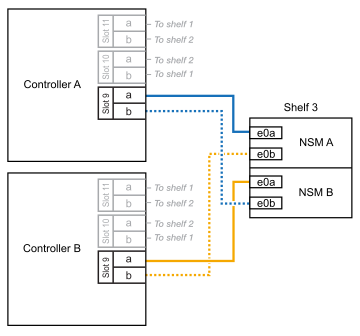
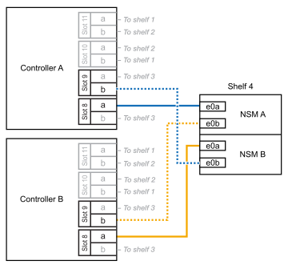

= 将 NS224 架连接到您的 AFF A1K 系统
:allow-uri-read: 
:icons: font
:imagesdir: ../media/

[role="lead"]
将 NS224 机架连接到 AFF A1K 系统，以便每个机架与 HA 对中的每个控制器有两个连接。

您可以将最多三个额外的NS224磁盘架热添加到一个AFF A1K HA对中(总共四个磁盘架)。

.关于此任务
* 此过程假设HA对至少有一个现有NS224磁盘架。
* 此过程可解决以下热添加情形：
+
** 将第二个磁盘架热添加到每个控制器中具有两个支持RoCE的I/O模块的HA对。(您已安装第二个I/O模块并将第一个磁盘架重新布线到两个I/O模块、或者已将第一个磁盘架布线到两个I/O模块。您将使用缆线将第二个磁盘架连接到两个I/O模块)。
** 在每个控制器中使用三个支持RoCE的I/O模块将第三个磁盘架热添加到HA对。(您已安装第三个I/O模块、并将使用缆线将第三个磁盘架仅连接到第三个I/O模块)。
** 将第三个磁盘架热添加到每个控制器中具有四个支持RoCE的I/O模块的HA对。(您已安装第三个和第四个I/O模块、并将使用缆线将第三个磁盘架连接到第三个和第四个I/O模块)。
** 在每个控制器中使用四个支持RoCE的I/O模块将第四个磁盘架热添加到HA对。(您已安装第四个I/O模块并将第三个磁盘架重新布线到第三个和第四个I/O模块、或者已将第三个磁盘架布线到第三个和第四个I/O模块。您将使用缆线将第四个磁盘架同时连接到第三个和第四个I/O模块)。

.步骤
. 如果要热添加的 NS224 磁盘架是 HA 对中的第二个 NS224 磁盘架，请完成以下子步骤。
+
否则，请转至下一步。

+
.. 使用缆线将磁盘架 NSM A 端口 e0a 连接到控制器 A 插槽 10 端口 A （ E10A ）。
.. 使用缆线将磁盘架 NSM A 端口 e0b 连接到控制器 B 插槽 11 端口 b （ e11b ）。
.. 使用缆线将磁盘架 NSM B 端口 e0a 连接到控制器 B 插槽 10 端口 A （ E10A ）。
.. 使用缆线将磁盘架 NSM B 端口 e0b 连接到控制器 A 插槽 11 端口 b （ e11b ）。
+
下图突出显示了HA对中第二个磁盘架的布线、其中每个控制器具有两个支持RoCE的I/O模块：

+
image::../media/drw_ns224_vino_m_2shelves_2cards_ieops-1642.svg[为AFF具有两个磁盘架和两个ASA模块的IO/IO A1K布线]

. 如果要热添加的NS224磁盘架是HA对中的第三个NS224磁盘架、并且每个控制器中有三个支持RoCE的I/O模块、请完成以下子步骤。否则，请继续执行下一步。
+
.. 使用缆线将磁盘架NSM A端口e0a连接到控制器A插槽9端口A (e9a)。
.. 使用缆线将磁盘架NSM A端口e0b连接到控制器B插槽9端口b (e9b)。
.. 使用缆线将磁盘架NSM B端口e0a连接到控制器B插槽9端口A (e9a)。
.. 使用缆线将磁盘架NSM B端口e0b连接到控制器A插槽9端口b (e9b)。
+
下图突出显示了HA对中第三个磁盘架的布线、其中每个控制器具有三个支持RoCE的I/O模块：

+

. 如果要热添加的NS224磁盘架是HA对中的第三个NS224磁盘架、并且每个控制器中有四个支持RoCE的I/O模块、请完成以下子步骤。否则，请继续执行下一步。
+
.. 使用缆线将磁盘架NSM A端口e0a连接到控制器A插槽9端口A (e9a)。
.. 使用缆线将磁盘架NSM A端口e0b连接到控制器B插槽8端口b (e8b)。
.. 使用缆线将磁盘架NSM B端口e0a连接到控制器B插槽9端口A (e9a)。
.. 使用缆线将磁盘架NSM B端口e0b连接到控制器A插槽8端口b (e8b)。
+
下图突出显示了HA对中第三个磁盘架的布线、其中每个控制器具有四个支持RoCE的I/O模块：

+
image::../media/drw_ns224_vino_m_3shelves_4cards_ieops-1644.svg[使用缆线为AFF具有三个磁盘架和四个ASA模块的IO/IO A1K布线]

. 如果要热添加的NS224磁盘架是HA对中的第四个NS224磁盘架、并且每个控制器中有四个支持RoCE的I/O模块、请完成以下子步骤。
+
.. 使用缆线将磁盘架NSM A端口e0a连接到控制器A插槽8端口A (e8a)。
.. 使用缆线将磁盘架NSM A端口e0b连接到控制器B插槽9端口b (e9b)。
.. 使用缆线将磁盘架NSM B端口e0a连接到控制器B插槽8端口A (e8a)。
.. 使用缆线将磁盘架NSM B端口e0b连接到控制器A插槽9端口b (e9b)。
+
下图突出显示了HA对中第四个磁盘架的布线、其中每个控制器具有四个支持RoCE的I/O模块：

+

. 使用验证热添加磁盘架的布线是否正确 https://mysupport.netapp.com/site/tools/tool-eula/activeiq-configadvisor["Active IQ Config Advisor"^]。
+
如果生成任何布线错误，请按照提供的更正操作进行操作。

.下一步行动
如果在此过程的准备过程中禁用了自动驱动器分配，则需要手动分配驱动器所有权，然后在需要时重新启用自动驱动器分配。转到 link:hot-add-aff-complete.html["完成热添加"]。

否则、您将完成热添加磁盘架过程。
