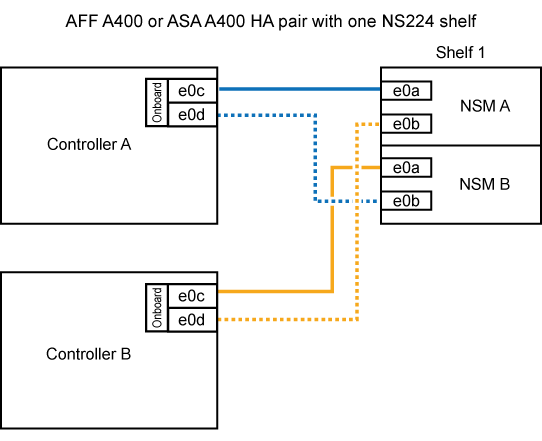

= 将 NS224 架连接到您的 AFF A400 或 AFF C400 系统
:allow-uri-read: 
:icons: font
:imagesdir: ../media/

[role="lead"]
将 NS224 磁盘架连接到 AFF A400 或 AFF C400 系统，以便每个磁盘架与 HA 对中的每个控制器有两个连接。

== 将磁盘架连接到 A400 HA 对

对于 A400 HA 对，您可以热添加最多两个架子，并根据需要使用板载端口 e0c/e0d 和插槽 5 中的端口。

.步骤
. 如果要在每个控制器上使用一组支持RoCE的端口(板载支持RoCE的端口)热添加一个磁盘架、并且这是HA对中唯一的NS224磁盘架、请完成以下子步骤。
+
否则，请转至下一步。

+
.. 使用缆线将磁盘架 NSM A 端口 e0a 连接到控制器 A 端口 e0c 。
.. 使用缆线将磁盘架 NSM A 端口 e0b 连接到控制器 B 端口 e0d 。
.. 使用缆线将磁盘架 NSM B 端口 e0a 连接到控制器 B 端口 e0c 。
.. 使用缆线将磁盘架 NSM B 端口 e0b 连接到控制器 A 端口 e0d 。
+
下图显示了如何在每个控制器上使用一组支持RoCE的端口为一个热添加磁盘架布线：

+

. 如果要在每个控制器上使用两组支持RoCE的端口(板载端口和支持RoCE的PCIe卡端口)热添加一个或两个磁盘架、请完成以下子步骤。
+
[cols="1,3"]
|===
| 磁盘架 | 布线 

 a| 
磁盘架 1
 a| 
.. 使用缆线将 NSM A 端口 e0a 连接到控制器 A 端口 e0c 。
.. 使用缆线将NSM A端口e0b连接到控制器B插槽5端口2 (e5b)。
.. 使用缆线将 NSM B 端口 e0a 连接到控制器 B 端口 e0c 。
.. 使用缆线将NSM B端口e0b连接到控制器A插槽5端口2 (e5b)。
.. 如果您要快速添加第二个搁板，请完成“`搁板 2`”子步骤；否则，请转到下一步。

 a| 
磁盘架 2
 a| 
.. 使用缆线将NSM A端口e0a连接到控制器A插槽5端口1 (e5a)。
.. 使用缆线将 NSM A 端口 e0b 连接到控制器 B 端口 e0d 。
.. 使用缆线将NSM B端口e0a连接到控制器B插槽5端口1 (e5a)。
.. 使用缆线将 NSM B 端口 e0b 连接到控制器 A 端口 e0d 。
.. 转至下一步。

|===
+
下图显示了两个热添加磁盘架的布线：

+
image::../media/drw_ns224_a400_2shelves_IEOPS-983.svg[为ASA A400具有两个NS224磁盘架、一组板载端口和一组PCIe卡端口的/PCIe布线]

. 使用验证热添加磁盘架的布线是否正确 https://mysupport.netapp.com/site/tools/tool-eula/activeiq-configadvisor["Active IQ Config Advisor"^]。
+
如果生成任何布线错误，请按照提供的更正操作进行操作。

== 将磁盘架连接到 C400 HA 对

对于 C400 HA 对，您可以热添加最多两个磁盘架，并根据需要使用插槽 4 和 5 中的端口。

.步骤
. 如果要在每个控制器上使用一组支持RoCE的端口热添加一个磁盘架、并且这是HA对中唯一的NS224磁盘架、请完成以下子步骤。
+
否则，请转至下一步。

+
.. 使用缆线将磁盘架NSM A端口e0a连接到控制器A插槽4端口1 (E4A)。
.. 使用缆线将磁盘架NSM A端口e0b连接到控制器B插槽4端口2 (e4b)。
.. 使用缆线将磁盘架NSM B端口e0a连接到控制器B插槽4端口1 (E4A)。
.. 使用缆线将磁盘架NSM B端口e0b连接到控制器A插槽4端口2 (e4b)。
+
下图显示了如何在每个控制器上使用一组支持RoCE的端口为一个热添加磁盘架布线：

+
image::../media/drw_ns224_c400_1shelf_IEOPS-985.svg[为具有一个NS224磁盘架和一组AFF卡端口的ASA C400布线]

. 如果要在每个控制器上使用两组支持RoCE的端口热添加一个或两个磁盘架、请完成以下子步骤。
+
[cols="1,3"]
|===
| 磁盘架 | 布线 

 a| 
磁盘架 1
 a| 
.. 使用缆线将NSM A端口e0a连接到控制器A插槽4端口1 (E4A)。
.. 使用缆线将NSM A端口e0b连接到控制器B插槽5端口2 (e5b)。
.. 使用缆线将NSM B端口e0a连接到控制器B端口插槽4端口1 (E4A)。
.. 使用缆线将NSM B端口e0b连接到控制器A插槽5端口2 (e5b)。
.. 如果您要快速添加第二个搁板，请完成“`搁板 2`”子步骤；否则，请转到下一步。

 a| 
磁盘架 2
 a| 
.. 使用缆线将NSM A端口e0a连接到控制器A插槽5端口1 (e5a)。
.. 使用缆线将NSM A端口e0b连接到控制器B插槽4端口2 (e4b)。
.. 使用缆线将NSM B端口e0a连接到控制器B插槽5端口1 (e5a)。
.. 使用缆线将NSM B端口e0b连接到控制器A插槽4端口2 (e4b)。
.. 转至下一步。

|===
+
下图显示了两个热添加磁盘架的布线：

+
image::../media/drw_ns224_c400_2shelves_IEOPS-984.svg[为具有两个NS224磁盘架和两组AFF卡端口的ASA C400布线]

. 使用验证热添加磁盘架的布线是否正确 https://mysupport.netapp.com/site/tools/tool-eula/activeiq-configadvisor["Active IQ Config Advisor"^]。
+
如果生成任何布线错误，请按照提供的更正操作进行操作。

.下一步行动
如果在此过程的准备过程中禁用了自动驱动器分配，则需要手动分配驱动器所有权，然后在需要时重新启用自动驱动器分配。转到 link:hot-add-aff-complete.html["完成热添加"]。

否则、您将完成热添加磁盘架过程。
