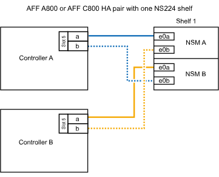

= 将 NS224 架连接到您的 ASA A800 或 ASA C800 系统
:allow-uri-read: 
:icons: font
:imagesdir: ../media/

[role="lead"]
将 NS224 磁盘架连接到 ASA A800 或 ASA C800 系统，以便每个磁盘架与 HA 对中的每个控制器具有两个连接。

.步骤
. 如果要在每个控制器上使用一组支持RoCE的端口(一个支持RoCE的PCIe卡)热添加一个磁盘架、并且这是HA对中唯一的NS224磁盘架、请完成以下子步骤。
+
否则，请转至下一步。

+

NOTE: 此步骤假定您已在插槽 5 中安装支持 RoCE 的 PCIe 卡。

+
.. 使用缆线将磁盘架NSM A端口e0a连接到控制器A插槽5端口A (e5a)。
.. 使用缆线将磁盘架NSM A端口e0b连接到控制器B插槽5端口b (e5b)。
.. 使用缆线将磁盘架NSM B端口e0a连接到控制器B插槽5端口A (e5a)。
.. 使用缆线将磁盘架NSM B端口e0b连接到控制器A插槽5端口b (e5b)。
+
下图显示了在每个控制器上使用一个支持RoCE的PCIe卡为一个热添加磁盘架布线：

+

. 如果要在每个控制器上使用两组支持RoCE的端口(两个支持RoCE的PCIe卡)热添加一个或两个磁盘架、请完成相应的子步骤。
+

NOTE: 此步骤假定您已在插槽 5 和插槽 3 中安装了支持 RoCE 的 PCIe 卡。

+
[cols="1,3"]
|===
| 磁盘架 | 布线 

 a| 
磁盘架 1
 a| 

NOTE: 这些子步骤假定您正在通过将磁盘架端口 e0a 连接到插槽 5 中支持 RoCE 的 PCIe 卡（而不是插槽 3 ）来开始布线。

.. 使用缆线将NSM A端口e0a连接到控制器A插槽5端口A (e5a)。
.. 使用缆线将NSM A端口e0b连接到控制器B插槽3端口b (e3b)。
.. 使用缆线将NSM B端口e0a连接到控制器B插槽5端口A (e5a)。
.. 使用缆线将NSM B端口e0b连接到控制器A插槽3端口b (e3b)。
.. 如果您要快速添加第二个搁板，请完成“`搁板 2`”子步骤；否则，请转到下一步。

 a| 
磁盘架 2
 a| 

NOTE: 这些子步骤假定您开始使用缆线将磁盘架端口 e0a 连接到插槽 3 中支持 RoCE 的 PCIe 卡，而不是插槽 5 （与磁盘架 1 的布线子步骤相关）。

.. 使用缆线将NSM A端口e0a连接到控制器A插槽3端口A (E3A)。
.. 使用缆线将NSM A端口e0b连接到控制器B插槽5端口b (e5b)。
.. 使用缆线将NSM B端口e0a连接到控制器B插槽3端口A (E3A)。
.. 使用缆线将NSM B端口e0b连接到控制器A插槽5端口b (e5b)。
.. 转至下一步。

|===
+
下图显示了两个热添加磁盘架的布线：

+
image::../media/drw_ns224_a800_c800_2shelves_IEOPS-966.svg[DRW nss224 a800 c800 2个磁盘架IEOPS 96696]

. 使用验证热添加磁盘架的布线是否正确 https://mysupport.netapp.com/site/tools/tool-eula/activeiq-configadvisor["Active IQ Config Advisor"^]。
+
如果生成任何布线错误，请按照提供的更正操作进行操作。

.下一步行动
如果在此过程的准备过程中禁用了自动驱动器分配，则需要手动分配驱动器所有权，然后在需要时重新启用自动驱动器分配。转到 link:hot-add-asa-complete.html["完成热添加"]。

否则、您将完成热添加磁盘架过程。
