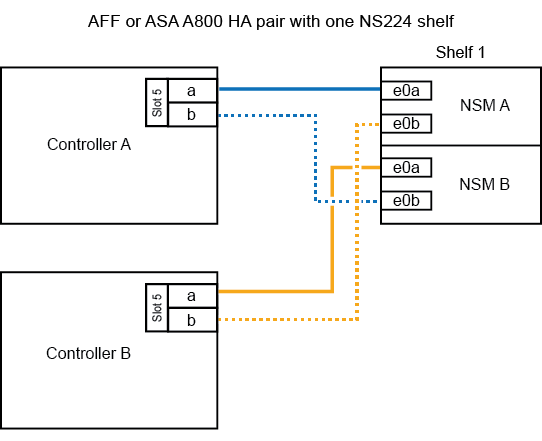
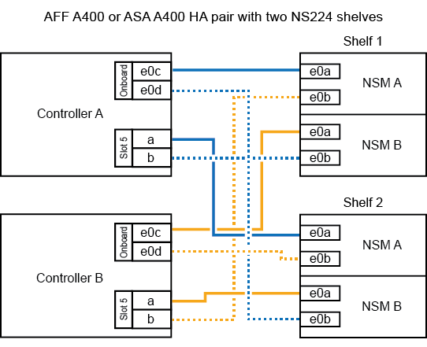
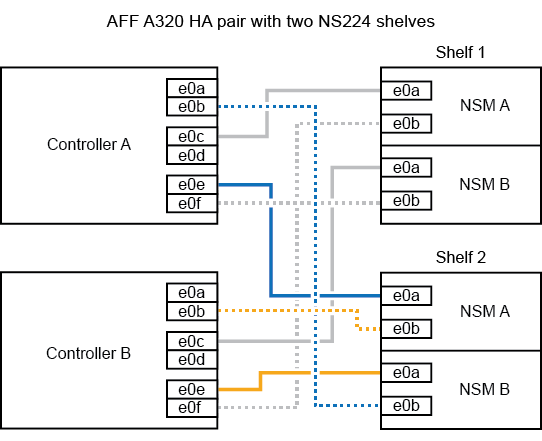

= 热添加磁盘架—NS224磁盘架
:allow-uri-read: 
:icons: font
:imagesdir: ../media/

[role="lead"]
您可以在 HA 对满足特定要求后以及完成适用于 HA 对的准备任务后热添加 NS224 驱动器架。

== 热添加的要求

热添加 NS224 驱动器架之前， HA 对必须满足特定要求。

* 您的平台型号和 ONTAP 版本必须支持您要热添加的 NS224 磁盘架和驱动器。
+
https://hwu.netapp.com["NetApp Hardware Universe"^]

* 要连接磁盘架，必须具有正确数量和类型的缆线。
+
https://hwu.netapp.com["NetApp Hardware Universe"^]

* HA 对必须具有足够的可用 RoCE 端口，以支持您要热添加的磁盘架数量。
+
For each shelf you are hot-adding, you need a minimum of two RoCE capable ports on each controller.这些端口可以位于控制器板上，支持 RoCE 的 PCIe 卡上，两者的组合，也可以位于支持 RoCE 的 I/O 模块上，这一点受您的平台型号支持。

+
如果 HA 对没有足够的可用 RoCE 端口，并且您的平台型号支持使用支持 RoCE 的 PCIe 卡或 I/O 模块，则必须已将额外的卡或 I/O 模块安装到您的平台型号支持的正确控制器插槽中。

+
https://hwu.netapp.com["NetApp Hardware Universe"^]

+
[NOTE]
====
必须配置不支持 RoCE 的专用端口以供存储使用（而不是用于网络连接）。

<<准备不支持 RoCE 的专用端口以进行热添加>>

====
* 如果您有 AFF A700 HA 对，并且要热添加初始 NS224 驱动器架（ HA 对中不存在 NS224 驱动器架），则必须在每个控制器中安装核心转储模块（ X9170A ， NVMe 1 TB SSD ）以支持核心转储（存储核心文件）。
+
link:../fas9000/caching-module-and-core-dump-module-replace.html["更换缓存模块或添加 / 更换核心转储模块— AFF A700 和 FAS9000"^]

* HA 对中的磁盘架数量必须小于支持的最大磁盘架数量，至少等于您计划热添加的磁盘架数量。
+
热添加磁盘架后，不能超过 HA 对支持的最大磁盘架数。

+
https://hwu.netapp.com["NetApp Hardware Universe"^]

* 如果要将磁盘架热添加到已具有 NS224 磁盘架的 HA 对，则 HA 对不能显示任何存储布线错误消息，并且必须将其作为多路径 HA 进行布线。
+
您可以运行 Active IQ Config Advisor 来查看任何存储布线错误消息以及应采取的更正操作。

+
https://mysupport.netapp.com/site/tools/tool-eula/activeiq-configadvisor["NetApp 下载： Config Advisor"^]

* 您需要一个带一端直发的回形针或一个窄尖圆头笔。
+
要更改磁盘架 ID ，请使用回形针或笔形笔访问操作显示面板（ OperatorDisplay Panel" ， ODP-A ）后面的磁盘架 ID 按钮。

== 热添加注意事项

在热添加 NS224 驱动器架之前，您应熟悉此操作步骤的最佳实践和相关方面。

* 如果您的 ASA HA 对支持 NS224 磁盘架，则可以使用此操作步骤。
* * 最佳实践： * 最佳实践是，在热添加磁盘架之前安装最新版本的磁盘认证包（ DQP ）。
+
安装最新版本的 DQP 后，您的系统便可识别和使用新认证的驱动器。这样可以避免出现有关驱动器信息不最新以及由于无法识别驱动器而阻止驱动器分区的系统事件消息。DQP 还会通知您驱动器固件不是最新的。

+
https://mysupport.netapp.com/site/downloads/firmware/disk-drive-firmware/download/DISKQUAL/ALL/qual_devices.zip["NetApp 下载：磁盘认证包"^]

* * 最佳实践： * 最佳实践是在热添加磁盘架前后运行 Active IQ Config Advisor 。
+
在热添加磁盘架之前运行 Active IQ Config Advisor 可快速了解现有磁盘架以太网（ ENET ）连接，验证 NVMe 磁盘架模块（ NSM ）固件版本，并允许您验证 HA 对中已在使用的磁盘架 ID 。通过在热添加磁盘架后运行 Active IQ Config Advisor ，您可以验证磁盘架布线是否正确以及磁盘架 ID 在 HA 对中是否唯一。

+
https://mysupport.netapp.com/site/tools/tool-eula/activeiq-configadvisor["NetApp 下载： Config Advisor"^]

* * 最佳实践： * 最佳实践是，在添加新磁盘架之前，系统上应安装最新版本的 NVMe 磁盘架模块（ NSM ）固件和驱动器固件。
+
https://mysupport.netapp.com/site/downloads/firmware/disk-shelf-firmware["NetApp 下载：磁盘架固件"^]

+
https://mysupport.netapp.com/site/downloads/firmware/disk-drive-firmware["NetApp 下载：磁盘驱动器固件"^]

+

NOTE: 请勿将固件还原到不支持您的磁盘架及其组件的版本。

* 为热添加的磁盘架布线后， ONTAP 将识别该磁盘架：
+
** 如果启用了自动驱动器分配，则会分配驱动器所有权。
** 如果需要，应自动更新 NSM 磁盘架固件和驱动器固件。
+

NOTE: 固件更新可能需要长达 30 分钟。

== 准备热添加

在热添加 NS224 驱动器架之前，您必须完成适用于 HA 对的准备任务。

=== 准备不支持 RoCE 的专用端口以进行热添加

如果您的 HA 对具有不支持 RoCE 的专用端口，而您要使用这些端口热添加 NS224 驱动器架，则必须确保这些端口已配置为用于存储（而不是用于网络连接）。根据您的平台型号，支持 RoCE 的端口位于控制器板上，支持 RoCE 的 PCIe 卡上，两者的组合或支持 RoCE 的 I/O 模块上。

.开始之前
您必须已满足系统要求。

<<热添加的要求>>

.关于此任务
* 对于某些平台型号，如果在控制器上受支持的插槽中安装了支持 RoCE 的 PCIe 卡或 I/O 模块，则这些端口会自动默认为存储使用（而不是网络连接）；但是，建议您完成此操作步骤以验证是否已将支持 RoCE 的端口配置为存储使用。
* 如果您确定 HA 对中不支持 RoCE 的专用端口未配置为存储使用，则配置这些端口是无中断操作步骤。
+

NOTE: 如果 HA 对运行的是 ONTAP 9.6 版，则需要重新启动控制器，一次重新启动一个控制器。

+

NOTE: 如果 HA 对运行的是 ONTAP 9.7 或更高版本，则无需重新启动控制器，除非一个或两个控制器均处于维护模式。此操作步骤假定两个控制器均未处于维护模式。

.步骤
. 验证 HA 对中的非专用端口是否已配置为存储使用： `storage port show`
+
您可以在任一控制器模块上输入命令。

+
如果 HA 对运行的是 ONTAP 9.8 或更高版本，则非专用端口在 `Mode` 列中显示 `storage` 。

+
如果 HA 对运行的是 ONTAP 9.7 或 9.6 ，则非专用端口会在 `is dedicated ？` 中显示 `false` 列中，也会在 `State` 列中显示 `enabled` 。

. 如果配置了非专用端口以供存储使用，则可以使用此操作步骤。
+
否则，您需要完成步骤 3 到步骤 6 来配置端口。

+
[NOTE]
====
如果未配置非专用端口以供存储使用，则命令输出将显示以下内容：

如果 HA 对运行的是 ONTAP 9.8 或更高版本，则非专用端口会在 `Mode` 列中显示 `network` 。

如果 HA 对运行的是 ONTAP 9.7 或 9.6 ，则非专用端口会在 `is dedicated ？`` 中显示 `false` 列中，也会在 `State` 列中显示 `d已标记` 。

====
. 在其中一个控制器模块上配置非专用端口以供存储使用：
+
您必须对要配置的每个端口重复适用的命令。

+
[cols="1,3"]
|===
| 如果 HA 对正在运行 ... | 那么 ... 

 a| 
ONTAP 9.8 或更高版本
 a| 
`storage port modify -node node name -port port name -mode storage`

 a| 
ONTAP 9.7 或 9.6
 a| 
`storage port enable -node node name -port port port name`

|===
. 如果 HA 对运行的是 ONTAP 9.6 ，请重新启动控制器模块以使端口更改生效： `ssystem node reboot -node node name -reason reason for the reboot`
+
否则，请转至下一步。

+

NOTE: 重新启动可能需要长达 15 分钟。

. 对第二个控制器模块重复步骤：
+
[cols="1,3"]
|===
| 如果 HA 对正在运行 ... | 那么 ... 

 a| 
ONTAP 9.7 或更高版本
 a| 
.. 重复步骤 3 。
.. 转至步骤 6. 。

 a| 
ONTAP 9.6
 a| 
.. 重复步骤 3 和 4 。
+

NOTE: 第一个控制器必须已完成重新启动。

.. 转至步骤 6. 。

|===
. 验证是否已为两个控制器模块上的非专用端口配置用于存储： `storage port show`
+
您可以在任一控制器模块上输入命令。

+
如果 HA 对运行的是 ONTAP 9.8 或更高版本，则非专用端口在 `Mode` 列中显示 `storage` 。

+
如果 HA 对运行的是 ONTAP 9.7 或 9.6 ，则非专用端口会在 `is dedicated ？` 中显示 `false` 列中，也会在 `State` 列中显示 `enabled` 。

=== 准备 AFF A700 ， AFF A800 或 AFF A400 HA 对以热添加第二个磁盘架

如果您的 AFF A700 ， AFF A800 或 AFF A400 HA 对具有一个 NS224 驱动器架，并通过缆线连接到每个控制器上一组支持 RoCE 的端口，则必须重新对该磁盘架进行布线（在安装了其他支持 RoCE 的 PCIe 卡或 I/O 模块之后） 在热添加第二个磁盘架之前，请在每个控制器上的两组端口之间执行此操作。

.开始之前
* 您必须已满足系统要求。
+
<<热添加的要求>>

* 您必须已启用您安装的支持 RoCE 的 PCIe 卡或 I/O 模块上的端口。
+
<<准备不支持 RoCE 的专用端口以进行热添加>>

.关于此任务
* 如果您的磁盘架具有多路径 HA 连接，则为端口连接重新布线是一种无中断操作步骤。
+
您可以在每个控制器上的两组端口之间重新对第一个磁盘架进行布线，以便在热添加第二个磁盘架时，这两个磁盘架的连接弹性都更高。

* 在此操作步骤期间，一次移动一根缆线，以始终保持与磁盘架的连接。

.步骤
. 根据您的平台型号，在每个控制器上的两组端口之间重新连接现有磁盘架的连接。
+

NOTE: 移动缆线无需等待从一个端口拔下缆线与将缆线插入另一个端口之间的时间。

+
[cols="1,3"]
|===
| 如果您有 ... | 那么 ... 

 a| 
AFF A700 HA 对
 a| 

NOTE: 这些子步骤假定已将现有磁盘架连接到每个控制器上插槽 3 中支持 RoCE 的 I/O 模块。

[NOTE]
====
如果需要，您可以参考两个磁盘架配置中显示现有单个磁盘架和已重新布线的磁盘架的布线图。

<<为 AFF A700 HA 对的热添加磁盘架布线>>

====
.. 在控制器 A 上，将缆线从插槽 3 端口 b （ e3b ）移至插槽 7 端口 b （ e7b ）。
.. 对控制器 B 重复相同的缆线移动操作

 a| 
AFF A800 HA 对
 a| 

NOTE: 这些子步骤假定已将现有磁盘架连接到每个控制器上插槽 5 中支持 RoCE 的 PCIe 卡。

[NOTE]
====
如果需要，您可以参考两个磁盘架配置中显示现有单个磁盘架和已重新布线的磁盘架的布线图。

<<为 AFF A800 HA 对的热添加磁盘架布线>>

====
.. 在控制器 A 上，将缆线从插槽 5 端口 b （ e5b ）移至插槽 3 端口 b （ e3b ）。
.. 对控制器 B 重复相同的缆线移动操作

 a| 
AFF A400 HA 对
 a| 
[NOTE]
====
如果需要，您可以参考两个磁盘架配置中显示现有单个磁盘架和已重新布线的磁盘架的布线图。

<<为 AFF A400 HA 对的热添加磁盘架布线>>

====
.. 在控制器 A 上，将缆线从端口 e0d 移至插槽 5 端口 b （ e5b ）。
.. 对控制器 B 重复相同的缆线移动操作

|===
. 验证重新连接的磁盘架是否已正确布线。
+
如果生成任何布线错误，请按照提供的更正操作进行操作。

+
https://mysupport.netapp.com/site/tools/tool-eula/activeiq-configadvisor["NetApp 下载： Config Advisor"^]

=== 准备手动分配驱动器所有权以进行热添加

如果要为要热添加的 NS224 驱动器架手动分配驱动器所有权，则需要禁用自动驱动器分配（如果已启用）。

.开始之前
您必须已满足系统要求。

<<热添加的要求>>

.关于此任务
如果磁盘架中的驱动器将由 HA 对中的两个控制器模块拥有，则需要手动分配驱动器所有权。

.步骤
. 验证是否已启用自动驱动器分配： `storage disk option show`
+
您可以在任一控制器模块上输入命令。

+
如果启用了自动驱动器分配，则输出会在 `Auto Assign` 列中显示 `on` （对于每个控制器模块）。

. 如果启用了自动驱动器分配，请将其禁用： `storage disk option modify -node node_name -autodassign off`
+
您必须在两个控制器模块上禁用自动驱动器分配。

== 安装驱动器架以进行热添加

安装新的 NS224 驱动器架涉及到将磁盘架安装到机架或机柜中，连接电源线（自动打开磁盘架电源），然后设置磁盘架 ID 。

.开始之前
* 您必须已满足系统要求。
+
<<热添加的要求>>

* 您必须已完成适用的准备过程。
+
<<准备热添加>>

.步骤
. 使用磁盘架随附的安装宣传单安装磁盘架随附的导轨安装套件。
+

NOTE: 请勿使用法兰安装磁盘架。

. 使用安装宣传单将磁盘架安装并固定到支架以及机架或机柜上。
+

NOTE: 满载的 NS224 磁盘架的重量最多可达 66.78 磅（ 30.29 千克），需要两个人抬起或使用液压升降机。请避免移除磁盘架组件（从磁盘架前部或后部）以减少磁盘架重量，因为磁盘架重量会变得不平衡。

. 将电源线连接到磁盘架，使用电源线固定器将其固定，然后将电源线连接到不同的电源以提高故障恢复能力。
+
连接到电源时，磁盘架将通电；它没有电源开关。正常运行时，电源的双色 LED 将呈绿色亮起。

. 将磁盘架 ID 设置为 HA 对中唯一的数字：
+
有关更多详细说明，请参见：

+
link:change-shelf-id.html["更改磁盘架 ID — NS224 磁盘架"^]

+
.. 拆下左端盖，找到 LED 右侧的小孔。
.. 将回形针或类似工具的一端插入小孔中，以到达磁盘架 ID 按钮。
.. 按住按钮（最长 15 秒），直到数字显示屏上的第一个数字闪烁，然后释放按钮。
+

NOTE: 如果此 ID 闪烁所需时间超过 15 秒，请再次按住此按钮，确保一直按此按钮。

.. 按下并释放此按钮可将此数字向前移动，直到达到所需数字 0 到 9 为止。
.. 重复子步骤 4c 和 4d 以设置磁盘架 ID 的第二个数字。
+
此数字可能需要长达三秒（而不是 15 秒）的时间才会闪烁。

.. 按住按钮，直到第二个数字停止闪烁。
+
大约 5 秒钟后，两个数字开始闪烁，并且耗时值上的琥珀色 LED 亮起。

.. 重新启动磁盘架以使磁盘架 ID 生效。
+
您必须从磁盘架上拔下两根电源线，等待 10 秒，然后重新插入。

+
电源恢复供电后，其双色 LED 将呈绿色亮起。

== 为驱动器架布线以进行热添加

You cable each NS224 drive shelf you are hot-adding so that each shelf has two connections to each controller module in the HA pair.根据您要热添加的磁盘架数量以及您的平台型号，您可以在控制器板上，支持 RoCE 的 PCIe 卡上，两者的组合或支持 RoCE 的 I/O 模块上使用支持 RoCE 的端口。

=== 为热添加布线时的注意事项

在为热添加的磁盘架布线之前，熟悉正确的缆线连接器方向以及 NS224 NSM 驱动器磁盘架模块上端口的位置和标记会很有帮助。

* 插入缆线时，连接器拉片朝上。
+
正确插入缆线后，它会卡入到位。

+
连接缆线的两端后，磁盘架和控制器端口 LNK （绿色） LED 将亮起。如果端口 LNK LED 不亮，请重新拔插缆线。

+
image::../media/oie_cable_pull_tab_up.png[OIE 缆线拉片向上]

* 您可以使用下图帮助您以物理方式识别磁盘架 NSM 端口 e0a 和 e0b ：
+
image::../media/drw_ns224_back_ports.png[DRW nss224 后端端口]

=== 为 AFF A900 HA 对的热添加磁盘架布线

如果需要更多存储，您可以将最多三个额外的 NS224 驱动器架（总共四个磁盘架）热添加到一个 AFF A900 HA 对中。

.开始之前
* 您必须已满足系统要求。
+
<<热添加的要求>>

* 您必须已完成适用的准备过程。
+
<<准备热添加>>

* 您必须已安装磁盘架，打开其电源并设置磁盘架 ID 。
+
<<安装驱动器架以进行热添加>>

.关于此任务
* 此操作步骤假定您的 HA 对至少具有一个现有 NS224 磁盘架，并且您要热添加最多三个额外的磁盘架。
* 如果您的 HA 对只有一个现有 NS224 磁盘架，则此操作步骤会假定该磁盘架已通过缆线连接到每个控制器上两个支持 RoCE 的 100GbE I/O 模块。

.步骤
. 如果要热添加的 NS224 磁盘架是 HA 对中的第二个 NS224 磁盘架，请完成以下子步骤。
+
否则，请转至下一步。

+
.. 使用缆线将磁盘架 NSM A 端口 e0a 连接到控制器 A 插槽 10 端口 A （ E10A ）。
.. 使用缆线将磁盘架 NSM A 端口 e0b 连接到控制器 B 插槽 2 端口 b （ e2b ）。
.. 使用缆线将磁盘架 NSM B 端口 e0a 连接到控制器 B 插槽 10 端口 A （ E10A ）。
.. 使用缆线将磁盘架 NSM B 端口 e0b 连接到控制器 A 插槽 2 端口 b （ e2b ）。

+
下图显示了第二个磁盘架的布线（以及第一个磁盘架）。

+
image::../media/drw_ns224_a900_2shelves.png[DRW nss224 a900 2 个磁盘架]

. 如果要热添加的 NS224 磁盘架是 HA 对中的第三个 NS224 磁盘架，请完成以下子步骤。
+
否则，请转至下一步。

+
.. 使用缆线将磁盘架 NSM A 端口 e0a 连接到控制器 A 插槽 1 端口 A （ e1a ）。
.. 使用缆线将磁盘架 NSM A 端口 e0b 连接到控制器 B 插槽 11 端口 b （ e11b ）。
.. 使用缆线将磁盘架 NSM B 端口 e0a 连接到控制器 B 插槽 1 端口 A （ e1a ）。
.. 使用缆线将磁盘架 NSM B 端口 e0b 连接到控制器 A 插槽 11 端口 b （ e11b ）。
+
下图显示了第三个磁盘架的布线。

+
image::../media/drw_ns224_a900_3shelves.png[DRW nss224 a900 3 个磁盘架]

. 如果要热添加的 NS224 磁盘架是 HA 对中的第四个 NS224 磁盘架，请完成以下子步骤。
+
否则，请转至下一步。

+
.. 使用缆线将磁盘架 NSM A 端口 e0a 连接到控制器 A 插槽 11 端口 A （ e11a ）。
.. 使用缆线将磁盘架 NSM A 端口 e0b 连接到控制器 B 插槽 1 端口 b （ e1b ）。
.. 使用缆线将磁盘架 NSM B 端口 e0a 连接到控制器 B 插槽 11 端口 A （ e11a ）。
.. Cable shelf NSM B port e0b to controller A slot 1 port b (e1b).
+
下图显示了第四个磁盘架的布线。

+
image::../media/drw_ns224_a900_4shelves.png[DRW nss224 a900 4 个磁盘架]

. 验证热添加磁盘架的布线是否正确。
+
如果生成任何布线错误，请按照提供的更正操作进行操作。

+
https://mysupport.netapp.com/site/tools/tool-eula/activeiq-configadvisor["NetApp 下载： Config Advisor"]

. 如果在准备此操作步骤时禁用了自动驱动器分配，则需要手动分配驱动器所有权，然后根据需要重新启用自动驱动器分配。
+
否则，您将使用此操作步骤。

+
<<完成热添加>>

=== 为 FAS500f 或 AFF A250 HA 对的热添加磁盘架布线

如果需要更多存储，您可以将 NS224 驱动器架热添加到 FAS500f 或 AFF A250 HA 对中。

.开始之前
* 您必须已满足系统要求。
+
<<热添加的要求>>

* 您必须已完成适用的准备过程。
+
<<准备热添加>>

* 您必须已安装磁盘架，打开其电源并设置磁盘架 ID 。
+
<<安装驱动器架以进行热添加>>

.关于此任务
从平台机箱背面看，左侧支持 RoCE 的卡端口为端口 "A" （ e1a ），右侧端口为端口 "b" （ e1b ）。

.步骤
. 为磁盘架连接布线：
+
.. 使用缆线将磁盘架 NSM A 端口 e0a 连接到控制器 A 插槽 1 端口 A （ e1a ）。
.. 使用缆线将磁盘架 NSM A 端口 e0b 连接到控制器 B 插槽 1 端口 b （ e1b ）。
.. 使用缆线将磁盘架 NSM B 端口 e0a 连接到控制器 B 插槽 1 端口 A （ e1a ）。
.. 使用缆线将磁盘架 NSM B 端口 e0b 连接到控制器 A 插槽 1 端口 b （ e1b ）。+ 下图显示了完成后的磁盘架布线。
+
image::../media/drw_ns224_aff250_fas500f_1shelf.png[DRW nss224 aff250 fas500f 1 个磁盘架]

. 验证热添加磁盘架的布线是否正确。
+
如果生成任何布线错误，请按照提供的更正操作进行操作。

+
https://mysupport.netapp.com/site/tools/tool-eula/activeiq-configadvisor["NetApp 下载： Config Advisor"^]

. 如果在准备此操作步骤时禁用了自动驱动器分配，则需要手动分配驱动器所有权，然后根据需要重新启用自动驱动器分配。
+
否则，您将使用此操作步骤。

+
<<完成热添加>>

=== 为 AFF A700 HA 对的热添加磁盘架布线

如何为 AFF A700 HA 对中的 NS224 驱动器架布线取决于您要热添加的磁盘架数量以及控制器模块上使用的支持 RoCE 的端口集数量（一个或两个）。

.开始之前
* 您必须已满足系统要求。
+
<<热添加的要求>>

* 您必须已完成适用的准备过程。
+
<<准备热添加>>

* 您必须已安装磁盘架，打开其电源并设置磁盘架 ID 。
+
<<安装驱动器架以进行热添加>>

.步骤
. 如果要在每个控制器模块上使用一组支持 RoCE 的端口（一个支持 RoCE 的 I/O 模块）热添加一个磁盘架，而这是 HA 对中唯一的 NS224 磁盘架，请完成以下子步骤。
+
否则，请转至下一步。

+

NOTE: 此步骤假定您在每个控制器模块上的插槽 3 中安装了支持 RoCE 的 I/O 模块，而不是插槽 7 。

+
.. 使用缆线将磁盘架 NSM A 端口 e0a 连接到控制器 A 插槽 3 端口 a
.. 使用缆线将磁盘架 NSM A 端口 e0b 连接到控制器 B 插槽 3 端口 b
.. 使用缆线将磁盘架 NSM B 端口 e0a 连接到控制器 B 插槽 3 端口 a
.. 使用缆线将磁盘架 NSM B 端口 e0b 连接到控制器 A 插槽 3 端口 b
+
下图显示了在每个控制器模块中使用一个支持 RoCE 的 I/O 模块为一个热添加磁盘架布线：

+
image::../media/drw_ns224_a700_1shelf.png[DRW nss224 a700 1 个磁盘架]

. 如果要在每个控制器模块中使用两组支持 RoCE 的端口（两个支持 RoCE 的 I/O 模块）热添加一个或两个磁盘架，请完成相应的子步骤。
+
[cols="1,3"]
|===
| 磁盘架 | 布线 

 a| 
磁盘架 1
 a| 

NOTE: 这些子步骤假定您开始布线时使用的是将磁盘架端口 e0a 连接到插槽 3 中支持 RoCE 的 I/O 模块，而不是插槽 7 。

.. 使用缆线将 NSM A 端口 e0a 连接到控制器 A 插槽 3 端口 a
.. 使用缆线将 NSM A 端口 e0b 连接到控制器 B 插槽 7 端口 b
.. 使用缆线将 NSM B 端口 e0a 连接到控制器 B 插槽 3 端口 a
.. 使用缆线将 NSM B 端口 e0b 连接到控制器 A 插槽 7 端口 b
.. 如果要热添加第二个磁盘架，请完成 `Shelf 2` 子步骤；否则，请转至步骤 3 。

 a| 
磁盘架 2
 a| 

NOTE: 这些子步骤假定您开始布线时使用的是将磁盘架端口 e0a 连接到插槽 7 中支持 RoCE 的 I/O 模块，而不是插槽 3 （与磁盘架 1 的布线子步骤相关）。

.. 使用缆线将 NSM A 端口 e0a 连接到控制器 A 插槽 7 端口 a
.. 使用缆线将 NSM A 端口 e0b 连接到控制器 B 插槽 3 端口 b
.. 使用缆线将 NSM B 端口 e0a 连接到控制器 B 插槽 7 端口 a
.. 使用缆线将 NSM B 端口 e0b 连接到控制器 A 插槽 3 端口 b
.. 转至步骤 3 。

|===
+
下图显示了第一个和第二个热添加磁盘架的布线：

+
image::../media/drw_ns224_a700_2shelves.png[DRW nss224 a700 2 个磁盘架]

. 验证热添加磁盘架的布线是否正确。
+
如果生成任何布线错误，请按照提供的更正操作进行操作。

+
https://mysupport.netapp.com/site/tools/tool-eula/activeiq-configadvisor["NetApp 下载： Config Advisor"^]

. 如果在准备此操作步骤时禁用了自动驱动器分配，则需要手动分配驱动器所有权，然后根据需要重新启用自动驱动器分配。
+
否则，您将使用此操作步骤。

+
<<完成热添加>>

=== 为 AFF A800 HA 对的热添加磁盘架布线

如何为 AFF A800 HA 对中的 NS224 驱动器架布线取决于您要热添加的磁盘架数量以及控制器模块上使用的支持 RoCE 的端口集数量（一个或两个）。

.开始之前
* 您必须已满足系统要求。
+
<<热添加的要求>>

* 您必须已完成适用的准备过程。
+
<<准备热添加>>

* 您必须已安装磁盘架，打开其电源并设置磁盘架 ID 。
+
<<安装驱动器架以进行热添加>>

.步骤
. 如果要在每个控制器模块上使用一组支持 RoCE 的端口（一个支持 RoCE 的 PCIe 卡）热添加一个磁盘架，而这是 HA 对中唯一的 NS224 磁盘架，请完成以下子步骤。
+
否则，请转至下一步。

+

NOTE: 此步骤假定您已在插槽 5 中安装支持 RoCE 的 PCIe 卡。

+
.. 使用缆线将磁盘架 NSM A 端口 e0a 连接到控制器 A 插槽 5 端口 a
.. 使用缆线将磁盘架 NSM A 端口 e0b 连接到控制器 B 插槽 5 端口 b
.. 使用缆线将磁盘架 NSM B 端口 e0a 连接到控制器 B 插槽 5 端口 a
.. 使用缆线将磁盘架 NSM B 端口 e0b 连接到控制器 A 插槽 5 端口 b
+
下图显示了在每个控制器模块上使用一个支持 RoCE 的 PCIe 卡为一个热添加磁盘架布线：

+

. 如果要在每个控制器模块上使用两组支持 RoCE 的端口（两个支持 RoCE 的 PCIe 卡）热添加一个或两个磁盘架，请完成相应的子步骤。
+

NOTE: 此步骤假定您已在插槽 5 和插槽 3 中安装了支持 RoCE 的 PCIe 卡。

+
[cols="1,3"]
|===
| 磁盘架 | 布线 

 a| 
磁盘架 1
 a| 

NOTE: 这些子步骤假定您正在通过将磁盘架端口 e0a 连接到插槽 5 中支持 RoCE 的 PCIe 卡（而不是插槽 3 ）来开始布线。

.. 使用缆线将 NSM A 端口 e0a 连接到控制器 A 插槽 5 端口 a
.. 使用缆线将 NSM A 端口 e0b 连接到控制器 B 插槽 3 端口 b
.. 使用缆线将 NSM B 端口 e0a 连接到控制器 B 插槽 5 端口 a
.. 使用缆线将 NSM B 端口 e0b 连接到控制器 A 插槽 3 端口 b
.. 如果要热添加第二个磁盘架，请完成 `Shelf 2` 子步骤；否则，请转至步骤 3 。

 a| 
磁盘架 2
 a| 

NOTE: 这些子步骤假定您开始使用缆线将磁盘架端口 e0a 连接到插槽 3 中支持 RoCE 的 PCIe 卡，而不是插槽 5 （与磁盘架 1 的布线子步骤相关）。

.. 使用缆线将 NSM A 端口 e0a 连接到控制器 A 插槽 3 端口 a
.. 使用缆线将 NSM A 端口 e0b 连接到控制器 B 插槽 5 端口 b
.. 使用缆线将 NSM B 端口 e0a 连接到控制器 B 插槽 3 端口 a
.. 使用缆线将 NSM B 端口 e0b 连接到控制器 A 插槽 5 端口 b
.. 转至步骤 3 。

|===
+
下图显示了两个热添加磁盘架的布线：

+
image::../media/drw_ns224_a800_2shelves.png[DRW nss224 a800 2 个磁盘架]

. 验证热添加磁盘架的布线是否正确。
+
如果生成任何布线错误，请按照提供的更正操作进行操作。

+
https://mysupport.netapp.com/site/tools/tool-eula/activeiq-configadvisor["NetApp 下载： Config Advisor"^]

. 如果在准备此操作步骤时禁用了自动驱动器分配，则需要手动分配驱动器所有权，然后根据需要重新启用自动驱动器分配。
+
否则，您将使用此操作步骤。

+
<<完成热添加>>

=== 为 AFF A400 HA 对的热添加磁盘架布线

如何为 AFF A400 HA 对中的 NS224 驱动器架布线取决于您要热添加的磁盘架数量以及控制器模块上使用的支持 RoCE 的端口集数量（一个或两个）。

.开始之前
* 您必须已满足系统要求。
+
<<热添加的要求>>

* 您必须已完成适用的准备过程。
+
<<准备热添加>>

* 您必须已安装磁盘架，打开其电源并设置磁盘架 ID 。
+
<<安装驱动器架以进行热添加>>

.步骤
. 如果要在每个控制器模块上使用一组支持 RoCE 的端口（板载支持 RoCE 的端口）热添加一个磁盘架，而这是 HA 对中唯一的 NS224 磁盘架，请完成以下子步骤。
+
否则，请转至下一步。

+
.. 使用缆线将磁盘架 NSM A 端口 e0a 连接到控制器 A 端口 e0c 。
.. 使用缆线将磁盘架 NSM A 端口 e0b 连接到控制器 B 端口 e0d 。
.. 使用缆线将磁盘架 NSM B 端口 e0a 连接到控制器 B 端口 e0c 。
.. 使用缆线将磁盘架 NSM B 端口 e0b 连接到控制器 A 端口 e0d 。
+
下图显示了在每个控制器模块上使用一组支持 RoCE 的端口为一个热添加磁盘架布线：

+
image::../media/drw_ns224_a400_1shelf.png[DRW nss224 a400 1 个磁盘架]

. 如果要在每个控制器模块上使用两组支持 RoCE 的端口（板载端口和 PCIe 卡支持 RoCE 的端口）热添加一个或两个磁盘架，请完成以下子步骤。
+
[cols="1,3"]
|===
| 磁盘架 | 布线 

 a| 
磁盘架 1
 a| 
.. 使用缆线将 NSM A 端口 e0a 连接到控制器 A 端口 e0c 。
.. 使用缆线将 NSM A 端口 e0b 连接到控制器 B 插槽 5 端口 b
.. 使用缆线将 NSM B 端口 e0a 连接到控制器 B 端口 e0c 。
.. 使用缆线将 NSM B 端口 e0b 连接到控制器 A 插槽 5 端口 b
.. 如果要热添加第二个磁盘架，请完成 `Shelf 2` 子步骤；否则，请转至步骤 3 。

 a| 
磁盘架 2
 a| 
.. 使用缆线将 NSM A 端口 e0a 连接到控制器 A 插槽 5 端口 a
.. 使用缆线将 NSM A 端口 e0b 连接到控制器 B 端口 e0d 。
.. 使用缆线将 NSM B 端口 e0a 连接到控制器 B 插槽 5 端口 a
.. 使用缆线将 NSM B 端口 e0b 连接到控制器 A 端口 e0d 。
.. 转至步骤 3 。

|===
+
下图显示了两个热添加磁盘架的布线：

+

. 验证热添加磁盘架的布线是否正确。
+
如果生成任何布线错误，请按照提供的更正操作进行操作。

+
https://mysupport.netapp.com/site/tools/tool-eula/activeiq-configadvisor["NetApp 下载： Config Advisor"^]

. 如果在准备此操作步骤时禁用了自动驱动器分配，则需要手动分配驱动器所有权，然后根据需要重新启用自动驱动器分配。
+
否则，您将使用此操作步骤。

+
<<完成热添加>>

=== 为 AFF A320 HA 对的热添加磁盘架布线

需要额外存储时，可以使用缆线将另一个 NS224 驱动器架连接到现有 HA 对。

.开始之前
* 您必须已满足系统要求。
+
<<热添加的要求>>

* 您必须已完成适用的准备过程。
+
<<准备热添加>>

* 您必须已安装磁盘架，打开其电源并设置磁盘架 ID 。
+
<<安装驱动器架以进行热添加>>

.关于此任务
此操作步骤假定您的 AFF A320 HA 对具有现有 NS224 磁盘架，并且您要热添加第二个磁盘架。

.步骤
. 用缆线将磁盘架连接到控制器模块。
+
.. 使用缆线将 NSM A 端口 e0a 连接到控制器 A 端口 e0e 。
.. 使用缆线将 NSM A 端口 e0b 连接到控制器 B 端口 e0b 。
.. 使用缆线将 NSM B 端口 e0a 连接到控制器 B 端口 e0e 。
.. 使用缆线将 NSM B 端口 e0b 连接到控制器 A 端口 e0b 。+ 下图显示了热添加磁盘架（磁盘架 2 ）的布线：
+

. 验证热添加磁盘架的布线是否正确。
+
如果生成任何布线错误，请按照提供的更正操作进行操作。

+
https://mysupport.netapp.com/site/tools/tool-eula/activeiq-configadvisor["NetApp 下载： Config Advisor"^]

. 如果在准备此操作步骤时禁用了自动驱动器分配，则需要手动分配驱动器所有权，然后根据需要重新启用自动驱动器分配。
+
否则，您将使用此操作步骤。

+
<<完成热添加>>

== 完成热添加

如果在准备 NS224 驱动器架热添加时禁用了自动驱动器分配，则需要手动分配驱动器所有权，然后根据需要重新启用自动驱动器分配。

.开始之前
您必须已按照 HA 对的说明为磁盘架布线。

<<为驱动器架布线以进行热添加>>

.步骤
. 显示所有未分配的驱动器： `storage disk show -container-type unassigned`
+
您可以在任一控制器模块上输入命令。

. 分配每个驱动器： `storage disk assign -disk disk_name -owner owner_name`
+
您可以在任一控制器模块上输入命令。

+
您可以使用通配符一次分配多个驱动器。

. 如果需要，请重新启用自动驱动器分配： `storage disk option modify -node node_name -autodassign on`
+
您必须在两个控制器模块上重新启用自动驱动器分配。

