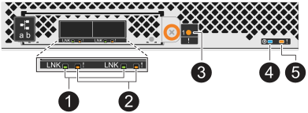

= 监控驱动器架LED—NS224磁盘架
:allow-uri-read: 
:icons: font
:imagesdir: ../media/

[role="lead"]
您可以通过了解驱动器架组件上LED的位置和状态条件来监控驱动器架的运行状况。

* 可以激活磁盘架操作员显示面板(ODP)和两个NSM上的位置(蓝色) LED、以帮助实际定位需要维修的磁盘架： `storage shelf location-led modify -shelf-name _shelf_name_ -led-status on`
+
如果您不知道受影响磁盘架的 ` _shelf_name_` ，请运行 `storage shelf show` 命令。

+
Location LEDs remain illuminated for 30 minutes.您可以输入相同的命令、但使用将其关闭 `off` 选项

* LED状态可以是：
+
** "On"(开)：LED指示灯稳定亮起
** "Off"(关)：LED未亮起
** "闪烁"：LED会根据FRU状态以不同的间隔打开和关闭
** "any state"(任何状态)：LED可以是"on"(开)、"off"(关)或"Blink"(闪烁)

== 操作员显示面板 LED

驱动器架前操作员显示面板(ODP)上的LED指示驱动器架是否正常运行或硬件存在问题。

下图和下表介绍了ODP上的三个LED：

image::../media/drw_ns224_odp_leds_IEOPS-1262.svg[操作员显示面板 LED]

[cols="1,2,1,5"]
|===
| LED 图标 | LED名称和颜色 | State | Description 

 a| 
image::../media/drw_sas_power_icon.svg[操作员显示面板电源LED]
 a| 
电源(绿色)
 a| 
开启
 a| 
一个或多个电源正在为驱动器架供电。

 a| 
image::../media/drw_sas_fault_icon.svg[操作员显示面板警示LED]
 a| 
注意(琥珀色)
 a| 
开启
 a| 
* 多个磁盘架CRU之一的功能出现错误。
+
检查事件消息以确定要采取的更正操作。

* 如果两位数的磁盘架ID也在闪烁、则表示磁盘架ID处于待定状态。
+
关闭并重新启动驱动器架、以使磁盘架ID生效。

 a| 
image::../media/drw_sas3_location_icon.svg[操作员显示面板位置LED]
 a| 
位置(蓝色)
 a| 
开启
 a| 
系统管理员激活了此LED功能。

|===

== NSM LED

NSM上的LED指示该模块是否正常运行、是否已准备好处理I/O流量以及硬件是否存在任何问题。

下图和表格介绍了与模块功能以及模块上每个NVMe端口的功能相关的NSM LED。

[role="tabbed-block"]
====
.NSM100模块
--
image::../media/drw_ns224_nsm_leds_IEOPS-1270.svg[NS224 NSM100模块LED]

[cols="1,1,2,4"]
|===
| 呼出 | LED 图标 | 颜色 | Description 

 a| 
image:../media/icon_round_1.png["标注编号1"]
 a| 
image::../media/drw_sas3_location_icon.svg[操作员显示面板位置LED]
 a| 
蓝色
 a| 
NSM：位置

 a| 
image:../media/icon_round_2.png["标注编号2"]
 a| 
image::../media/drw_sas_fault_icon.svg[操作员显示面板警示LED]
 a| 
琥珀色
 a| 
NSM：注意

 a| 
image:../media/icon_round_3.png["标注编号3"]
 a| 
LNK
 a| 
绿色
 a| 
NVMe端口/链路：状态

 a| 
image:../media/icon_round_4.png["标注编号4"]
 a| 
image::../media/drw_sas_fault_icon.svg[操作员显示面板警示LED]
 a| 
琥珀色
 a| 
NVMe端口/链路：注意

|===
[cols="2,1,1,1"]
|===
| Status | NSM警示(琥珀色) | 端口LNK (绿色) | 端口警示(琥珀色) 

 a| 
NSM正常
 a| 
关闭
 a| 
任何状态
 a| 
关闭

 a| 
NSM故障
 a| 
开启
 a| 
任何状态
 a| 
任何状态

 a| 
NSM VPD错误
 a| 
开启
 a| 
任何状态
 a| 
任何状态

 a| 
无主机端口连接
 a| 
任何状态
 a| 
关闭
 a| 
关闭

 a| 
主机端口连接链路处于活动状态
 a| 
任何状态
 a| 
活动时亮起/闪烁
 a| 
任何状态

 a| 
主机端口连接出现故障
 a| 
开启
 a| 
如果所有车道都发生故障、则打开/关闭
 a| 
开启

 a| 
开机后从BIOS映像启动BIOS
 a| 
闪烁
 a| 
任何状态
 a| 
任何状态

|===
--
.NSM100B模块
--

[cols="1,1,2,4"]
|===
| 呼出 | LED 图标 | 颜色 | Description 

 a| 
image:../media/icon_round_1.png["标注编号1"]
 a| 
LNK
 a| 
绿色
 a| 
NVMe端口/链路：状态

 a| 
image:../media/icon_round_2.png["标注编号2"]
 a| 
image::../media/drw_sas_fault_icon.svg[操作员显示面板警示LED]
 a| 
琥珀色
 a| 
NVMe端口/链路：注意

 a| 
image:../media/icon_round_3.png["标注编号3"]
 a| 
image::../media/drw_sas_fault_icon.svg[操作员显示面板警示LED]
 a| 
琥珀色
 a| 
I/O模块：注意

 a| 
image:../media/icon_round_4.png["标注编号4"]
 a| 
image::../media/drw_sas3_location_icon.svg[操作员显示面板位置LED]
 a| 
蓝色
 a| 
NSM：位置

 a| 
image:../media/icon_round_5.png["标注编号5"]
 a| 
image::../media/drw_sas_fault_icon.svg[操作员显示面板警示LED]
 a| 
琥珀色
 a| 
NSM：注意

|===
[cols="2,1,1,1,1"]
|===
| Status | NSM警示(琥珀色) | 端口LNK (绿色) | 端口警示(琥珀色) | I/O模块注意 

 a| 
NSM正常
 a| 
关闭
 a| 
任何状态
 a| 
关闭
 a| 
关闭

 a| 
NSM故障
 a| 
开启
 a| 
任何状态
 a| 
任何状态
 a| 
关闭

 a| 
NSM VPD错误
 a| 
开启
 a| 
任何状态
 a| 
任何状态
 a| 
关闭

 a| 
无主机端口连接
 a| 
任何状态
 a| 
关闭
 a| 
关闭
 a| 
关闭

 a| 
主机端口连接链路处于活动状态
 a| 
任何状态
 a| 
活动时亮起/闪烁
 a| 
任何状态
 a| 
关闭

 a| 
主机端口连接出现故障
 a| 
开启
 a| 
如果所有车道都发生故障、则打开/关闭
 a| 
开启
 a| 
关闭

 a| 
开机后从BIOS映像启动BIOS
 a| 
闪烁
 a| 
任何状态
 a| 
任何状态
 a| 
关闭

 a| 
I/O模块缺失
 a| 
开启
 a| 
不适用
 a| 
不适用
 a| 
开启

|===
--
====

== 电源 LED

交流或直流电源(PSU)上的LED指示PSU是否正常工作或存在硬件问题。

下图和表格介绍了PSU上的LED。(图中所示为交流PSU；但是、直流PSU上的LED位置相同)：

image::../media/drw_ns224_psu_leds_IEOPS-1261.svg[电源设备电源活动LED]

[cols="1,4"]
|===
| 呼出 | Description 

 a| 
image:../media/icon_round_1.png["标注编号1"]
 a| 
双色LED指示灯呈绿色时指示电源/活动、呈红色时指示故障。

|===
[cols="2,1,1"]
|===
| Status | 电源/活动(绿色) | 注意(红色) 

 a| 
盘柜没有交流/直流电源
 a| 
关闭
 a| 
关闭

 a| 
PSU没有交流/直流电源
 a| 
关闭
 a| 
开启

 a| 
交流/直流电源打开、但PSU不在机箱中
 a| 
闪烁
 a| 
关闭

 a| 
PSU运行正常
 a| 
开启
 a| 
关闭

 a| 
PSU故障
 a| 
关闭
 a| 
开启

 a| 
风扇故障
 a| 
关闭
 a| 
开启

 a| 
固件更新模式
 a| 
闪烁
 a| 
关闭

|===

== 驱动器LED

NVMe驱动器上的LED指示灯可指示其是否正常运行或硬件是否存在问题。

下图和下表介绍了NVMe驱动器上的两个LED：

image::../media/drw_ns224_drive_leds_IEOPS-1263.svg[NVMe驱动器警示和电源LED]

[cols="1,2,2"]
|===
| 呼出 | LED name | 颜色 

 a| 
image:../media/icon_round_1.png["标注编号1"]
 a| 
注意
 a| 
琥珀色

 a| 
image:../media/icon_round_2.png["标注编号2"]
 a| 
电源/活动
 a| 
绿色

|===
[cols="2,1,1,1"]
|===
| Status | 电源/活动(绿色) | 注意(琥珀色) | 关联的ODP LED 

 a| 
驱动器已安装且正常运行
 a| 
活动时亮起/闪烁
 a| 
任何状态
 a| 
不适用

 a| 
驱动器故障
 a| 
活动时亮起/闪烁
 a| 
开启
 a| 
注意(琥珀色)

 a| 
SES设备标识集
 a| 
活动时亮起/闪烁
 a| 
闪烁
 a| 
警示(琥珀色)熄灭

 a| 
SES设备故障位设置
 a| 
活动时亮起/闪烁
 a| 
开启
 a| 
注意(琥珀色)

 a| 
电源控制电路故障
 a| 
关闭
 a| 
任何状态
 a| 
注意(琥珀色)

|===