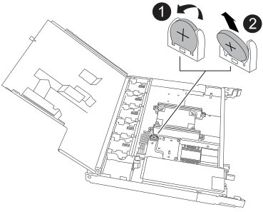

= Replace the real-time clock battery - NS224 shelves
:allow-uri-read: 
:icons: font
:imagesdir: ../media/

[role="lead"]
您可以在已启动且正在执行 I/O 的 NS224 驱动器架中无中断地更换发生故障的实时时钟（ Real-Time Clock ， RTC ）电池。

.开始之前
* 磁盘架的配对NSM必须已启动且正在运行、并已正确布线、以便在删除具有故障FRU (目标NSM)的NSM时磁盘架保持连接。
+
https://mysupport.netapp.com/site/tools/tool-eula/activeiq-configadvisor["NetApp 下载： Config Advisor"^]

* 系统中的所有其他组件必须正常运行。

.关于此任务
* 在拆卸和安装 NVMe 磁盘架模块（ NSM ）之间至少留出 70 秒。
+
这样， ONTAP 就有足够的时间来处理 NSM 删除事件。

* 更换RTC电池、重新安装NSM后、模块启动后、ONTAP将更新实时时钟时间。
* * 最佳实践： * 最佳实践是，在更换 FRU 组件之前，应在系统上安装最新版本的 NVMe 磁盘架模块（ NSM ）固件和驱动器固件。
+
https://mysupport.netapp.com/site/downloads/firmware/disk-shelf-firmware["NetApp 下载：磁盘架固件"^]

+
https://mysupport.netapp.com/site/downloads/firmware/disk-drive-firmware["NetApp 下载：磁盘驱动器固件"^]

+
[NOTE]
====
请勿将固件还原到不支持您的磁盘架及其组件的版本。

====
* 如果需要，您可以打开磁盘架的位置（蓝色） LED ，以帮助以物理方式定位受影响的磁盘架： `storage shelf location-led modify -shelf-name _shelf_name_ -led-status on`
+
如果您不知道受影响磁盘架的 `shelf_name` ，请运行 `storage shelf show` 命令。

+
磁盘架具有三个定位LED：操作员显示面板上一个、每个NSM上一个。Location LEDs remain illuminated for 30 minutes.您可以通过输入相同的命令并使用选项来关闭它们 `off`。

* 拆开备用 RTC 电池的包装时，请保存所有包装材料，以便在退回发生故障的 RTC 电池时使用。
+
If you need the RMA number or additional help with the replacement procedure, contact technical support at https://mysupport.netapp.com/site/global/dashboard["NetApp 支持"^], 888-463-8277 (North America), 00-800-44-638277 (Europe), or +800-800-80-800 (Asia/Pacific).

[role="tabbed-block"]
====
.NSM100模块
--
对于NSM100模块、您可以使用以下动画或书面步骤来更换RTC电池。

.更换NS224磁盘架中的RTC电池
video::df7a12f4-8554-4448-a3df-aa86002f2de8[panopto]
.步骤
. 正确接地。
. 从包含要更换的FRU的NSM断开布线：
+
.. 如果是交流电源、请打开电源线固定器、如果是直流电源、请拧下两个翼形螺钉、然后从电源拔下电源线、从而断开电源线与电源的连接。
+
电源没有电源开关。

.. 断开存储布线与NSM端口的连接。
+
记下每个缆线连接到的NSM端口。重新插入NSM时、请将缆线重新连接到相同的端口、此过程稍后将进行介绍。

. 从磁盘架中卸下NSM：
+
.. 将食指环穿过NSM两侧闩锁装置的手指孔。
+

NOTE: 如果您要卸下底部NSM，并且底部导轨阻碍了对锁定装置的操作，请将食指从内侧穿过手指孔(通过交叉手臂)。

.. 用拇指按住锁定机制顶部的橙色卡舌。
+
闩锁机制将抬起，以清除磁盘架上的闩锁销。

.. 轻轻拉动NSM、直至其离开磁盘架的三分之一处、用双手抓住NSM两侧以支撑其重量、然后将其放在平稳的表面上。
+
当您开始拉动时、锁定机构臂会从NSM伸出、并锁定在完全伸出的位置。

. 松开NSM盖板指旋螺钉、然后打开盖板。
+
NSM护盖上的FRU标签显示了RTC电池的位置、靠近NSM前端和电源右侧。

. 以物理方式确定发生故障的 RTC 电池。
. 更换 RTC 电池：
+
.. 将电池轻轻推离电池架，直至其倾斜（与电池架倾斜），然后将其从电池架中取出。
.. 将更换用电池倾斜地插入电池架（从电池架上倾斜），将其推入直立位置，然后将其牢牢按入连接器中，直到其完全就位。
+

NOTE: 电池正极(标有加号)朝外(远离电池座)、与NSM板上标记的加号相对应。

. 合上NSM护盖、然后拧紧指旋螺钉。
. 确保锁定装置臂锁定在完全展开的位置。
. 用双手将NSM轻轻滑入磁盘架、直到磁盘架完全支撑NSM的重量为止。
. 将NSM推入磁盘架、直至其停止(距离磁盘架背面大约半英寸)。
+
您可以将拇指放在每个手指环(锁定装置臂)正面的橙色卡舌上、以推入NSM。

. 将食指环穿过NSM两侧闩锁装置的手指孔。
+

NOTE: 如果您插入底部NSM，并且底部导轨阻碍了对锁定装置的操作，请将食指从内侧穿过手指孔(通过交叉手臂)。

. 用拇指按住锁定机制顶部的橙色卡舌。
. 轻轻向前推，使闩锁超过停止位置。
. 从锁定机制的顶部释放拇指，然后继续推动，直到锁定机制卡入到位。
+
NSM应完全插入磁盘架、并与磁盘架边缘齐平。

. 将布线重新连接到NSM：
+
.. 将存储布线重新连接到相同的两个NSM端口。
+
插入缆线时，连接器拉片朝上。正确插入缆线后，它会卡入到位。

.. 将电源线重新连接到电源、如果电源为交流电源、请使用电源线固定器固定电源线、如果是直流电源、则拧紧两个翼形螺钉、然后从电源中拔下电源线。
+
正常运行时，电源的双色 LED 将呈绿色亮起。

+
此外、两个NSM端口LNK (绿色) LED都会亮起。If a LNK LED does not illuminate, reseat the cable.

. 确认包含故障RTC电池的NSM上的警示(琥珀色) LED和磁盘架操作员显示面板不再亮起
+
NSM重新启动后、NSM警示LED熄灭、不再检测到RTC电池问题。This can take three to five minutes.

. 运行Active IQ Config Advisor以验证NSM是否已正确布线。
+
如果生成任何布线错误，请按照提供的更正操作进行操作。

+
https://mysupport.netapp.com/site/tools/tool-eula/activeiq-configadvisor["NetApp 下载： Config Advisor"^]

--
.NSM100B模块
--
.步骤
. 正确接地。
. 从包含要更换的FRU的NSM断开布线：
+
.. 如果是交流电源、请打开电源线固定器、如果是直流电源、请拧下两个翼形螺钉、然后从电源拔下电源线、从而断开电源线与电源的连接。
+
电源没有电源开关。

.. 断开存储布线与NSM端口的连接。
+
记下每个缆线连接到的NSM端口。重新插入NSM时、请将缆线重新连接到相同的端口、此过程稍后将进行介绍。

. 卸下NSM：
+
image::../media/drw_g_and_t_handles_remove_ieops-1837.svg[卸下NSM。]

+
[cols="1,4"]
|===

 a| 
image::../media/icon_round_1.png[标注编号1]
 a| 
在NSM的两端、向外推垂直锁定卡舌以释放手柄。

 a| 
image::../media/icon_round_2.png[标注编号2]
 a| 
** 朝您的方向拉动手柄、从中间板上取下NSM。
+
拉动时、手柄会从磁盘架中伸出。当您遇到一些阻力时、请继续拉。

** 将NSM滑出磁盘架、然后将其放在平稳的表面上。
+
确保在将NSM滑出磁盘架时支撑其底部。

 a| 
image::../media/icon_round_3.png[标注编号3]
 a| 
竖直旋转手柄(卡舌旁边)、将其移开。

|===
. 逆时针旋转指旋螺钉以松开模块盖、然后打开模块盖。
. 找到RTC电池并进行更换。
+
.. 取出发生故障的电池：
+

+
[cols="1,4"]
|===

 a| 
image::../media/icon_round_1.png[标注编号1]
 a| 
轻轻旋转RTC电池、使其与电池座成一定角度。

 a| 
image::../media/icon_round_2.png[标注编号2]
 a| 
将RTC电池从其支架中提出。

|===
.. 从防静电运输袋中取出更换用电池。
.. 记下 RTC 电池的极性，然后将电池倾斜并向下推，将其插入电池架中。
+

NOTE: 您必须确保电池上的加号与主板上的加号相对应。

.. 目视检查电池，确保其已完全安装到电池架中，并且极性正确。

. 合上NSM护盖、顺时针旋转翼形螺钉、直到拧紧为止。
. 将NSM插入磁盘架：
+
image::../media/drw_g_and_t_handles_reinstall_ieops-1838.svg[更换NSM。]

+
[cols="1,4"]
|===

 a| 
image::../media/icon_round_1.png[标注编号1]
 a| 
如果您在维修NSM时竖直旋转NSM手柄(位于卡舌旁边)以将其移出、请将其向下旋转至水平位置。

 a| 
image::../media/icon_round_2.png[标注编号2]
 a| 
将NSM的后部与磁盘架中的开口对齐、然后使用手柄轻轻推动NSM、直至其完全就位。

 a| 
image::../media/icon_round_3.png[标注编号3]
 a| 
将手柄旋转至竖直位置、并使用卡舌锁定到位。

|===
. 重新对NSM进行电源恢复。
+
.. 将存储布线重新连接到相同的两个NSM端口。
+
插入缆线时，连接器拉片朝上。正确插入缆线后，它会卡入到位。

.. 将电源线重新连接到电源、如果电源为交流电源、请使用电源线固定器固定电源线、如果是直流电源、则拧紧两个翼形螺钉、然后从电源中拔下电源线。
+
正常运行时，电源的双色 LED 将呈绿色亮起。

+
此外、两个NSM端口LNK (绿色) LED都会亮起。If a LNK LED does not illuminate, reseat the cable.

. 确认包含故障RTC电池的NSM上的警示(琥珀色) LED和磁盘架操作员显示面板不再亮起
+
NSM重新启动后、NSM警示LED熄灭、不再检测到RTC电池问题。This can take three to five minutes.

. 运行Active IQ Config Advisor以验证NSM是否已正确布线。
+
如果生成任何布线错误，请按照提供的更正操作进行操作。

+
https://mysupport.netapp.com/site/tools/tool-eula/activeiq-configadvisor["NetApp 下载： Config Advisor"^]

--
====