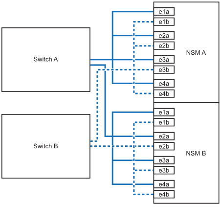

= 热添加架子 - NX224 架子
:allow-uri-read: 
:icons: font
:imagesdir: ../media/

[role="lead"]
您可以通过将 NX224 架热添加到现有的 AFX 集群配置来扩展存储功能。

.关于此任务
* 为热添加的架子布线后， ONTAP会识别该架子。如果需要，NSM 架子固件和驱动器固件应该自动更新。
+

NOTE: 固件更新可能需要长达 30 分钟。

.开始之前
* 在热添加架子之前，请确保您已：
+
** 一端拉直的回形针或尖头圆珠笔。
+
要更改磁盘架ID、请使用回形针或圆珠笔访问操作员显示面板(ODP)后面的磁盘架ID按钮以执行更改磁盘架ID步骤。

** 连接架子的电缆数量和类型正确。看 https://hwu.netapp.com["NetApp Hardware Universe"^]。

* 了解满载的 NX224 架子平均重量为 56.8 磅（25.8 千克），需要两个人才能抬起或使用液压升降机。避免拆除货架组件（从货架前部或后部）来减轻货架重量，因为这样会导致货架重量不平衡。
* NX224 架包含两个 NSM140 模块。顶部模块插入插槽 A（NSM A），底部模块插入插槽 B（NSM B）。
* 您的平台型号和ONTAP版本必须支持您正在热添加的 NX224 架和驱动器。看 https://hwu.netapp.com["NetApp Hardware Universe"^]
* 您的 AFX 集群所支持的机架数量必须至少比您计划热添加的机架数量少。
+
热添加机架后，您不能超过 AFX 集群支持的最大机架数量。看 https://hwu.netapp.com["NetApp Hardware Universe"^]。

* *最佳实践：*确保您拥有最新版本的 https://mysupport.netapp.com/site/downloads/firmware/disk-drive-firmware/download/DISKQUAL/ALL/qual_devices.zip["磁盘认证包"^]在热添加架子之前安装。
+
安装最新版本的 DQP 后，您的系统便可识别和使用新认证的驱动器。这样可以避免出现有关驱动器信息不最新以及由于无法识别驱动器而阻止驱动器分区的系统事件消息。DQP 还会通知您驱动器固件不是最新的。

* *最佳实践*：运行 https://mysupport.netapp.com/site/tools/tool-eula/activeiq-configadvisor["Active IQ Config Advisor"^]在热添加架子之前和之后查看任何存储布线错误消息以及应采取的纠正措施。
+
在热添加机架之前运行Active IQ Config Advisor可提供现有机架以太网 (ENET) 连接的快照，验证 NVMe 机架模块 (NSM) 固件版本，并允许您验证 AFX 集群中已使用的机架 ID。

+
热添加机架后运行Active IQ Config Advisor可让您验证机架是否正确布线以及机架 ID 在 AFX 集群内是否唯一。

* *最佳实践：*确保您拥有最新版本的 https://mysupport.netapp.com/site/downloads/firmware/disk-shelf-firmware["NVMe磁盘架模块(NSM)固件"^]和 https://mysupport.netapp.com/site/downloads/firmware/disk-drive-firmware["驱动器固件"^]在添加新架子之前，先在存储系统上进行操作。
+

NOTE: 请勿将固件还原到不支持您的磁盘架及其组件的版本。

== 步骤 1：安装用于热添加的架子

您需要在机柜或电信机架中安装 NX224 机架，连接电源线（自动打开机架电源），并设置机架 ID。

.步骤
. 根据需要、按照套件附带的说明安装磁盘架导轨套件。
+

NOTE: 始终使用适用于磁盘架的导轨套件将磁盘架安装到机架或机柜中。

. 安装磁盘架：
+
.. 将磁盘架的背面置于导轨上、然后从底部支撑磁盘架、并将其滑入机柜或电信机架。
+
建议将所有架子都安装在同一机架中靠近交换机的位置。

.. 使用套件中提供的安装螺钉将磁盘架固定到机柜或电信机架上。

. 连接电源：
+
.. 将电源线连接到架子上，并用电源线固定器将其固定到位。
.. 将电源线连接到不同的电源以实现故障恢复能力。
+
连接到电源时，磁盘架将通电；它没有电源开关。正常运行时，电源的双色 LED 将呈绿色亮起。

. 将架子 ID 设置为 AFX 集群内唯一的数字：
+
有关更详细的说明，请参阅link:change-shelf-id.html["更改货架 ID - NX224 货架"^]。

+
image::../media/drw_tp_change_shelf_id_ieops-2381.svg[更改NX224货架ID]

+
[cols="20%,80%"]
|===

 a| 
image::../media/icon_round_1.png[标注编号1]
 a| 
磁盘架端盖

 a| 
image::../media/icon_round_2.png[[插图编号2]
 a| 
磁盘架面板

 a| 
image::../media/icon_round_3.png[[插图编号3]
 a| 
磁盘架ID编号

 a| 
image::../media/icon_round_4.png[[插图编号4]
 a| 
货架ID按钮访问

|===
+
.. 拆下左端盖，找到 LED 右侧的小孔。
.. 将回形针或类似工具的一端插入小孔中，以到达磁盘架 ID 按钮。
.. 按住按钮（最长 15 秒），直到数字显示屏上的第一个数字闪烁，然后释放按钮。
+
如果此 ID 闪烁所需时间超过 15 秒，请再次按住此按钮，确保一直按此按钮。

.. 按下并释放此按钮可将此数字向前移动，直到达到所需数字 0 到 9 为止。
.. 重复子步骤 4c 和 4d 以设置磁盘架 ID 的第二个数字。
+
此数字可能需要长达三秒（而不是 15 秒）的时间才会闪烁。

.. 按住按钮，直到第二个数字停止闪烁。
+
大约 5 秒钟后，两个数字开始闪烁，并且耗时值上的琥珀色 LED 亮起。

.. 重新启动磁盘架以使磁盘架 ID 生效。
+
您必须从磁盘架上拔下两根电源线，等待 10 秒，然后重新插入。

+
电源恢复供电后，其双色 LED 将呈绿色亮起。

== 步骤 2：热添加电缆架

对要热添加的每个 NX224 架进行布线，以便每个架与每个交换机有八个连接。

.开始之前
* 熟悉正确的电缆连接器方向以及 NX224 NSM140 架模块上端口的位置和标签。
+
** 插入缆线时，连接器拉片朝上。
+
正确插入缆线后，它会卡入到位。

+
连接缆线的两端后，磁盘架和控制器端口 LNK （绿色） LED 将亮起。如果端口 LNK LED 不亮，请重新拔插缆线。

+
image::../media/oie_cable_pull_tab_up.png[插入电缆时、连接器拉片朝上]

** 每个 NSM140 模块包括 4 x 100GbE CX7 Path_A 端口（e1a、e2a、e3a 和 e4a）和 4 x 100GbE CX7 Path_B 端口（e1b、e2b、e3b 和 e4b）。
+

NOTE: 每个 NSM140 模块上的 Path_A 和 Path_B 端口都需要单独的分支电缆，每个机架总共需要四条分支电缆。

+
下图突出显示了 NSM140 模块上的 Path_A 和 Path_B 端口：

+
image::../media/drw_tp_nsm_ports_ieops-2301.svg[NX224 NSM140 Path_A 和 Path_B 端口的位置。]

+
[cols="1,4"]
|===

 a| 
image::../media/icon_round_1.png[标注编号1]
 a| 
Path_A 端口（蓝色端口）

 a| 
image::../media/icon_round_2.png[标注编号2]
 a| 
Path_B 端口（红色端口）

|===

.步骤
. 使用电缆将架 NSM A 和 NSM B Path_A 端口 e1a、e2a、e3a 和 e4a 连接至交换机 A 上的任意端口。
. 使用电缆将架 NSM A 和 NSM B Path_B 端口 e1b、e2b、e3b 和 e4b 连接至交换机 B 上的任意端口。
+
下图突出显示了向交换机配置热添加附加架的布线。要添加额外的架子，请遵循相同的基于交换机的布线方法。

+

. 使用验证热添加磁盘架的布线是否正确 https://mysupport.netapp.com/site/tools/tool-eula/activeiq-configadvisor["Active IQ Config Advisor"^]。
+
如果生成任何布线错误，请按照提供的更正操作进行操作。

