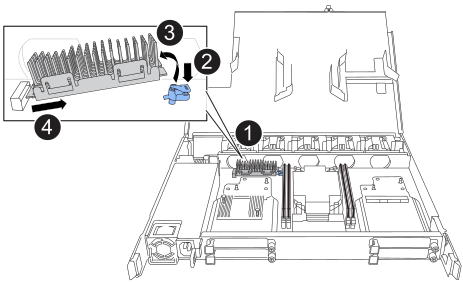

= 更换启动介质 - NX224 架
:allow-uri-read: 
:icons: font
:imagesdir: ../media/

[role="lead"]
您可以更换 NX224 架中发生故障的启动介质。当机架已通电且 I/O 正在进行时，可以无中断地更换启动介质。

.关于此任务
* 更换启动介质后、磁盘架配对节点NSM中的启动映像会自动复制到替代启动介质中。
+
这可能需要长达五分钟的时间。

* 在拆卸和安装 NVMe 磁盘架模块（ NSM ）之间至少留出 70 秒。
+
这样， ONTAP 就有足够的时间来处理 NSM 删除事件。

* 如果需要，您可以打开磁盘架的位置（蓝色） LED ，以帮助以物理方式定位受影响的磁盘架： `storage shelf location-led modify -shelf-name _shelf_name_ -led-status on`
+
如果您不知道受影响磁盘架的 ` _shelf_name_` ，请运行 `storage shelf show` 命令。

+
磁盘架具有三个定位LED：操作员显示面板上一个、每个NSM上一个。Location LEDs remain illuminated for 30 minutes.您可以通过输入相同的命令并使用选项来关闭它们 `off`。

* 更换启动介质后，您可以按照套件随附的 RMA 说明中所述将故障部件退回 NetApp 。
+
If you need the RMA number or additional help with the replacement procedure, contact technical support at https://mysupport.netapp.com/site/global/dashboard["NetApp 支持"^], 888-463-8277 (North America), 00-800-44-638277 (Europe), or +800-800-80-800 (Asia/Pacific).

.开始之前
* 机架的合作伙伴 NSM 必须启动并运行，并且布线正确，以便当您移除具有故障 FRU（目标 NSM）的 NSM 时，机架能够保持连接。您可以通过以下方式验证合作伙伴 NSM 的状态 https://mysupport.netapp.com/site/tools/tool-eula/activeiq-configadvisor["下载并运行Config Advisor"^]。
* 系统中的所有其他组件必须正常运行。

.步骤
. 正确接地。
. 从包含要更换的FRU的NSM断开布线：
+
.. 打开电源线固定器，然后从电源上拔下电源线，以断开电源线与电源的连接。
+
电源没有电源开关。

.. 断开存储布线与NSM端口的连接。
+
记下每个缆线连接到的NSM端口。重新插入NSM时、请将缆线重新连接到相同的端口、此过程稍后将进行介绍。

. 卸下NSM：
+
image::../media/drw_g_and_t_handles_remove_ieops-1837.svg[卸下NSM。]

+
[cols="1,4"]
|===

 a| 
image::../media/icon_round_1.png[标注编号1]
 a| 
在NSM的两端、向外推垂直锁定卡舌以释放手柄。

 a| 
image::../media/icon_round_2.png[标注编号2]
 a| 
** 朝您的方向拉动手柄、从中间板上取下NSM。
+
拉动时、手柄会从磁盘架中伸出。当您遇到一些阻力时、请继续拉。

** 将NSM滑出磁盘架、然后将其放在平稳的表面上。
+
确保在将NSM滑出磁盘架时支撑其底部。

 a| 
image::../media/icon_round_3.png[标注编号3]
 a| 
竖直旋转手柄(卡舌旁边)、将其移开。

|===
. 逆时针旋转指旋螺丝将其松开、打开NSM护盖、然后打开护盖。
. 以物理方式找到故障启动介质。
. 删除启动介质：
+

+
[cols="1,4"]
|===

 a| 
image::../media/icon_round_1.png[标注编号1]
 a| 
启动介质位置

 a| 
image::../media/icon_round_2.png[标注编号2]
 a| 
按下蓝色卡舌以释放启动介质的右端。

 a| 
image::../media/icon_round_3.png[标注编号3]
 a| 
轻轻向上提起引导介质的右端，以便沿着引导介质的两侧获得良好的抓持力。

 a| 
image::../media/icon_round_4.png[标注编号4]
 a| 
轻轻地将引导介质的左端从插槽中拉出。

|===
. 安装替代启动介质：
+
.. 将启动介质的边缘与插槽外壳对齐，然后将其轻轻直推入插槽。
.. 朝锁定按钮方向向下旋转启动介质。
.. 按下锁定按钮、向下旋转行李箱介质、然后松开锁定按钮。

. 合上NSM护盖、然后拧紧指旋螺钉。
. 将NSM插入磁盘架：
+
image::../media/drw_g_and_t_handles_reinstall_ieops-1838.svg[更换NSM。]

+
[cols="1,4"]
|===

 a| 
image::../media/icon_round_1.png[标注编号1]
 a| 
如果您在维修NSM时竖直旋转NSM手柄(位于卡舌旁边)以将其移出、请将其向下旋转至水平位置。

 a| 
image::../media/icon_round_2.png[标注编号2]
 a| 
将NSM的后部与磁盘架中的开口对齐、然后使用手柄轻轻推动NSM、直至其完全就位。

 a| 
image::../media/icon_round_3.png[标注编号3]
 a| 
将手柄旋转至竖直位置、并使用卡舌锁定到位。

|===
. 将布线重新连接到NSM：
+
.. 将存储电缆重新连接到相同的八个 NSM 端口。
+
插入缆线时，连接器拉片朝上。正确插入缆线后，它会卡入到位。

.. 将电源线重新连接到电源，然后使用电源线固定器固定电源线。
+
正常运行时，电源的双色 LED 将呈绿色亮起。

+
此外、两个NSM端口LNK (绿色) LED都会亮起。If a LNK LED does not illuminate, reseat the cable.

. 确认包含故障启动介质的NSM和磁盘架操作员显示面板上的警示(琥珀色) LED不再亮起。
+
It can take between 5 to 10 minutes for the attention LEDs to turn off.这是NSM重新启动和完成启动介质映像复制所需的时间。

+
如果故障 LED 保持亮起状态，则可能无法正确安装启动介质或可能存在其他问题描述，您应联系技术支持以获得帮助。

. 验证 NSM 是否已正确连接，方法是 https://mysupport.netapp.com/site/tools/tool-eula/activeiq-configadvisor["运行Active IQ Config Advisor"^]。
+
如果生成任何布线错误，请按照提供的更正操作进行操作。

