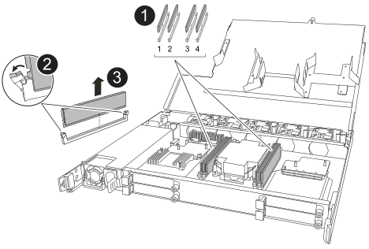

= 更换 DIMM - NX224 托架
:allow-uri-read: 
:icons: font
:imagesdir: ../media/

[role="lead"]
您可以在已打开电源且 I/O 正在进行的情况下无中断地更换 NX224 驱动器架中的故障 DIMM。

.关于此任务
* 在拆卸和安装 NVMe 磁盘架模块（ NSM ）之间至少留出 70 秒。
+
这样、ONTAP就有足够的时间处理NSM删除事件。

* *最佳实践：*最佳实践是在更换 FRU 组件之前，在系统上安装最新版本的 NVMe 架模块 (NSM) 固件和驱动器固件。您可以访问NetApp支持网站 https://mysupport.netapp.com/site/downloads/firmware/disk-shelf-firmware["下载磁盘架固件"^]和 https://mysupport.netapp.com/site/downloads/firmware/disk-drive-firmware["下载磁盘驱动器固件"^] 。
+
[NOTE]
====
请勿将固件还原到不支持您的磁盘架及其组件的版本。

====
* 如果需要，您可以打开磁盘架的位置（蓝色） LED ，以帮助以物理方式定位受影响的磁盘架： `storage shelf location-led modify -shelf-name _shelf_name_ -led-status on`
+
如果您不知道受影响磁盘架的 ` _shelf_name_` ，请运行 `storage shelf show` 命令。

+
磁盘架具有三个定位LED：操作员显示面板上一个、每个NSM上一个。Location LEDs remain illuminated for 30 minutes.您可以通过输入相同的命令并使用选项来关闭它们 `off`。

* 拆开备用 DIMM 的包装时，请保存所有包装材料，以便在退回发生故障的 DIMM 时使用。
+
If you need the RMA number or additional help with the replacement procedure, contact technical support at https://mysupport.netapp.com/site/global/dashboard["NetApp 支持"^], 888-463-8277 (North America), 00-800-44-638277 (Europe), or +800-800-80-800 (Asia/Pacific).

.开始之前
* 机架的合作伙伴 NSM 必须启动并运行，并且正确连接电缆，以便当您移除具有故障 FRU（目标 NSM）的 NSM 时，机架能够保持连接。您可以通过以下方式验证合作伙伴 NSM 的状态 https://mysupport.netapp.com/site/tools/tool-eula/activeiq-configadvisor["下载并运行Config Advisor"^]。
* 系统中的所有其他组件（包括其他三个 DIMM）必须正常运行。

.步骤
. 正确接地。
. 从包含要更换的FRU的NSM断开布线：
+
.. 打开电源线固定器，然后从电源上拔下电源线，以断开电源线与电源的连接。
+
电源没有电源开关。

.. 断开存储布线与NSM端口的连接。
+
记下每个缆线连接到的NSM端口。重新插入NSM时、请将缆线重新连接到相同的端口、此过程稍后将进行介绍。

. 将NSM插入磁盘架：
+
image::../media/drw_g_and_t_handles_reinstall_ieops-1838.svg[更换NSM。]

+
[cols="1,4"]
|===

 a| 
image::../media/icon_round_1.png[标注编号1]
 a| 
如果您在维修NSM时竖直旋转NSM手柄(位于卡舌旁边)以将其移出、请将其向下旋转至水平位置。

 a| 
image::../media/icon_round_2.png[标注编号2]
 a| 
将NSM的后部与磁盘架中的开口对齐、然后使用手柄轻轻推动NSM、直至其完全就位。

 a| 
image::../media/icon_round_3.png[标注编号3]
 a| 
将手柄旋转至竖直位置、并使用卡舌锁定到位。

|===
. 逆时针旋转指旋螺钉以松开NSM护盖、然后打开护盖。
+
NSM 盖上的 FRU 标签显示了 NSM 中四个 DIMM 的位置。

. 物理确定故障 DIMM 。
+
当DIMM出现故障时、系统会向系统控制台记录一条警告消息、指示需要更换哪个DIMM。

. 卸下故障DIMM：
+

+
[cols="1,4"]
|===

 a| 
image::../media/icon_round_1.png[标注编号1]
 a| 
DIMM插槽编号和位置。

 a| 
image::../media/icon_round_2.png[标注编号2]
 a| 
** 记下插槽中DIMM的方向、以便可以使用相同的方向插入更换用的DIMM。
** 缓慢地拉开DIMM插槽两端的两个DIMM弹出卡舌、以弹出故障DIMM。

IMPORTANT: 小心握住 DIMM 的边角或边缘，以避免对 DIMM 电路板组件施加压力。

 a| 
image::../media/icon_round_3.png[标注编号3]
 a| 
向上提起DIMM并将其从插槽中取出。

弹出器凸耳保持打开位置。

|===
. 更换DIMM：
+
.. 从防静电包装袋中取出更换用的 DIMM 。
.. 拿住 DIMM 的边角，然后将 DIMM 垂直插入插槽。
+
DIMM 底部插脚之间的槽口应与插槽中的卡舌对齐。

+
正确插入后， DIMM 应轻松插入，但应紧紧插入插槽中。如果没有，请重新插入 DIMM 。

.. 小心而稳固地向下推 DIMM 的上边缘，直到弹出器卡舌卡入到位，卡入到位于 DIMM 两端的缺口上。

. 合上NSM护盖、然后拧紧指旋螺钉。
. 将NSM插入磁盘架：
+
image::../media/drw_g_and_t_handles_reinstall_ieops-1838.svg[更换NSM。]

+
[cols="1,4"]
|===

 a| 
image::../media/icon_round_1.png[标注编号1]
 a| 
如果您在维修NSM时竖直旋转NSM手柄(位于卡舌旁边)以将其移出、请将其向下旋转至水平位置。

 a| 
image::../media/icon_round_2.png[标注编号2]
 a| 
将NSM的后部与磁盘架中的开口对齐、然后使用手柄轻轻推动NSM、直至其完全就位。

 a| 
image::../media/icon_round_3.png[标注编号3]
 a| 
将手柄旋转至竖直位置、并使用卡舌锁定到位。

|===
. 将布线重新连接到NSM：
+
.. 将存储电缆重新连接到相同的八个 NSM 端口。
+
插入缆线时，连接器拉片朝上。正确插入缆线后，它会卡入到位。

.. 将电源线重新连接到电源，然后使用电源线固定器固定电源线。
+
正常运行时，电源的双色 LED 将呈绿色亮起。

+
此外、两个NSM端口LNK (绿色) LED都会亮起。If a LNK LED does not illuminate, reseat the cable.

. 确认包含故障DIMM的NSM和磁盘架操作员显示面板上的警示(琥珀色) LED不再亮起。
+
NSM重新启动后、NSM警示LED熄灭、不再检测到DIMM问题。This can take three to five minutes.

. 验证 NSM 是否已正确连接，方法是 https://mysupport.netapp.com/site/tools/tool-eula/activeiq-configadvisor["运行Config Advisor"^]。
+
如果生成任何布线错误，请按照提供的更正操作进行操作。

