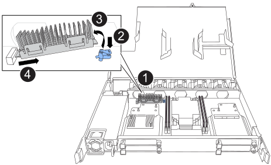
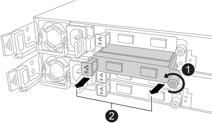

= 更换 NSM - NX224 架子
:allow-uri-read: 
:icons: font
:imagesdir: ../media/

[role="lead"]
您可以在已打开电源且 I/O 正在进行的情况下，无中断地更换受损的 NVMe 架模块 (NSM)。

.关于此任务
* 更换 NSM 涉及将 DIMM、风扇、启动介质、I/O 模块和电源从受损的 NSM 移至更换的 NSM。
+
您不要移动实时时钟 (RTC) 电池。它已预先安装在替换的 NSM 中。

* 拆卸和安装 NSM 之间至少间隔 70 秒。
+
这样， ONTAP 就有足够的时间来处理 NSM 删除事件。

* *最佳实践：*最佳实践是在更换 FRU 组件之前在系统上安装最新版本的 NSM 固件和驱动器固件。您可以访问NetApp支持网站 https://mysupport.netapp.com/site/downloads/firmware/disk-shelf-firmware["下载磁盘架固件"^]和 https://mysupport.netapp.com/site/downloads/firmware/disk-drive-firmware["下载磁盘驱动器固件"^] 。
+
[NOTE]
====
请勿将固件还原到不支持您的磁盘架及其组件的版本。

====
* 在固件版本不是最新的新NSM上、磁盘架(NSM)固件会自动更新(无干扰)。
+
NSM固件检查每10分钟进行一次。An NSM firmware update can take up to 30 minutes.

* 如果需要，您可以打开磁盘架的位置（蓝色） LED ，以帮助以物理方式定位受影响的磁盘架： `storage shelf location-led modify -shelf-name _shelf_name_ -led-status on`
+
如果您不知道受影响磁盘架的 `shelf_name` ，请运行 `storage shelf show` 命令。

+
磁盘架具有三个定位LED：操作员显示面板上一个、每个NSM上一个。Location LEDs remain illuminated for 30 minutes.您可以通过输入相同的命令并使用选项来关闭它们 `off`。

* When you unpack the replacement NSM, save all packing materials for use when you return the failed NSM.
+
If you need the RMA number or additional help with the replacement procedure, contact technical support at https://mysupport.netapp.com/site/global/dashboard["NetApp 支持"^], 888-463-8277 (North America), 00-800-44-638277 (Europe), or +800-800-80-800 (Asia/Pacific).

.开始之前
* 机架的合作伙伴 NSM 必须启动并运行，并且正确连接电缆，以便在您移除发生故障的 NSM 时机架能够保持连接。您可以通过以下方式验证合作伙伴 NSM 的状态 https://mysupport.netapp.com/site/tools/tool-eula/activeiq-configadvisor["下载并运行Config Advisor"^]。
* 系统中的所有其他组件必须正常运行。

.步骤
. 正确接地。
. 物理识别受损的NSM。
+
系统会向系统控制台记录一条警告消息，指示哪个模块受损。此外，驱动器架操作员显示面板和受损模块上的警示（琥珀色） LED 也会亮起。

. 断开受损NSM的布线：
+
.. 打开电源线固定器，然后从电源上拔下电源线，以断开电源线与电源的连接。
+
电源没有电源开关。

.. 断开存储布线与NSM端口的连接。
+
记下每个缆线连接到的NSM端口。您可以将缆线重新连接到替代NSM上的相同端口、此过程稍后将进行介绍。

. 卸下NSM：
+
image::../media/drw_g_and_t_handles_remove_ieops-1837.svg[卸下NSM。]

+
[cols="1,4"]
|===

 a| 
image::../media/icon_round_1.png[标注编号1]
 a| 
在NSM的两端、向外推垂直锁定卡舌以释放手柄。

 a| 
image::../media/icon_round_2.png[标注编号2]
 a| 
** 朝您的方向拉动手柄、从中间板上取下NSM。
+
拉动时、手柄会从磁盘架中伸出。当您遇到一些阻力时、请继续拉。

** 将NSM滑出磁盘架、然后将其放在平稳的表面上。
+
确保在将NSM滑出磁盘架时支撑其底部。

 a| 
image::../media/icon_round_3.png[标注编号3]
 a| 
竖直旋转手柄(卡舌旁边)、将其移开。

|===
. 拆开替代NSM的包装、并将其放在受损NSM附近的水平表面上。
. 松开每个护盖上的翼形螺钉、打开两个NSM的护盖。
. 将所有四个 DIMM 从受损的 NSM 移至更换的 NSM：
+
.. 从受损的 NSM 中移除每个 DIMM：
+
image::../media/drw_tp_dimm_replace_ieops-2202.svg[卸下DIMM。]

+
[cols="1,4"]
|===

 a| 
image::../media/icon_round_1.png[标注编号1]
 a| 
DIMM插槽编号和位置。

 a| 
image::../media/icon_round_2.png[标注编号2]
 a| 
*** 记下插槽中DIMM的方向、以便可以使用相同的方向将其插入更换用的DIMM中。
*** 缓慢地拉开DIMM插槽两端的两个DIMM弹出卡舌、以弹出故障DIMM。

IMPORTANT: 小心握住 DIMM 的边角或边缘，以避免对 DIMM 电路板组件施加压力。

 a| 
image::../media/icon_round_3.png[标注编号3]
 a| 
向上提起DIMM并将其从插槽中取出。

弹出器凸耳保持打开位置。

|===
.. 在替换 NSM 中安装每个 DIMM：
+
... 拿住 DIMM 的边角，然后将 DIMM 垂直插入插槽。
+
DIMM 底部插脚之间的槽口应与插槽中的卡舌对齐。

+
正确插入后， DIMM 应轻松插入，但应紧紧插入插槽中。如果没有，请重新插入 DIMM 。

... 小心而稳固地向下推 DIMM 的上边缘，直到弹出器卡舌卡入到位，卡入到位于 DIMM 两端的缺口上。

. 将受损NSM中的所有风扇移至更换NSM：
+

+
[cols="1,4"]
|===

 a| 
image::../media/icon_round_1.png[标注编号1]
 a| 
用力抓住蓝色触点所在的两侧、然后将故障风扇从插槽中竖直拉出、以卸下风扇。

 a| 
image::../media/icon_round_1.png[标注编号2]
 a| 
通过将替代风扇与导板对齐来插入、然后向下推、直到风扇连接器完全固定在插槽中。

|===
. 将启动介质移至替代NSM：
+
.. 从受损NSM中删除启动介质：
+

+
[cols="1,4"]
|===

 a| 
image::../media/icon_round_1.png[标注编号1]
 a| 
启动介质位置

 a| 
image::../media/icon_round_2.png[标注编号2]
 a| 
按下蓝色卡舌以释放启动介质的右端。

 a| 
image::../media/icon_round_3.png[标注编号3]
 a| 
轻轻向上提起引导介质的右端，以便沿着引导介质的两侧获得良好的抓持力。

 a| 
image::../media/icon_round_4.png[标注编号4]
 a| 
轻轻地将引导介质的左端从插槽中拉出。

|===
.. 在替代NSM中安装启动介质：
+
... 将启动介质的边缘与替换NSM中的插槽外壳对齐、然后将其垂直推入插槽。
... 朝锁定按钮方向向下旋转启动介质。
... 按下锁定按钮、向下旋转行李箱介质、然后松开锁定按钮。

. 将所有四个 I/O 模块从受损的 NSM 移至更换的 NSM。
+
.. 从受损的 NSM 中移除每个 I/O 模块：
+

+
[cols="1,4"]
|===

 a| 
image::../media/icon_round_1.png[标注编号1]
 a| 
逆时针旋转I/O模块指旋螺钉以拧松。

 a| 
image::../media/icon_round_2.png[标注编号2]
 a| 
使用左侧的端口标签卡舌和翼形螺钉将I/O模块从NSM中拉出。

|===
.. 在替换 NSM 中安装每个 I/O 模块：
+
... 将I/O模块与替代NSM中插槽的边缘对齐。
... 将I/O模块轻轻推入插槽、确保将模块正确插入连接器。
+
您可以使用左侧的卡舌和指旋螺钉推入I/O模块。

. 合上每个NSM的护盖、然后拧紧每个翼形螺钉。
. 将受损NSM中的电源移至更换NSM：
+
.. 将电源手柄向上旋转至水平位置，然后抓住它。
.. 用拇指按下电源上的陶土卡舌，以释放锁定机制。
.. 将电源从NSM中拉出、同时使用另一只手支撑其重量。
.. 用双手支撑电源边缘并将其与更换用NSM中的开口对齐。
.. 将电源轻轻推入NSM、直至锁定装置卡入到位。
+

NOTE: 请勿用力过大，否则可能会损坏内部连接器。

.. 将电源手柄向下旋转，使其不妨碍正常操作。

. 将NSM插入磁盘架：
+
image::../media/drw_g_and_t_handles_reinstall_ieops-1838.svg[更换NSM。]

+
[cols="1,4"]
|===

 a| 
image::../media/icon_round_1.png[标注编号1]
 a| 
如果您在维修NSM时竖直旋转NSM手柄(位于卡舌旁边)以将其移出、请将其向下旋转至水平位置。

 a| 
image::../media/icon_round_2.png[标注编号2]
 a| 
将NSM的后部与磁盘架中的开口对齐、然后使用手柄轻轻推动NSM、直至其完全就位。

 a| 
image::../media/icon_round_3.png[标注编号3]
 a| 
将手柄旋转至竖直位置、并使用卡舌锁定到位。

|===
. 将布线重新连接到NSM：
+
.. 将存储电缆重新连接到相同的八个 NSM 端口。
+
插入缆线时，连接器拉片朝上。正确插入缆线后，它会卡入到位。

.. 将电源线重新连接到电源，然后使用电源线固定器固定电源线。
+
正常运行时，电源的双色 LED 将呈绿色亮起。

+
此外、两个NSM端口LNK (绿色) LED都会亮起。If a LNK LED does not illuminate, reseat the cable.

. 验证磁盘架操作员显示面板上的警示（琥珀色） LED 是否不再亮起。
+
NSM重新启动后、操作员显示面板警示LED熄灭。This can take three to five minutes.

. 验证 NSM 是否已正确连接，方法是 https://mysupport.netapp.com/site/tools/tool-eula/activeiq-configadvisor["运行Active IQ Config Advisor"^]。
+
如果生成任何布线错误，请按照提供的更正操作进行操作。

. 确保磁盘架中的两个NSM运行的固件版本相同：0300或更高版本。

