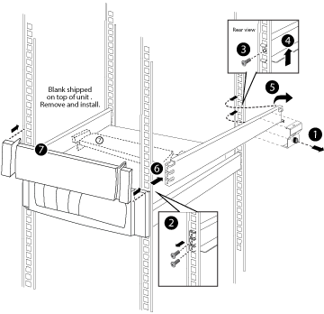

= 在系统机柜中安装设备
:icons: font
:imagesdir: ../media/

[role="lead"]
将任何额外的支持导轨安装到系统机柜中后，您可以向预先填充的系统机柜添加更多系统组件，或者将现有系统组件添加到空的系统机柜中。

. 如果系统机柜的后盖和前盖尚未打开，请将其解锁并打开。
. 按照设备随附的安装说明中所述，将设备安装到系统机柜中。
+
存储控制器应位于系统机柜的中间。磁盘架应位于存储控制器上方和下方。所有交换机都应位于系统机柜的最顶部。

+

NOTE: 如果设备安装法兰超出支撑导轨中的螺孔，请根据需要在支撑导轨上方安装锁紧螺母，以便将设备竖直固定到机柜上。

. 在系统机柜中的任何空托架上安装空白面板。
+
如果您收到的系统机柜已安装设备，则必须卸下空机柜托架正下方设备顶部的系紧导轨，如下图所示：

+

. 重新安装前后系统机柜门。

