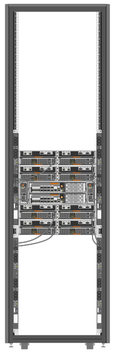

= 打开系统机柜的电源
:allow-uri-read: 
:icons: font
:imagesdir: ../media/

[role="lead"]
您必须将系统组件连接到 PDU ，将 PDU 缆线连接到交流电源，将其连接到电源以及打开系统电源。

IMPORTANT: 为防止PDU发生故障时系统中断、请勿将任何组件的两根电源线同时插入一个PDU。将负载分布在插入不同电路的分布在各个集成电路中、如图所示。

您必须为系统机柜中的每个 PDU 提供单独的电源电路。

. 将设备连接到PDU：
+
.. 将控制器电源连接到连接到不同电源的不同PDU。
.. 将驱动器架电源连接到连接到不同电源的不同PDU。
.. 将所有交换机电源连接到连接到不同电源的不同PDU。
+

+
将PDU电源线穿过系统机柜中的以下一个开口：

+
*** 系统机柜的顶部
*** 位于系统机柜后盖底部和框架之间
*** 通过落地窗和系统机柜下方

. 关闭 PDU 上的电源开关或断路器。
. 将每个 PDU 电源线插入单独交流电路上的各个交流电源。
. 打开 PDU 的电源开关或断路器。
. 打开组件的电源，然后启动系统。
. 关闭并锁定系统机柜门。

