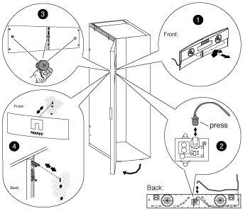

= 拆下照明标志
:icons: font
:imagesdir: ../media/

[role="lead"]
要卸下照明标志，您需要打开系统机柜前盖，从标志背面拔下电源线，然后从系统机柜门中卸下标志组件。

使用下图以及以下步骤：

. 解锁并打开系统机柜前盖。
. 松开车门内侧标志后面板上的固定螺钉，然后将后面板轻轻拉出车门网格。
. 按下插头上的锁定夹，从插槽拔下电源线，然后从后面板拔下缆线，从而从后面板拔下电源线。
+
将后面板放在一旁。

. 小心地从标志背面卸下螺钉。
+

NOTE: 翼形螺钉上的系统杆非常短。将空闲的手放在螺钉下方，以便在您放下翼形螺钉时抓住它。

. 从车门前部取下此标志，并将其放在一旁。

