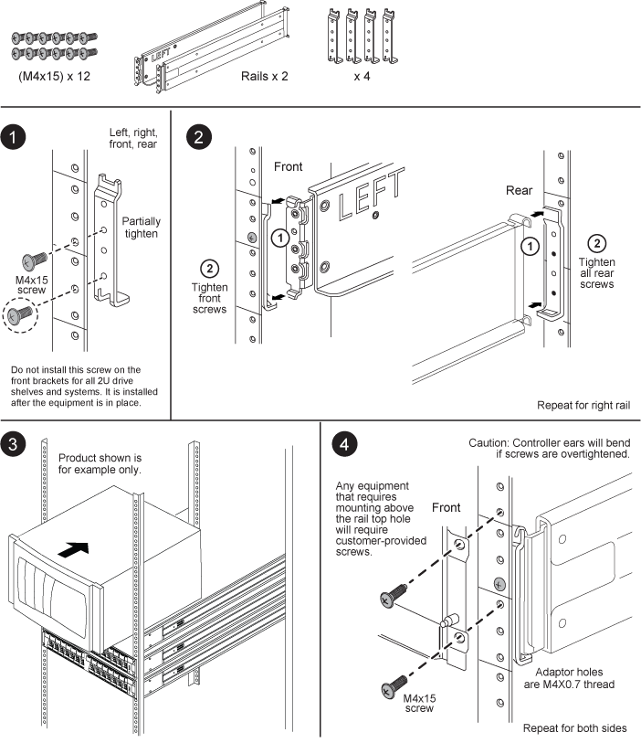

= SuperRail 套件安装说明
:allow-uri-read: 
:icons: font
:imagesdir: ../media/

[role="lead"]
SuperRail 可以安装在标准方孔四柱机架上，也可以使用圆到方孔适配器支架安装在标准圆孔四柱机架上。

NOTE: 用于安装SuperRail的前后连接点之间的最小深度为24英寸、最大深度为32英寸。

== 将 SuperRail 安装到方孔四柱机架

image::../media/drw_superrail_square_hole_four_post_kit_re_release.png[如何将SuperRail安装到方孔四柱机架中]

== 将 SuperRail 安装到圆孔四柱机架

