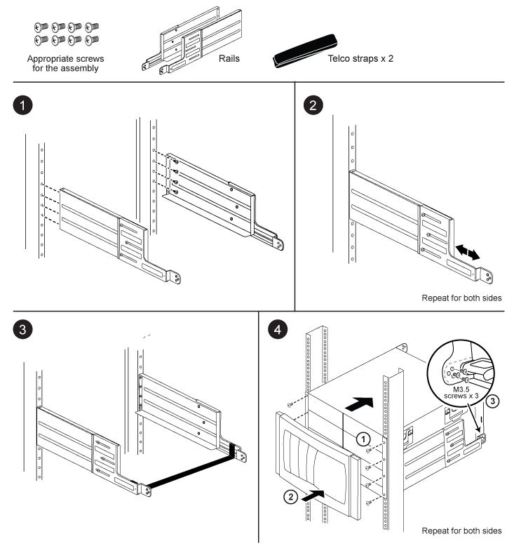

= 为您的 AFF A700 或 FAS9000 系统安装两柱支撑导轨套件
:allow-uri-read: 
:icons: font
:imagesdir: ../media/

[role="lead"]
FAS9000 和 AFF A700 系统可以使用两个双柱支持导轨套件。一个套件用于将系统嵌装到两柱机架中，另一个套件用于在两柱机架中将系统安装到中端。

[[install-the-two-post-mid-mount-rail-kit]]
== 安装两柱中置导轨套件

image::../media/drw_telco_mid_mount_1.png[如何安装两柱中部安装导轨套件]

[[install-the-two-post-flush-mount-rail-kit]]
== 安装两柱嵌装导轨套件

