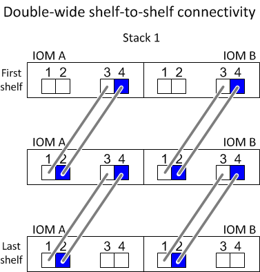
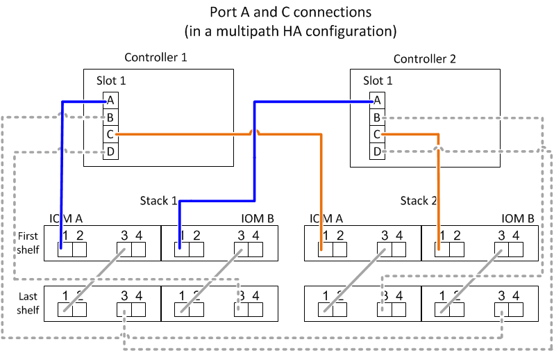
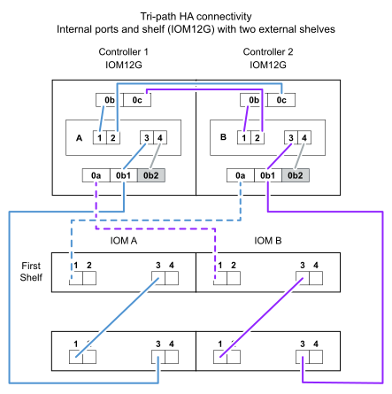
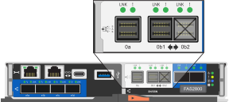

= SAS 布线规则和概念 - DS212C、DS224C 或 DS460C
:allow-uri-read: 
:icons: font
:imagesdir: ../media/

[role="lead"]
使用IOM12/IOM12B模块的磁盘架可以在HA对和单控制器配置中进行布线(适用于受支持的平台)、方法是应用SAS布线规则：配置规则、控制器插槽编号规则、磁盘架到磁盘架连接规则、控制器到堆栈连接规则以及迷你SAS HD SAS光缆规则(如果适用)。

NOTE: 本指南中所述的 SAS 布线规则（包括控制器插槽编号规则、磁盘架间连接规则以及控制器与堆栈间的连接规则）适用于所有 SAS 磁盘架，无论其配备的是 IOM12 还是 IOM12B 模块。但是，本指南中的信息仅适用于配备 IOM12/IOM12B 模块的磁盘架的独特特性及其在受支持配置中的使用。

本指南中介绍的有关配置规则和迷你SAS HD SAS光缆规则的SAS布线规则专用于具有IOM12/IOM12B模块的磁盘架。

本指南中介绍的 SAS 布线规则可平衡板载 SAS 端口与主机总线适配器 SAS 端口之间的 SAS 布线，以提供高可用性存储控制器配置并满足以下目标：

* 为所有 SAS 产品和配置提供一个易于理解的通用算法
* 生成材料清单（ BOM ）时，产生相同的物理布线，然后在工厂和现场进行布线
* 可通过配置检查软件和工具进行验证
* 提供尽可能高的弹性，以保持可用性并最大限度地减少对控制器接管的依赖

您应避免偏离规则；偏差可能会降低可靠性，通用性和通用性。

== 配置规则

特定类型的HA对和单控制器配置支持具有IOM12/IOM12B模块的磁盘架。

[NOTE]
====
有关您的平台型号支持的布线配置的最新信息、请参见Hardware Universe。

https://hwu.netapp.com["NetApp Hardware Universe"^]

====
* HA 对配置必须采用多路径 HA 或四路径 HA 配置的形式进行布线，但以下情况除外：
+
** 具有内部存储的平台不支持四路径HA连接。
** FAS2820 HA对可以采用三路径HA的形式进行布线。
+
有关FAS2820连接的信息、请参见<<三路径HA连接>>一节。

** 具有内部存储的平台可以采用单路径HA配置进行布线(从端口0b/0b1到外部磁盘架)、以支持连接到外部SAS磁带备份设备(从端口0a)。

[NOTE]
====
对于FAS2820 HA对、尽管使用缆线连接到外部磁盘架是单路径HA、但由于每个控制器将端口0b内部连接到其本地扩展器(IOM12G)、并将端口0c连接到其配对系统的扩展器、因此HA对配置为多路径HA。

====
* 单控制器配置必须采用多路径或四路径配置的形式进行布线，但以下情况除外：
+
** FAS2600系列单控制器配置可以采用单路径配置的形式进行布线。
+
由于内部存储使用单路径连接，因此 ONTAP 偶尔会发出警告，指出检测到混合路径。为了避免这些警告，您可以使用单路径连接到外部磁盘架。此外，在使用外部 SAS 磁带备份设备时，您可以使用单路径连接。

** FAS2600 系列单控制器配置不支持四路径连接。

== 控制器插槽编号规则

为了在所有受支持的 HA 对和单控制器配置中应用布线规则，我们会使用控制器插槽编号约定。

* 对于所有 HA 对和单控制器配置，以下情况适用：
+
** 物理 PCI 插槽中的 SAS HBA 定义为占用 PCI 插槽 1 ， 2 ， 3 等，而不管控制器上插槽的物理标签如何。
+
例如，如果 SAS HBA 占用物理 PCI 插槽 3 ， 5 和 7 ，则为了应用 SAS 布线规则，它们将被指定为插槽 1 ， 2 和 3 。

** 板载 SAS HBA 定义为占用 PCI 插槽 0 ，就像在控制器上标记一样。
** 每个插槽中的每个端口都按照控制器上的标签进行定义。例如，具有两个端口的插槽 0 称为 0a 和 0b 。具有四个端口的插槽 1 称为 1a ， 1b ， 1c 和 1d 。
+
在本文档中，插槽和插槽端口如下所示：

+
image::../media/slot0_rules.png[插槽和插槽[端口会议]

== 磁盘架到磁盘架连接规则

如果一个磁盘架堆栈中有多个磁盘架，则这些磁盘架会使用适用的 `standard` 或 `double-wide` 磁盘架到磁盘架布线通过每个 SAS 域（ IOM A 和 IOM B ）彼此连接。使用 `standard` 或 `double-wide` 磁盘架到磁盘架布线取决于您的配置。

=== 标准磁盘架到磁盘架连接

* 包含多个磁盘架的任何磁盘架堆栈均会使用标准磁盘架到磁盘架连接。
+
在每个域中的磁盘架-域A (IOM A)和域B (IOM B)之间需要一个缆线连接。

* 最佳实践是使用 IOM 端口 3 和 1 实现标准磁盘架到磁盘架连接。
+
从堆栈中的第一个逻辑磁盘架到最后一个逻辑磁盘架，您需要将 IOM 端口 3 连接到域 A 和域 B 中下一个磁盘架的 IOM 端口 1

image::../media/drw_shelf_to_shelf_standard.gif[标准磁盘架到磁盘架连接]

=== 双宽磁盘架到磁盘架连接

* 在四路径（四路径 HA 和四路径）配置中使用双宽磁盘架到磁盘架连接。
* 双宽磁盘架到磁盘架连接要求每个域 A （ IOM A ）和域 B （ IOM B ）中的磁盘架之间有两个缆线连接。
+
第一个缆线连接作为标准磁盘架到磁盘架连接进行布线（使用 IOM 端口 3 和 1 ）；第二个缆线连接作为双宽磁盘架到磁盘架连接进行布线（使用 IOM 端口 4 和 2 ）。

+
从堆栈中的第一个逻辑磁盘架到最后一个逻辑磁盘架，您需要将 IOM 端口 3 连接到域 A 和域 B 中下一个磁盘架的 IOM 端口 1从堆栈中的第一个逻辑磁盘架到最后一个逻辑磁盘架，您需要将 IOM 端口 4 连接到域 A 和域 B 中下一个磁盘架的 IOM 端口 2（以双宽连接方式连接的 IOM 端口显示为蓝色。）

== 控制器到堆栈的连接规则

您可以通过了解SAS磁盘架使用基于软件的磁盘所有权、控制器端口A/C和B/D如何连接到堆栈来正确地将SAS连接从HA对或单控制器配置中的每个控制器连接到每个堆栈。 如何将控制器端口A/C和B/D组织成端口对、以及具有内部存储的平台如何将其控制器端口连接到堆栈。

=== 基于 SAS 磁盘架软件的磁盘所有权规则

SAS 磁盘架使用基于软件的磁盘所有权（而不是基于硬件的磁盘所有权）。这意味着磁盘驱动器所有权存储在磁盘驱动器上，而不是由存储系统物理连接的拓扑来确定（就基于硬件的磁盘所有权而言）。具体而言，磁盘驱动器所有权由 ONTAP （自动或 CLI 命令）分配，而不是通过控制器到堆栈连接的布线方式分配。

切勿使用基于硬件的磁盘所有权方案为 SAS 磁盘架布线。

=== 控制器A和C端口连接规则(适用于没有内部存储的平台)

* A 和 C 端口始终是堆栈的主路径。
* A 和 C 端口始终连接到堆栈中第一个逻辑磁盘架。
* A 和 C 端口始终连接到磁盘架 IOM 端口 1 和 2 。
+
IOM 端口 2 仅用于四路径 HA 和四路径配置。

* 控制器 1 A 和 C 端口始终连接到 IOM A （域 A ）。
* 控制器 2 A 和 C 端口始终连接到 IOM B （域 B ）。

下图突出显示了控制器端口 A 和 C 如何在具有一个四端口 HBA 和两个磁盘架堆栈的多路径 HA 配置中进行连接。与堆栈 1 的连接显示为蓝色。与堆栈 2 的连接以橙色显示。

=== 控制器B和D端口连接规则(适用于没有内部存储的平台)

* B 和 D 端口始终是堆栈的二级路径。
* B 和 D 端口始终连接到堆栈中最后一个逻辑磁盘架。
* B 和 D 端口始终连接到磁盘架 IOM 端口 3 和 4 。
+
IOM 端口 4 仅用于四路径 HA 和四路径配置。

* 控制器 1 B 和 D 端口始终连接到 IOM B （域 B ）。
* 控制器 2 B 和 D 端口始终连接到 IOM A （域 A ）。
* B 和 D 端口通过将 PCI 插槽的顺序偏移 1 来连接到堆栈，以便第一个插槽上的第一个端口最后进行布线。

下图突出显示了控制器端口 B 和 D 如何在具有一个四端口 HBA 和两个磁盘架堆栈的多路径 HA 配置中进行连接。与堆栈 1 的连接显示为蓝色。与堆栈 2 的连接以橙色显示。

image::../media/drw_controller_to_stack_rules_ports_b_and_d_example.gif[不带内部存储的平台的控制器B和D端口连接规则]

=== 端口对连接规则(适用于没有内部存储的平台)

控制器 SAS 端口 A ， B ， C 和 D 按端口对进行组织，在 HA 对和单控制器配置中使用缆线连接控制器到堆栈连接时，可以利用所有 SAS 端口来提高系统故障恢复能力和一致性。

* 端口对由控制器 A 或 C SAS 端口以及控制器 B 或 D SAS 端口组成。
+
A 和 C SAS 端口连接到堆栈中第一个逻辑磁盘架。B 和 D SAS 端口连接到堆栈中最后一个逻辑磁盘架。

* 端口对使用系统中每个控制器上的所有 SAS 端口。
+
您可以通过将所有 SAS 端口（位于物理 PCI 插槽中的 HBA 上，插槽 1-N 和板载控制器上的所有 SAS 端口）整合到端口对中来提高系统故障恢复能力。请勿排除任何 SAS 端口。

* 端口对的标识和组织方式如下：
+
.. 按插槽（ 0 ， 1 ， 2 ， 3 等）顺序列出 A 端口和 C 端口。
+
例如： 1A ， 2a ， 3a ， 1c ， 2c ， 3c

.. 依次列出 B 端口和 D 端口（ 0 ， 1 ， 2 ， 3 等）。
+
例如： 1B ， 2b ， 3b ， 1D ， 2D ， 3D

.. 重新写入 D 和 B 端口列表，以便将列表中的第一个端口移至列表末尾。
+
例如： image:../media/drw_gen_sas_cable_step2.png["重新写入D和B端口列表"]

+
如果有多个 SAS 端口插槽可用，则通过一个将插槽顺序偏移来平衡多个插槽（物理 PCI 插槽和板载插槽）之间的端口对；因此，可以防止将堆栈连接到一个 SAS HBA 。

.. 按照列出的顺序将 A 和 C 端口（在步骤 1 中列出）与 D 和 B 端口（在步骤 2 中列出）配对。
+
例如： 1A/2b ， 2a/3b ， 3a/1D ， 1c/2D ， 2c/3D ， 3c/1b 。

+

NOTE: 对于 HA 对，您为第一个控制器标识的端口对列表也适用于第二个控制器。

* 为系统布线时，您可以按标识的顺序使用端口对，也可以跳过端口对：
+
** 如果需要使用所有端口对来为系统中的堆栈布线，请按照您确定（列出）的顺序使用端口对。
+
例如，如果您为系统确定了六个端口对，并且要使用六个堆栈作为多路径进行布线，则应按列出的顺序对这些端口对进行布线：

+
1A/2b ， 2a/3b ， 3a/1D ， 1c/2D ， 2c/3D ， 3c/1b

** 如果系统中的堆栈并非所有端口对都需要布线，请跳过端口对（使用其他每一个端口对）。
+
例如，如果您为系统确定了六个端口对，并且要使用三个堆栈作为多路径进行布线，则可以为列表中的其他每个端口对布线：

+
image::../media/drw_portpair_connection_rules_list_skip.gif[可选择跳过端口对]

+

NOTE: 如果您的端口对数量超过了为系统中的堆栈布线所需的数量，则最佳做法是跳过端口对以优化系统上的 SAS 端口。通过优化 SAS 端口，您可以优化系统的性能。

控制器到堆栈布线工作表是识别和组织端口对的便捷工具，您可以为 HA 对或单控制器配置使用缆线连接控制器到堆栈连接。

link:install-cabling-worksheet-template-multipath.html["用于多路径连接的控制器到堆栈布线工作表模板"]

link:install-cabling-worksheet-template-quadpath.html["用于四路径连接的控制器到堆栈布线工作表模板"]

=== 具有内部存储的平台的控制器0b/0b1和0a端口连接规则

具有内部存储的平台具有一组唯一的连接规则、因为每个控制器必须在内部存储(端口0b/0b1)和堆栈之间保持相同的域连接。这意味着、如果控制器位于机箱的插槽A中(控制器1)、则它位于域A (IOM A)中、因此端口0b/0b1必须连接到堆栈中的IOM A。如果某个控制器位于机箱的插槽B (控制器2)中、则该控制器位于域B (IOM B)中、因此端口0b/0b1必须连接到堆栈中的IOM B。

NOTE: 此内容不会介绍FAS25XX平台。

NOTE: 如果未将0b/0b1端口连接到正确的域(交叉连接域)、则会使系统面临故障恢复能力问题、从而使您无法安全地执行无中断过程。

* 控制器0b/0b1端口(内部存储端口)：
+
** 控制器1 0b/0b1端口始终连接到IOM A (域A)。
** 控制器2 0b/0b1端口始终连接到IOM B (域B)。
** 端口0b/0b1始终为主路径。
** 端口0b/0b1始终连接到堆栈中的最后一个逻辑磁盘架。
** 端口0b/0b1始终连接到磁盘架IOM端口3。

* 控制器 0a 端口（内部 HBA 端口）：
+
** 控制器 1 0a 端口始终连接到 IOM B （域 B ）。
** 控制器 2 0a 端口始终连接到 IOM A （域 A ）。
** 端口 0a 始终是二级路径。
** 端口 0a 始终连接到堆栈中第一个逻辑磁盘架。
** 端口 0a 始终连接到磁盘架 IOM 端口 1 。

下图突出显示了内部存储端口(0b/0b1)与外部磁盘架堆栈的域连接：

image::../media/drw_fas2600_mpha_domain_example_IEOPS-1172.svg[内部存储端口0b 0b1域连接]

=== 三路径HA连接

FAS2820 HA对支持三路径HA连接。三路径HA连接在每个控制器与内部(IOM12G)和外部磁盘架之间具有三条路径：

* 每个控制器将端口0b内部连接到其本地IOM12G并将端口0c内部连接到其配对节点的IOM12G、可提供HA对多路径HA连接。
* 通过为每个控制器的外部存储端口0A和0b1布线、可以建立HA对三路径HA连接。
+
如果没有外部磁盘架、则使用缆线将端口0A和0b1连接到两个控制器、或者使用缆线将其连接到外部磁盘架以实现三路径HA连接。

下面显示了实现三路径HA连接的控制器内部连接和外部布线：

FAS2820外部SAS端口：

* 0a端口来自内部HBA (与具有内部磁盘架的其他平台一样)。
* 0b1端口来自内部磁盘架(与具有内部磁盘架的其他平台上的0b端口类似)。
* 未使用0b2端口。已禁用。如果连接了电缆、则会生成错误消息。

有关FAS2820 HA对布线示例、请参见link:install-cabling-worksheets-examples-fas2600.html["使用内部存储的平台的控制器到堆栈布线工作表和布线示例"]一节。

== 迷你 SAS HD SAS 光缆规则

您可以使用迷你 SAS HD SAS 光缆—带有迷你 SAS HD 到迷你 SAS HD 连接器的多模式有源光缆（ AOC ）缆线和带有迷你 SAS HD 到 LC 连接器的多模式（ OM4 ）分支缆线—为某些配置（其中磁盘架带有 IOM12 模块）实现远程 SAS 连接。

* 您的 ONTAP 平台和版本必须支持使用迷你 SAS HD SAS 光缆：带迷你 SAS HD 到迷你 SAS HD 连接器的多模式活动光缆（ AOC ）缆线和带迷你 SAS HD 到 LC 连接器的多模式（ OM4 ）分支缆线。
+
https://hwu.netapp.com["NetApp Hardware Universe"]

* 带有迷你 SAS HD 到迷你 SAS HD 连接器的 SAS 多模式光纤 AOC 电缆可用于控制器到堆栈和磁盘架到磁盘架连接，其长度可达 50 米。
* 如果您使用 SAS 光纤多模式（ OM4 ）分支缆线与迷你 SAS HD 到 LC 连接器（适用于配线板），则需遵循以下规则：
+
** 您可以使用这些缆线进行控制器到堆栈和磁盘架到磁盘架的连接。
+
如果使用多模式分支缆线进行磁盘架到磁盘架连接，则只能在磁盘架堆栈中使用一次。您必须使用多模式 AOC 缆线连接其余磁盘架到磁盘架连接。

+
对于四路径 HA 和四路径配置，如果在两个磁盘架之间使用多模式分支缆线进行磁盘架到磁盘架双宽连接，则最佳做法是使用相同配对的分支缆线。

** 您必须将所有八个（四对） LC 分支连接器连接到配线板。
** 您需要提供配线板和面板间缆线。
+
面板间电缆必须与分支电缆处于相同模式： OM4 多模式。

** 一个路径最多可使用一对配线板。
** 任何多模式缆线的点对点（ mini-SAS HD 到 mini-SAS HD ）路径均不能超过 100 米。
+
该路径包括分支缆线，配线板和面板间缆线。

** 端到端总路径（从控制器到最后一个磁盘架的点对点路径之和）不能超过 300 米。
+
总路径包括分支缆线，配线板和面板间缆线。

* SAS 缆线可以是 SAS 铜缆， SAS 光缆或两者的组合。
+
如果混合使用 SAS 铜缆和 SAS 光缆，则需遵循以下规则：

+
** 堆栈中的磁盘架到磁盘架连接必须全部为 SAS 铜缆或全部为 SAS 光缆。
** 如果磁盘架到磁盘架的连接是 SAS 光缆，则与该堆栈的控制器到堆栈连接也必须是 SAS 光缆。
** 如果磁盘架到磁盘架的连接是 SAS 铜缆，则该堆栈的控制器到堆栈连接可以是 SAS 光缆或 SAS 铜缆。

