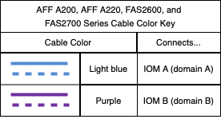

= DS212C、DS224C 或 DS460C 磁盘架与内部存储平台的布线工作表
:allow-uri-read: 
:icons: font
:imagesdir: ../media/

[role="lead"]
您可以使用已完成的控制器到堆栈布线工作表和布线示例，为具有内部存储的平台布线。这适用于带有 IOM12、IOM12B 或 IOM12C 模块的磁盘架。

* If needed, you can refer to link:install-cabling-rules.html["SAS布线规则和概念"] 有关支持的配置，磁盘架到磁盘架连接以及控制器到磁盘架连接的信息。
* 布线示例显示控制器到堆栈的缆线为实线或虚线、用于区分控制器0b/0b1端口连接与控制器0a端口连接。
+
image::../media/drw_fas2600_controller_to_stack_cable_type_key_IEOPS-947.svg[适用于具有板载存储的平台的缆线类型密钥]

* 布线示例显示了控制器到堆栈连接以及磁盘架到磁盘架连接的两种不同颜色，用于区分通过 IOM A （域 A ）和 IOM B （域 B ）进行的连接。
+

== 采用多路径HA配置且无外部磁盘架的FAS2820平台

以下示例显示、不需要布线即可实现多路径HA连接：

image::../media/drw_fas2800_noshelf_mpha_IEOPS-954.svg[FAS2820多路径HA、无外部磁盘架]

== 采用三路径HA配置且无外部磁盘架的FAS2820平台

以下布线示例显示了两个控制器之间实现三路径连接所需的布线：

image::../media/drw_fas2800_noshelf_tpha_IEOPS-955.svg[不带外部磁盘架的Fas2800三路径HA布线示例]

== 采用三路径HA配置并具有一个多磁盘架堆栈的FAS2820平台

以下工作表和布线示例使用端口对0a/0b1：

image::../media/drw_fas2800_worksheet_IEOPS-948.svg[显示堆栈1端口对的FAS2820三路径HA布线工作表]

image::../media/drw_fas2800_withshelves_tpha_IEOPS-949.svg[FAS2820三路径HA到一个堆栈的布线示例]

== 采用多路径HA配置且具有一个多架堆栈的内部存储平台

以下工作表和布线示例使用端口对 0A/0b ：

NOTE: 本节不适用于 FAS2820 系统。

image::../media/drw_fas2600_mpha_worksheet_IEOPS-1255.svg[包含内部存储和一个堆栈的平台的多路径HA布线工作表]

image::../media/drw_fas2600_mpha_IEOPS-1256.svg[具有内部存储的平台的多路径HA布线示例]
