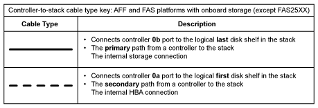

= 带有板载存储的 AFF 和 FAS 平台的控制器到堆栈布线工作表和布线示例—带有 IOM12 模块的磁盘架
:allow-uri-read: 
:icons: font
:imagesdir: ../media/

[role="lead"]
您可以使用完整的控制器到堆栈布线工作表和布线示例为 AFF 和 FAS 平台连接板载存储，例如但不限于 AFF A200 ， AFF A220 ， FAS2600 系列和 FAS2700 平台。此信息不适用于 FAS25XX 平台。

* If needed, you can refer to link:install-cabling-rules.html["SAS 布线规则"] 有关支持的配置，磁盘架到磁盘架连接以及控制器到磁盘架连接的信息。
* 布线示例将控制器到堆栈的缆线显示为实心或虚线，以区分控制器 0b 端口连接与控制器 0a 端口连接。
+

* 布线示例显示了控制器到堆栈连接以及磁盘架到磁盘架连接的两种不同颜色，用于区分通过 IOM A （域 A ）和 IOM B （域 B ）进行的连接。
+
image::../media/drw_fas2600_cable_color_key.png[DRW fas2600 电缆颜色密钥]

== 采用多路径 HA 配置并具有一个多架堆栈的板载存储的 AFF 和 FAS 平台

以下工作表和布线示例使用端口对 0A/0b ：

image::../media/drw_fas2600_mpha_worksheet.png[DRW fas2600 mpha 工作表]

image::../media/drw_fas2600_mpha.png[DRW fas2600 mpha]

== FAS2600 系列多路径配置，具有一个多架堆栈

以下工作表和布线示例使用端口对 0A/0b 。

在此示例中，控制器安装在机箱的插槽 A 中。如果控制器位于机箱的插槽 A 中，则其内部存储端口（ 0b ）位于域 A （ IOM A ）中；因此，端口 0b 必须连接到堆栈中的域 A （ IOM A ）。

image::../media/drw_fas2600_mp_slot_a_worksheet.png[DRW fas2600 MP 插槽 A 工作表]

image::../media/drw_fas2600_mp_slot_a.png[DRW fas2600 MP 插槽 A]

在此示例中，控制器安装在机箱的插槽 B 中。如果控制器位于机箱的插槽 B 中，则其内部存储端口（ 0b ）位于域 B （ IOM B ）中；因此，端口 0b 必须连接到堆栈中的域 B （ IOM B ）。

image::../media/drw_fas2600_mp_slot_b_worksheet.png[DRW fas2600 MP 插槽 b 工作表]

image::../media/drw_fas2600_mp_slot_b.png[DRW fas2600 MP 插槽 b]
