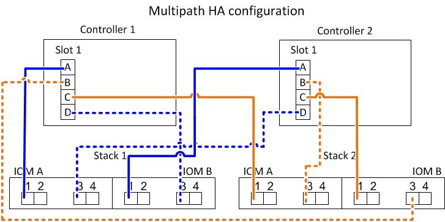
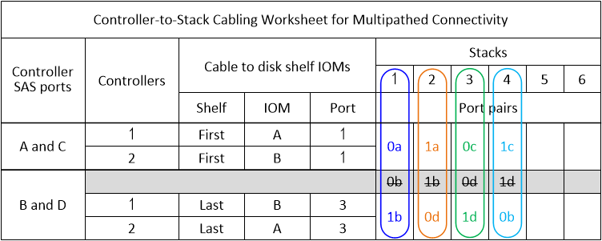

= 多路径HA配置的控制器到堆栈布线工作表和布线示例—具有IOM12/IOM12B模块的磁盘架
:allow-uri-read: 
:icons: font
:imagesdir: ../media/

[role="lead"]
您可以使用控制器到堆栈的布线工作表和布线示例将 HA 对作为多路径 HA 配置进行布线。

NOTE: 此信息指的是没有内部存储的适用场景平台。

* If needed, you can refer to link:install-cabling-rules.html["SAS布线规则和概念"] for information about supported configurations, the controller slot numbering convention, shelf-to-shelf connectivity, and controller-to-shelf connectivity (including the use of port pairs).
* 如果需要，可以参考 link:install-cabling-worksheets-how-to-read-multipath.html["如何阅读使用缆线连接控制器到堆栈连接以实现多路径连接的工作表"]。
* 布线示例将控制器到堆栈的缆线显示为实心或虚线，以区分控制器 A 和 C 端口连接与控制器 B 和 D 端口连接。
+
image::../media/drw_controller_to_stack_cable_type_key.gif[DRW 控制器到堆栈缆线类型密钥]

* 布线示例中的缆线及其工作表中对应的端口对采用颜色编码，以区分与 HA 对中每个堆栈的连接。
+
image::../media/drw_controller_to_stack_cable_color_key_non2600_4stackcolors.gif[DRW 控制器到堆栈的缆线颜色密钥非 2600 4 个堆栈颜色]

* 工作表和布线示例按工作表中列出的顺序显示了端口对的布线。

== 使用四端口 SAS HBA 的多路径 HA 配置的控制器到堆栈布线工作表和布线示例

您可以使用完整的控制器到堆栈布线工作表和布线示例为具有四端口 SAS HBA 的常见多路径 HA 配置布线。这些控制器没有板载 SAS 端口。

=== 多路径高可用性，一个四端口 SAS HBA 和一个单架堆栈

以下工作表和布线示例使用端口对 1a/1D ：

image::../media/drw_worksheet_mpha_slot_1_one_4porthba_one_singleshelf_stack.gif[DRW 工作表 mpha 插槽 1 一个 4 孔 ba 一个单槽堆栈]

image::../media/drw_mpha_slot_1_one_4porthba_one_singleshelf_stack.gif[DRW mpha 插槽 1 一个 4porthba 一个单通道堆栈]

=== 多路径高可用性，一个四端口 SAS HBA 和两个单架堆栈

以下工作表和布线示例使用端口对 1a/1D 和 1C/1b ：

image::../media/drw_worksheet_mpha_slot_1_one_4porthba_two_singleshelf_stacks.gif[DRW 工作表 mpha 插槽 1 一个 4porthba 两个单 Helf 堆栈]

=== 具有两个四端口 SAS HBA 和两个多架堆栈的多路径 HA

此配置可使用四个端口对： 1A/2b ， 2a/1D ， 1c/2D 和 2c/1b 。您可以按端口对的标识顺序（在工作表中列出）为其布线，也可以为其他端口对布线（跳过端口对）。

NOTE: 如果您的端口对数量超过了为系统中的堆栈布线所需的数量，则最佳做法是跳过端口对以优化系统上的 SAS 端口。通过优化 SAS 端口，您可以优化系统的性能。

以下工作表和布线示例显示了按工作表中所列顺序使用的端口对： 1A/2b ， 2a/1D ， 1c/2D 和 2c/1b 。

image::../media/drw_worksheet_mpha_slots_1_and_2_two_4porthbas_two_stacks.gif[DRW 工作表 mpha 插槽 1 和 2 两个 4 孔 bas 两个堆栈]

image::../media/drw_mpha_slots_1_and_2_4porthbas_4_stacks.gif[DRW mpha 插槽 1 和 2 4 个 4 孔 bas 4 个堆栈]

以下工作表和布线示例显示了跳过端口对以使用列表中的其他端口对： 1A/2b 和 11/2D 。

NOTE: 如果稍后添加第三个堆栈，则使用已跳过的端口对。

image::../media/drw_worksheet_mpha_slots_1_and_2_two_4porthbas_two_stacks_skipped.gif[DRW 工作表 mpha 插槽 1 和 2 跳过两个 4 孔 bas 两个堆栈]

image::../media/drw_mpha_slots_1_and_2_two_4porthbas_two_stacks_skipped.gif[已跳过 DRW mpha 插槽 1 和 2 中的两个 4 孔 bas 两个堆栈]

== 具有四个板载 SAS 端口的多路径 HA 配置的控制器到堆栈布线工作表和布线示例

您可以使用完整的控制器到堆栈布线工作表和布线示例为具有四个板载 SAS 端口的常见多路径 HA 配置布线。

=== 多路径高可用性，具有四个板载 SAS 端口和一个单架堆栈

以下工作表和布线示例使用端口对 0A/0d ：

image::../media/drw_worksheet_mpha_slot_0_4ports_one_singleshelf_stack.gif[DRW 工作表 mpha 插槽 0 4 端口一个单通道堆栈]

image::../media/drw_mpha_slot_0_4ports_one_singleshelf_stack.gif[DRW mpha 插槽 0 4 端口一个单通道堆栈]

=== 多路径高可用性，具有四个板载 SAS 端口和两个单架堆栈

以下工作表和布线示例使用端口对 0a/0d 和 0c/0b ：

image::../media/drw_worksheet_mpha_slot_0_4ports_two_singleshelf_stacks.gif[DRW 工作表 mpha 插槽 0 4 端口两个单架堆栈]

image::../media/drw_mpha_slot_0_4ports_two_singleshelf_stacks.gif[DRW mpha 插槽 0 4 端口两个单架堆栈]

=== 多路径高可用性，具有四个板载 SAS 端口，一个四端口 SAS HBA 和两个多架堆栈

此配置可使用四个端口对： 0a/1b ， 1a/0d ， 0c/1D 和 1c/0b 。您可以按端口对的标识顺序（在工作表中列出）为其布线，也可以为其他端口对布线（跳过端口对）。

NOTE: 如果您的端口对数量超过了为系统中的堆栈布线所需的数量，则最佳做法是跳过端口对以优化系统上的 SAS 端口。通过优化 SAS 端口，您可以优化系统的性能。

以下工作表和布线示例显示了按工作表中所列顺序使用的端口对： 0a/1b ， 1a/0d ， 0c/1D 和 1c/0b 。

image::../media/drw_mpha_slots_0_and_1_8ports_4_stacks.gif[DRW mpha 插槽 0 和 1 8 端口 4 个堆栈]

以下工作表和布线示例显示了跳过端口对以使用列表中的其他端口对： 0a/1b 和 0c/1d 。

NOTE: 如果稍后添加第三个堆栈，则使用已跳过的端口对。

image::../media/drw_worksheet_mpha_slots_0_and_1_8ports_two_stacks_skipped.gif[DRW 工作表 mpha 插槽 0 和 1 8 端口跳过两个堆栈]

image::../media/drw_mpha_slots_0_and_1_8ports_two_stacks_skipped.gif[DRW mpha 插槽 0 和 1 8 端口跳过两个堆栈]
