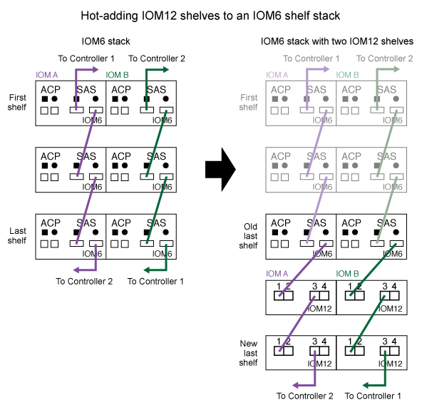

= 将 IOM12 磁盘架热添加到 IOM6 磁盘架堆栈中
:icons: font
:imagesdir: ../media/

[role="lead"]
如果需要更多存储，您可以将 IOM12 磁盘架（带有 IOM12 模块的 SAS 磁盘架）热添加到 IOM6 磁盘架堆栈（带有 IOM6 模块的 SAS 磁盘架）中，这意味着您可以混合一个堆栈。

== 热添加的要求

[role="lead"]
在将 IOM12 磁盘架热添加到 IOM6 磁盘架堆栈之前， HA 对，单控制器或延伸型 MetroCluster 配置（系统）必须满足特定要求。

NOTE: 有关网桥连接的 MetroCluster 配置，请参见 <<Requirements for a hot-add in bridge-attached MetroCluster configurations>>。

* 您的系统和 ONTAP 版本必须支持在同一个堆栈（混合堆栈）中混合使用 IOM6 磁盘架和 IOM12 磁盘架。
+
您可以使用以下方法之一验证支持：

+
** 在任一控制器的管理提示符处输入 ``run local sysconfig`` 命令。
+
如果 SAS2/SAS3 混合堆栈支持字段未显示在输出中或其值为 none ，则表示您的系统不支持混合堆栈。

+
如果 SAS2/SAS3 Mixed Stack Support 字段中显示了其他任何内容，例如 ALL 或 bride-attached ，则表示您的系统支持混合堆栈。

** 转到 Hardware Universe 并导航到您的平台信息。
+
https://hwu.netapp.com["NetApp Hardware Universe"]

* 如果要向 MetroCluster 配置添加磁盘架，则此配置必须满足《 MetroCluster 安装和配置指南》中的所有要求。
+
http://docs.netapp.com/ontap-9/topic/com.netapp.doc.dot-mcc-inst-cnfg-ip/home.html["《 MetroCluster IP 安装和配置指南》"]

+
http://docs.netapp.com/ontap-9/topic/com.netapp.doc.dot-mcc-inst-cnfg-stretch/home.html["《 ONTAP 9 延伸型 MetroCluster 安装和配置指南》"]

+
http://docs.netapp.com/ontap-9/topic/com.netapp.doc.dot-mcc-inst-cnfg-fabric/home.html["《 ONTAP 9 光纤连接 MetroCluster 安装和配置指南》"]

* 要热添加 IOM12 磁盘架的 IOM6 磁盘架堆栈必须使用 SAS 铜缆进行布线（适用于所有磁盘架到磁盘架和控制器到堆栈连接）。
+
混合堆栈不支持 SAS 光缆。

+

NOTE: 如果 IOM6 磁盘架堆栈使用任何 SAS 光缆进行布线，则不能热添加 IOM12 磁盘架。请联系您的 NetApp 销售代表。

* 您的系统必须少于支持的最大驱动器数，至少等于要热添加的 IOM12 磁盘架中能够安装的驱动器数。
+
热添加 IOM12 磁盘架后，您不能超过系统支持的最大驱动器数。

+
https://hwu.netapp.com["NetApp Hardware Universe"]

* 您的系统不能显示任何 SAS 布线错误消息。
+
您必须使用错误消息提供的更正操作更正任何布线错误。

+
https://mysupport.netapp.com/site/tools/tool-eula/activeiq-configadvisor["NetApp 下载： Config Advisor"]

* 您必须已订购并收到 IOM12 磁盘架以及适当数量和类型的 SAS 铜缆。
+
IOM12 磁盘架使用迷你 SAS HD 连接器。IOM6 磁盘架使用 QSFP 连接器。

== 网桥连接 MetroCluster 配置中的热添加要求

[role="lead"]
如果要将 IOM12 磁盘架热添加到使用 MetroCluster 配置中的一对 ATTO FibreBridge 网桥连接的 IOM6 磁盘架堆栈中，则系统必须满足特定要求。

* 如果网桥 SAS 端口在当前配置中可用，则应将 IOM12 磁盘架作为单独的堆栈添加。
+
在堆栈中混用 IOM12 和 IOM6 模块之前，请使用所有网桥端口。

* 您的系统和 ONTAP 版本必须支持在同一个堆栈（混合堆栈）中混合使用 IOM6 磁盘架和 IOM12 磁盘架。
+
您可以使用以下方法之一验证支持：

+
** 在任一控制器的管理提示符处输入 ``run local sysconfig`` 命令。
+
如果 SAS2/SAS3 混合堆栈支持字段未显示在输出中或其值为 none ，则表示您的系统不支持混合堆栈。

+
如果 SAS2/SAS3 Mixed Stack Support 字段中显示了其他任何内容，例如 ALL 或 bride-attached ，则表示您的系统支持混合堆栈。

** 转到 Hardware Universe 并导航到您的平台信息。
+
https://hwu.netapp.com["NetApp Hardware Universe"]

* 此配置必须满足《 MetroCluster 安装和配置指南》中的所有要求。
+
https://docs.netapp.com/us-en/ontap-metrocluster/install-stretch/index.html["安装和配置延伸型 MetroCluster 配置"]

+
https://docs.netapp.com/us-en/ontap-metrocluster/install-fc/index.html["安装和配置光纤连接的 MetroCluster 配置"]

* 要热添加 IOM12 磁盘架的 IOM6 磁盘架堆栈必须使用 SAS 铜缆进行布线（适用于所有磁盘架到磁盘架和控制器到堆栈连接）。
+
混合堆栈不支持 SAS 光缆。

+

NOTE: 如果 IOM6 磁盘架堆栈使用任何 SAS 光缆进行布线，则不能热添加 IOM12 磁盘架。请联系您的 NetApp 销售代表。

* 您的配置必须小于网桥端口支持的最大驱动器数。
* 您必须已订购并收到 IOM12 磁盘架以及适当数量和类型的 SAS 铜缆。
+
IOM12 磁盘架使用迷你 SAS HD 连接器。IOM6 磁盘架使用 QSFP 连接器。

* 网桥必须运行固件版本 3.16/4.16 及更高版本。

== 热添加注意事项

[role="lead"]
在将 IOM12 磁盘架热添加到 IOM6 磁盘架堆栈之前，您应熟悉此操作步骤的各个方面和最佳实践。

=== 一般注意事项

* 强烈建议您要热添加的 IOM12 磁盘架运行固件版本 0260 或更高版本，然后再使用缆线将其连接到系统。
+
如果热添加磁盘架未正确连接到堆栈，则使用受支持版本的磁盘架固件可防止存储堆栈访问问题。

+
将 IOM12 磁盘架固件下载到磁盘架后，通过在任一控制器的控制台中输入 `storage shelf show -module` 命令，验证固件版本是否为 0260 或更高版本。

* 不支持无中断堆栈整合。
+
在系统启动并提供数据（ I/O 正在进行）时，您不能使用此操作步骤热添加从同一系统中的另一个堆栈热移除的磁盘架。

* 如果受影响磁盘架具有镜像聚合，则可以使用此操作步骤热添加在同一 MetroCluster 系统中热移除的磁盘架。
* 为热添加的磁盘架布线后， ONTAP 将识别该磁盘架：
+
** 如果启用了自动驱动器分配，则会分配驱动器所有权。
** 如果需要，应自动更新磁盘架（ IOM ）固件和驱动器固件。
+

NOTE: 固件更新可能需要长达 30 分钟。

=== 最佳实践注意事项

* * 最佳实践： * 最佳实践是，在热添加磁盘架之前，系统上应安装最新版本的磁盘架（ IOM ）固件和驱动器固件。
+
https://mysupport.netapp.com/site/downloads/firmware/disk-shelf-firmware["NetApp 下载：磁盘架固件"]

+
https://mysupport.netapp.com/site/downloads/firmware/disk-drive-firmware["NetApp 下载：磁盘驱动器固件"]

NOTE: 请勿将固件还原到不支持您的磁盘架及其组件的版本。

* * 最佳实践： * 最佳实践是，在热添加磁盘架之前安装最新版本的磁盘认证包（ DQP ）。
+
安装最新版本的 DQP 后，您的系统便可识别和使用新认证的驱动器。这样可以避免出现有关驱动器信息不最新以及由于无法识别驱动器而阻止驱动器分区的系统事件消息。DQP 还会通知您驱动器固件不是最新的。

+
https://mysupport.netapp.com/NOW/download/tools/diskqual/["NetApp 下载：磁盘认证包"]

* * 最佳实践： * 最佳实践是在热添加磁盘架前后运行 Active IQ Config Advisor 。
+
在热添加磁盘架之前运行 Active IQ Config Advisor 可提供现有 SAS 连接的快照，验证磁盘架（ IOM ）固件版本，并允许您验证系统上已在使用的磁盘架 ID 。通过在热添加磁盘架后运行 Active IQ Config Advisor ，您可以验证磁盘架布线是否正确以及磁盘架 ID 在系统中是否唯一。

+
https://mysupport.netapp.com/site/tools/tool-eula/activeiq-configadvisor["NetApp 下载： Config Advisor"]

* * 最佳实践： * 最佳实践是在您的系统上运行带内 ACP （ IBACP ）。
+
** 对于运行 IBAP 的系统，会在热添加的 IOM12 磁盘架上自动启用 IBACP 。
** 对于启用了带外 ACP 的系统， IOM12 磁盘架上不提供 ACP 功能。
+
您应迁移到 IBACP 并删除带外 ACP 布线。

** 如果您的系统未运行 IBACP ，并且您的系统满足 IBACP 的要求，则可以在热添加 IOM12 磁盘架之前将系统迁移到 IBACP 。
+
https://kb.netapp.com/Advice_and_Troubleshooting/Data_Storage_Systems/FAS_Systems/In-Band_ACP_Setup_and_Support["迁移到 IBACP 的说明"]

+

NOTE: 迁移说明提供了 IBACP 的系统要求。

== 准备手动分配驱动器所有权以进行热添加

[role="lead"]
如果要为要热添加的 IOM12 磁盘架手动分配驱动器所有权，则需要禁用自动驱动器分配（如果已启用）。

您必须已满足系统要求。

<<Requirements for a hot-add>>

<<Requirements for a hot-add in bridge-attached MetroCluster configurations>>

如果您有 HA 对，则如果磁盘架中的驱动器将由两个控制器模块拥有，则需要手动分配驱动器所有权。

.步骤
. 验证是否已启用自动驱动器分配： `storage disk option show`
+
如果您有 HA 对，则可以在任一控制器模块上输入命令。

+
如果启用了自动驱动器分配，则输出会在 "`Auto Assign` " 列中显示 `on` （对于每个控制器模块）。

. 如果启用了自动驱动器分配，请将其禁用： `storage disk option modify -node _node_name_ -autodassign off`
+
如果您具有 HA 对或双节点 MetroCluster 配置，则必须在两个控制器模块上禁用自动驱动器分配。

== 安装用于热添加的磁盘架

[role="lead"]
对于要热添加的每个磁盘架，您可以将磁盘架安装到机架中，连接电源线，打开磁盘架电源并设置磁盘架 ID 。

. 使用磁盘架随附的安装宣传单安装磁盘架随附的机架安装套件（适用于两柱或四柱机架安装）。
+
[NOTE]
====
如果要安装多个磁盘架，则应从机架的底部到顶部安装这些磁盘架，以获得最佳稳定性。

====
+
[CAUTION]
====
请勿通过法兰将磁盘架安装到电信型机架中；磁盘架的重量可以发生原因使其在机架中自行折叠。

====
. 使用套件随附的安装宣传单将磁盘架安装并固定到支架和机架上。
+
为了减轻磁盘架重量并便于操作，请卸下电源和 I/O 模块（ IOM ）。

+
对于 DS460C 磁盘架，您还可以使用磁盘架随附的四个可拆卸手柄。手柄（机箱每侧两个）可通过向上推直至卡入到位来安装。将磁盘架滑入导轨时，请使用拇指闩锁分离手柄。

+
如果要移动满载的 DS460C 磁盘架，建议使用机械升降机或升降机。

+

NOTE: 满载的 DS460C 磁盘架的重量约为 247 磅（ 112 千克）。

+
image::../media/drw_ds460c_handles.gif[DRW ds460c 句柄]

. 如果要安装 DS460C 磁盘架，请将组件安装到机架式磁盘架中；否则，请转至下一步。
+
如果您购买的磁盘架已部分填充，但每个驱动器插槽中没有驱动器，则必须确保：

+
** 每个抽盒中的前四个插槽（ 0 ， 3 ， 6 和 9 ）已被占用。
+
这样可确保磁盘架通风良好。

** 在包含 30 个驱动器的磁盘架中，其余 10 个驱动器均匀分布在每个抽盒的插槽 1 和 10 中的整个磁盘架中。
+
下图显示了如何在磁盘架中的每个驱动器抽盒中将驱动器编号为 0 到 11 。插槽 0 ， 3 ， 6 ， 9 和， 在包含 30 个驱动器的磁盘架中，每个抽盒中的插槽 1 和 10 必须包含驱动器。

+
image::../media/dwg_trafford_drawer_with_hdds_callouts.gif[带有 HDD 标注的 Dwg Trafford 抽屉]

+
.. 重新安装在将磁盘架安装到机架之前卸下的所有电源和 IOM 。
.. 打开磁盘架的顶部抽盒。
.. 将驱动器上的凸轮把手提起至垂直位置。
.. 将驱动器托架两侧的两个凸起按钮与驱动器抽屉上驱动器通道中的匹配间隙对齐。
+
image::../media/28_dwg_e2860_de460c_drive_cru.gif[28 dwg e2860 de460c 驱动器 cru]

+
|===

 a| 
image:../media/legend_icon_01.png[""]
| 驱动器托架右侧的凸起按钮 
|===
.. 竖直向下放下驱动器，然后向下旋转凸轮把手，直到驱动器在橙色释放闩锁下卡入到位。
.. 对抽盒中的每个驱动器重复上述子步骤。
+
您必须确保每个抽盒中的插槽 0 ， 3 ， 6 和 9 包含驱动器。

.. 小心地将驱动器抽盒推回机箱。
+
|===

 a| 
image:../media/2860_dwg_e2860_de460c_gentle_close.gif[""]

 a| 

CAUTION: * 可能丢失数据访问： * 切勿关闭抽盒。缓慢推入抽盒，以避免抽盒震动并损坏存储阵列。

|===
.. 将两个拉杆推向中央，关闭驱动器抽屉。
.. 对磁盘架中的每个抽盒重复上述步骤。

. 如果要添加多个磁盘架，请对要安装的每个磁盘架重复上述步骤。
. 连接每个磁盘架的电源：
+
.. 首先将电源线连接到磁盘架，使用电源线固定器将其固定到位，然后将电源线连接到不同的电源以提高故障恢复能力。
.. 打开每个磁盘架的电源，等待磁盘驱动器旋转。

. 将要热添加的每个磁盘架的磁盘架 ID 设置为 HA 对或单控制器配置中唯一的 ID 。
+
有效磁盘架 ID 为 00 到 99 。建议您设置磁盘架 ID ，以便 IOM6 磁盘架使用较低的数字（ 1 - 9 ），而 IOM12 磁盘架使用较高的数字（ 10 及更高）。

+
如果您的平台型号具有板载存储，则磁盘架 ID 必须在内部磁盘架和外部连接的磁盘架之间是唯一的。建议将内部磁盘架设置为 0 。在 MetroCluster IP 配置中，仅应用外部磁盘架名称，因此磁盘架名称不需要唯一。

+
.. 如果需要，请运行 Active IQ Config Advisor 来验证已在使用的磁盘架 ID 。
+
https://mysupport.netapp.com/site/tools/tool-eula/activeiq-configadvisor["NetApp 下载： Config Advisor"]

+
您也可以运行 `storage shelf show -fields shelf-id` 命令来查看系统中已在使用的磁盘架 ID 列表（如果存在重复项）。

.. 访问左端盖后面的磁盘架 ID 按钮。
.. 按住橙色按钮，直到数字显示屏上的第一个数字闪烁，这可能需要长达三秒钟的时间，从而更改磁盘架 ID 的第一个数字。
.. 按按钮可向前移动此数字，直到达到所需数字为止。
.. 对第二个数字重复子步骤 c 和 d 。
.. 按住按钮，直到第二个数字停止闪烁，这可能需要长达三秒钟的时间，以退出编程模式。
.. 重新启动磁盘架以使磁盘架 ID 生效。
+
您必须关闭两个电源开关，等待 10 秒，然后重新打开它们，才能完成重新启动。

.. 对要热添加的每个磁盘架重复子步骤 b 到 g 。

== 为热添加的磁盘架布线

[role="lead"]
如何将 IOM12 磁盘架连接到 IOM6 磁盘架堆栈取决于 IOM12 磁盘架是否为初始 IOM12 磁盘架，这意味着该堆栈中不存在其他 IOM12 磁盘架， 或者，它是否是现有混合堆栈的额外 IOM12 磁盘架，这意味着该堆栈中已存在一个或多个 IOM12 磁盘架。它还取决于堆栈是否具有多路径 HA ，多路径，单路径 HA 或单路径连接。

.开始之前
* 您必须已满足系统要求。
+
<<Requirements for a hot-add>>

* 如果适用，您必须已完成准备操作步骤。
+
<<Prepare to manually assign drive ownership for a hot-add>>

* 您必须已安装磁盘架，打开其电源并设置磁盘架 ID 。
+
<<Install shelves for a hot-add>>

.关于此任务
* 您始终可以将 IOM12 磁盘架热添加到堆栈中最后一个逻辑磁盘架，以便在堆栈中保持单速过渡。
+
通过将 IOM12 磁盘架热添加到堆栈中最后一个逻辑磁盘架， IOM6 磁盘架将保持分组在一起，而 IOM12 磁盘架将保持分组在一起，以便在两组磁盘架之间实现单速过渡。

+
例如：

+
** 在 HA 对中，包含两个 IOM6 磁盘架和两个 IOM12 磁盘架的堆栈中的单速过渡如下所示：
+
 Controller <-> IOM6 <-> IOM6 <---> IOM12 <-> IOM12 <-> Controller
** 在具有板载 IOM12E 存储的 HA 对中，包含两个 IOM12 磁盘架和两个 IOM6 磁盘架的堆栈中的单速过渡如下所示：
+
 IOM12E 0b <-> IOM12 <-> IOM12 <---> IOM6 <-> IOM6 <-> IOM12E 0a
+
板载存储端口 0b 是来自内部存储（扩展器）的端口，由于它连接到热添加的 IOM12 磁盘架（堆栈中的最后一个磁盘架），因此 IOM12 磁盘架组会放在一起，并通过堆栈和板载 IOM12E 存储保持一次过渡。

* 混合堆栈仅支持单速过渡。您不能再进行其他速度过渡。例如，一个堆栈中不能有两个速度过渡，如下所示：
+
 Controller <-> IOM6 <-> IOM6 <---> IOM12 <-> IOM12 <---> IOM6 <-> Controller
* 您可以将 IOM6 磁盘架热添加到混合堆栈中。但是，您必须将其热添加到 IOM6 磁盘架（现有一组 IOM6 磁盘架）所在堆栈的一侧，以便在堆栈中保持单速过渡。
* 首先通过连接 IOM A 路径上的 SAS 端口来为 IOM12 磁盘架布线，然后根据堆栈连接情况对 IOM B 路径重复上述布线步骤。
+

NOTE: 在 MetroCluster 配置中，不能使用 IOM B 路径。

* 初始 IOM12 磁盘架（连接到逻辑上一个 IOM6 磁盘架的 IOM12 磁盘架）始终连接到 IOM6 磁盘架圆形端口（而不是方形端口）。
* SAS 缆线连接器具有方向性；正确连接到 SAS 端口时，连接器会卡入到位。
+
对于磁盘架，您可以插入 SAS 缆线连接器，拉片朝下（位于连接器的下侧）。对于控制器， SAS 端口的方向可能因平台型号而异；因此，正确的 SAS 缆线连接器方向会有所不同。

* 在未使用 FC-SAS 网桥的配置中，您可以参考下图将 IOM12 磁盘架连接到 IOM6 磁盘架堆栈。
+
此图仅适用于具有多路径 HA 连接的堆栈；但是，布线概念可以应用于具有多路径，单路径 HA ，单路径连接和延伸型 MetroCluster 配置的堆栈。

+

* 在桥接 MetroCluster 配置中，您可以参考下图将 IOM12 磁盘架连接到 IOM6 磁盘架堆栈。 image:../media/hot_adding_iom12_shelves_to_iom6_stack_in_bridge_attached_config.png[""]

.步骤
. 物理确定堆栈中的最后一个逻辑磁盘架。
+
根据您的平台型号和堆栈连接（多路径 HA ，多路径，单路径 HA 或单路径），最后一个逻辑磁盘架是从控制器 SAS 端口 B 和 D 建立控制器到堆栈连接的磁盘架， 或者，磁盘架没有连接到任何控制器（因为控制器到堆栈的连接是通过控制器 SAS 端口 A 和 C 连接到堆栈的逻辑顶部）。

. 如果要热添加的 IOM12 磁盘架是要添加到 IOM6 堆栈的初始 IOM12 磁盘架，这意味着 IOM6 磁盘架堆栈中不存在其他 IOM12 磁盘架，请完成相应的子步骤。
+
否则，请转至步骤 3 。

+
[cols="2*"]
|===
| 如果 IOM6 堆栈连接 ... | 那么 ... 

 a| 
多路径 HA 或多路径或单路径 HA ，可通过控制器连接到最后一个逻辑磁盘架（包括延伸型 MetroCluster 配置）
 a| 
.. 从最后一个 IOM6 磁盘架 IOM A 圆形端口断开控制器到堆栈的缆线连接到控制器或网桥。
+
记下控制器端口。

+
将缆线放在一旁。不再需要它。

+
否则，请转至子步骤 E

.. 使用缆线将最后一个 IOM6 磁盘架 IOM A 圆形端口（子步骤 A ）与新的 IOM12 磁盘架 IOM A 端口 1 之间的磁盘架到磁盘架连接。
+
使用 SAS 铜缆 QSFP-to-Mini-SAS HD 。

.. 如果您要热添加另一个 IOM12 磁盘架，请使用缆线将 IOM12 磁盘架 IOM A 端口 3 ，刚刚连接的磁盘架连接到下一个 IOM12 磁盘架 IOM A 端口 1 。
+
使用 SAS 铜缆迷你 SAS HD 到迷你 SAS HD 缆线。

+
否则，请转至下一子步骤。

.. 通过将控制器或网桥上的同一端口（在子步骤 A 中）连接到最后一个新的 IOM12 磁盘架 IOM A 端口 3 ，重新建立控制器到堆栈的连接。
+
根据控制器上的端口类型，使用 SAS 铜缆 QSFP-to-Mini-SAS HD 缆线或迷你 SAS HD 到迷你 SAS HD 缆线。

.. 对 IOM B 重复子步骤 a 到 d
+
否则，请转至步骤 4 。

 a| 
MetroCluster 配置中的网桥连接
 a| 
.. 从最后一个 IOM6 磁盘架 IOM A 圆形端口断开底部网桥到堆栈的缆线。
+
记下网桥端口。

+
将缆线放在一旁。不再需要它。

+
否则，请转至子步骤 E

.. 使用缆线将最后一个 IOM6 磁盘架 IOM A 圆形端口（子步骤 A ）与新的 IOM12 磁盘架 IOM A 端口 1 之间的磁盘架到磁盘架连接。
+
使用 SAS 铜缆 QSFP-to-Mini-SAS HD 。

.. 如果您要热添加另一个 IOM12 磁盘架，请使用缆线将 IOM12 磁盘架 IOM A 端口 3 ，刚刚连接的磁盘架连接到下一个 IOM12 磁盘架 IOM A 端口 1 。
+
使用 SAS 铜缆迷你 SAS HD 到迷你 SAS HD 缆线。

+
否则，请转至下一子步骤。

.. 重复子步骤 b 和 c ，为 IOM B 的磁盘架到磁盘架连接布线
.. 通过将网桥上的同一端口（在子步骤 A 中）连接到最后一个新的 IOM12 磁盘架 IOM A 端口 3 ，重新建立底部网桥到堆栈的连接。
+
根据控制器上的端口类型，使用 SAS 铜缆 QSFP-to-Mini-SAS HD 缆线或迷你 SAS HD 到迷你 SAS HD 缆线。

.. 转至步骤 4. 。

 a| 
单路径 HA 或单路径，没有控制器连接到最后一个逻辑磁盘架
 a| 
.. 使用缆线将最后一个 IOM6 磁盘架 IOM A 圆形端口与新的 IOM12 磁盘架 IOM A 端口 1 之间的磁盘架到磁盘架连接。
+
使用 SAS 铜缆 QSFP-to-Mini-SAS HD 。

.. 对 IOM B 重复上述子步骤
.. 如果要热添加另一个 IOM12 磁盘架，请重复子步骤 a 和 b
+
否则，请转至步骤 4 。

|===
. 如果要热添加的 IOM12 磁盘架是现有混合堆栈的额外 IOM12 磁盘架，这意味着堆栈中已存在一个或多个 IOM12 磁盘架，请完成相应的子步骤。
+
[cols="2*"]
|===
| 混合堆栈连接 | 那么 ... 

 a| 
多路径 HA 或多路径，或单路径 HA ，可通过控制器连接到逻辑最后一个磁盘架，或者在 MetroCluster 配置中通过网桥连接
 a| 
.. 将控制器到堆栈的缆线从最后一个 IOM12 磁盘架 IOM A 端口 3 移至最后一个新 IOM12 磁盘架上的同一端口。
.. 如果要热添加一个 IOM12 磁盘架，请使用缆线将旧的最后一个 IOM12 磁盘架 IOM A 端口 3 之间的磁盘架到磁盘架连接连接到新的最后一个 IOM12 磁盘架 IOM A 端口 1 。
+
使用 SAS 铜缆迷你 SAS HD 到迷你 SAS HD 缆线。

+
否则，请转至下一子步骤。

.. 如果要热添加多个 IOM12 磁盘架，请在最后一个 IOM12 磁盘架 IOM A 端口 3 和下一个 IOM12 磁盘架 IOM A 端口 1 之间使用缆线连接磁盘架到磁盘架，然后对任何其他 IOM12 磁盘架重复此操作。
+
使用额外的 SAS 铜线迷你 SAS HD 到迷你 SAS HD 缆线。

+
否则，请转至下一子步骤。

.. 对 IOM B 重复子步骤 a 到 c
+
否则，请转至步骤 4 。

 a| 
MetroCluster 配置中的网桥连接
 a| 
.. 将底部网桥到堆栈缆线从最后一个 IOM12 磁盘架移至最后一个新 IOM12 磁盘架上的同一端口。
.. 使用缆线将最后一个 IOM12 磁盘架 IOM A 端口 3 与下一个 IOM12 磁盘架 IOM A 端口 1 之间的磁盘架到磁盘架连接，然后对任何其他 IOM12 磁盘架重复此操作。
+
使用 SAS 铜缆迷你 SAS HD 到迷你 SAS HD 缆线。

.. 使用缆线将最后一个 IOM12 磁盘架 IOM B 端口 3 与下一个 IOM12 磁盘架 IOM B 端口 1 之间的磁盘架到磁盘架连接，然后对任何其他 IOM12 磁盘架重复此操作。
.. 转至步骤 4. 。

 a| 
单路径 HA 或单路径，没有控制器连接到最后一个逻辑磁盘架
 a| 
.. 使用缆线将最后一个 IOM12 磁盘架 IOM A 端口 3 与最后一个新 IOM12 磁盘架 IOM A 端口 1 之间的磁盘架到磁盘架连接。
+
使用 SAS 铜缆迷你 SAS HD 到迷你 SAS HD 缆线。

.. 对 IOM B 重复上述子步骤
.. 如果要热添加另一个 IOM12 磁盘架，请重复子步骤 a 和 b
+
否则，请转至步骤 4 。

|===
. 验证 SAS 连接是否已正确布线。
+
如果生成任何布线错误，请按照提供的更正操作进行操作。

+
https://mysupport.netapp.com/site/tools/tool-eula/activeiq-configadvisor["NetApp 下载： Config Advisor"]

. 如果在准备此操作步骤时禁用了自动驱动器分配，则需要手动分配驱动器所有权，然后根据需要重新启用自动驱动器分配。
+
否则，您将使用此操作步骤。

+
<<Complete the hot-add>>

+

NOTE: 所有 MetroCluster 配置都需要手动分配驱动器。

== 完成热添加

[role="lead"]
如果在准备将 IOM12 磁盘架热添加到 IOM6 磁盘架堆栈时禁用了自动驱动器分配，则需要手动分配驱动器所有权，然后根据需要重新启用自动驱动器分配。

您必须已按照系统说明为磁盘架布线。

<<Cable shelves for a hot-add>>

.步骤
. 显示所有未分配的驱动器： `storage disk show -container-type unassigned`
+
如果您有 HA 对，则可以在任一控制器模块上输入命令。

. 分配每个驱动器： `s存储磁盘 assign -disk _disk_name_ -owner _owner_name_`
+
如果您有 HA 对，则可以在任一控制器模块上输入命令。

+
您可以使用通配符一次分配多个驱动器。

. 如果需要，请重新启用自动驱动器分配： `storage disk option modify -node _node_name_ -autodassign on`
+
如果您有 HA 对，则必须在两个控制器模块上重新启用自动驱动器分配。

