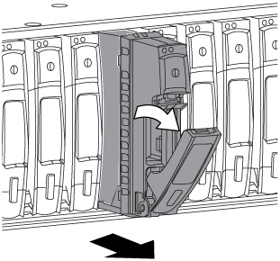

= 热插拔 DS224C 或 DS212C 磁盘架中的磁盘驱动器—使用 IOM12 模块的磁盘架
:icons: font
:imagesdir: ../media/

[role="lead"]
您可以热插拔 DS224C 或 DS212C 磁盘架中的故障磁盘驱动器。

.开始之前
* DS224C 或 DS212C 磁盘架必须支持您要安装的磁盘驱动器。
+
https://hwu.netapp.com["NetApp Hardware Universe"]

* 系统中的所有其他组件必须正常运行；否则，请联系技术支持。
* 要删除的磁盘驱动器必须出现故障。
+
您可以运行 `storage disk show -broken` 命令来验证磁盘驱动器是否出现故障。故障磁盘驱动器将显示在故障磁盘驱动器列表中。否则，您应等待并再次运行命令。

+

NOTE: 根据磁盘驱动器类型和容量，磁盘驱动器可能需要长达数小时才能显示在故障磁盘驱动器列表中。

* 如果要更换自加密磁盘（ SED ），则必须按照适用于您的 ONTAP 版本的 ONTAP 文档中有关更换 SED 的说明进行操作。
+
ONTAP 文档中的说明介绍了在更换 SED 之前和之后必须执行的其他步骤。

+
https://docs.netapp.com/ontap-9/topic/com.netapp.doc.pow-nve/home.html["《 ONTAP 9 NetApp 加密高级指南》"]

.关于此任务
* 您应采取措施以避免静电放电（ ESD ）：
+
** 请将磁盘驱动器放在 ESD 袋中，直到准备好安装为止。
** 用手打开 ESD 袋或用剪刀剪掉顶部。
+

NOTE: 请勿将金属工具或刀片插入 ESD 袋中。

** 请始终佩戴 ESD 腕带，该腕带接地至存储机箱上未上漆的表面。
+
如果没有腕带，请先触摸存储机箱机箱上未上漆的表面，然后再处理磁盘驱动器。

* 您应采取措施小心处理磁盘驱动器：
+
** 在拆卸，安装或搬运磁盘驱动器时，请始终用双手支撑其重量。
+

NOTE: 请勿将手放在磁盘驱动器托架下侧暴露的磁盘驱动器板上。

** 您应将磁盘驱动器放置在缓冲表面上，切勿将磁盘驱动器堆栈在彼此之上。
** 请注意，不要将磁盘驱动器撞到其他表面。

* 磁盘驱动器应远离磁性设备。
+

NOTE: 磁场可能会破坏磁盘驱动器上的所有数据，并且发生原因会对磁盘驱动器电路造成不可修复的损坏。

* 最佳实践是，在热插拔磁盘驱动器之前，安装最新版本的磁盘认证包（ DQP ）。
+
安装当前版本的 DQP 后，您的系统便可识别和使用新认证的磁盘驱动器；因此，可以避免出现有关磁盘驱动器信息不是最新的系统事件消息。此外，您还可以避免由于无法识别磁盘驱动器而可能阻止磁盘分区。DQP 还会通知您磁盘驱动器固件不是最新的。

+
https://mysupport.netapp.com/NOW/download/tools/diskqual/["NetApp 下载：磁盘认证包"]

* 最佳实践是，在添加新磁盘架，磁盘架 FRU 组件或 SAS 缆线之前，应在系统上安装最新版本的磁盘架（ IOM ）固件和磁盘驱动器固件。
+
可以在 NetApp 支持站点上找到最新版本的固件。

+
https://mysupport.netapp.com/site/downloads/firmware/disk-shelf-firmware["NetApp 下载：磁盘架固件"]

+
https://mysupport.netapp.com/site/downloads/firmware/disk-drive-firmware["NetApp 下载：磁盘驱动器固件"]

* 使用非最新固件版本的新磁盘驱动器上的磁盘驱动器固件会自动更新（无中断）。
+

NOTE: 磁盘驱动器固件每两分钟检查一次。

* 如果需要，您可以打开磁盘架的位置（蓝色） LED ，以帮助以物理方式定位受影响的磁盘架： `storage shelf location-led modify -shelf-name _shelf_name_ -led-status on`
+
磁盘架具有三个位置 LED ：一个位于操作员显示面板上，一个位于每个 IOM12 模块上。定位 LED 保持亮起 30 分钟。您可以通过输入相同的命令并使用 off 选项来将其关闭。

* 如果需要，您可以参阅 " 监控磁盘架 LED " 一节，了解有关操作员显示面板和 FRU 组件上磁盘架 LED 的含义和位置的信息。

.步骤
. 如果要手动为替换磁盘驱动器分配磁盘所有权，则需要禁用自动驱动器分配（如果已启用）；否则，请转至下一步。
+

NOTE: 如果堆栈中的磁盘驱动器属于 HA 对中的两个控制器，则需要手动分配磁盘所有权。

+

NOTE: 您可以手动分配磁盘所有权，然后在此操作步骤中稍后重新启用自动驱动器分配。

+
.. 验证是否已启用自动驱动器分配：``storage disk option show``
+
如果您有 HA 对，则可以在任一控制器的控制台中输入命令。

+
如果启用了自动驱动器分配，则输出会在 "`Auto Assign` " 列中显示 "`on` " （对于每个控制器）。

.. 如果启用了自动驱动器分配，则需要将其禁用：``storage disk option modify -node _node_name_ -autodassign off``
+
您需要在 HA 对中的两个控制器上禁用自动驱动器分配。

. 正确接地。
. 拆开新磁盘驱动器的包装，将其放在磁盘架附近的水平表面上。
+
保存所有包装材料，以便在退回故障磁盘驱动器时使用。

+

NOTE: NetApp 要求所有退回的磁盘驱动器均采用 ESD 防护袋装。

. 通过系统控制台警告消息和磁盘驱动器上亮起的警示（琥珀色） LED 以物理方式识别故障磁盘驱动器。
+

NOTE: 故障磁盘驱动器上的活动（绿色） LED 可能会亮起（稳定亮起），表示磁盘驱动器已通电，但不应闪烁，这表示 I/O 活动。发生故障的磁盘驱动器没有 I/O 活动。

. 按下磁盘驱动器表面上的释放按钮，然后将凸轮把手拉至完全打开位置，以将磁盘驱动器从中板释放。
+
按下释放按钮时，磁盘驱动器上的凸轮把手会部分打开。

+

NOTE: DS212C 磁盘架中的磁盘驱动器通过位于磁盘驱动器正面左侧的释放按钮水平排列。DS224C 磁盘架中的磁盘驱动器垂直排列，释放按钮位于磁盘驱动器正面的顶部。

+
下面显示了 DS212C 磁盘架中的磁盘驱动器：

+
image::../media/drw_drive_open_no_bezel.png[DRW 驱动器未打开挡板]

+
以下显示了 DS224C 磁盘架中的磁盘驱动器：

+

. 将磁盘驱动器轻轻滑出以使磁盘安全地旋转，然后从磁盘架中取出磁盘驱动器。
+
HDD 可能需要长达一分钟的时间才能安全地停转。

+

NOTE: 处理磁盘驱动器时，请始终用双手支撑其重量。

. 用两只手将凸轮把手放在打开位置，将更换用的磁盘驱动器插入磁盘架，用力推动，直到磁盘驱动器停止。
+

NOTE: 请至少等待 10 秒，然后再插入新磁盘驱动器。这样，系统就可以识别磁盘驱动器已被删除。

+

NOTE: 请勿将手放在磁盘托架下侧暴露的磁盘驱动器板上。

. 合上凸轮把手，使磁盘驱动器完全固定在中间板中，并且把手卡入到位。
+
请务必缓慢地关闭凸轮把手，使其与磁盘驱动器的正面正确对齐。

. 如果要更换另一个磁盘驱动器，请重复步骤 3 到 8 。
. 验证磁盘驱动器的活动（绿色） LED 是否亮起。
+
如果磁盘驱动器的活动 LED 呈稳定绿色，则表示磁盘驱动器已通电。当磁盘驱动器的活动 LED 闪烁时，表示磁盘驱动器已通电且 I/O 正在进行中。如果磁盘驱动器固件正在自动更新，则 LED 将闪烁。

. 如果您在步骤 1 中禁用了自动驱动器分配，请手动分配磁盘所有权，然后根据需要重新启用自动驱动器分配：
+
.. 显示所有未分配的磁盘：``storage disk show -container-type unassigned``
.. 分配每个磁盘：``s存储磁盘 assign -disk _disk_name_ -owner _owner_name_``
+
您可以使用通配符一次分配多个磁盘。

.. 如果需要，请重新启用自动驱动器分配：``storage disk option modify -node _node_name_ -autodassign on``
+
您需要在 HA 对中的两个控制器上重新启用自动驱动器分配。

. 按照套件随附的 RMA 说明将故障部件退回 NetApp 。
+
请通过联系技术支持 https://mysupport.netapp.com/site/global/dashboard["NetApp 支持"]， 888-463-8277 （北美）， 00-800-44-638277 （欧洲）或 +800-800-80-800 （亚太地区）（如果您需要 RMA 编号或有关更换操作步骤的其他帮助）。

