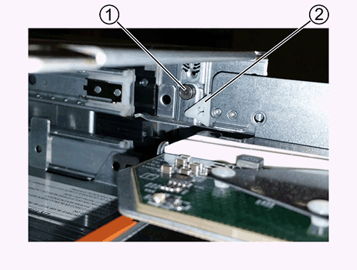

= 将 DS460C 磁盘架中的驱动器抽盒更换为 IOM12 模块
:allow-uri-read: 
:icons: font
:imagesdir: ../media/

[role="lead"]
在更换驱动器抽盒之前，您必须停止所有主机 I/O 活动并关闭磁盘架电源。

其中每个 60 个驱动器架都有五个驱动器抽盒。

image::../media/28_dwg_e2860_de460c_front_no_callouts.gif[28 dwg e2860 de460c 正面无标注]

这五个抽盒中的每个抽盒最多可容纳 12 个驱动器。

image::../media/dwg_trafford_drawer_with_hdds_callouts.gif[带有 HDD 标注的 Dwg Trafford 抽屉]

== 开始之前

此操作步骤需要以下项目：

* 防静电保护
+

NOTE: * 可能的硬件损坏： * 为了防止静电释放损坏驱动器架，在处理驱动器架组件时，请使用适当的防静电保护。

* 更换驱动器抽屉
* 更换左侧和右侧缆线链
* 手电筒

== 拆下缆线链

[role="lead"]
DS460C 驱动器架中每个驱动器抽盒的左右缆线链允许抽盒滑入和滑出。在卸下驱动器抽盒之前，必须同时卸下两个缆线链。

.开始之前
* 您已停止主机 I/O 活动并关闭磁盘架电源。
* 您已获取以下项：
+
** 防静电保护
+

NOTE: * 可能的硬件损坏： * 为了防止静电释放损坏磁盘架，请在处理磁盘架组件时使用适当的防静电保护。

** 手电筒

每个驱动器抽屉都有左右缆线链。缆线链上的金属端滑入机箱内相应的垂直和水平支架，如下所示：

* 左右垂直支架将缆线链连接到机箱的中板。
* 左右水平支架将缆线链连接到各个抽盒。

.步骤
. 启用防静电保护。
. 从驱动器架后部，按如下所示卸下右侧风扇模块：
+
.. 按下橙色卡舌以释放风扇模块手柄。
+
此图显示了从左侧橙色卡舌中伸出并释放的风扇模块的手柄。

+
image::../media/28_dwg_e2860_de460c_fan_canister_handle_with_callout.gif[28 dwg e2860 de460c 风扇箱手柄，带标注]

+
[cols="10,90"]
|===

 a| 
image:../media/legend_icon_01.png[""]
| 风扇模块手柄 
|===
.. 使用把手将风扇模块从驱动器架中拉出，并放在一旁。

. 手动确定要断开的五个缆线链中的哪一个。
+
此图显示了已卸下风扇模块的驱动器架右侧。卸下风扇模块后，您可以看到五个缆线链以及每个抽盒的垂直和水平连接器。提供了驱动器抽盒 1 的标注。

+
image::../media/2860_dwg_full_back_view_chain_connectors.gif[2860 dwg 全背面图链连接器]

+
[cols="10,90"]
|===

 a| 
image:../media/legend_icon_01.png[""]
| 缆线链 

 a| 
image:../media/legend_icon_02.png[""]
 a| 
垂直连接器（连接到中板）

 a| 
image:../media/legend_icon_03.png[""]
 a| 
水平连接器（连接到驱动器抽盒）

|===
+
顶部缆线链连接到驱动器抽盒 1 。底部缆线链连接到驱动器抽盒 5 。

. 用手将右侧的缆线链移至左侧。
. 按照以下步骤，从相应的垂直支架上断开任何右侧缆线链。
+
.. 使用手电筒找到连接到机箱中垂直支架的缆线链末端的橙色环。
+
image::../media/2860_dwg_vertical_ring_for_chain.gif[用于链的 2860 dwg 垂直环]

+
[cols="10,90"]
|===

 a| 
image:../media/legend_icon_01.png[""]
| 垂直支架上的橙色环 
|===
.. 轻按橙色环的中心并将缆线的左侧拉出机箱，以断开垂直连接器（连接到中板）。
.. 要拔下缆线链，请小心地将手指朝您的方向拉大约 1 英寸（ 2.5 厘米），但将缆线链连接器留在垂直支架中。

. 按照以下步骤断开缆线链的另一端：
+
.. 使用手电筒找到连接到机箱中水平支架的缆线链末端的橙色环。
+
此图显示了右侧的水平连接器，左侧的缆线链已断开并部分拉出。

+
image::../media/2860_dwg_horiz_ring_for_chain.gif[2860 dwg 链的水平环]

+
[cols="10,90"]
|===

 a| 
image:../media/legend_icon_01.png[""]
| 水平支架上的橙色环 

 a| 
image:../media/legend_icon_02.png[""]
 a| 
缆线链

|===
.. 将您的手指轻轻插入橙色环。
+
此图显示了向下推水平支架上的橙色环，以便将缆线链的其余部分拉出机箱。

.. 向您的方向拉手以拔下缆线链。

. 小心地将整个缆线链拉出驱动器架。
. 从驱动器架背面，卸下左侧风扇模块。
. 按照以下步骤从垂直支架断开左侧缆线链：
+
.. 使用手电筒找到连接到垂直支架的缆线链末端的橙色环。
.. 将您的手指插入橙色环。
.. 要拔下缆线链，请将您的手指朝您的方向拉大约 1 英寸（ 2.5 厘米），但将缆线链连接器保留在垂直支架中。

. 断开左侧缆线链与水平支架的连接，然后将整个缆线链从驱动器架中拉出。

== 卸下驱动器抽屉

[role="lead"]
After removing the right and left cable chains, you can remove the drive drawer from the drive shelf.卸下驱动器抽盒需要将抽盒部分滑出、卸下驱动器并卸下驱动器抽盒。

.开始之前
* 您已卸下驱动器抽盒的左右缆线链。
* 您已更换左右风扇模块。

.步骤
. 从驱动器架正面卸下挡板。
. 拉出两个拉杆，以解锁驱动器抽屉。
. 使用扩展拉杆小心地拉出驱动器抽盒，直到其停止。请勿从驱动器架中完全卸下驱动器抽盒。
. 从驱动器抽盒中取出驱动器：
+
.. 轻轻向后拉每个驱动器前部中央可见的橙色释放闩锁。下图显示了每个驱动器的橙色释放闩锁。
+
image::../media/28_dwg_e2860_drive_latches_top_view.gif[28 dwg e2860 驱动器闩锁顶视图]

.. 将驱动器把手提起至垂直位置。
.. 使用手柄将驱动器从驱动器抽屉中提起。
+
image::../media/92_dwg_de6600_install_or_remove_drive.gif[92 dwg de6600 安装或删除驱动器]

.. 将驱动器放在无静电的平面上，远离磁性设备。
+

NOTE: * 可能的数据访问丢失： * 磁场会破坏驱动器上的所有数据，并且发生原因会对驱动器电路造成无法弥补的损坏。为了避免丢失数据访问并损坏驱动器，请始终使驱动器远离磁性设备。

. 请按照以下步骤卸下驱动器抽盒：
+
.. 找到驱动器抽盒两侧的塑料释放杆。
+
image::../media/92_pht_de6600_drive_drawer_release_lever.gif[92 PHT de6600 驱动器抽屉释放拉杆]

+
[cols="10,90"]
|===

 a| 
image:../media/legend_icon_01.png[""]
| 驱动器抽盒释放拉杆 
|===
.. 向您的方向拉动闩锁以打开两个释放拉杆。
.. 握住两个释放拉杆，向您的方向拉动驱动器抽盒。
.. 从驱动器架中卸下驱动器抽屉。

== 安装驱动器抽盒

[role="lead"]
在驱动器架中安装驱动器抽盒需要将抽盒滑入空插槽，安装驱动器并更换前挡板。

.开始之前
* 您已获取以下项：
+
** 更换驱动器抽屉
** 手电筒

.步骤
. 从驱动器架前部，将手电筒放在空抽盒插槽中，然后找到该插槽的锁定滚轮。
+
锁定式转储器组件是一项安全功能，可防止您一次打开多个驱动器抽盒。

+

+
[cols="10,90"]
|===

 a| 
image:../media/legend_icon_01.png[""]
| 锁定更好 

 a| 
image:../media/legend_icon_02.png[""]
 a| 
抽盒指南

|===
. 将替代驱动器抽盒放在空插槽前面，并略微位于中心右侧。
+
将抽盒略微置于中心右侧有助于确保锁定转盘器和抽盒导板正确接合。

. 将驱动器抽盒滑入插槽中，并确保抽盒导轨滑入锁定转储器下方。
+

NOTE: * 设备损坏风险： * 如果抽盒导轨未滑入锁定转滚器下方，则会发生损坏。

. 小心地将驱动器抽盒完全推入，直到闩锁完全啮合。
+

NOTE: * 设备损坏风险： * 如果您感觉阻力过大或绑定过大，请停止推驱动器抽盒。使用抽盒正面的释放杆将抽盒滑回。然后，将抽盒重新插入插槽，并确保其可以自由滑入和滑出。

. 按照以下步骤在驱动器抽屉中重新安装驱动器：
+
.. 拉出驱动器抽盒正面的两个拉杆，以解锁驱动器抽盒。
.. 使用扩展拉杆小心地拉出驱动器抽盒，直到其停止。请勿从驱动器架中完全卸下驱动器抽盒。
.. 在要安装的驱动器上、将手柄提起至垂直位置。
.. 将驱动器两侧的两个凸起按钮与抽盒上的缺口对齐。
+
此图显示了驱动器的右侧视图，其中显示了凸起按钮的位置。

+
image::../media/28_dwg_e2860_de460c_drive_cru.gif[28 dwg e2860 de460c 驱动器 cru]

+
[cols="10,90"]
|===

 a| 
image:../media/legend_icon_01.png[""]
| 驱动器右侧的凸起按钮。 
|===
.. 竖直向下放下驱动器，然后向下旋转驱动器把手，直到驱动器卡入到位。
+
如果磁盘架已部分填充、这意味着要重新安装驱动器的抽盒所支持的驱动器少于12个、请将前四个驱动器安装到正面插槽(0、3、6和9)中。

+

NOTE: *设备故障风险：*为了确保气流正常并防止过热、请始终将前四个驱动器安装到前面的插槽(0、3、6和9)中。

+
image::../media/92_dwg_de6600_install_or_remove_drive.gif[92 dwg de6600 安装或删除驱动器]

.. 重复这些子步骤以重新安装所有驱动器。

. 将抽盒从中间推回驱动器架，然后合上两个拉杆，将其滑回驱动器架。
+

NOTE: * 设备故障的风险： * 请确保通过推动两个控制杆完全关闭驱动器抽屉。您必须完全关闭驱动器抽盒，以确保通风良好并防止过热。

. 将挡板连接到驱动器架的正面。

== 连接缆线链

[role="lead"]
安装驱动器抽盒的最后一步是将左右缆线链连接到驱动器架。连接缆线链时，请按与断开缆线链相反的顺序进行操作。您必须先将链的水平连接器插入机箱中的水平支架，然后再将链的垂直连接器插入机箱中的垂直支架。

.开始之前
* 已更换驱动器抽盒和所有驱动器。
* 您有两个替代缆线链，分别标记为左侧和右侧（位于驱动器抽盒旁边的水平连接器上）。

image::../media/28_dwg_e2860_de460c_cable_chain_left.gif[左侧 28 个 dwg e2860 de460c 缆线链]

[cols="4*"]
|===
| 标注 | 缆线链 | 连接器 | 连接到 

 a| 
image:../media/legend_icon_01.png[""]
| 左侧  a| 
垂直
 a| 
中板

 a| 
image:../media/legend_icon_02.png[""]
 a| 
左侧
 a| 
水平
 a| 
驱动器抽屉

|===
image:../media/28_dwg_e2860_de460c_cable_chain_right.gif[""]

[cols="4*"]
|===
| 标注 | 缆线链 | 连接器 | 连接到 

 a| 
image:../media/legend_icon_01.png[""]
| 对  a| 
水平
 a| 
驱动器抽屉

 a| 
image:../media/legend_icon_02.png[""]
 a| 
对
 a| 
垂直
 a| 
中板

|===
.步骤
. 按照以下步骤连接左侧缆线链：
+
.. 找到左侧缆线链上的水平和垂直连接器以及机箱内相应的水平和垂直支架。
.. 将两个缆线链连接器与其对应的支架对齐。
.. 将缆线链的水平连接器滑入水平支架上的导轨下方，并尽可能将其推入。
+
此图显示了机箱中第二个驱动器抽盒的左侧导轨。

+
image::../media/2860_dwg_guide_rail.gif[2860 dwg 导轨]

+
[cols="10,90"]
|===

 a| 
image:../media/legend_icon_01.png[""]
| 导轨 
|===
+
[NOTE]
====
* 设备故障的风险： * 请务必滑动支架上导轨下方的连接器。如果连接器位于导轨顶部，则在系统运行时可能会出现问题。

====
.. 将左侧缆线链上的垂直连接器滑入垂直支架。
.. 重新连接缆线链的两端后，请小心拉动缆线链，以验证两个连接器是否均已锁紧。
+
[NOTE]
====
* 设备故障风险： * 如果连接器未锁定，则在抽盒操作期间，缆线链可能会松动。

====

. 重新安装左侧风扇模块。
. 按照以下步骤重新连接正确的缆线链：
+
.. 找到缆线链上的水平和垂直连接器以及机箱内相应的水平和垂直支架。
.. 将两个缆线链连接器与其对应的支架对齐。
.. 将缆线链的水平连接器滑入水平支架上的导轨下方，并将其推入尽可能远的位置。
+
[NOTE]
====
* 设备故障的风险： * 请务必滑动支架上导轨下方的连接器。如果连接器位于导轨顶部，则在系统运行时可能会出现问题。

====
.. 将右侧缆线链上的垂直连接器滑入垂直支架。
.. 重新连接缆线链的两端后，小心拉动缆线链，以验证两个连接器是否均已锁紧。
+
[NOTE]
====
* 设备故障风险： * 如果连接器未锁定，则在抽盒操作期间，缆线链可能会松动。

====

. 重新安装右侧风扇模块。
. 重新接通电源：
+
.. 打开驱动器架上的两个电源开关。
.. 确认两个风扇均已打开，并且风扇背面的琥珀色 LED 熄灭。

